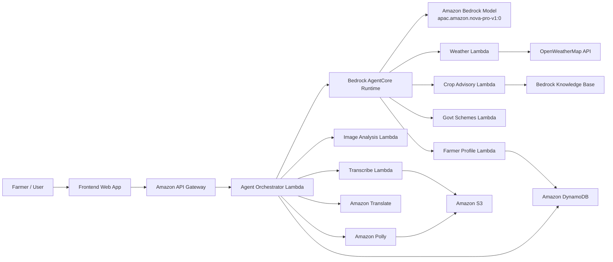
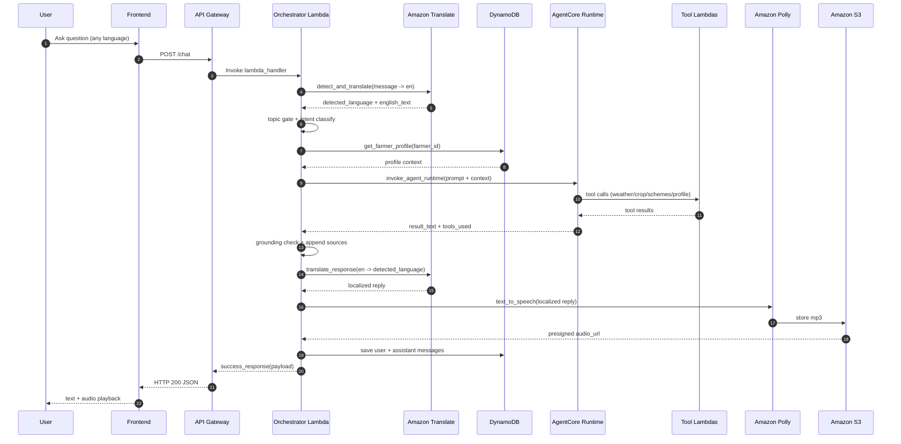
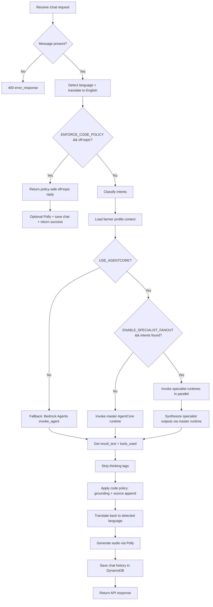
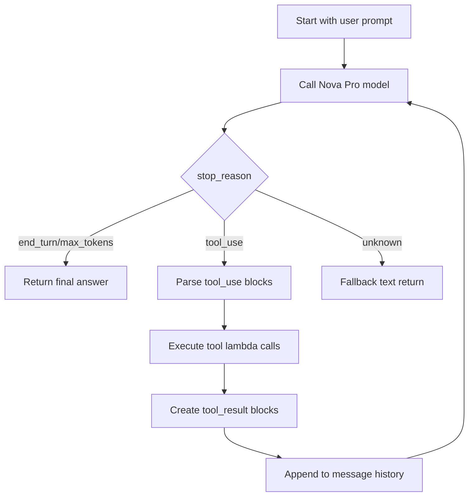
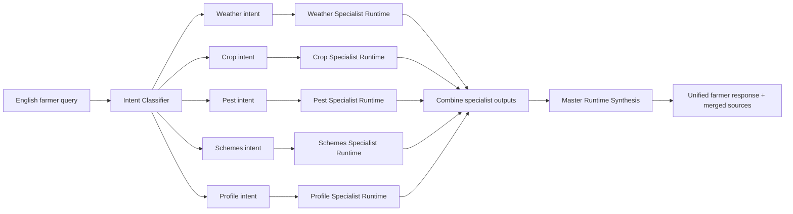
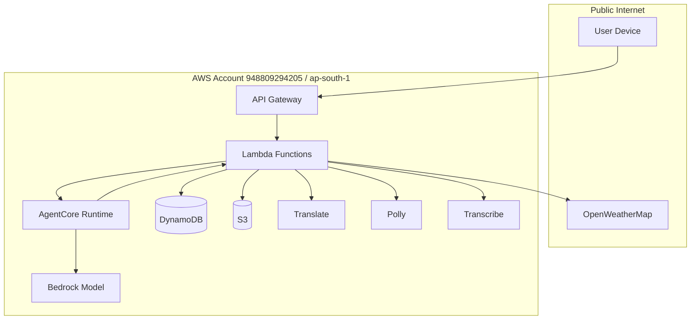
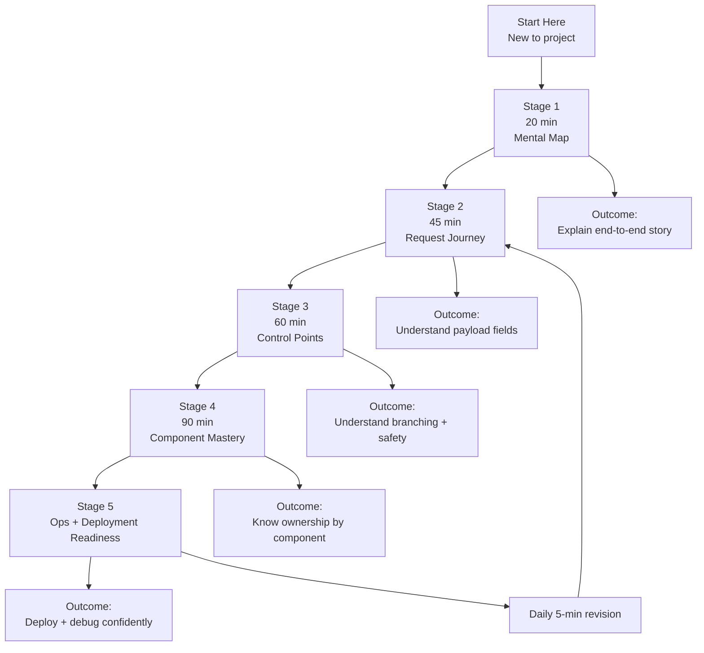

# Smart Rural AI Advisor — Complete System Guide

> **Owner:** Manoj RS  
> **Region:** `ap-south-1` (Mumbai)  
> **Account:** `948809294205`  
> **Last Updated:** February 2026

---

## Table of Contents

1. [What Is This Project?](#1-what-is-this-project)
2. [Big Picture Architecture](#2-big-picture-architecture)
3. [How a User's Message Flows (Step by Step)](#3-how-a-users-message-flows-step-by-step)
4. [AWS Services Used](#4-aws-services-used)
5. [Lambda Functions — Each One Explained](#5-lambda-functions--each-one-explained)
   - 5.1 [Agent Orchestrator (The Brain)](#51-agent-orchestrator-the-brain)
   - 5.2 [Weather Lookup](#52-weather-lookup)
   - 5.3 [Crop Advisory](#53-crop-advisory)
   - 5.4 [Government Schemes](#54-government-schemes)
   - 5.5 [Farmer Profile](#55-farmer-profile)
   - 5.6 [Image Analysis](#56-image-analysis)
   - 5.7 [Transcribe Speech](#57-transcribe-speech)
   - 5.8 [Health Check](#58-health-check)
6. [Utility Modules (Shared Helpers)](#6-utility-modules-shared-helpers)
   - 6.1 [response_helper.py](#61-response_helperpy)
   - 6.2 [translate_helper.py](#62-translate_helperpy)
   - 6.3 [polly_helper.py](#63-polly_helperpy)
   - 6.4 [dynamodb_helper.py](#64-dynamodb_helperpy)
   - 6.5 [error_handler.py](#65-error_handlerpy)
7. [Amazon Bedrock AgentCore — The AI Brain](#7-amazon-bedrock-agentcore--the-ai-brain)
   - 7.1 [What Is AgentCore?](#71-what-is-agentcore)
   - 7.2 [agent.py — The Runtime Code](#72-agentpy--the-runtime-code)
   - 7.3 [Tool Definitions (What the AI Can Do)](#73-tool-definitions-what-the-ai-can-do)
   - 7.4 [The Agent Loop (Tool-Use Cycle)](#74-the-agent-loop-tool-use-cycle)
   - 7.5 [Two Auth Paths: API Key vs IAM](#75-two-auth-paths-api-key-vs-iam)
   - 7.6 [Multi-Agent Specialist Fanout](#76-multi-agent-specialist-fanout)
8. [The Bedrock Foundation Model](#8-the-bedrock-foundation-model)
9. [Policy & Hallucination Prevention](#9-policy--hallucination-prevention)
   - 9.1 [Code-Level Policy (Orchestrator)](#91-code-level-policy-orchestrator)
   - 9.2 [Runtime-Level Guardrails (AgentCore)](#92-runtime-level-guardrails-agentcore)
10. [Infrastructure (SAM / CloudFormation)](#10-infrastructure-sam--cloudformation)
11. [Environment Variables (.env)](#11-environment-variables-env)
12. [API Endpoints (What the Frontend Calls)](#12-api-endpoints-what-the-frontend-calls)
13. [Tests](#13-tests)
14. [Setup Scripts](#14-setup-scripts)
15. [Data Files](#15-data-files)
16. [Glossary](#16-glossary)
17. [Full Section-by-Section Deep Dive](#17-full-section-by-section-deep-dive)

---

## 1. What Is This Project?

**Smart Rural AI Advisor** is a serverless AI chatbot that helps **Indian farmers** with:

- **Weather forecasts** — "Will it rain in Guntur this week?"
- **Crop advice** — "What seed should I use for Kharif rice in Tamil Nadu?"
- **Pest/disease diagnosis** — "My cotton has yellow spots, what should I do?"
- **Government scheme info** — "Am I eligible for PM-KISAN?"
- **Irrigation guidance** — "When should I irrigate my wheat field?"
- **Crop image analysis** — Upload a photo of a sick plant and get a diagnosis

The farmer can talk in **any Indian language** (Tamil, Telugu, Hindi, etc.) — the system auto-detects the language, translates to English internally, gets the answer, translates back, and even generates an **audio response** so the farmer can listen.

---

## 2. Big Picture Architecture

This section gives you a **diagrammatic, layered architecture view** so you can understand the system from top level down to decision logic.

### 2.1 System Context (L0)



**Explanation:**
- `API Gateway` is the single entry point for all client requests.
- `Agent Orchestrator Lambda` is the control plane for chat flow (translation, policy, agent call, audio, persistence).
- `AgentCore Runtime` is the AI execution plane where the model decides which tools to use.
- Tool Lambdas are specialized data/reasoning helpers the model can call.
- `DynamoDB` and `S3` are persistence layers; `OpenWeather` and `Knowledge Base` are external knowledge sources.

### 2.2 Container View (L1)

```mermaid
flowchart TB
  subgraph Client Layer
    FE[Frontend (Vite/React)]
  end

  subgraph API Layer
    GW[API Gateway /Prod]
  end

  subgraph Orchestration Layer
    ORCH[Agent Orchestrator Lambda<br/>POST /chat, /voice]
    POLICY[Code Policy Engine<br/>topic gate + grounding + sources]
    I18N[Translation + Localization]
    AUDIO[TTS Pipeline]
  end

  subgraph AI Layer
    ACR[AgentCore Runtime(s)]
    FM[Foundation Model<br/>Nova Pro]
    TOOLS[Tool Calling Loop]
  end

  subgraph Tool Layer
    WL[Weather Tool Lambda]
    CL[Crop Tool Lambda]
    GL[Govt Schemes Tool Lambda]
    PL[Profile Tool Lambda]
  end

  subgraph Data & External Layer
    DDB[(DynamoDB<br/>farmer_profiles, chat_sessions)]
    S3[(S3<br/>audio + uploads)]
    TR[Amazon Translate]
    PO[Amazon Polly]
    KBS[Bedrock KB]
    OWM[OpenWeatherMap]
  end

  FE --> GW --> ORCH
  ORCH --> POLICY
  ORCH --> I18N --> TR
  ORCH --> AUDIO --> PO --> S3
  ORCH --> DDB

  ORCH --> ACR --> FM
  ACR --> TOOLS
  TOOLS --> WL --> OWM
  TOOLS --> CL --> KBS
  TOOLS --> GL
  TOOLS --> PL --> DDB
```

**Explanation:**
- The architecture is intentionally split into **layers** so responsibilities stay clear.
- Policy is enforced in orchestration layer, not only in model prompt.
- AI layer is stateless compute; persistent data lives in dedicated stores.

### 2.3 End-to-End Chat Sequence (L2)



**Explanation:**
- This sequence is your core production path.
- Every response is both **human-readable** (`reply`) and **machine-debuggable** (`reply_en`, `tools_used`, `policy`).
- Audio generation is non-fatal: if Polly fails, text response still returns.

#### 2.3.1 Line-by-Line Deep Dive (What each arrow actually means)

If you feel "I still don't understand what is happening," use this section as the literal decoding of the sequence diagram.

| Step | Diagram Arrow | What Actually Happens in Code | Why It Exists |
|---|---|---|---|
| 1 | `U->>FE: Ask question` | User types/speaks in UI (Tamil/Telugu/Hindi/English). | Entry point from real farmer interaction. |
| 2 | `FE->>GW: POST /chat` | Frontend sends JSON payload to API Gateway. | Standard HTTPS transport and routing. |
| 3 | `GW->>OR: Invoke lambda_handler` | API Gateway transforms HTTP event into Lambda event object. | Serverless execution boundary. |
| 4 | `OR->>TR: detect_and_translate(message -> en)` | Orchestrator calls Translate helper to detect language + convert text to English. | Keep one reasoning language internally (English). |
| 5 | `TR-->>OR` | Returns `detected_language` and `translated_text`. | Needed later for reverse translation. |
| 6 | `OR->>OR: topic gate + intent classify` | In-process policy and keyword checks run before AI call. | Cost control + off-topic safety + tool routing hints. |
| 7 | `OR->>DB: get_farmer_profile` | Fetches farmer context from `farmer_profiles` table (if non-anonymous user). | Personalization (state, crops, soil type, etc.). |
| 8 | `DB-->>OR: profile context` | Profile object returned and merged into prompt context. | Better recommendations grounded to user context. |
| 9 | `OR->>AC: invoke_agent_runtime` | Orchestrator sends enriched English prompt to AgentCore runtime ARN. | Delegates reasoning + tool orchestration to AI runtime. |
| 10 | `AC->>TL: tool calls` | Model asks runtime to invoke tools (`get_weather`, `get_crop_advisory`, etc.). | Pull factual data instead of model guessing. |
| 11 | `TL-->>AC: tool results` | Tool Lambdas return structured JSON (weather/schemes/profile/KB facts). | Evidence for grounded final answer. |
| 12 | `AC-->>OR: result_text + tools_used` | AgentCore returns composed answer and metadata about invoked tools. | Traceability + post-policy checks. |
| 13 | `OR->>OR: grounding check + append sources` | Orchestrator verifies factual intents used tools; appends source attribution. | Hallucination prevention + auditability. |
| 14 | `OR->>TR: translate_response` | English output translated back to detected farmer language. | User should receive advice in their own language. |
| 15 | `TR-->>OR: localized reply` | Localized text returned. | Human-readable final response. |
| 16 | `OR->>PO: text_to_speech` | Polly synthesizes speech from localized text. | Accessibility for low-literacy/voice-first use. |
| 17 | `PO->>S3: store mp3` | MP3 uploaded to S3 key like `audio/<uuid>.mp3`. | Durable object storage. |
| 18 | `S3-->>OR: presigned audio_url` | Temporary signed URL generated (time-limited). | Secure download/playback without making bucket public. |
| 19 | `OR->>DB: save messages` | User message + assistant response persisted in `chat_sessions`. | Conversation history and session continuity. |
| 20 | `OR-->>GW: success_response(payload)` | Lambda returns standardized response shape + CORS headers. | Consistent API contract. |
| 21 | `GW-->>FE: HTTP 200 JSON` | API Gateway sends response to browser/app. | Completion of backend call. |
| 22 | `FE-->>U: text + audio playback` | UI renders localized text and audio player using presigned URL. | Final farmer experience. |

#### 2.3.2 Request and Response Contracts (Exact data shape)

**Request contract to `/chat` (minimum fields):**

```json
{
  "message": "Will it rain in Guntur this week?",
  "farmer_id": "farmer_123",
  "session_id": "session_abc"
}
```

**Response contract (important fields):**

```json
{
  "status": "success",
  "data": {
    "reply": "Localized text for farmer",
    "reply_en": "Internal English answer",
    "detected_language": "te",
    "tools_used": ["get_weather"],
    "audio_url": "https://...presigned...",
    "session_id": "session_abc",
    "mode": "agentcore",
    "policy": {
      "code_policy_enforced": true,
      "off_topic_blocked": false,
      "grounding_required": true,
      "grounding_satisfied": true
    }
  },
  "message": "Advisory generated successfully"
}
```

**How to read these fields:**
- `reply`: what farmer sees.
- `reply_en`: English debug copy (helps QA and logs).
- `tools_used`: factual trace of where answer came from.
- `mode`: whether AgentCore or fallback path handled response.
- `policy`: transparent safety state of this exact reply.

#### 2.3.3 Failure Behavior at Each Stage (important for real systems)

| Stage | If failure happens | System behavior |
|---|---|---|
| Translate in | Detection/translation error | Falls back to original text where possible; avoids hard crash. |
| Topic gate | Off-topic detected | Returns safe redirect, skips expensive AI call. |
| Profile fetch | DynamoDB miss/error | Continues with empty/default context. |
| AgentCore/tool call | Runtime/tool unavailable | Returns safe fallback guidance; does not fabricate tool facts. |
| Grounding check | Tools required but absent | Replaces answer with policy-safe grounded fallback. |
| Translate out | Localization fails | Returns English text instead of failing whole response. |
| Polly | Audio synth/upload fails | Returns text response with `audio_url` missing/null. |
| Chat persistence | Save fails | Best-effort log + still returns advisory to user. |

#### 2.3.4 Latency and Performance Breakdown (practical view)

Approximate end-to-end latency is additive:

$$
T_{total} = T_{gateway} + T_{translate\_in} + T_{policy} + T_{profile} + T_{agent+tools} + T_{translate\_out} + T_{polly} + T_{save}
$$

Typical dominant term is `T_agent+tools`, because model inference + tool calls are the heaviest operations.

#### 2.3.5 Trust Boundaries in this sequence

- **Inside your AWS account:** API Gateway, Lambda, AgentCore runtime, DynamoDB, S3, Translate, Polly, Transcribe.
- **Outside account (external dependency):** OpenWeatherMap API.
- **Key rule:** Any data from outside (weather API, user input) is treated as untrusted until validated by code path.

#### 2.3.6 Why this sequence design is robust

1. **Deterministic orchestration:** Business logic in code, not only in prompt text.
2. **Tool-grounded answers:** Factual claims backed by tool responses.
3. **Language-safe UX:** Internal English reasoning + external localization.
4. **Graceful degradation:** Text still returns even when audio or secondary services fail.
5. **Observability:** `tools_used` and `policy` expose what happened for each response.

### 2.4 Orchestrator Internal Decision Flow (L3)



**Explanation:**
- This is exactly how your orchestrator code branches at runtime.
- The critical safety gates are **early off-topic block** and **post-model grounding enforcement**.
- Specialist fanout is optional and controlled by environment variable.

### 2.5 AgentCore Tool-Use Loop (L4)



**Explanation:**
- The model does not directly access weather/db/kb.
- It requests tool calls; your runtime executes those calls and feeds results back.
- Loop guard `MAX_TURNS` prevents infinite tool-calling cycles.

### 2.6 Specialist Fanout Architecture



**Explanation:**
- Each specialist focuses on one domain with role-specific prompting.
- Outputs are merged and re-synthesized to remove duplication and keep actionability.
- This improves answer quality for multi-intent questions.

### 2.7 Data, Trust, and Security Boundaries



**Explanation:**
- Most components run inside your AWS account boundary.
- External dependency is primarily OpenWeatherMap.
- IAM policies in SAM template constrain which services each Lambda can invoke.

### 2.8 Why This Architecture Works Well

1. **Separation of concerns:** Orchestrator coordinates, specialists fetch domain data, model reasons, utilities standardize behavior.
2. **Defense in depth:** Prompt constraints + code policy + optional Bedrock Guardrails.
3. **Multi-lingual by design:** Translate in/out around a single English reasoning core.
4. **Traceability:** `tools_used` + `policy` metadata + source attribution improve auditability.
5. **Extensibility:** Add new tools/runtimes without rewriting frontend contract.
6. **Serverless economics:** Pay-per-use with managed scaling.

**In plain English:** the system behaves like a well-managed farm office — one coordinator, multiple specialists, strict policy checks, and every advisory tied to concrete data sources.

---

## 3. How a User's Message Flows (Step by Step)

Let's trace what happens when a farmer types: **"என் நிலத்தில் கோதுமைக்கு தண்ணீர் எப்போது விடணும்?"** (Tamil for "When should I irrigate wheat in my field?")

### Step 1: Frontend → API Gateway
The frontend sends a `POST /chat` request:
```json
{
  "message": "என் நிலத்தில் கோதுமைக்கு தண்ணீர் எப்போது விடணும்?",
  "farmer_id": "farmer_123",
  "session_id": "abc-session"
}
```

### Step 2: Language Detection & Translation
The Orchestrator Lambda calls **Amazon Translate**:
- **Input:** Tamil text
- **Output:** `{ "detected_language": "ta", "translated_text": "When should I give water for wheat in my land?" }`

Now the system has the English version to work with.

### Step 3: Policy Check (Is It On-Topic?)
The system checks: does the English message contain farming-related keywords like "wheat", "water", "irrigation"?  
✅ Yes → proceed. If someone asked "What's the IPL score?" → ❌ blocked with a polite redirect.

### Step 4: Intent Classification
The system scans the English message for keywords:
- "wheat" → `crop` intent
- "water", "irrigate" → triggers crop/irrigation tools

### Step 5: Farmer Profile Enrichment
If `farmer_id` is not "anonymous", the system fetches the farmer's saved profile from DynamoDB:
```json
{ "name": "Ravi", "state": "Tamil Nadu", "crops": ["wheat", "rice"], "soil_type": "Clay loam" }
```
This context is **prepended** to the message so the AI knows the farmer's background.

### Step 6: AI Agent (AgentCore) Processing
The enriched English message is sent to the **AgentCore Runtime**. The AI model (Amazon Nova Pro) reads the message, decides which tools to call, and runs the **agent loop**:

1. AI says: "I need weather data for this farmer's location" → calls `get_weather` tool
2. AI says: "I also need crop advisory for wheat" → calls `get_crop_advisory` tool
3. Tools return data from Lambda functions
4. AI reads the tool results and writes a final farmer-friendly answer in English

### Step 7: Source Attribution
The system appends: `Sources: WeatherFunction(OpenWeather), CropAdvisoryFunction(KB)` so the farmer knows where the info came from.

### Step 8: Translate Response Back
Amazon Translate converts the English answer back to Tamil.

### Step 9: Generate Audio (Polly)
Amazon Polly converts the Tamil text to an MP3 audio file, uploads it to S3, and returns a presigned URL.

### Step 10: Save Chat History
Both the user message and AI response are saved to the `chat_sessions` DynamoDB table.

### Step 11: Return to Frontend
```json
{
  "status": "success",
  "data": {
    "reply": "உங்கள் கோதுமை நிலத்தில் 7 நாட்களுக்கு ஒருமுறை...",
    "reply_en": "For your wheat field, irrigate every 7 days...",
    "detected_language": "ta",
    "tools_used": ["get_weather", "get_crop_advisory"],
    "audio_url": "https://s3.amazonaws.com/smart-rural-ai/.../audio.mp3",
    "session_id": "abc-session",
    "mode": "agentcore",
    "policy": {
      "code_policy_enforced": true,
      "off_topic_blocked": false,
      "grounding_required": true,
      "grounding_satisfied": true
    }
  }
}
```

---

## 4. AWS Services Used

| Service | What It Does In Our Project |
|---|---|
| **API Gateway** | Creates REST API URLs (`/chat`, `/weather/{location}`, `/schemes`, etc.) and routes HTTP requests to Lambda |
| **Lambda** | Runs our Python code without a server. Each function handles one concern. |
| **Amazon Bedrock** | Hosts the AI model (Amazon Nova Pro). We call it to generate intelligent responses. |
| **Bedrock AgentCore** | Manages the AI agent runtime — gives the model tools, handles the tool-calling loop, manages sessions. |
| **Amazon Translate** | Auto-detects language (Tamil, Telugu, Hindi, etc.) and translates text to/from English. |
| **Amazon Polly** | Converts text to natural-sounding speech (MP3 audio). Uses the neural Kajal voice. |
| **Amazon S3** | Stores audio files (Polly output), knowledge base documents, and temporarily stores audio uploads for transcription. |
| **DynamoDB** | NoSQL database with two tables: `farmer_profiles` (farmer info) and `chat_sessions` (conversation history). |
| **Amazon Transcribe** | Converts voice audio to text (speech-to-text) for the voice input feature. |
| **CloudFormation/SAM** | Infrastructure-as-code. Defines all Lambda functions, API routes, permissions in one YAML file. |

---

## 5. Lambda Functions — Each One Explained

### 5.1 Agent Orchestrator (The Brain)

**File:** `backend/lambdas/agent_orchestrator/handler.py`  
**Endpoint:** `POST /chat`, `POST /voice`  
**Timeout:** 120 seconds  
**This is the most important Lambda — it coordinates everything.**

**What it does (in order):**
1. Receives the farmer's message from API Gateway
2. Calls Amazon Translate to detect language and convert to English
3. Checks if the message is on-topic (agriculture-related)
4. Classifies the intent (weather? crop? pest? schemes?)
5. Loads the farmer's profile from DynamoDB
6. Sends the enriched English message to AgentCore Runtime
7. Receives the AI answer + list of tools that were used
8. Applies policy checks (grounding, source attribution)
9. Translates the answer back to the farmer's language
10. Generates audio via Polly
11. Saves chat history to DynamoDB
12. Returns the complete response

**Key features:**
- **Two modes:** AgentCore Runtime (preferred) or Bedrock Agents API (fallback)
- **Specialist fanout:** Can send the message to multiple specialist runtimes in parallel (weather specialist, crop specialist, schemes specialist) then synthesize the results
- **Policy enforcement:** Topic gating, grounding checks, source attribution
- **Off-topic blocking:** If message isn't about farming, returns a polite redirect without calling the AI

**How mode selection works:**
```python
USE_AGENTCORE = bool(AGENTCORE_RUNTIME_ARN)  # If ARN is set, use AgentCore
```
If the `AGENTCORE_RUNTIME_ARN` environment variable is set, it uses AgentCore. If empty/missing, it falls back to the traditional Bedrock Agents API.

---

### 5.2 Weather Lookup

**File:** `backend/lambdas/weather_lookup/handler.py`  
**Endpoint:** `GET /weather/{location}`  
**External API:** OpenWeatherMap (free tier)

**What it does:**
1. Takes a location name (e.g., "Chennai", "Guntur")
2. Calls OpenWeatherMap API for **current weather** (temperature, humidity, wind, rain)
3. Calls OpenWeatherMap API for **5-day forecast**
4. Aggregates forecast data into daily summaries (min/max temp, description, rain probability)
5. Generates a **farming advisory** based on conditions:
   - Humidity > 80% → "Risk of fungal infections"
   - Temperature > 38°C → "Ensure adequate irrigation"
   - Rain > 10mm → "Avoid pesticide spraying today"
6. Returns structured weather data

**Dual-mode support:** This Lambda can be called:
- **Directly** by the frontend via `GET /weather/Chennai` (API Gateway route)
- **By the AI agent** as a tool (Bedrock Agent action group format)

It detects which mode using `is_bedrock_event(event)` and formats the response accordingly.

---

### 5.3 Crop Advisory

**File:** `backend/lambdas/crop_advisory/handler.py`  
**No direct API Gateway endpoint** (called only by the AI agent as a tool)  
**Uses:** Amazon Bedrock Knowledge Base

**What it does:**
1. Receives parameters: crop name, state, season, soil type, symptoms, query
2. Builds a rich search query from all available parameters
3. Queries the **Bedrock Knowledge Base** (RAG — Retrieval Augmented Generation)
4. The Knowledge Base searches through uploaded agriculture documents
5. Returns the top 5 matching document chunks with relevance scores

**Three operations (all in one Lambda):**
- `get_crop_advisory` — general crop growing advice
- `get_pest_alert` — pest/disease identification and treatment
- `get_irrigation_advice` — when and how to irrigate

**What is a Knowledge Base?**  
Think of it as a smart search engine for documents. You upload PDFs/documents about farming, and the Knowledge Base converts them into vectors (mathematical representations). When someone asks a question, it finds the most relevant sections from those documents.

---

### 5.4 Government Schemes

**File:** `backend/lambdas/govt_schemes/handler.py`  
**Endpoint:** `GET /schemes`

**What it does:**
1. Contains a **hardcoded dictionary** of 9 Indian government agriculture schemes
2. Each scheme has: name, full name, benefit, eligibility, how to apply, helpline, website
3. Supports search by keyword (searches across name, full name, benefit fields)
4. Can return all schemes or filter by name/keyword

**Schemes included:**
| Scheme | What It Gives |
|---|---|
| PM-KISAN | ₹6,000/year direct cash |
| PMFBY | Crop insurance at 2% premium |
| KCC | Crop loan at 4% interest |
| Soil Health Card | Free soil testing |
| PMKSY | 55% subsidy on drip/sprinkler |
| eNAM | Online crop trading platform |
| PKVY | ₹50,000/hectare for organic farming |
| NFSM | Subsidized seeds and fertilizers |
| AIF | 3% interest subsidy on infrastructure loans |

**Dual-mode:** Works both as an API Gateway endpoint and as a Bedrock Agent tool.

---

### 5.5 Farmer Profile

**File:** `backend/lambdas/farmer_profile/handler.py`  
**Endpoints:** `GET /profile/{farmerId}`, `PUT /profile/{farmerId}`

**What it does:**
- **GET:** Retrieves a farmer's profile from DynamoDB. If the farmer doesn't exist, returns a blank profile template.
- **PUT:** Creates or updates a farmer's profile. Automatically sets `created_at` on first save and `updated_at` on every save.

**Profile fields:**
```json
{
  "farmer_id": "farmer_123",
  "name": "Ravi Kumar",
  "state": "Tamil Nadu",
  "district": "Coimbatore",
  "crops": ["rice", "wheat"],
  "soil_type": "Clay loam",
  "land_size_acres": 5,
  "language": "ta-IN"
}
```

**Why it matters:** When a farmer chats, the orchestrator fetches their profile and adds it as context to the AI prompt. So the AI knows "this farmer is in Tamil Nadu, grows rice on clay loam soil" and gives personalized advice.

---

### 5.6 Image Analysis

**File:** `backend/lambdas/image_analysis/handler.py`  
**Endpoint:** `POST /image-analyze`  
**Uses:** Amazon Nova Pro Vision model via Bedrock Converse API

**What it does:**
1. Receives a **base64-encoded image** of a crop
2. Validates the image (format, size < 4MB)
3. Detects image format (JPEG, PNG, GIF, WebP) from base64 magic bytes
4. Sends the image to **Amazon Nova Pro Vision** with a detailed system prompt
5. The AI analyzes the image and returns a structured diagnosis:
   - Confidence level (High/Medium/Low)
   - Disease/pest name
   - Severity
   - Organic treatment options
   - Chemical treatment options
   - Prevention steps
   - Urgency
6. Translates the response if farmer's language isn't English
7. Always recommends visiting the nearest KVK (Krishi Vigyan Kendra) for confirmation

**Safety:** The system prompt explicitly tells the AI to be honest about confidence and never fabricate a diagnosis if the image is unclear.

---

### 5.7 Transcribe Speech

**File:** `backend/lambdas/transcribe_speech/handler.py`  
**Endpoint:** `POST /transcribe`  
**Uses:** Amazon Transcribe + S3

**What it does:**
1. Receives base64-encoded audio from the frontend (recorded voice)
2. Uploads the audio to S3 as a `.webm` file
3. Starts an Amazon Transcribe job with the farmer's language code
4. Polls every 1 second for up to 30 seconds until transcription completes
5. Reads the transcription result from S3
6. Cleans up (deletes audio and transcription files from S3)
7. Returns the transcribed text

**Supported languages:** Tamil (ta-IN), Telugu (te-IN), Hindi (hi-IN), English (en-IN, en-US)

**Why it exists:** This is a fallback for browsers that don't support the Web Speech API (like Firefox). Chrome can do speech-to-text in the browser, but Firefox can't, so we send the audio to AWS Transcribe.

---

### 5.8 Health Check

**File:** Defined inline in `infrastructure/template.yaml`  
**Endpoint:** `GET /health`

**What it does:** Returns `{"status": "healthy", "service": "Smart Rural AI Advisor"}`. Used to verify the API is up and running. No external dependencies.

---

## 6. Utility Modules (Shared Helpers)

These are in `backend/utils/` and are imported by multiple Lambda functions.

### 6.1 response_helper.py

**Purpose:** Standardizes all API responses so every endpoint returns the same format.

**Functions:**
- `success_response(data, message, language)` → Returns HTTP 200 with:
  ```json
  { "status": "success", "data": {...}, "message": "...", "language": "en" }
  ```
- `error_response(message, status_code)` → Returns HTTP 4xx/5xx with:
  ```json
  { "status": "error", "data": null, "message": "..." }
  ```
- `is_bedrock_event(event)` → Checks if the Lambda was called by a Bedrock Agent (looks for `actionGroup` and `messageVersion` fields)
- `parse_bedrock_params(event)` → Extracts parameters from Bedrock Agent's invocation format
- `bedrock_response(data, event)` → Formats response in the specific format that Bedrock Agents expect
- `bedrock_error_response(msg, event)` → Same but for errors

**Why dual formats?** Each Lambda can be called two ways: (1) by the frontend through API Gateway, or (2) by the AI agent as a tool. These two callers expect different response shapes. The helpers handle both.

All responses include **CORS headers** (`Access-Control-Allow-Origin: *`) so the frontend (running on a different domain) can call the API without browser security errors.

---

### 6.2 translate_helper.py

**Purpose:** Handles all language translation using Amazon Translate.

**Functions:**
- `detect_and_translate(text, target_language='en')` — Auto-detects the source language and translates to English. Returns `{ detected_language, translated_text, target_language }`.
- `translate_response(text, source_language, target_language)` — Translates from a known source language to target. Used for translating the AI's English response back to the farmer's language.

**Supported:** English, Hindi, Tamil, Telugu, Kannada, Malayalam, Marathi, Bengali.

**Fallback:** If translation fails (network error, unsupported text), it returns the original text unchanged. The system never crashes due to translation failure.

---

### 6.3 polly_helper.py

**Purpose:** Converts text to speech audio using Amazon Polly.

**Functions:**
- `text_to_speech(text, language_code, voice_id, return_metadata)` — Converts text to MP3 audio.

**How it works:**
1. Selects the **Kajal** neural voice (an Indian English/Hindi voice)
2. Truncates text to 2800 characters (Polly's limit) — cuts at a word boundary, not mid-word
3. Calls Polly to synthesize speech
4. Uploads the MP3 to S3 under `audio/{uuid}.mp3`
5. Generates a presigned URL valid for 1 hour
6. Returns the URL (or a metadata dict with `{audio_url, truncated}`)

**Language mapping:**
| Farmer's Language | Polly Language | Voice |
|---|---|---|
| English (en) | en-IN | Kajal |
| Hindi (hi) | hi-IN | Kajal |
| Tamil (ta) | hi-IN (fallback) | Kajal |
| Telugu (te) | hi-IN (fallback) | Kajal |

Tamil and Telugu don't have native Polly voices, so they fall back to the Hindi voice. The text is still in Tamil/Telugu — it just sounds like Hindi pronunciation.

---

### 6.4 dynamodb_helper.py

**Purpose:** All DynamoDB read/write operations.

**Functions:**
- `get_farmer_profile(farmer_id)` — Fetches one farmer profile from the `farmer_profiles` table
- `put_farmer_profile(farmer_id, profile_data)` — Creates/updates a farmer profile
- `save_chat_message(session_id, role, message, language)` — Saves one chat message to the `chat_sessions` table (used for conversation history)
- `get_chat_history(session_id, limit=10)` — Retrieves recent messages for a session

**Tables:**
- `farmer_profiles` — Primary key: `farmer_id`
- `chat_sessions` — Primary key: `session_id`, Sort key: `timestamp`

---

### 6.5 error_handler.py

**Purpose:** A Python decorator that wraps Lambda handlers with error handling.

```python
@handle_errors
def lambda_handler(event, context):
    ...  # your code
```

If the wrapped function raises:
- `KeyError` → returns HTTP 400 "Missing required field"
- Any other `Exception` → returns HTTP 500 "Internal server error"

Also logs the full event and traceback for debugging in CloudWatch.

---

## 7. Amazon Bedrock AgentCore — The AI Brain

### 7.1 What Is AgentCore?

**AgentCore** is Amazon's managed service for running AI agents. Think of it as:

- A **hosting platform** for your AI agent code
- It manages the **model connection** (to Amazon Nova Pro)
- It provides a **Gateway** that exposes your Lambda functions as tools the AI can call
- It handles **sessions** (remembers conversation context)

**Without AgentCore:** You'd have to write all the logic yourself — call the model, parse its tool requests, execute tools, send results back, handle errors, manage conversation memory.

**With AgentCore:** You write the agent logic in `agent.py`, deploy it, and AgentCore runs it as a managed runtime. The orchestrator Lambda just sends one API call and gets back the answer.

---

### 7.2 agent.py — The Runtime Code

**File:** `agentcore/agent.py`

This is the code that runs **inside** AgentCore Runtime. When the orchestrator Lambda calls AgentCore, this code executes.

**Structure:**

```
agentcore/agent.py
├── Configuration (model, region, guardrail settings)
├── System Prompt (tells the AI who it is and how to behave)
├── Tool Definitions (6 tools the AI can call)
├── Lambda Execution (_execute_tool → _invoke_lambda)
├── Path A: API Key auth (_call_claude_apikey)
├── Path B: IAM auth (_call_claude_iam)
├── Agent Loop (_run_agent_loop)
└── Entrypoint (invoke function registered with @app.entrypoint)
```

**The System Prompt** (what the AI "believes about itself"):
> "You are the Smart Rural AI Advisor, an expert Indian agricultural assistant helping small and marginal farmers across India. You are a trusted Krishi Mitra (farming friend). Provide actionable advice about crops, pests, weather, irrigation, and government schemes. Use Indian context: Kharif/Rabi seasons, Indian soil types, local crop varieties. Only discuss agriculture and farming-related topics."

There are also **role-specific suffixes** for specialist agents (weather specialist, crop specialist, schemes specialist, master orchestrator).

---

### 7.3 Tool Definitions (What the AI Can Do)

The AI doesn't browse the internet or access databases directly. Instead, we give it **6 tools** — each tool is a Lambda function. The AI decides which tools to call based on the farmer's question.

| Tool Name | What It Does | Lambda It Calls |
|---|---|---|
| `get_crop_advisory` | Get crop growing advice for a region/season/soil | CropAdvisoryFunction |
| `get_pest_alert` | Identify pests/diseases and get treatment | CropAdvisoryFunction |
| `get_irrigation_advice` | Get irrigation scheduling and methods | CropAdvisoryFunction |
| `get_weather` | Get real-time weather + 5-day forecast | WeatherFunction |
| `search_schemes` | Search government schemes by keyword | GovtSchemesFunction |
| `get_farmer_profile` | Look up a farmer's saved profile | FarmerProfileFunction |

Each tool has an **input schema** that tells the AI what parameters it can pass. For example, `get_weather` requires a `location` string.

---

### 7.4 The Agent Loop (Tool-Use Cycle)

This is the core intelligence mechanism. Here's how it works:

```
Step 1: Send farmer's question to AI model
         ↓
Step 2: AI responds with either:
        (a) A final text answer → DONE, return it
        (b) A tool_use request → continue to Step 3
         ↓
Step 3: Execute the requested tool(s) by calling Lambda
         ↓
Step 4: Send tool results back to AI model
         ↓
Step 5: Go back to Step 2 (AI may call more tools or give final answer)
         ↓
(Max 10 turns to prevent infinite loops)
```

**Example conversation inside the loop:**

```
Turn 1:
  User: "What's the weather in Chennai and what crop should I plant?"
  AI: [tool_use: get_weather(location="Chennai")]
       [tool_use: get_crop_advisory(state="Tamil Nadu")]

Turn 2:
  System: [tool_result: Weather data showing 32°C, 75% humidity]
          [tool_result: Crop advisory for Tamil Nadu]
  AI: "Based on current weather in Chennai (32°C, 75% humidity) and 
       Tamil Nadu conditions, I recommend planting rice for the Kharif
       season. Ensure adequate irrigation as temperatures are moderate..."
  → DONE (stop_reason = "end_turn")
```

---

### 7.5 Two Auth Paths: API Key vs IAM

The agent code supports two ways to call the Bedrock model:

**Path A — API Key (Bearer token):**
```
agent.py → HTTPS POST to Bedrock invoke_model endpoint
         → Authorization: Bearer <API_KEY>
```
- Used when `BEDROCK_API_KEY` environment variable is set
- Calls the Anthropic Messages API format directly
- Simpler but doesn't support Bedrock Guardrails

**Path B — IAM Role (boto3 converse):**
```
agent.py → boto3 client → bedrock-runtime.converse()
         → Uses IAM role credentials automatically
```
- Used when `BEDROCK_API_KEY` is empty
- Uses the Converse API (AWS's unified format)
- Supports Bedrock Guardrails for content filtering
- This is the **recommended** path for production

**How it's selected:**
```python
USE_API_KEY = bool(BEDROCK_API_KEY)  # True if key is set, False otherwise
```

---

### 7.6 Multi-Agent Specialist Fanout

This is an advanced feature. Instead of one AI agent handling everything, the orchestrator can send the farmer's question to **multiple specialist agents in parallel**:

```
Farmer asks: "Weather for Chennai + best rice variety + government subsidy?"
                                    ↓
Orchestrator detects intents: [weather, crop, schemes]
                                    ↓
         ┌──────────────────────────┼──────────────────────────┐
         ▼                          ▼                          ▼
  Weather Specialist          Crop Specialist          Schemes Specialist
  (AgentCore Runtime)         (AgentCore Runtime)      (AgentCore Runtime)
         │                          │                          │
         ▼                          ▼                          ▼
  "Rain expected Thu"      "ADT-43 variety best"    "PMFBY insurance 2%"
         │                          │                          │
         └──────────────────────────┼──────────────────────────┘
                                    ▼
                          Master Agent Synthesis
                    (Combines into one friendly answer)
```

**How intents are classified** (keyword matching):
- Weather keywords: weather, rain, temperature, monsoon, forecast
- Crop keywords: crop, seed, soil, fertilizer, yield, harvest
- Pest keywords: pest, disease, fungus, insect, spray
- Scheme keywords: scheme, subsidy, loan, insurance, yojana
- Profile keywords: profile, my farm, my details

**Controlled by env var:** `ENABLE_SPECIALIST_FANOUT=true`

---

## 8. The Bedrock Foundation Model

**Model:** `apac.amazon.nova-pro-v1:0` (Amazon Nova Pro)

**What is it?** Amazon Nova Pro is Amazon's own large language model. It's similar to ChatGPT or Claude but runs natively on AWS Bedrock. The `apac` prefix means it's using the Asia Pacific inference profile (lower latency for `ap-south-1` region).

**Why this model?**
- Available in `ap-south-1` (Mumbai) — low latency for Indian users
- Supports tool use (can call our Lambda tools)
- Supports vision (can analyze crop images)
- Good balance of speed and quality
- No cross-region inference needed

**Model parameters we use:**
```python
max_tokens = 4096      # Maximum response length
temperature = 0.3      # Low = more focused/deterministic, High = more creative
```

**For image analysis**, we use the same model (`apac.amazon.nova-pro-v1:0`) but via the Converse API with image content blocks.

---

## 9. Policy & Hallucination Prevention

We have **two layers** of defense against the AI saying wrong things:

### 9.1 Code-Level Policy (Orchestrator)

**File:** `backend/lambdas/agent_orchestrator/handler.py`  
**Controlled by:** `ENFORCE_CODE_POLICY=true`

This runs **before and after** the AI generates its answer:

**a) Topic Gating (Before AI call):**
```python
AGRI_POLICY_KEYWORDS = {'crop', 'farming', 'weather', 'rain', 'soil', 'pest', ...}

def _is_on_topic_query(text):
    # Returns True if message contains any farming keyword
    # Also allows safe chitchat: hi, hello, thanks
```
If the message is off-topic (e.g., "What's the cricket score?"), the system **never calls the AI** — it immediately returns a polite redirect message. This saves money and prevents the AI from hallucinating about non-farming topics.

**b) Grounding Check (After AI call):**
```python
def _requires_grounded_tools(intents):
    # If the intent is weather/crop/pest/schemes, we NEED tool data
    required = {'weather', 'crop', 'pest', 'schemes', 'profile'}
```
If the AI was supposed to use tools but didn't (maybe tools failed), the system replaces the answer with a safe fallback: *"I couldn't verify this with trusted tools. Please share more details."*

**c) Source Attribution (After AI call):**
Automatically appends `Sources: WeatherFunction(OpenWeather), CropAdvisoryFunction(KB)` to every response that used tools.

**d) Policy Metadata:**
Every response includes a `policy` object:
```json
{
  "code_policy_enforced": true,
  "off_topic_blocked": false,
  "grounding_required": true,
  "grounding_satisfied": true
}
```

### 9.2 Runtime-Level Guardrails (AgentCore)

**File:** `agentcore/agent.py`  
**Controlled by:** `BEDROCK_GUARDRAIL_ID` and `BEDROCK_GUARDRAIL_VERSION`

This is an AWS-managed content filter. When configured:
```python
converse_kwargs["guardrailConfig"] = {
    "guardrailIdentifier": BEDROCK_GUARDRAIL_ID,
    "guardrailVersion": BEDROCK_GUARDRAIL_VERSION,
}
```
Bedrock checks every AI response against your guardrail rules (topic filters, content filters, word filters) before returning it. This is a platform-level safety net.

**Current status:** Placeholders are set in `.env` but not yet activated (you need to create a guardrail in the Bedrock console).

**The system prompt also helps:**
> "If reliable tool data is unavailable for a factual query, do not guess — ask for missing details and clearly state you could not verify."

---

## 10. Infrastructure (SAM / CloudFormation)

**File:** `infrastructure/template.yaml`

This is the **Infrastructure as Code** — one YAML file that defines EVERYTHING in AWS:

**What it creates:**
- 7 Lambda functions (orchestrator, weather, crop, schemes, profile, image, transcribe)
- 1 inline Lambda (health check)
- 1 API Gateway with all routes
- IAM roles with least-privilege permissions

**Key design decisions:**
- Runtime: Python 3.13
- Default memory: 256 MB (512 MB for image analysis)
- Default timeout: 30 seconds (120 seconds for orchestrator, 60 for image analysis)
- All functions share global environment variables
- CORS is handled at Lambda level (not API Gateway level)

**Parameters** (values you pass during `sam deploy`):
| Parameter | Purpose |
|---|---|
| `BedrockAgentId` | Which Bedrock Agent to use |
| `BedrockKBId` | Which Knowledge Base for crop advisory |
| `OpenWeatherApiKey` | API key for weather data |
| `AgentCoreRuntimeArn` | ARN of the deployed AgentCore runtime |
| `EnableSpecialistFanout` | Enable/disable multi-agent parallel queries |
| `EnforceCodePolicy` | Enable/disable application-level policy checks |

**Deployment command:**
```bash
cd infrastructure
sam build
sam deploy --guided  # First time (asks for parameter values)
sam deploy           # Subsequent times (uses saved config)
```

---

## 11. Environment Variables (.env)

**File:** `.env`

This file contains all configuration values. It's used by:
- Local testing
- SAM deploy (via `samconfig.toml` parameter overrides)
- Direct Lambda environment variable configuration

| Variable | Value | Purpose |
|---|---|---|
| `AWS_REGION` | ap-south-1 | AWS region |
| `S3_KNOWLEDGE_BUCKET` | smart-rural-ai-948809294205 | S3 bucket for audio + docs |
| `DYNAMODB_PROFILES_TABLE` | farmer_profiles | DynamoDB table name |
| `DYNAMODB_SESSIONS_TABLE` | chat_sessions | DynamoDB table name |
| `BEDROCK_AGENT_ID` | SmartRuralAdvisor-lcQ47nFSPm | Bedrock Agent ID |
| `BEDROCK_KB_ID` | 9X1YUTXNOQ | Knowledge Base ID |
| `AGENTCORE_RUNTIME_ARN` | arn:aws:bedrock-agentcore:... | Master agent runtime |
| `AGENTCORE_WEATHER_RUNTIME_ARN` | arn:aws:bedrock-agentcore:... | Weather specialist |
| `AGENTCORE_CROP_RUNTIME_ARN` | arn:aws:bedrock-agentcore:... | Crop specialist |
| `AGENTCORE_SCHEMES_RUNTIME_ARN` | arn:aws:bedrock-agentcore:... | Schemes specialist |
| `AGENTCORE_PROFILE_RUNTIME_ARN` | arn:aws:bedrock-agentcore:... | Profile specialist |
| `AGENTCORE_PEST_RUNTIME_ARN` | arn:aws:bedrock-agentcore:... | Pest specialist |
| `ENABLE_SPECIALIST_FANOUT` | true | Enable multi-agent mode |
| `ENFORCE_CODE_POLICY` | true | Enable topic/grounding checks |
| `OPENWEATHER_API_KEY` | a13f12... | OpenWeatherMap API key |
| `API_GATEWAY_URL` | https://zuadk9l1nc... | Deployed API base URL |

---

## 12. API Endpoints (What the Frontend Calls)

**Base URL:** `https://zuadk9l1nc.execute-api.ap-south-1.amazonaws.com/Prod`

| Method | Path | Lambda | Purpose |
|---|---|---|---|
| `GET` | `/health` | HealthCheck | Is the API alive? |
| `POST` | `/chat` | AgentOrchestrator | Main chat endpoint |
| `POST` | `/voice` | AgentOrchestrator | Voice message endpoint |
| `GET` | `/weather/{location}` | WeatherLookup | Direct weather query |
| `GET` | `/schemes` | GovtSchemes | List/search schemes |
| `GET` | `/profile/{farmerId}` | FarmerProfile | Get farmer profile |
| `PUT` | `/profile/{farmerId}` | FarmerProfile | Update farmer profile |
| `POST` | `/image-analyze` | ImageAnalysis | Crop disease photo analysis |
| `POST` | `/transcribe` | TranscribeSpeech | Voice-to-text |

**All endpoints support `OPTIONS` for CORS preflight requests.**

### Example: POST /chat

**Request:**
```json
{
  "message": "What is the weather in Chennai?",
  "farmer_id": "demo_farmer",
  "session_id": "my-session-123"
}
```

**Response:**
```json
{
  "status": "success",
  "data": {
    "reply": "Chennai is currently 32°C with 75% humidity...",
    "reply_en": "Chennai is currently 32°C with 75% humidity...",
    "detected_language": "en",
    "tools_used": ["get_weather"],
    "audio_url": "https://s3.amazonaws.com/.../audio.mp3",
    "session_id": "my-session-123",
    "mode": "agentcore",
    "policy": {
      "code_policy_enforced": true,
      "off_topic_blocked": false,
      "grounding_required": true,
      "grounding_satisfied": true
    }
  },
  "message": "Advisory generated successfully"
}
```

---

## 13. Tests

**File:** `test_unit.py` (86 test cases)

Tests every function with **mocked AWS services** (no real AWS calls during testing):

| Test Group | What It Tests |
|---|---|
| TestResponseHelper | Success/error response format, CORS headers, Bedrock format |
| TestTranslateHelper | Language detection, translation, fallback on error |
| TestPollyHelper | Audio generation, text truncation, S3 upload, presigned URLs |
| TestDynamoDBHelper | Profile CRUD, chat history save/retrieve, error handling |
| TestErrorHandler | Decorator wrapping, KeyError → 400, Exception → 500 |
| TestWeatherLookup | API call, forecast aggregation, farming advisory, timeout handling |
| TestCropAdvisory | KB query, parameter building, Bedrock format |
| TestGovtSchemes | All schemes, keyword search, Bedrock format |
| TestFarmerProfile | GET/PUT profiles, CORS, missing farmerId |
| TestImageAnalysis | Vision model call, format detection, translation, size limit |
| TestTranscribeSpeech | S3 upload, Transcribe job, polling, cleanup |
| TestAgentOrchestrator | Full flow: translate → agent → policy → audio → save |
| TestAgentOrchestratorPolicy | On-topic, off-topic, grounding, source attribution |

**Run tests:**
```bash
cd smart-rural-ai-advisor
python -m pytest test_unit.py -v
```

---

## 14. Setup Scripts

### setup_agentcore.py

**Purpose:** Automates the complete AgentCore deployment (run once during initial setup).

**What it does:**
1. Creates an **AgentCore Gateway** with IAM authentication
2. Adds each Lambda function as a **Gateway Target** (so the agent can call them)
3. Creates **IAM roles** for Gateway execution and agent invocation
4. Configures and deploys the **agent runtime** to AgentCore
5. Optionally sets up **AgentCore Memory** (short-term + long-term)
6. Updates the SAM template with the new AgentCore ARN

**Usage:**
```bash
python setup_agentcore.py                  # Full setup
python setup_agentcore.py --gateway-only   # Only Gateway + targets
python setup_agentcore.py --deploy-only    # Only deploy agent
python setup_agentcore.py --status         # Check status
python setup_agentcore.py --cleanup        # Delete everything
```

### setup_bedrock_agent.py / setup_bedrock_agent_v1.py

**Purpose:** Alternative setup scripts for the traditional Bedrock Agents API (non-AgentCore). Used as fallback or for comparison.

---

## 15. Data Files

| File | Purpose |
|---|---|
| `data/crop_data.csv` | Crop information database (for Knowledge Base ingestion) |
| `data/govt_schemes.json` | Government schemes data (JSON format) |
| `data/knowledge_base/` | Documents to upload to Bedrock Knowledge Base |
| `data/sample_images/` | Sample crop disease images for testing |

---

## 16. Glossary

| Term | Meaning |
|---|---|
| **Lambda** | AWS service that runs your code without a server. You pay only when it runs. |
| **API Gateway** | AWS service that creates HTTP endpoints (URLs) and routes requests to Lambda. |
| **Bedrock** | AWS's managed AI service. Hosts foundation models like Nova Pro. |
| **AgentCore** | AWS service for running AI agents with tool-calling capabilities. |
| **Knowledge Base (KB)** | A search index over your documents. Uses vector embeddings for semantic search. |
| **RAG** | Retrieval Augmented Generation — feed relevant documents to the AI so it answers based on facts, not just its training data. |
| **SAM** | Serverless Application Model — AWS tool to define and deploy serverless apps using YAML. |
| **CORS** | Cross-Origin Resource Sharing — browser security mechanism. Our APIs send CORS headers so frontends on different domains can call them. |
| **Presigned URL** | A temporary S3 URL that allows anyone to download a file for a limited time (1 hour in our case). |
| **Kharif** | Indian summer/monsoon cropping season (June–October). Rice, cotton, maize. |
| **Rabi** | Indian winter cropping season (October–March). Wheat, mustard, gram. |
| **KVK** | Krishi Vigyan Kendra — government agricultural research/extension centers across India. |
| **Polly** | AWS text-to-speech service. Converts text to natural-sounding audio. |
| **Translate** | AWS translation service. Supports 75+ languages with auto-detection. |
| **Transcribe** | AWS speech-to-text service. Converts audio recordings to text. |
| **DynamoDB** | AWS NoSQL database. Fast, serverless, auto-scaling. |
| **S3** | AWS object storage. We store audio files and documents here. |
| **IAM** | Identity and Access Management. Controls who/what can access AWS resources. |
| **Guardrail** | Bedrock feature that filters AI responses for safety (topic, content, word filters). |
| **Hallucination** | When an AI makes up information that sounds real but isn't. Our policy checks prevent this. |
| **Tool Use** | The AI's ability to call external functions (our Lambdas) to get real data instead of guessing. |
| **Converse API** | AWS's unified API for calling AI models. Works with Claude, Nova, Titan, etc. |
| **Inference Profile** | Region-specific model deployment. `apac.amazon.nova-pro-v1:0` is optimized for Asia Pacific. |

---

## Summary: What Was Built

| Component | Status |
|---|---|
| 7 Lambda functions + 1 inline health check | ✅ Deployed |
| API Gateway with 9 endpoints | ✅ Live |
| AgentCore Runtime (master + 5 specialists) | ✅ Deployed |
| Multi-language support (8 languages) | ✅ Working |
| Text-to-speech audio responses | ✅ Working |
| Crop image analysis with AI vision | ✅ Working |
| Speech-to-text voice input | ✅ Working |
| Government schemes database | ✅ Working |
| Real-time weather with farming advisory | ✅ Working |
| Farmer profile management | ✅ Working |
| Chat history persistence | ✅ Working |
| Off-topic blocking policy | ✅ Working |
| Source attribution on every response | ✅ Working |
| Grounding enforcement | ✅ Working |
| 86 unit tests | ✅ All passing |
| Infrastructure as Code (SAM template) | ✅ Complete |

---

## 17. Full Section-by-Section Deep Dive

This section is written for "I want to understand every single piece" learning. It explains each major section from start to end in practical, implementation-level language.

### 17.1 Section 1 — What Is This Project? (deep interpretation)

- The product is not just a chatbot; it is a **decision-support system** for agriculture.
- The strongest design choice is **multilingual user edge + English reasoning core**:
  - Edge in user language for accessibility.
  - Core in English for model/tool consistency.
- The system is optimized for:
  - low-bandwidth/low-literacy contexts (audio response),
  - high factual reliability (tool-grounding),
  - regional relevance (Indian crop seasons, schemes, KVK recommendation).

### 17.2 Section 2 — Architecture (why each level exists)

- **L0 (System Context):** answers "what components exist?"
- **L1 (Container View):** answers "which layer owns which responsibility?"
- **L2 (Sequence):** answers "what happens for a single `/chat` request?"
- **L3 (Decision Flow):** answers "where does branching happen?"
- **L4 (Tool loop):** answers "how AI alternates between reasoning and tools?"
- **Fanout view:** answers "how multi-intent questions are decomposed and re-synthesized?"
- **Security boundary view:** answers "what is in-account vs external?"

#### Mermaid validation status

All Mermaid diagrams in this guide were validated for syntax rendering during documentation update. No syntax-breaking errors were found in the current diagram blocks.

### 17.3 Section 3 — Message Flow (operational understanding)

When a farmer message enters the system, there are four processing phases:

1. **Input normalization phase**
  - Validate request body.
  - Detect language and translate to English.
2. **Reasoning + evidence phase**
  - Intent detect.
  - Profile enrich.
  - Agent/tool loop to gather evidence.
3. **Safety + localization phase**
  - Grounding check.
  - Source append.
  - Translate output back.
4. **Delivery + persistence phase**
  - Optional TTS audio generation.
  - Save messages to session history.
  - Return API payload.

### 17.4 Section 4 — AWS Services (system role map)

Think of each AWS service as one job only:

- API Gateway = traffic router.
- Lambda = compute workers.
- Bedrock/AgentCore = AI execution and tool-calling runtime.
- Translate = language bridge.
- Polly = voice synthesis.
- S3 = object storage.
- DynamoDB = structured fast state store.
- Transcribe = voice input fallback pipeline.
- SAM/CloudFormation = repeatable infrastructure provisioning.

This separation helps debugging: if weather fails, inspect weather Lambda/OpenWeather path, not frontend.

### 17.5 Section 5 — Lambda Functions (deep per-function mental model)

#### 5.1 Orchestrator Lambda
- Control-plane Lambda: coordinates all stages, enforces policy, shapes final payload.
- Most expensive mistake to avoid here: allowing factual answers without tool grounding.

#### 5.2 Weather Lambda
- Data aggregation Lambda: current weather + forecast + agriculture heuristics.
- Dual format output: API-friendly and Bedrock-tool-friendly.

#### 5.3 Crop Advisory Lambda
- RAG retrieval Lambda over KB.
- Converts sparse user params into richer retrieval query.

#### 5.4 Schemes Lambda
- Static knowledge service with search/filter capabilities.
- Useful for deterministic scheme information with low model hallucination risk.

#### 5.5 Farmer Profile Lambda
- Stateful personalization layer.
- `GET` for enrichment, `PUT` for updates.

#### 5.6 Image Analysis Lambda
- Vision pipeline with explicit confidence and safety framing.
- Includes format detection and strict size guardrails before model call.

#### 5.7 Transcribe Lambda
- Browser compatibility fallback for speech-to-text.
- Temporary object lifecycle: upload -> transcribe -> fetch result -> cleanup.

#### 5.8 Health Check
- Liveness endpoint used by monitoring and deployment verification.

### 17.6 Section 6 — Utilities (why helpers are critical)

- `response_helper.py`: guarantees stable response contract and CORS consistency.
- `translate_helper.py`: centralizes multilingual logic and fallback safety.
- `polly_helper.py`: abstracts text limits, voice mapping, S3 upload, signed URL.
- `dynamodb_helper.py`: central data access layer, avoids duplicated DB code.
- `error_handler.py`: standardized exception-to-HTTP behavior.

Without this utility layer, every Lambda would re-implement error and response behavior inconsistently.

### 17.7 Section 7 — AgentCore internals (runtime mechanics)

AgentCore runtime performs a loop:

1. Model receives current context.
2. Model either answers or requests tool use.
3. Runtime executes requested tools.
4. Tool results are fed back as structured context.
5. Loop repeats until `end_turn` or guard limit.

Two auth paths exist:
- API key path (simple bearer mode).
- IAM Converse path (recommended, supports guardrails better).

### 17.8 Section 8 — Foundation model choices

- `apac.amazon.nova-pro-v1:0` is selected for:
  - regional latency fit (`ap-south-1` usage profile),
  - tool-use support,
  - vision support,
  - balanced speed/quality.
- Low temperature (`0.3`) biases toward deterministic advisory over creativity.

### 17.9 Section 9 — Policy and hallucination prevention (defense in depth)

Two independent controls:

1. **Code-level controls in orchestrator**
  - topic gate,
  - grounding requirement,
  - source attribution.
2. **Runtime-level controls in Bedrock guardrails**
  - optional platform filtering.

If one layer weakens, other layer still reduces unsafe/unverified output risk.

### 17.10 Section 10 — Infrastructure (deployment model)

- SAM template is the single source of truth for:
  - functions,
  - API routes,
  - IAM permissions,
  - env parameters.
- Parameterization allows same template for dev/test/prod with different values.
- Least privilege IAM in template is essential because tool Lambdas touch multiple services.

### 17.11 Section 11 — Environment variables (runtime switches)

The environment variables act as feature flags and routing controls:

- Runtime selection (`AGENTCORE_RUNTIME_ARN`) toggles AgentCore usage.
- Safety behavior (`ENFORCE_CODE_POLICY`) toggles strict policy checks.
- Scalability behavior (`ENABLE_SPECIALIST_FANOUT`) toggles specialist parallelism.
- Data and service routing (`DYNAMODB_*`, `S3_*`, `OPENWEATHER_API_KEY`) binds external dependencies.

### 17.12 Section 12 — API contract (integration stability)

The frontend depends on stable fields:

- `reply`, `reply_en`, `audio_url` for UX.
- `tools_used`, `policy` for transparency/debug.
- `session_id` for continuity.

If these contracts change, frontend and tests should be updated together.

### 17.13 Section 13 — Tests (what confidence they provide)

- Test suite validates contract-level behavior with mocked AWS clients.
- It checks:
  - success and error envelopes,
  - translation and fallback behavior,
  - DynamoDB CRUD path,
  - policy enforcement decisions,
  - multimedia pipelines (audio/image/transcribe).

This gives high confidence in logic, but live AWS integration should still be smoke-tested in deployed environment.

### 17.14 Section 14 — Setup scripts (automation boundaries)

- `setup_agentcore.py` automates gateway, targets, roles, runtime deployment.
- Useful for reproducible setup and lower manual console errors.
- Cleanup/status modes support lifecycle management and operational hygiene.

### 17.15 Section 15 — Data files (knowledge inputs)

- `crop_data.csv` and KB docs influence advisory quality.
- `govt_schemes.json` must stay updated for policy relevance.
- Sample images are critical for regression testing vision outputs.

Data freshness directly impacts answer quality even if model/tool code is perfect.

### 17.16 Section 16 — Glossary (why it matters)

- Glossary aligns technical language for developers, reviewers, and non-technical stakeholders.
- It reduces ambiguity in terms like RAG, guardrail, inference profile, and tool use.
- In system handovers, this section prevents miscommunication faster than code comments.

### 17.17 Practical troubleshooting checklist (from request to response)

If something is broken, debug in this exact order:

1. `/health` endpoint.
2. API Gateway logs and request payload shape.
3. Orchestrator logs (language detect, intents, policy flags).
4. AgentCore invocation result + tool call trace.
5. Individual tool Lambda outputs.
6. Translate/Polly/S3 post-processing.
7. DynamoDB persistence checks.

This order minimizes time-to-root-cause because it follows the actual request pipeline.

### 17.18 Beginner Learning Path (study this guide without confusion)

Use this exact order if you are new to this system.



#### Stage 1 — 20-minute quick mental map

Read in this order:
1. Section 1 (What Is This Project?)
2. Section 2.1 (L0 System Context diagram)
3. Section 2.3 (L2 sequence diagram)

Goal after Stage 1:
- You can explain the high-level story in one line:
  - "User asks -> orchestrator coordinates -> agent uses tools -> reply/audio/history returned."

#### Stage 2 — 45-minute request journey understanding

Read in this order:
1. Section 2.3.1 (line-by-line arrows)
2. Section 3 (step-by-step example flow)
3. Section 12 (API contracts)

Goal after Stage 2:
- You can track each request field from frontend to final response.
- You can explain what `reply`, `reply_en`, `tools_used`, and `policy` mean.

#### Stage 3 — 60-minute architecture control points

Read in this order:
1. Section 2.4 (orchestrator decision flow)
2. Section 2.5 (tool-use loop)
3. Section 9 (policy and hallucination prevention)

Goal after Stage 3:
- You know where decisions are made.
- You know where the system blocks off-topic queries.
- You know how grounding is enforced.

#### Stage 4 — 90-minute component mastery

Read in this order:
1. Section 5 (all Lambdas)
2. Section 6 (utility helpers)
3. Section 7 (AgentCore internals)
4. Section 8 (model choices)

Goal after Stage 4:
- You can answer "which component owns this responsibility?" for any feature.
- You can identify whether an issue belongs to tool Lambda, orchestrator, or runtime.

#### Stage 5 — operations and deployment readiness

Read in this order:
1. Section 10 (infrastructure)
2. Section 11 (environment variables)
3. Section 13 (tests)
4. Section 14 (setup scripts)
5. Section 17.17 (troubleshooting checklist)

Goal after Stage 5:
- You can deploy safely, validate behavior, and debug production issues systematically.

#### Fast revision checklist (5-minute daily recap)

- Can I draw the L2 sequence from memory?
- Can I explain when tools are mandatory?
- Can I list the two major safety layers?
- Can I map each endpoint to its Lambda?
- Can I locate where multilingual conversion happens?

If all five are "yes," your understanding is already strong.
