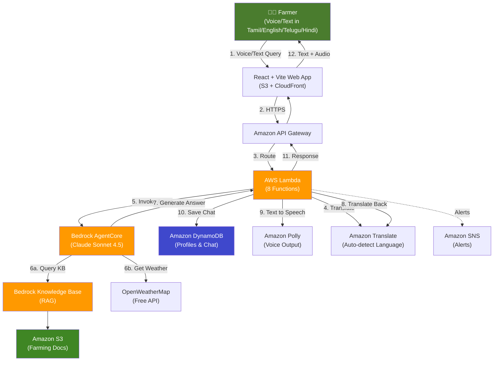

# Smart Rural AI Advisor — Detailed Implementation Guide
### Complete Project Understanding + Step-by-Step Build Instructions

**Team:** Creative Intelligence (CI)  
**Hackathon:** AWS AI for Bharat  
**Deadline:** March 4, 2026  
**Last Updated:** Feb 25, 2026  

> **Read Part A first** to understand the full project — the problem, the solution, how everything connects, and why we chose each technology. **Then follow Part B** for step-by-step build instructions.

---

## Table of Contents

### Part A — Understand the Project First

- [A1. The Problem We're Solving](#a1-the-problem-were-solving)
- [A2. Our Solution — What Is Smart Rural AI Advisor?](#a2-our-solution--what-is-smart-rural-ai-advisor)
- [A3. A Real Example — How a Farmer Uses This](#a3-a-real-example--how-a-farmer-uses-this)
- [A4. Every Component and What It Does](#a4-every-component-and-what-it-does)
- [A5. How Data Flows Through the System](#a5-how-data-flows-through-the-system)
- [A6. Why This Is Different From Existing Solutions](#a6-why-this-is-different-from-existing-solutions)
- [A7. The 6-Day Build Plan](#a7-the-6-day-build-plan)
- [A8. Budget Breakdown](#a8-budget-breakdown)
- [A9. What We're Submitting](#a9-what-were-submitting)
- [A10. Scalability & High Availability](#a10-scalability--high-availability)
- [A11. Architecture Diagrams (All Views)](#a11-architecture-diagrams-all-views)
- [A12. Impact & Future Roadmap](#a12-impact--future-roadmap)
- [A13. Responsible AI & Ethics](#a13-responsible-ai--ethics)
- [A14. Judging Criteria Alignment](#a14-judging-criteria-alignment)
- [A15. Pre-Build Preparation Checklist](#a15-pre-build-preparation-checklist)

### Part B — Step-by-Step Build Instructions

1. [Prerequisites & Accounts Setup](#1-prerequisites--accounts-setup)
2. [GitHub Repo & Project Structure](#2-github-repo--project-structure)
   - **2b.** [Integration Contract — API Contracts, DB Schemas, Naming Rules](#2b-integration-contract--the-agreement-between-frontend--backend)
3. [AWS Account & Credits Setup](#3-aws-account--credits-setup)
4. [Amazon S3 — Knowledge Base Storage](#4-amazon-s3--knowledge-base-storage)
5. [Curating the Farming Knowledge Data](#5-curating-the-farming-knowledge-data)
6. [Amazon Bedrock Knowledge Base — RAG Setup](#6-amazon-bedrock-knowledge-base--rag-setup)
7. [Amazon DynamoDB — Database Setup](#7-amazon-dynamodb--database-setup)
8. [Amazon Bedrock AgentCore — The AI Brain](#8-amazon-bedrock-agentcore--the-ai-brain)
9. [AWS Lambda — Backend Functions](#9-aws-lambda--backend-functions)
10. [Amazon API Gateway — API Layer](#10-amazon-api-gateway--api-layer)
11. [Amazon Polly — Voice Output](#11-amazon-polly--voice-output)
12. [Amazon Translate — Auto Language Detection](#12-amazon-translate--auto-language-detection)
13. [OpenWeatherMap — Weather Integration](#13-openweathermap--weather-integration)
14. [Amazon SNS — Alert Notifications](#14-amazon-sns--alert-notifications)
15. [React Frontend — Web App](#15-react-frontend--web-app)
16. [Voice Input — Native JavaScript](#16-voice-input--native-javascript)
17. [Crop Image Analysis — Claude Vision](#17-crop-image-analysis--claude-vision)
18. [AWS SAM — Infrastructure as Code](#18-aws-sam--infrastructure-as-code)
19. [React Deployment — S3 + CloudFront](#19-react-deployment--s3--cloudfront)
- **🔀 ALTERNATIVE: Streamlit Frontend (15S–19S)** — [Jump to Streamlit path](#-alternative-frontend--streamlit-sections-15s19s)
20. [AWS IAM & KMS — Security](#20-aws-iam--kms--security)
21. [Amazon CloudWatch — Monitoring](#21-amazon-cloudwatch--monitoring)
22. [Testing Strategy](#22-testing-strategy)
23. [Demo Video — How to Record](#23-demo-video--how-to-record)
24. [README.md Template](#24-readmemd-template)
25. [requirements.txt — All Python Packages](#25-requirementstxt--all-python-packages)
26. [Creating the Architecture Diagram Image](#26-creating-the-architecture-diagram-image)
27. [Troubleshooting — Common Errors & Fixes](#27-troubleshooting--common-errors--fixes)
28. [Live Demo — Judge Testing Walkthrough](#28-live-demo--judge-testing-walkthrough)
29. [Final Submission Checklist](#29-final-submission-checklist)
30. [Kiro — requirements.md & design.md (Idea Phase — Done)](#30-kiro--generating-requirementsmd--designmd-idea-phase--already-done)
31. [Presentation Deck — PPT to PDF (Idea Phase — Done)](#31-presentation-deck--ppt-to-pdf-idea-phase--already-done)

---
---

# PART A — Understand the Project First

> **Read this entire section before writing a single line of code.** It explains what we're building, why, how everything connects, and the reasoning behind every technology choice. If you understand Part A, the build instructions in Part B will make complete sense.

---

## A1. The Problem We're Solving

India has **150+ million farmers**, most of them small and marginal (owning less than 2 hectares). They face a core challenge:

**They lack access to personalized, timely, decision-oriented farming advice.**

### What Exists Today

- **Government portals (farmer.gov.in, mKisan):** Provide static data — weather numbers, scheme PDFs, crop tables. The farmer has to read, understand, and decide on their own.
- **Kisan Call Centre (1800-180-1551):** Helpful but overloaded — long wait times, limited hours, not personalized.
- **AgriTech apps (Kisan Suvidha, IFFCO Kisan):** Show dashboards, market prices, and news. But they're information dumps — not decision-makers.
- **YouTube / WhatsApp groups:** Unverified, inconsistent, often wrong.

### What's Missing

None of these systems:
- **Make decisions** for the farmer ("Don't irrigate today — rain is coming tomorrow")
- **Combine multiple data** sources in one answer (weather + soil + pest + scheme = one recommendation)
- **Speak the farmer's language** naturally (Tamil, Telugu, Hindi) via voice
- **Explain why** they're recommending something
- **Remember** the farmer's context (crops, location, history)
- **Include traditional wisdom** (Panchagavya, companion planting, lunar cycles)

### The Real-World Impact

When a pest outbreak hits, a farmer may not realize it for days — by then, 20-30% of the crop is lost. When a government scheme launches, farmers hear about it months later through word of mouth — and miss the enrollment window. When the monsoon shifts, planting at the wrong time can cost an entire season's income.

**This is the gap we're filling.**

---

## A2. Our Solution — What Is Smart Rural AI Advisor?

Smart Rural AI Advisor is a **voice-first, multilingual AI chatbot** that acts as a **personal agricultural officer** for every Indian farmer. It runs entirely on AWS and is accessible via any smartphone browser.

### In Simple Terms

Think of it as **a wise, experienced agricultural officer who:**
- Speaks Tamil, English, Telugu, and Hindi
- Is available 24/7 on your phone
- Knows your specific farm (location, soil, crops)
- Checks the weather before giving advice
- Knows every government scheme and how to apply
- Remembers what you discussed last time
- Explains *why* he's recommending something
- Also knows traditional farming wisdom your grandfather used

That's what our AI does. But instead of one officer for 1,000 farmers, it's **one AI for 150 million farmers** — all at once, no waiting.

### What Makes Ours "Agentic AI"?

Most chatbots are simple: you ask a question → they search a database → they return an answer. Like Google search with a chat interface.

Our system is **agentic** — meaning the AI *thinks*, *plans*, and *acts*:

1. **Receives** the farmer's question
2. **Reasons** — "This question involves pest + weather + crop data. I need to check 3 sources."
3. **Calls tools** — Checks weather API, queries pest database, looks up crop info
4. **Combines** the results intelligently
5. **Generates** a personalized, explainable answer
6. **Remembers** the conversation for next time

This multi-step reasoning is what separates it from a simple Q&A bot.

---

## A3. A Real Example — How a Farmer Uses This

Let's walk through a **complete real scenario** so you understand every piece of the system.

### The Farmer

**Rajesh**, a rice farmer in **Thanjavur, Tamil Nadu**. He owns 3.5 acres, uses canal irrigation, and speaks Tamil. He has a basic smartphone with Chrome browser and intermittent 4G.

### Step 1: Rajesh Opens the App

He opens his phone browser and goes to our URL (e.g., `https://d1234abcd.cloudfront.net`). No app install needed.

He sees:
- A clean chat interface with a **big green microphone button** (🎤)
- A sidebar where he already set up his profile (name, state, district, crops)
- Navigation links to Weather, Govt Schemes, Crop Doctor pages

### Step 2: Rajesh Speaks in Tamil

He presses the mic button and says:

**"எனது நெற்பயிரில் இலை மஞ்சள் நிறமாக மாறுகிறது"**  
*(Translation: "My rice crop leaves are turning yellow")*

### Step 3: Speech → Text (Browser Web Speech API)

The **Browser Web Speech API** (built into modern browsers — completely free, no AWS cost) captures his Tamil speech and converts it to Tamil text.

**Why Web Speech API instead of Amazon Transcribe?**  
- Web Speech API: **Free**, supports Tamil/Telugu/Hindi, works in Chrome/Edge/Safari/Opera
- Amazon Transcribe: **$0.024/min**, needs Lambda + streaming setup
- For a hackathon, free + simple wins.

**Browser Compatibility for Voice Input:**
| Browser | Voice Works? | Notes |
|---|---|---|
| Chrome (desktop + Android) | ✅ Full support | Best experience — recommended for demos |
| Edge | ✅ Full support | Same Chromium engine as Chrome |
| Safari (macOS / iOS) | ⚠️ Partial | Works but some Indian languages may be limited |
| Opera, Samsung Internet | ✅ Works | Chromium-based, same as Chrome |
| Firefox | ❌ Not supported | API is behind an experimental flag, not usable |

**If a farmer uses Firefox or an unsupported browser:** The app automatically switches to **Amazon Transcribe** as a fallback. The mic button still works — but instead of the browser doing speech-to-text, it records the audio using the `MediaRecorder` API (supported in ALL browsers including Firefox), sends the audio to our Lambda function, which calls Amazon Transcribe. The farmer sees zero difference.

**Why this dual approach?**
- **Primary (Web Speech API):** Free, instant, no server round-trip — best experience
- **Fallback (Amazon Transcribe):** 60 min/month free tier, works in every browser, more accurate for Indian languages
- Result: Voice input works **everywhere**, for **every farmer**, on **every browser**

### Step 4: Language Detection + Translation (Amazon Translate)

The Tamil text goes to our backend. **Amazon Translate** does two things:

1. **Auto-detects** the language as Tamil (`ta`)
2. **Translates** to English: "My rice crop leaves are turning yellow"

**Why translate to English?** The AI agent (Claude Sonnet 4.5) works best in English. We translate input to English for processing, then translate the response back to Tamil.

**Why Amazon Translate instead of building our own translation?**  
- Supports 75+ languages including Tamil, Telugu, Hindi
- Auto-detect = farmer never needs to pick a language
- Costs only $15 per million characters (~₹1,250)
- Simple API — 3 lines of code

### Step 5: Query Reaches the AI Brain (Bedrock AgentCore)

The English message goes through:

```
React Frontend → Amazon API Gateway → AWS Lambda (orchestrator) → Amazon Bedrock AgentCore
```

**AgentCore** is the brain. It's powered by **Claude Sonnet 4.5** and has access to 5 tools:

| Tool | What It Does |
|---|---|
| `get_crop_advisory` | Looks up crop data from Knowledge Base |
| `get_weather_data` | Gets real-time weather from OpenWeatherMap |
| `get_pest_alert` | Looks up pest/disease data from Knowledge Base |
| `get_irrigation_advice` | Looks up irrigation data from Knowledge Base |
| `get_govt_schemes` | Returns government scheme information |

### Step 6: The Agent Reasons and Calls Tools

The agent reads "My rice crop leaves are turning yellow" and **thinks** (this is the multi-step reasoning):

> "Yellow leaves in rice could mean: nitrogen deficiency, iron deficiency, or early rice blast. I need weather data (humidity matters) and pest pattern data to narrow it down. Let me also check crop-specific nutrient info."

It **calls 3 tools** automatically:

1. **`get_pest_alert`** → Queries Bedrock Knowledge Base → Finds: "Yellow leaves during humid conditions = likely rice blast or nitrogen deficiency. Symptoms: diamond-shaped lesions with grey center..."
2. **`get_weather_data`** → Calls OpenWeatherMap → Returns: Thanjavur is currently 28°C, 85% humidity, no rain expected today
3. **`get_crop_advisory`** → Queries Bedrock Knowledge Base → Finds: "Rice needs N:P:K = 120:60:60 kg/ha. Apply urea at tillering stage..."

### Step 7: Agent Synthesizes a Response

The agent **combines** all three tool results with its own reasoning:

> "Yellow leaves in rice during Kharif with high humidity (currently 85% in Thanjavur) likely indicates nitrogen deficiency or early-stage rice blast.
>
> **What to do:**
> 1. Apply 20kg urea per acre immediately — this addresses nitrogen deficiency
> 2. Spray Pseudomonas fluorescens (10g/L) as a preventive organic treatment
> 3. If you see diamond-shaped spots, use Tricyclazole 75% WP (0.6g/L)
>
> **Why this recommendation:**
> Your current weather — 85% humidity at 28°C — creates perfect conditions for rice blast. Acting now prevents 20-30% yield loss.
>
> **Government support:**
> You may be eligible for bio-fertilizer subsidy under the National Mission on Sustainable Agriculture. Contact your nearest Krishi Vigyan Kendra.
>
> **Traditional tip:**
> Apply Panchagavya spray (3% solution) — it boosts plant immunity and is an excellent preventive measure."

### Step 8: Translation Back to Tamil (Amazon Translate)

The English response is translated to Tamil by Amazon Translate.

### Step 9: Voice Output (Amazon Polly)

**Amazon Polly** takes the Tamil/Hindi text and generates natural-sounding speech as an MP3 file. This is stored temporarily in **Amazon S3** and a playable URL is sent back.

**Why Polly?**  
- Neural voices sound natural (not robotic)
- Supports Hindi and Indian English voices (Kajal - Neural)
- Very cheap: ~$4 per 1 million characters
- For Tamil/Telugu: Polly may not have dedicated voices, so we use browser's built-in TTS as fallback

### Step 10: Rajesh Sees and Hears the Answer

On his phone screen:
- **Tamil text** of the full recommendation
- **Audio player** — he presses play and hears the advice spoken
- **Expandable "Why this recommendation?"** section
- **Links** to relevant govt schemes

### Step 11: Conversation is Saved (DynamoDB)

Everything is stored in **Amazon DynamoDB**:
- His original Tamil message
- The English translation
- The agent's English response
- The Tamil translation
- Which tools were called
- The audio file URL

**Why save all this?** 
- Memory — next time Rajesh asks "what about my rice?", the agent already knows the context
- Debugging — if something goes wrong, we can trace exactly where
- Analytics — we can see what farmers ask most (for improving the system)

### That's One Complete Cycle

```
Tamil Speech → Text → Auto-Detect Tamil → Translate to English 
  → AgentCore reasons → Calls 3 tools → Synthesizes answer 
  → Translate to Tamil → Polly speaks Tamil → Farmer hears advice
```

Total time: **3-7 seconds**. Available 24/7. No waiting in queue.

---

## A4. Every Component and What It Does

### Architecture Diagram (Text)

```
┌──────────────────────────────────────────────────────────────────────────────────┐
│                              AWS CLOUD                                            │
│                                                                                   │
│  👨‍🌾 FARMER (Phone Browser)                                                       │
│  ┌─────────────────────────────────────────────┐                                  │
│  │ React + Vite Web App (S3 + CloudFront)        │                                  │
│  │ • Chat Interface      • Weather Page         │                                  │
│  │ • Voice Mic Button    • Govt Schemes Page     │                                  │
│  │ • Crop Image Upload   • My Farm Profile       │                                  │
│  │ • 🎤 Web Speech API   • Polly Audio Player    │                                  │
│  └──────────────────┬──────────────────────────┘                                  │
│                     │ HTTPS                                                        │
│                     ▼                                                              │
│  ┌─────────────────────────────────────────────┐                                  │
│  │ Amazon API Gateway (REST API)                │                                  │
│  │ Routes: /chat  /voice  /weather  /health     │                                  │
│  │         /profile  /schemes  /image-analyze   │                                  │
│  │ + IAM Auth + KMS Encryption + CORS           │                                  │
│  └──────────────────┬──────────────────────────┘                                  │
│                     │                                                              │
│                     ▼                                                              │
│  ┌─────────────────────────────────────────────┐                                  │
│  │ AWS Lambda Functions (Serverless Compute)     │                                  │
│  │ • agent_orchestrator  • weather_lookup        │                                  │
│  │ • crop_advisory       • govt_schemes          │                                  │
│  │ • farmer_profile      • transcribe_speech     │                                  │
│  │ • image_analysis      • (health = inline)     │                                  │
│  └──────────┬────────────┬─────────────────────┘                                  │
│             │            │                                                         │
│             ▼            ▼                                                         │
│  ┌──────────────────┐  ┌────────────────────────────────────┐                     │
│  │ Amazon Bedrock    │  │ DATA & KNOWLEDGE LAYER              │                     │
│  │ AgentCore         │  │                                     │                     │
│  │ (Claude Sonnet    │  │  📚 Bedrock Knowledge Base (RAG)    │                     │
│  │  4.5 - the brain) │  │  📦 Amazon S3 (farming docs)        │                     │
│  │                   │  │  🗄️ Amazon DynamoDB (profiles)      │                     │
│  │ • Multi-step      │  │  🌤️ OpenWeatherMap API (weather)    │                     │
│  │   reasoning       │  │                                     │                     │
│  │ • Tool calling    │  └────────────────────────────────────┘                     │
│  │ • Memory          │                                                             │
│  │ • Guardrails      │  ┌────────────────────────────────────┐                     │
│  └──────────────────┘  │ RESPONSE LAYER                      │                     │
│                         │  🔊 Amazon Polly (voice output)     │                     │
│                         │  🌐 Amazon Translate (auto-detect)  │                     │
│                         │  📢 Amazon SNS (alerts)             │                     │
│                         └────────────────────────────────────┘                     │
│                                                                                   │
│  ┌─────────────────────────────────────────────────────────────────────────────┐   │
│  │  MONITORING: CloudWatch (logs + dashboards)  │  SECURITY: IAM + KMS         │   │
│  └─────────────────────────────────────────────────────────────────────────────┘   │
└──────────────────────────────────────────────────────────────────────────────────┘
```

### Layer-by-Layer Breakdown

#### Layer 1: Frontend — What the Farmer Sees

| Component | Technology | What It Does | Why This Choice |
|---|---|---|---|
| **Web App** | React 18 + Vite (JavaScript) | 5-page app: Chat, Weather, Govt Schemes, Crop Doctor, My Farm | Custom, professional UI with full control over styling and mobile responsiveness. Sanjay handles frontend — React gives the best judge impression ("looks like a real product"). |
| **Voice Input (Primary)** | Browser Web Speech API | Farmer speaks → converts to text | **Free** (no AWS cost), supports Tamil/Telugu/Hindi/English, works in Chrome/Edge/Safari/Opera. **Native in React** — Web Speech API is just JavaScript, no hacks needed. |
| **Voice Input (Fallback)** | Amazon Transcribe | Audio recorded via MediaRecorder → Lambda → Transcribe → text | 60 min/month free. Kicks in automatically for Firefox or any browser without Web Speech API. Farmer sees no difference. Custom hook auto-detects and switches path. |
| **Voice Output** | Amazon Polly audio | AI speaks back in farmer's language | Neural voices sound natural, supports Hindi + Indian English. Cheap ($4/million chars). |
| **Crop Image Upload** | React file input + drag-and-drop | Upload photo of diseased crop → AI diagnosis | Full control over UI, drag-and-drop zone, sends image as base64 to Claude Vision for analysis. |
| **Farmer Profile** | Sidebar form | Name, state, district, crops, soil type | Personalizes every AI response. Stored in DynamoDB. |
| **Hosting** | S3 + CloudFront | Gives a public URL for the app | Submission requires a "Working Live Link." Static site hosted on S3 with CloudFront CDN — fast, cheap, and globally distributed. |

**Why React instead of Streamlit?**

| | React | Streamlit |
|---|---|---|
| Language | JavaScript (Sanjay's strength) | Python |
| UI Quality | **Custom, professional, impressive** | Clean but generic — "another Streamlit project" |
| Voice Input | **Native** — Web Speech API is just JS | Tricky — needs iframe custom component hack |
| Mobile UX | **Full control** — CSS media queries | Basic responsive |
| Judge impression | **"This looks like a real product"** | "Standard hackathon demo" |
| Hackathon fit | **Best choice** — Sanjay owns frontend | Works if nobody knows JS |

#### Layer 2: API Layer — The Front Door

| Component | Technology | What It Does | Why This Choice |
|---|---|---|---|
| **REST API** | Amazon API Gateway | Routes HTTP requests to correct Lambda function | Standard AWS entry point for serverless. Handles auth, rate limiting, CORS automatically. |
| **8 Endpoints** | API routes | `/chat`, `/voice`, `/weather/{location}`, `/profile/{farmerId}`, `/health`, `/schemes`, `/image-analyze`, `/transcribe` | Each endpoint maps to one Lambda function — clean separation of concerns. |
| **Security** | IAM + CORS | Authenticates requests, allows browser access | IAM handles AWS-level auth. CORS must be enabled or browsers will block frontend requests (the #1 hackathon debugging headache). |
| **Encryption** | KMS (via HTTPS) | All data encrypted in transit | HTTPS is automatic with API Gateway — no extra setup needed. |

#### Layer 3: Compute — The Workers

| Component | Technology | What It Does | Why This Choice |
|---|---|---|---|
| **Agent Orchestrator** | AWS Lambda | Main entry: receives query → calls Translate → calls AgentCore → translates response → calls Polly → returns | Central coordinator for the entire request flow. |
| **Weather Lookup** | AWS Lambda | Calls OpenWeatherMap API, formats data | Separate function = can be tested independently. |
| **Govt Schemes** | AWS Lambda | Returns scheme eligibility, application steps, helplines | Curated data — always accurate and up-to-date. |
| **Crop Advisory** | AWS Lambda | Queries Bedrock Knowledge Base for crop/pest/irrigation info | Retrieves the most relevant farming knowledge for the query. |
| **Farmer Profile** | AWS Lambda | CRUD operations on DynamoDB farmer profiles | Stores/retrieves farmer preferences for personalized advice. |
| **Transcribe Speech** | AWS Lambda | Audio → Amazon Transcribe → text. Fallback for browsers without Web Speech API. | Enables voice input for Firefox users. |
| **Image Analysis** | AWS Lambda | Sends crop image to Claude Sonnet 4.5 Vision → gets diagnosis | Claude can analyze images out of the box — no ML training needed. |

**Why AWS Lambda instead of EC2 or containers?**

| | Lambda | EC2 |
|---|---|---|
| Cost | Pay per request (~$0 for hackathon with free tier) | ~$5-15/week minimum even when idle |
| Scaling | Automatic (0 to 1000 concurrent) | Manual |
| Setup | Upload code, done | Install OS, runtime, configure, deploy |
| Maintenance | Zero | Patches, updates, monitoring |
| Hackathon fit | **Perfect** | Over-engineered |

#### Layer 4: AI Brain — The Intelligence

| Component | Technology | What It Does | Why This Choice |
|---|---|---|---|
| **AI Orchestrator** | Amazon Bedrock AgentCore | The brain — receives English query, decides which tools to call, chains reasoning steps, maintains memory, applies guardrails | See detailed comparison below. |
| **Foundation Model** | Claude Sonnet 4.5 (on Bedrock) | Understands language, reasons about farming, generates explainable advice | Best balance of quality + speed + cost. See model comparison below. |
| **Knowledge Retrieval** | Amazon Bedrock Knowledge Base (RAG) | Searches curated farming docs semantically — finds the 3-5 most relevant paragraphs for any query | See RAG explanation below. |
| **Guardrails** | Bedrock Guardrails | Blocks harmful content, keeps responses on-topic (farming only) | Shows judges we care about responsible AI. |

**Why Bedrock AgentCore — not just calling Claude directly?**

If you call Claude directly (Bedrock `invoke_model`), you get a simple input-output: text in → text out. The AI can't call weather APIs, can't query a database, can't check pest data. You'd have to code all that orchestration yourself.

AgentCore adds:
- **Tool calling** — The AI decides *which* Lambda tools to call based on the question
- **Multi-step reasoning** — It can chain: first get weather → then get pest data → then combine both into advice
- **Memory** — Remembers the conversation. "My rice" references what was discussed 5 messages ago
- **Guardrails** — Blocks off-topic queries ("What's the latest cricket score?" → politely redirected)

This is what makes it **agentic** AI, not just a chatbot.

**Why Claude Sonnet 4.5 — not Haiku, Opus, or GPT?**

| Model | Quality | Speed | Cost (per 1M input tokens) | Our Verdict |
|---|---|---|---|---|
| Claude Haiku | Basic | Very fast | ~$0.25 | Too simple — can't reason well about multi-factor farming decisions |
| Claude Sonnet 3.5 | Good | Fast | ~$3 | Would work, but 4.5 has significantly better reasoning |
| **Claude Sonnet 4.5** | **Excellent** | **Fast** | **~$3** | **Best balance — great reasoning + fast response + affordable** |
| Claude Opus 4 | Best | Slow (10-20s) | ~$15 | Too slow for a chatbot. Too expensive for 2000+ test queries. |
| GPT-4 (OpenAI) | Excellent | Fast | ~$10 | **Not available on AWS Bedrock** — this is an AWS hackathon! |

**What is RAG (Retrieval-Augmented Generation)?**

Without RAG:
```
Farmer asks: "When should I plant rice in Tamil Nadu?"
Claude thinks based on its general training data → May give outdated or generic answer
```

With RAG:
```
Farmer asks: "When should I plant rice in Tamil Nadu?"
→ Knowledge Base searches our curated documents
→ Finds: "Tamil Nadu rice: Samba season June-Jan, Navarai season Jan-Apr, 
   recommended varieties: BPT-5204, CO-51, Swarna..."
→ Sends these SPECIFIC paragraphs to Claude along with the question
→ Claude gives accurate, detailed, India-specific answer
```

RAG = The AI reads our curated documents first, THEN answers. Like giving a student a textbook before the exam.

**Why Bedrock Knowledge Base instead of building RAG ourselves (with OpenSearch, Pinecone, etc.)?**

| | Bedrock KB (Managed) | DIY with OpenSearch |
|---|---|---|
| Setup time | ~30 minutes | ~3-4 hours |
| Code to write | Zero (point to S3 bucket, click sync) | Embedding pipeline, indexing, query code |
| Vector database | Auto-created (managed OpenSearch Serverless) | Manual cluster configuration |
| Cost | ~$3-5 for the week | ~$20-30 for the week |
| Maintenance | Zero | Manage cluster, shards, indices |
| Quality | Same | Same |
| Hackathon fit | **Perfect** | Over-engineered |

#### Layer 5: Data & Knowledge — What the AI Knows

| Component | Technology | Content | Why |
|---|---|---|---|
| **Farming Documents** | Amazon S3 → Bedrock KB | 6 curated Markdown files: 20 crops, pests, irrigation, traditional practices, govt schemes, regional advisories | These documents are the AI's "textbook" — quality here = quality of advice |
| **Farmer Profiles** | Amazon DynamoDB | Name, location, crops, soil type, language preference | Personalizes every recommendation |
| **Chat History** | Amazon DynamoDB | Every message (original + translated + response) per session | Memory + debugging + analytics |
| **Weather Data** | OpenWeatherMap API (external) | Real-time current weather + 5-day forecast for any Indian city | **Free** tier = 1000 API calls/day, no AWS cost |

**Why DynamoDB instead of PostgreSQL/RDS?**

| | DynamoDB | RDS (PostgreSQL) |
|---|---|---|
| Setup | 2 minutes (create table, done) | 15-20 min (instance type, VPC, security groups) |
| Cost | **Free tier** (25GB + 25 read/write) | ~$15-30/week minimum |
| Schema | Flexible — add fields anytime | Fixed — need migration scripts |
| Maintenance | Zero (serverless) | Manage backups, patches, scaling |
| Speed | Single-digit millisecond | 5-10ms |

**Why OpenWeatherMap instead of an AWS weather service?**
AWS doesn't have a weather API. OpenWeatherMap has a generous free tier (1000 calls/day) and covers every Indian city. Sign up takes 2 minutes.

#### Layer 6: Language & Voice — Breaking the Barrier

| Component | Technology | What It Does | Why |
|---|---|---|---|
| **Language Detection** | Amazon Translate (auto-detect) | Farmer sends any language → system detects which one | Farmer never needs to pick a language. Just speak naturally. |
| **Input Translation** | Amazon Translate | Farmer's Tamil/Telugu/Hindi → English (for the AI) | Agent works in English for best quality |
| **Output Translation** | Amazon Translate | AI's English response → Farmer's detected language | Response comes back in the language they spoke |
| **Voice Input (Primary)** | Browser Web Speech API | Speech → text in Tamil/Telugu/Hindi/English | Free, no AWS cost, works in Chrome/Edge/Safari/Opera. Uses `declare_component()` to bridge JS↔Python. |
| **Voice Input (Fallback)** | Amazon Transcribe | Audio → Lambda → Transcribe → text | 60 min/month free. Auto-activates when Web Speech API unavailable (e.g. Firefox). Same custom component. |
| **Voice Output** | Amazon Polly (Neural) | Text → natural-sounding speech | Neural voices (Kajal) sound human-like, not robotic |

**The complete language flow:**

```
┌────────────┐     ┌──────────────┐     ┌──────────────┐     ┌──────────────┐
│ Farmer     │     │ Web Speech   │     │ Amazon       │     │ Bedrock      │
│ speaks     │────►│ API converts │────►│ Translate    │────►│ AgentCore    │
│ Tamil      │     │ to Tamil     │     │ detects Tamil│     │ processes    │
│            │     │ text         │     │ → English    │     │ in English   │
└────────────┘     └──────────────┘     └──────────────┘     └──────┬───────┘
                                                                     │
┌────────────┐     ┌──────────────┐     ┌──────────────┐            │
│ Farmer     │     │ Amazon       │     │ Amazon       │     ┌──────▼───────┐
│ hears      │◄────│ Polly speaks │◄────│ Translate    │◄────│ English      │
│ Tamil      │     │ Tamil audio  │     │ English →    │     │ response     │
│ advice     │     │              │     │ Tamil        │     │ generated    │
└────────────┘     └──────────────┘     └──────────────┘     └──────────────┘
```

**Languages supported (and priority):**

| Language | Code | Priority | Status |
|---|---|---|---|
| Tamil | `ta` | 🥇 Primary | Full support — text, translate, voice (browser TTS) |
| English | `en` | 🥇 Primary | Full support — text, translate, Polly neural voice |
| Telugu | `te` | 🥈 Secondary | Text + translate. Voice via browser TTS. |
| Hindi | `hi` | 🥉 Tertiary | Full support — text, translate, Polly neural voice (Kajal) |

#### Layer 7: Alerts & Monitoring

| Component | Technology | What It Does | Why |
|---|---|---|---|
| **Alerts** | Amazon SNS | Sends weather warnings, pest outbreak alerts via email/SMS | First 1M requests free. Simple pub/sub model. |
| **Logging** | Amazon CloudWatch | Every Lambda invocation logged automatically | Built-in — zero setup. Essential for debugging. |
| **Dashboard** | CloudWatch Dashboard | Visual: invocations, errors, latency | 5-minute setup, shows judges you monitor your system. |
| **Auth** | AWS IAM | Each service has minimum-privilege permissions | Security best practice. SAM template handles it. |
| **Encryption** | KMS + S3 SSE + HTTPS | Data encrypted at rest and in transit | S3 SSE is free. HTTPS is automatic with API Gateway. |

---

## A5. How Data Flows Through the System

### Flow 1: Text Chat (Most Common)

```
1. Farmer types in Tamil in the React chat box
2. React sends POST to API Gateway /chat endpoint
3. API Gateway triggers agent_orchestrator Lambda
4. Lambda calls Amazon Translate:
   - Detects: Tamil (ta)
   - Translates to: English
5. Lambda calls Bedrock AgentCore with English query
6. AgentCore (Claude Sonnet 4.5):
   a. Reads the query
   b. Decides which tools to call
   c. Calls get_pest_alert Lambda → queries Bedrock KB
   d. Calls get_weather_data Lambda → calls OpenWeatherMap
   e. Combines results → generates English response
7. Lambda calls Amazon Translate: English → Tamil
8. Lambda calls Amazon Polly: Tamil text → MP3 audio → saved to S3
9. Lambda saves conversation to DynamoDB (chat_sessions table)
10. Lambda returns to API Gateway:
    {
      "reply": "Tamil advisory text",
      "reply_en": "English advisory text",
      "detected_language": "ta",
      "tools_used": ["get_pest_alert", "get_weather_data"],
      "audio_url": "https://s3.../audio/xyz.mp3",
      "session_id": "sess_abc123"
    }
11. React displays Tamil text + plays audio
```

### Flow 2: Voice Chat

```
Same as Flow 1, except:
- Step 1: Farmer presses mic → Web Speech API converts speech to text
- Then continues from Step 2 onwards
```

### Flow 3: Crop Image Analysis

```
1. Farmer uploads photo of diseased crop on Crop Doctor page
2. React encodes image as base64
3. Sends POST to API Gateway /image-analyze endpoint
4. Lambda calls Claude Sonnet 4.5 Vision (Bedrock invoke_model) with the image
5. Claude analyzes the image:
   - Identifies: disease/pest/deficiency
   - Severity: low/medium/high
   - Treatment: organic + chemical options
   - Prevention steps
6. Response translated to farmer's language
7. Displayed on screen with audio option
```

### Flow 4: Weather Check

```
1. Farmer clicks Weather page or asks "What's the weather?"
2. GET request to API Gateway /weather/{location}
3. Lambda calls OpenWeatherMap API
4. Returns: temperature, humidity, rainfall, 5-day forecast
5. Displayed in a clean dashboard widget
```

### Flow 5: Government Scheme Lookup

```
1. Farmer asks "How do I apply for PM-KISAN?" or browses Schemes page
2. Agent calls get_govt_schemes tool OR direct API call
3. Returns: scheme name, eligibility, step-by-step application process, helpline
4. Information is both from curated Lambda data AND Knowledge Base docs
```

---

## A6. Why This Is Different From Existing Solutions

| What Exists Today | What Our System Does |
|---|---|
| Shows raw weather data (28°C, 85% humidity) | **Makes a decision:** "Don't spray pesticide today — too humid, it won't stick to leaves. Wait for Thursday when humidity drops to 60%." |
| Shows scheme PDFs | **Walks through it:** "You ARE eligible for PM-KISAN. Here's exactly how to apply: Step 1: Go to your nearest CSC. Step 2: Bring Aadhaar + bank passbook. Step 3: They'll register you. You'll get ₹2,000 in 2 months." |
| One language (English or Hindi) | **Auto-detects** Tamil/Telugu/Hindi/English — farmer never has to choose |
| Text only, requires reading | **Voice-first** — speak a question, hear an answer |
| Generic information for all of India | **Personalized** to your specific state, district, crops, soil, and weather |
| No memory | **Remembers** your farm profile and conversation history |
| Modern science only | **Combines** modern science + traditional wisdom (Panchagavya, companion planting, crop rotation) |
| Tells you WHAT to do | **Explains WHY** — "I'm recommending this because your soil pH is 6.5 and current humidity is high" |
| One data source per app | **Combines 5+ sources** per answer — weather + pest + crop + scheme + traditional knowledge |

### A6b. Original Submission vs Current Implementation — What Changed and Why

Our original idea submission (`Smart_Rural_AI_Advisor_Submission.md`) described a **full production vision** with 15+ AWS services. The current prototype is a **realistic, buildable subset** that delivers the same core value in 6 days with $100 credits. Here's every difference:

#### Services That Changed

| Component | Original Submission | Current Prototype | Why We Changed |
|---|---|---|---|
| **AI Orchestration** | "Kiro Orchestration" | Bedrock AgentCore | Kiro is a **spec/design tool** (IDE) — we use it to generate `requirements.md` and `design.md` (mandatory submission). For **runtime** AI orchestration, we use Bedrock AgentCore. |
| **ML Predictions** | SageMaker + SageMaker Ground Truth (custom models for crop yield, pest risk, irrigation) | Claude Sonnet 4.5 on Bedrock (zero training) | We have **no labeled training data** for custom models. SageMaker needs weeks of data collection + labeling + training. Claude's reasoning handles crop/pest/irrigation advice via Knowledge Base — no training required. |
| **Knowledge Search** | Amazon OpenSearch (managed cluster) | Bedrock Knowledge Base (managed RAG) | OpenSearch requires: cluster configuration, index mapping, embedding pipeline, scaling config. Bedrock KB does ALL of this in 30 minutes with zero code. Same search quality, 10x faster setup. |
| **Data Catalog** | AWS Glue Data Catalog | Not needed | Glue is for managing metadata across multiple data lakes/warehouses. We have 6 Markdown files in S3 — no data catalog needed. |
| **Analytics** | Amazon Athena + QuickSight dashboards | QuickSight (stretch goal only) | Athena queries data in S3 using SQL — we don't need SQL queries on Markdown files. QuickSight dashboards are a nice stretch goal but not core functionality. |
| **Foundation Model** | "Claude / Titan" (unspecified) | Claude Sonnet 4.5 (specific) | We chose Sonnet 4.5 specifically: best reasoning quality for the price, supports tool calling, great at multilingual content, and handles image analysis (Crop Doctor). |
| **Language Support** | "Hindi, Tamil, Telugu, Kannada, and other Indian languages" | Tamil, English (primary), Telugu, Hindi (secondary) | 4 languages we can thoroughly test > 10 languages we can't. Tamil is our demo language. Can easily add more post-hackathon. |
| **Frontend** | "Mobile App / Web App" (unspecified) | React + Vite Web App (specific) | A mobile app takes 2+ weeks (React Native + app store approval). A responsive web app works on all phones via browser and deploys in hours. |
| **Hosting** | Not specified | S3 + CloudFront | Gives us a public URL (submission requirement), serves static files globally via CDN, auto-scales, and costs pennies. |
| **Security** | AWS Security Hub | CloudWatch + IAM + KMS | Security Hub is enterprise-grade compliance management (~$30+/month). Overkill for a prototype. IAM + KMS + CloudWatch provides real security at zero cost. |
| **IoT** | "IoT/Sensor Data" | Not in prototype | No physical sensors to connect. Future roadmap (Phase 2). |
| **Offline Mode** | "Offline Cache & Sync Mechanism" | Not in prototype | True offline requires service workers, local storage, and sync logic — 2-3 days of work alone. Future roadmap (Phase 2). |
| **Govt API** | "Govt Agri API" (implied live API) | Pre-curated data in Knowledge Base | No reliable government APIs exist. Data is manually curated from official websites and stored in our KB. Safer and more reliable than scraping. |

#### Services That Stayed the Same

| Service | Original | Current | Status |
|---|---|---|---|
| Amazon API Gateway | ✅ | ✅ | Routes all requests to Lambda |
| AWS Lambda | ✅ | ✅ | Serverless backend (8 functions) |
| Amazon Bedrock (AgentCore) | ✅ | ✅ | AI orchestration + tool calling |
| Amazon DynamoDB | ✅ | ✅ | Farmer profiles + chat history |
| Amazon S3 | ✅ | ✅ | Knowledge Base document storage |
| Amazon Polly | ✅ | ✅ | Text-to-speech for voice output |
| Amazon SNS | ✅ | ✅ | Farmer alerts |
| AWS IAM | ✅ | ✅ | Access control |
| AWS KMS | ✅ | ✅ | Encryption |
| Amazon CloudWatch | ✅ | ✅ | Monitoring + logging |
| Weather API | ✅ | ✅ | OpenWeatherMap for real-time weather |

#### Services We Added (Not in Original)

| Service | Why We Added It |
|---|---|
| **Amazon Translate** | Original didn't mention translation. We need auto-language detection + translation to/from Tamil/Telugu/Hindi. |
| **Bedrock Knowledge Base** | The RAG layer. Original had OpenSearch, we replaced with this managed alternative. |
| **Titan Embeddings V2** | Needed for Knowledge Base vector search. Wasn't in original. |
| **S3 + CloudFront** | Needed for public URL (submission requirement). Hosts React static frontend globally via CDN. |
| **Web Speech API** | Browser-based voice input. Original said "voice" but didn't specify how. |
| **Bedrock Guardrails** | Content filtering, PII detection, topic control. Important for responsible AI. |

#### The Core Value Is Identical

Despite the technical changes, the **farmer experience** is exactly what we proposed:

| Promise (Original Submission) | Delivered (Current Prototype) |
|---|---|
| "Voice-enabled, multilingual AI advisor" | ✅ Voice input (Web Speech API) + Voice output (Polly) + 4 languages |
| "Traditional farming knowledge" | ✅ Panchagavya, crop rotation, companion planting in Knowledge Base |
| "Real-time weather and crop intelligence" | ✅ OpenWeatherMap + Bedrock KB crop data |
| "Government schemes and financial support" | ✅ PM-KISAN, PMFBY, KCC, etc. in Knowledge Base |
| "Agent-based AI" | ✅ Bedrock AgentCore with tool calling |
| "Predictive, explainable, actionable guidance" | ✅ Claude Sonnet 4.5 reasoning + "Why this recommendation?" in every response |
| "Designed for low digital literacy" | ✅ Voice-first, auto-language, simple UI |

#### If Judges Ask: "Your submission mentioned Kiro/SageMaker/OpenSearch — where are they?"

> *"Kiro is our spec & design tool — we used it to generate the `requirements.md` and `design.md` files in our repo, exactly as the hackathon requires. For runtime AI orchestration, we use Bedrock AgentCore instead. SageMaker requires training data we don't have — Claude's reasoning via Knowledge Base delivers the same advisory quality without training. OpenSearch was replaced by Bedrock Knowledge Base, which gives us the same semantic search in 30 minutes instead of 4 hours. Every change was made to deliver the same farmer experience with a buildable, demoable prototype in 6 days. The original vision services — SageMaker custom models, offline mode, IoT sensors — are our post-hackathon Phase 1-3 roadmap."*

---

## A7. The 6-Day Build Plan

We have **6 working days** (Feb 25 – Mar 2) + 1 buffer day (Mar 3). Deadline: Mar 4.

We're using **Claude Opus 4.6 via GitHub Copilot** to generate ~80% of code — this 5-10x's our development speed. A Lambda function that would take 2 hours manually takes ~20 minutes with AI.

| Day | Date | Focus | End-of-Day Milestone |
|---|---|---|---|
| **1** | Feb 25 | Foundation | S3 data curated, Bedrock KB synced, AgentCore agent working, DynamoDB ready |
| **2** | Feb 26 | Backend | API Gateway live, all Lambda tools working, Polly + Translate integrated |
| **3** | Feb 27 | Frontend | Full React app with chat, voice, weather, schemes, crop doctor |
| **4** | Feb 28 | Deploy | Live URL on S3 + CloudFront, SNS alerts |
| **5** | Mar 1 | Test & Polish | 20+ scenarios tested, all bugs fixed, UI polished, mobile tested |
| **6** | Mar 2 | Submit | Demo video recorded, README done, all 5 deliverables submitted |
| **7** | Mar 3 | Buffer | Monitor live URL, emergency fixes |

### Team Role Assignments

**Team:** Creative Intelligence (CI) — 4 members

| Role | Owner | Responsibilities | Days Most Active |
|---|---|---|---|
| **Team Lead + Frontend** | **Sanjay M** | Frontend (React — all 5 pages + voice + CSS), frontend deployment (S3 + CloudFront), demo video narration | All days |
| **Backend + Infra** | **Manoj RS** | All 7 Lambda functions, backend utils, SAM template, API Gateway, Bedrock AgentCore config, Polly/Translate integration, `sam deploy` | Day 1-4 |
| **Data Curator / KB Specialist** | **Abhishek Reddy** | Write all 6 Knowledge Base documents (using templates), structured data (JSON/CSV), upload to S3, create & test Bedrock KB | Day 1-2 (critical path) |
| **QA + Documentation Lead** | **Jeevidha R** | Problem statement, testing all endpoints (20+ scenarios), bug logging, README, Project Summary, screenshots, demo video operation, final submission | Day 1 + Day 3-6 |

**How it works:**
- **Sanjay + Manoj have equal authority** — Sanjay owns frontend, Manoj owns backend. Architecture and final decisions are joint. "Team Lead" is the official hackathon title (Sanjay submitted the idea), not a hierarchy.
- **Abhishek** creates the knowledge that powers the AI brain — his Day 1 output is what makes the demo impressive
- **Jeevidha** ensures quality and owns the submission deliverables that judges read first
- **Manoj reviews** Abhishek's KB docs before S3 upload (30-min checkpoint end of Day 1)
- **Sanjay + Manoj jointly review** Jeevidha's README + Project Summary before submission (Day 5-6)
- Both Sanjay and Manoj approve final deliverables before submission
- Use a shared WhatsApp group for real-time updates: "Backend Lambda #3 done ✅", "Frontend weather page blocked — need API Gateway URL"

### Parallel Work Streams

```
Day 1:  [Abhishek: KB docs]      [Sanjay: AWS setup + frontend scaffold] [Manoj: IAM + utils + Lambda skeletons] [Jeevidha: Problem Statement + test prep]
Day 2:  [Abhishek: KB setup+test] [Sanjay: all 5 pages (mock data)]       [Manoj: all 7 Lambdas + reviews KB docs] [Jeevidha: help Abhishek + learn Postman]
Day 3:  [Abhishek: help test]     [Sanjay: connects all pages to API]     [Manoj: AgentCore + SAM + deploy → shares API URL] [Jeevidha: API testing]
Day 4:  [Abhishek: mobile test]   [Sanjay: deploy frontend → live URL]    [Manoj: fix backend bugs]               [Jeevidha: full E2E testing on live URL]
Day 5:  [Abhishek: screenshots]   [Sanjay: fix frontend bugs + polish]    [Manoj: fix bugs + final deploy]        [Jeevidha: edge cases + README + Summary]
Day 6:  [Abhishek: demo prep]     [Sanjay: narrate demo + final review]   [Manoj: review docs + verify]           [Jeevidha: record demo + submit]
```

---

## A8. Budget Breakdown

**Total AWS credits: $100. Estimated spend: $30-55.**

| Service | Cost | What It Does |
|---|---|---|
| Amazon Bedrock (Claude Sonnet 4.5) | $15-25 | ~2000 queries during dev + testing + demo |
| Bedrock Knowledge Base | $3-5 | Embeddings storage + retrieval |
| AWS Lambda | ~$0.50 | Free tier covers most |
| API Gateway | ~$0.50 | Low volume |
| DynamoDB | $0 | Free tier (25GB) |
| Amazon S3 | ~$0.10 | Small data storage |
| Amazon Polly | $2-4 | Voice output in 4 languages |
| Amazon Translate | $1-3 | Tamil/Telugu/Hindi translation |
| S3 + CloudFront | ~$0.50 | Hosts frontend (static site, very cheap) |
| Amazon SNS | $0 | First 1M requests free |
| CloudWatch | $0 | Basic monitoring free |
| **Total** | **$30-55** | **$45-70 remaining as buffer** |

The most expensive item is Bedrock (Claude) for AI queries. Everything else is near-free thanks to AWS free tier.

---

## A9. What We're Submitting

> **Context:** The idea phase (Kiro `requirements.md` + `design.md` + PPT deck) is already done — we got shortlisted! The prototype phase has different deliverables.

The **prototype submission** (due March 4, 2026 at 11:59 PM IST) requires:

| # | Deliverable | What We'll Submit | Mandatory? |
|---|---|---|---|
| 1 | **GitHub Repository** | Full source code + README + architecture diagram + setup instructions | ✅ Yes |
| 2 | **Live Working Prototype URL** | S3 + CloudFront URL that judges can test in their browser | ✅ Yes |
| 3 | **Video Demo** | 5-7 min video: problem intro → architecture → live demo (English + Tamil voice + image analysis) → impact. YouTube or Google Drive link. | ✅ Yes |
| 4 | **Project Summary** | 500-800 word write-up: problem, solution, architecture, impact | ✅ Yes |
| 5 | **Problem Statement** | The farming advisory gap — 150M+ farmers without personalized guidance | ✅ Yes |

> **Note:** Sections 30 and 31 cover Kiro and PPT — those were for the idea submission phase (already completed). Keep those files in your repo for completeness, but the prototype phase focuses on the 5 deliverables above.

### A9b. Project Summary — Ready to Submit (Copy-Paste)

This is the actual 500-800 word write-up for the hackathon submission. Copy and paste directly.

---

**Smart Rural AI Advisor — Project Summary**

**Team:** Creative Intelligence (CI)

**Problem**

India has over 150 million farmers, the majority of whom are small and marginal landholders with less than 2 hectares. These farmers face a critical information gap: they lack access to personalized, timely, and decision-oriented farming advice. Existing solutions — government portals like farmer.gov.in, the Kisan Call Centre, and AgriTech apps — provide static data, dashboards, and raw information. Farmers must interpret weather numbers, read scheme PDFs, and make decisions alone. This gap is deepened by language barriers (most tools are English or Hindi only), low digital literacy, and the absence of voice-first interfaces. When a pest outbreak occurs, a farmer may not recognize it for days — losing 20-30% of the crop. When government schemes launch, farmers hear about them months later and miss enrollment windows. These are not information problems. They are decision-support problems.

**Solution**

Smart Rural AI Advisor is a voice-first, multilingual AI chatbot that acts as a personal agricultural officer for every Indian farmer. It is accessible via any smartphone browser — no app installation required. Farmers speak or type in their native language (Tamil, English, Telugu, or Hindi), and the system auto-detects the language, processes the query through an agentic AI pipeline, and responds with actionable, explainable advice in the same language — both as text and spoken audio.

The system is built on Amazon Bedrock AgentCore, which orchestrates Claude Sonnet 4.5 as the foundation model with multi-step reasoning and tool-calling capabilities. Unlike simple chatbots that return search results, our agent reasons across multiple data sources per query: it checks real-time weather data (via OpenWeatherMap), searches curated farming knowledge (via Bedrock Knowledge Base with RAG), and combines crop science, pest patterns, government schemes, and traditional Indian farming wisdom into a single, personalized recommendation.

Key features include: AI-powered crop planning based on soil, season, and region; smart irrigation scheduling informed by weather forecasts; early pest and disease alerts with both organic and chemical treatment options; step-by-step government scheme guidance for PM-KISAN, PMFBY, KCC, and other programs; crop disease diagnosis from smartphone photos using Claude Vision; and integration of traditional practices like Panchagavya, companion planting, and crop rotation alongside modern agricultural science.

**Architecture**

The solution uses 14 AWS services in a fully serverless architecture: Amazon Bedrock AgentCore and Claude Sonnet 4.5 for agentic AI reasoning; Bedrock Knowledge Base (RAG) with Titan Embeddings V2 for semantic search over curated farming documents stored in Amazon S3; AWS Lambda (8 functions) for serverless compute; Amazon API Gateway for REST API routing; Amazon DynamoDB for farmer profiles and chat history; Amazon Translate for auto-language detection and translation; Amazon Polly for neural text-to-speech output; Amazon SNS for weather and pest alerts; Amazon S3 and CloudFront for hosting the React web frontend with a public URL; and AWS IAM, KMS, and CloudWatch for security, encryption, and monitoring.

All services are serverless or fully managed, meaning the system auto-scales from 1 farmer to 1 million farmers with zero infrastructure management. Infrastructure is defined as code using AWS SAM.

**Impact**

The cost per farmer at scale is ₹10-20 per year — 50x cheaper than the current agricultural extension officer model (₹3-5 lakh per officer per year, reaching only ~200 farmers). Our system reaches 100% of farmers, 24/7, in their own language. It aligns with 7 UN Sustainable Development Goals (SDGs 1, 2, 8, 10, 12, 13, 15). Post-hackathon, we have an aggressive 3-phase roadmap: Phase 1 (first month) adds 10+ languages, WhatsApp integration, and SageMaker custom models; Phase 2 (month 2-3) adds offline mode, IoT sensor integration, and market price data; Phase 3 (month 3-6) builds government partnerships, agri-fintech credit scoring, and predictive analytics. Farmers always use it for free — the ecosystem (state agriculture departments, CSR funding, agri-data partnerships) sustains the cost because the value delivered far exceeds it.

Smart Rural AI Advisor brings together agentic AI, traditional wisdom, and inclusive design to solve a real problem for millions of Indian farmers — making intelligent, personalized farming advice as accessible as a phone call, in any language, at any time.

---

**Word count: ~590 words.** You can expand to 700-800 by adding more detail about the Rajesh farmer example or specific feature descriptions.

---

## A10. Scalability & High Availability

This section explains how our system handles **growth** (more farmers using it) and **failures** (what if something crashes). Even though we're building a hackathon prototype, the architecture is inherently production-ready because we chose **serverless, managed AWS services.**

### What is Scalability?

Scalability = Can the system handle more users without breaking or slowing down?

If 10 farmers use it today and 100,000 use it tomorrow — does it still work? **Yes**, because of how AWS serverless services work.

### What is High Availability?

High Availability = If one server crashes, does the whole system go down?

With traditional servers (EC2), if your server dies, your app is dead until you fix it. With our serverless architecture, **AWS manages redundancy automatically** across multiple data centers.

### Service-by-Service Scalability & HA

| Service | Scalability | High Availability | Details |
|---|---|---|---|
| **AWS Lambda** | ✅ Auto-scales to 1,000 concurrent executions instantly | ✅ Runs across multiple Availability Zones (AZs) automatically | If 500 farmers ask questions at the same time, Lambda spins up 500 instances. No config needed. If one AZ fails, Lambda runs in another. |
| **Amazon API Gateway** | ✅ Handles millions of requests/sec | ✅ Multi-AZ by default | AWS manages the infrastructure. Automatic throttling prevents abuse. Default limit: 10,000 requests/sec (can be increased). |
| **Amazon Bedrock (Claude Sonnet 4.5)** | ✅ Managed by AWS — scales with demand | ✅ Multi-AZ managed service | You don't manage any infrastructure. AWS handles scaling of the AI model. Rate limits apply (can request increases). |
| **Bedrock AgentCore** | ✅ Serverless — scales automatically | ✅ Managed service, multi-AZ | Same as Bedrock. All orchestration is handled by AWS behind the scenes. |
| **Bedrock Knowledge Base** | ✅ Serverless — scales with query volume | ✅ Uses managed OpenSearch Serverless (multi-AZ) | Embeddings stored redundantly. Searches scale automatically. |
| **Amazon DynamoDB** | ✅ On-demand mode — scales to millions of requests/sec | ✅ Data replicated across 3 AZs automatically | Even on free tier, DynamoDB auto-scales reads/writes. Data is never lost — replicated 3 times. |
| **Amazon S3** | ✅ Virtually unlimited storage | ✅ 99.999999999% (11 nines) durability — data replicated across 3+ AZs | Your farming documents are stored with the highest durability on the planet. |
| **Amazon Polly** | ✅ Managed — scales automatically | ✅ Multi-AZ managed service | No infrastructure to manage. Just send text, get audio. |
| **Amazon Translate** | ✅ Managed — scales automatically | ✅ Multi-AZ managed service | Same. Handles millions of translation requests. |
| **S3 + CloudFront** | ✅ CloudFront auto-scales to any traffic level | ✅ Edge locations worldwide, S3 is 11-nines durable | Static files served from CDN edge locations. Handles millions of requests per second. |
| **Amazon SNS** | ✅ Handles millions of messages | ✅ Multi-AZ, fully managed | Built for high-throughput pub/sub. |
| **Amazon CloudWatch** | ✅ Handles any log volume | ✅ Fully managed | Never goes down — it's what monitors everything else. |

### Why Serverless = Automatic Scalability

Traditional architecture (EC2-based):
```
Farmer → Load Balancer → EC2 Instance (you manage)
                         ├── If 100 users: add more EC2s (manual)
                         ├── If instance crashes: downtime until restart
                         └── You pay even when idle
```

Our serverless architecture:
```
Farmer → API Gateway → Lambda (AWS manages)
                        ├── If 100 users: AWS auto-creates 100 Lambda instances (instant)
                        ├── If one instance fails: AWS retries on a new one (automatic)
                        └── You pay ZERO when idle
```

**Every single service in our stack is serverless or fully managed.** We don't manage a single server. AWS handles all scaling, failover, patching, and availability.

### Scaling Scenario: 1 Farmer → 1 Million Farmers

| Scale | What Happens | Do We Need to Change Anything? |
|---|---|---|
| **1-100 farmers** (hackathon) | Everything runs on free tier / minimal cost | Nothing — just works |
| **1,000 farmers** | Lambda handles concurrent requests easily | Nothing — auto-scales |
| **10,000 farmers** | API Gateway throttling may kick in (default 10K/sec) | Request limit increase from AWS |
| **100,000 farmers** | DynamoDB on-demand handles it. Bedrock may hit rate limits. | Request Bedrock quota increase. Consider DynamoDB provisioned mode for cost optimization. |
| **1,000,000 farmers** | All services scale. Main bottleneck: Bedrock AI model throughput. | Bedrock provisioned throughput ($$$). Add caching (ElastiCache) for common queries. Add CDN (CloudFront) for frontend. |

### Fault Tolerance — What If Something Breaks?

| Failure Scenario | What Happens | Auto-Recovery? |
|---|---|---|
| **Lambda function crashes** | AWS automatically retries on a new instance | ✅ Yes — instant |
| **One AZ goes down** (data center failure) | Traffic routes to remaining AZs | ✅ Yes — automatic failover |
| **DynamoDB has an issue** | Data is replicated in 3 AZs — reads continue from healthy replicas | ✅ Yes |
| **S3 data corruption** | S3 versioning enabled — roll back to previous version | ✅ Yes (manual rollback) |
| **CloudFront/S3 issue** | CloudFront has global edge redundancy; S3 is 11-nines durable | ✅ Yes — virtually never fails |
| **Bedrock is slow/down** | Our error handler returns a graceful fallback message | ⚠️ Partial — user gets error message, no AI response until Bedrock recovers |
| **OpenWeatherMap API is down** | Lambda returns cached weather or "weather unavailable" message | ⚠️ Partial — graceful degradation |
| **Entire AWS region goes down** | Everything is down (very rare — happens maybe once a year for minutes) | ❌ No — would need multi-region setup ($$$) |

### How We Handle Errors Gracefully

Every Lambda function uses our `error_handler.py` wrapper (see Part B, Section 9):

```python
@handle_errors
def lambda_handler(event, context):
    # If anything inside fails → farmer gets a friendly error message
    # Not a blank screen or cryptic "500 Internal Server Error"
    ...
```

The farmer sees: *"Sorry, I couldn't process your request right now. Please try again in a moment. For urgent help, call Kisan Helpline: 1800-180-1551."*

### Security at Scale

| Concern | How We Handle It |
|---|---|
| **DDoS attacks** | API Gateway has built-in throttling (10K req/sec default). WAF can be added if needed. |
| **Data privacy** | All data encrypted: S3 (SSE-S3), DynamoDB (encryption at rest), HTTPS (in transit) |
| **Access control** | Each Lambda has its own IAM role with least-privilege permissions — no Lambda can access something it doesn't need |
| **Secrets management** | Environment variables for Lambda. Never hardcoded. `.env` excluded from Git. |
| **Farmer data** | Profiles stored in DynamoDB with encryption. No PII shared with external APIs (weather API only gets location, not farmer name). |

### Cost at Scale

| Scale | Monthly Cost Estimate |
|---|---|
| 100 farmers, 50 queries/day | ~$30-50/month |
| 1,000 farmers, 500 queries/day | ~$150-300/month |
| 10,000 farmers, 5,000 queries/day | ~$1,000-2,000/month |
| 100,000 farmers, 50,000 queries/day | ~$8,000-15,000/month |

The biggest cost driver at scale is **Bedrock (Claude)** — AI inference per query. Optimization strategies:
- **Cache common queries** ("What crop for Tamil Nadu Kharif?" — same answer every time)
- **Use Haiku for simple lookups** and Sonnet only for complex reasoning
- **Bedrock provisioned throughput** for predictable pricing at high volume

### Practical Cost-Saving Tips (During the Hackathon)

| Tip | Saves | How |
|---|---|---|
| **Use S3 + CloudFront for static hosting** | $5-10 vs App Runner | React builds to static files — S3 + CloudFront is ~$0.50/month vs App Runner at $5-10/week. Much cheaper. |
| **Monitor Bedrock token usage daily** | Prevents surprise bills | AWS Console → Bedrock → Usage → Check daily. Set a CloudWatch alarm at $20. |
| **Use shorter system prompts during dev** | $2-3 | Use the full prompt only for final testing. During dev, use a short 3-line prompt. |
| **Test with short queries** | $1-2 | During dev, type "hi" not a 100-word question. Less input tokens = less cost. |
| **Don't generate Polly audio during dev** | $1-2 | Add a `SKIP_POLLY=true` env var for development. Only enable for demo. |
| **Clean up after hackathon** | Prevents ongoing charges | On March 5: delete CloudFront distribution, delete S3 buckets, delete DynamoDB tables, remove Bedrock agent. Run `sam delete` to tear down CloudFormation stack. |
| **Use `sam local invoke` for testing** | $0.50 | Tests Lambda locally instead of deploying every change to AWS. |

---

## A11. Architecture Diagrams (All Views)

We have **three architecture views** — each shows the system from a different angle.

### View 1: High-Level Architecture (What judges see first)

This is the "big picture" showing all AWS services and their connections:

```
┌──────────────────────────────────────────────────────────────────────────────────┐
│                              AWS CLOUD                                            │
│                                                                                   │
│  👨‍🌾 FARMER (Phone Browser — Tamil / English / Telugu / Hindi)                     │
│  ┌─────────────────────────────────────────────┐                                  │
│  │ React + Vite Web App (S3 + CloudFront)        │                                  │
│  │ • Chat with AI     • Weather Dashboard       │                                  │
│  │ • 🎤 Voice Input   • Govt Schemes Browser    │                                  │
│  │ • 📸 Crop Doctor   • 👤 My Farm Profile      │                                  │
│  └──────────────────┬──────────────────────────┘                                  │
│                     │ HTTPS                                                        │
│                     ▼                                                              │
│  ┌─────────────────────────────────────────────┐                                  │
│  │ Amazon API Gateway (REST API)                │                                  │
│  │ /chat  /voice  /weather  /health             │                                  │
│  │ /profile  /schemes  /image-analyze           │                                  │
│  │ + IAM Auth + KMS Encryption + CORS           │                                  │
│  └──────────────────┬──────────────────────────┘                                  │
│                     │                                                              │
│                     ▼                                                              │
│  ┌─────────────────────────────────────────────┐                                  │
│  │ AWS Lambda Functions (Serverless)             │                                  │
│  │ agent_orchestrator │ weather_lookup           │                                  │
│  │ crop_advisory      │ govt_schemes             │                                  │
│  │ farmer_profile     │ transcribe_speech        │                                  │
│  │ image_analysis     │ (health = inline)        │                                  │
│  └──────────┬────────────┬─────────────────────┘                                  │
│             │            │                                                         │
│     ┌───────┘            └──────────┐                                              │
│     ▼                               ▼                                              │
│  ┌──────────────────┐  ┌────────────────────────────────────┐                     │
│  │ INTELLIGENCE      │  │ DATA & KNOWLEDGE                   │                     │
│  │                   │  │                                     │                     │
│  │ Bedrock AgentCore │  │ 📚 Bedrock Knowledge Base (RAG)    │                     │
│  │ (Claude Sonnet    │  │ 📦 Amazon S3 (6 farming docs)      │                     │
│  │  4.5)             │  │ 🗄️ DynamoDB (profiles + sessions)  │                     │
│  │                   │  │ 🌤️ OpenWeatherMap API               │                     │
│  │ • Reasoning       │  │                                     │                     │
│  │ • Tool calling    │  └────────────────────────────────────┘                     │
│  │ • Memory          │                                                             │
│  │ • Guardrails      │  ┌────────────────────────────────────┐                     │
│  └──────────────────┘  │ RESPONSE                            │                     │
│                         │ 🔊 Amazon Polly (voice output)     │                     │
│                         │ 🌐 Amazon Translate (auto-detect)  │                     │
│                         │ 📢 Amazon SNS (weather/pest alerts)│                     │
│                         └────────────────────────────────────┘                     │
│                                                                                   │
│  ┌─────────────────────────────────────────────────────────────────────────────┐   │
│  │  📊 MONITORING: CloudWatch (logs, metrics, dashboards, alarms)              │   │
│  │  🔒 SECURITY: IAM (least-privilege roles) + KMS (encryption at rest)       │   │
│  │  📈 SCALABILITY: All services serverless/managed — auto-scale to millions  │   │
│  └─────────────────────────────────────────────────────────────────────────────┘   │
└──────────────────────────────────────────────────────────────────────────────────┘
```

### View 2: Request Flow Architecture (How one query moves through the system)

```
┌─────────┐    ┌───────────┐    ┌─────────────┐    ┌──────────────┐    ┌─────────────────┐
│ FARMER  │───►│ REACT     │───►│ API GATEWAY │───►│ LAMBDA       │───►│ BEDROCK         │
│ (Phone) │    │ (S3 +     │    │ (REST API)  │    │ (Orchestrator│    │ AGENTCORE       │
│         │    │ CloudFrnt)│    │             │    │  Function)   │    │ (Claude 4.5)    │
└─────────┘    └───────────┘    └─────────────┘    └──────┬───────┘    └────────┬────────┘
                                                          │                     │
                                                          │              ┌──────▼────────┐
                                                          │              │ AGENT DECIDES │
                                                          │              │ WHICH TOOLS   │
                                                          │              │ TO CALL       │
                                                          │              └──────┬────────┘
                                                          │                     │
                                                   ┌──────▼─────────────────────▼──────┐
                                                   │         TOOL EXECUTION             │
                                                   │                                    │
                                                   │  ┌─────────┐  ┌────────────────┐  │
                                                   │  │Weather  │  │Bedrock KB      │  │
                                                   │  │Lambda   │  │(RAG Search)    │  │
                                                   │  │↓        │  │↓               │  │
                                                   │  │OpenWea- │  │S3 Farming Docs │  │
                                                   │  │therMap  │  │(6 files)       │  │
                                                   │  └─────────┘  └────────────────┘  │
                                                   │                                    │
                                                   │  ┌─────────┐  ┌────────────────┐  │
                                                   │  │Schemes  │  │DynamoDB        │  │
                                                   │  │Lambda   │  │(Profile +      │  │
                                                   │  │(curated │  │ Chat History)  │  │
                                                   │  │ data)   │  │                │  │
                                                   │  └─────────┘  └────────────────┘  │
                                                   └──────────────────┬─────────────────┘
                                                                      │
                                                               ┌──────▼────────┐
                                                               │ AGENT COMBINES│
                                                               │ ALL RESULTS   │
                                                               │ INTO ONE      │
                                                               │ CLEAR ANSWER  │
                                                               └──────┬────────┘
                                                                      │
                                                   ┌──────────────────▼─────────────────┐
                                                   │         RESPONSE PIPELINE           │
                                                   │                                     │
                                                   │  Amazon Translate (English → Tamil)  │
                                                   │  Amazon Polly (Tamil text → audio)   │
                                                   │  Amazon S3 (store audio MP3)         │
                                                   │  DynamoDB (save chat history)        │
                                                   └──────────────────┬─────────────────┘
                                                                      │
┌─────────┐    ┌───────────┐    ┌─────────────┐    ┌──────────────┐   │
│ FARMER  │◄───│ REACT     │◄───│ API GATEWAY │◄───│ LAMBDA       │◄──┘
│ hears   │    │ shows     │    │ returns     │    │ returns      │
│ Tamil   │    │ Tamil text│    │ JSON        │    │ text + audio │
│ audio   │    │ + audio   │    │ response    │    │ URL          │
└─────────┘    └───────────┘    └─────────────┘    └──────────────┘
```

### View 3: Scalability Architecture (How the system handles growth)

```
                         ┌────────────────────────────────┐
                         │     AWS REGION (ap-south-1)    │
                         │                                │
                         │  ┌──── AZ-1 ────┐             │
                         │  │ Lambda ✓      │             │
                         │  │ DynamoDB ✓    │             │
                         │  │ CloudFront ✓  │             │
                         │  └───────────────┘             │
                         │                                │
                         │  ┌──── AZ-2 ────┐             │
 1000+ Farmers ─────────►│  │ Lambda ✓      │   (auto)    │
 (simultaneous)          │  │ DynamoDB ✓    │◄──failover  │
                         │  │ CloudFront ✓  │             │
                         │  └───────────────┘             │
                         │                                │
                         │  ┌──── AZ-3 ────┐             │
                         │  │ Lambda ✓      │             │
                         │  │ DynamoDB ✓    │             │
                         │  │   (standby)   │             │
                         │  └───────────────┘             │
                         │                                │
                         │  S3: Data replicated across    │
                         │      all 3 AZs (11 nines)     │
                         │                                │
                         │  Bedrock: Managed by AWS       │
                         │  across multiple AZs           │
                         └────────────────────────────────┘

 Auto-scaling behavior:
 ┌──────────────────────────────────────────────────────┐
 │ 10 farmers  → 10 Lambda instances   (free tier)      │
 │ 100 farmers → 100 Lambda instances  (pennies)        │
 │ 1000 farmers→ 1000 Lambda instances (auto, ~$5)      │
 │ CloudFront  → global CDN, handles any traffic level  │
 │ DynamoDB    → on-demand scales reads/writes          │
 │ API Gateway → handles 10,000 requests/sec default    │
 └──────────────────────────────────────────────────────┘
```

### View 4: Original Idea Submission Architecture (Full Vision)

This is the **full-scale production architecture** from our original idea submission. It includes services we're NOT building in the prototype (marked with ❌) but shows where the system could go:

```
┌─────────────────────────────────────────────────────────────────────────────────┐
│                                  AWS CLOUD                                       │
│                                                                                  │
│  [Farmer]                                                                        │
│  Mobile / Voice / Text / Multilingual                                            │
│         │                                                                        │
│         ▼                                                                        │
│  Amazon API Gateway ──► IAM (Auth) + KMS (Encryption)                           │
│         │                                                                        │
│         ▼                                                                        │
│  ┌─────────────────────┐                                                         │
│  │  ORCHESTRATION       │                                                         │
│  │  ✅ Bedrock AgentCore│  (Original plan said "Kiro" — replaced)                │
│  │  ✅ AWS Lambda       │                                                         │
│  └─────────┬───────────┘                                                         │
│            │                                                                     │
│            ▼                                                                     │
│  ✅ Amazon Bedrock (Claude Sonnet 4.5)                                           │
│            │                                                                     │
│            ▼                                                                     │
│  ┌─────────────────────────────────────────────────────┐                          │
│  │              DATA & KNOWLEDGE LAYER                  │                          │
│  │  ✅ DynamoDB          ✅ Amazon S3                   │                          │
│  │  ✅ Bedrock KB (RAG)  ✅ OpenWeatherMap              │                          │
│  │  ❌ OpenSearch         ❌ Glue Data Catalog           │                          │
│  │  ❌ IoT Sensor Data                                   │                          │
│  └─────────────────────────────────────────────────────┘                          │
│            │                                                                     │
│            ▼                                                                     │
│  ┌─────────────────────────────────────────────────────┐                          │
│  │              AI & PREDICTION LAYER                    │                          │
│  │  ❌ SageMaker (Custom ML models)                      │                          │
│  │  ❌ SageMaker Ground Truth (Data labeling)            │                          │
│  └─────────────────────────────────────────────────────┘                          │
│            │                                                                     │
│            ▼                                                                     │
│  ┌─────────────────────────────────────────────────────┐                          │
│  │              ANALYTICS LAYER                          │                          │
│  │  🟡 QuickSight (stretch goal)  ❌ Athena              │                          │
│  └─────────────────────────────────────────────────────┘                          │
│            │                                                                     │
│            ▼                                                                     │
│  ┌─────────────────────────────────────────────────────┐                          │
│  │              RESPONSE LAYER                           │                          │
│  │  ✅ Amazon Polly      ✅ Amazon SNS                   │                          │
│  │  ✅ Amazon Translate                                   │                          │
│  └─────────────────────────────────────────────────────┘                          │
│                                                                                  │
│  ┌─────────────────────────────────────────────────────┐                          │
│  │  MONITORING & SECURITY                                │                          │
│  │  ✅ CloudWatch   ✅ IAM + KMS   ❌ Security Hub        │                          │
│  └─────────────────────────────────────────────────────┘                          │
│                                                                                  │
│  Legend: ✅ = Building in prototype  🟡 = Stretch goal  ❌ = Future roadmap       │
└─────────────────────────────────────────────────────────────────────────────────┘
```

---

## A12. Impact & Future Roadmap

### Why This Section Matters
Judges score **impact** heavily. They want to know: "If this goes beyond the hackathon, how many lives does it change?" This section answers that.

### Current Impact (Prototype)

| Metric | Value |
|---|---|
| **Target users** | 150+ million Indian farmers |
| **Languages supported** | 4 (Tamil, English, Telugu, Hindi) — covers ~60% of Indian farmers |
| **Advice categories** | 5 (crop planning, irrigation, pest alerts, govt schemes, traditional practices) |
| **Response time** | 3-7 seconds per query |
| **Accessibility** | Voice-first — works for illiterate and semi-literate farmers |
| **Cost to farmer** | ₹0 (free — only needs a phone with internet) |
| **Device requirement** | Any smartphone with Chrome browser |

### Potential Impact at Scale

| Scale | Impact |
|---|---|
| **1,000 farmers** | A single district adopts it. Local KVK (Krishi Vigyan Kendra) recommends it. Farmers reduce crop losses by 15-25% through early pest warnings. |
| **100,000 farmers** | State-level adoption (e.g., Tamil Nadu agriculture department). Government scheme enrollment increases by 30-40% because farmers finally understand eligibility and steps. |
| **1 million farmers** | Multi-state deployment. Partnerships with NABARD, agricultural universities. Data collected helps predict pest outbreaks at regional level. |
| **10 million+ farmers** | National platform. Integration with PM-KISAN, eNAM, Soil Health Card. Becomes the "UPI of farming advice" — trusted, universal, free. |

### UN Sustainable Development Goals (SDGs) Alignment

| SDG | How We Contribute |
|---|---|
| **SDG 1: No Poverty** | Increases farmer income by reducing crop losses and improving yield |
| **SDG 2: Zero Hunger** | Better farming practices → more food production → food security |
| **SDG 8: Decent Work** | Financial literacy through scheme guidance, credit access via KCC |
| **SDG 10: Reduced Inequalities** | Bridges the information gap between urban and rural India |
| **SDG 12: Responsible Consumption** | Promotes organic/traditional practices, efficient water use |
| **SDG 13: Climate Action** | Climate-adaptive farming recommendations based on weather data |
| **SDG 15: Life on Land** | Soil health awareness, sustainable farming practices, reduced chemical use |

### Future Roadmap (Post-Hackathon)

#### Phase 1: Enhanced Prototype (Week 1-4 post-hackathon)
| Feature | What | Why | Effort |
|---|---|---|---|
| **10+ languages** | Add Kannada, Malayalam, Marathi, Bengali, Gujarati, Punjabi, Odia | Cover 95% of Indian farmers | ~3 days (Amazon Translate already supports them) |
| **WhatsApp integration** | Farmers chat via WhatsApp (most used app in India) | Remove browser dependency — massive adoption boost | ~1 week (WhatsApp Business API) |
| **Custom ML models (SageMaker)** | Train pest detection on Indian crop images | Better accuracy than generic Claude vision | ~2 weeks (data collection + training) |
| **SMS fallback** | For feature phones (no smartphone needed) | Includes the poorest farmers | ~3 days (Amazon SNS + Pinpoint) |

#### Phase 2: Platform (Month 2-3)
| Feature | What | Why | Effort |
|---|---|---|---|
| **Offline mode** | Service worker + local cache for common queries | Works without internet — critical for remote areas | ~1 week |
| **IoT sensor integration** | Real soil moisture/temperature sensors → automatic irrigation alerts | Move from reactive to proactive farming | ~2 weeks |
| **Market price integration** | Real-time mandi (market) prices from eNAM | Farmers sell at the best price | ~3 days |
| **Peer learning** | "Farmers in your area who grow rice report pest outbreak" | Community intelligence | ~1 week |

#### Phase 3: Ecosystem (Month 3-6)
| Feature | What | Why | Effort |
|---|---|---|---|
| **Government partnership** | Integrate with PM-KISAN, PMFBY, Soil Health Card APIs | Auto-enroll eligible farmers, track claim status | ~2-3 weeks (depends on API access approvals) |
| **Agri-fintech** | Credit scoring based on farming history → easier loans | Financial inclusion | ~2 weeks |
| **Predictive analytics** | Predict pest outbreaks 2 weeks ahead using weather + historical data | Preventive, not reactive | ~2 weeks |
| **Regional dashboards (QuickSight)** | Government officials see: "What are farmers in Thanjavur struggling with?" | Data-driven policy making | ~1 week |

### Business Model — Who Pays the Cloud Bill?

**The honest answer judges want to hear:**

Farmers pay ₹0. But AWS, Bedrock, and hosting aren't free. Here's who pays at each stage:

#### Stage 1: Hackathon (Now — March 2026)
| Cost | Who Pays | How |
|---|---|---|
| $30-55 total | **AWS** (via hackathon credits) | $100 free credits provided to every team |

#### Stage 2: Pilot (Month 1-6, post-hackathon)
| Cost | Who Pays | How |
|---|---|---|
| ~$50-150/month (100-500 farmers) | **AWS Activate / Startup Credits** | AWS gives $1,000-$10,000 credits to social impact startups. Apply at https://aws.amazon.com/activate/ |
| | **Government grants** | NITI Aayog Atal Innovation Mission, DST (Dept of Science & Technology), NABARD grants for agri-tech |
| | **Hackathon prize money** | If we win, prize money funds the pilot |

#### Stage 3: Scale (Month 6-12, 10K+ farmers)
| Cost | Who Pays | How |
|---|---|---|
| ~$1,000-2,000/month | **State agriculture departments** | They currently spend ₹500-1,000 per farmer per year on extension officers who reach only 5-10% of farmers. Our AI reaches 100% at ₹10-20/farmer/year. It's 50x cheaper for them. |
| | **CSR funding** | Corporate Social Responsibility budgets from Tata Trusts, Infosys Foundation, Reliance Foundation (all have active agri programs) |
| | **International development** | Bill & Melinda Gates Foundation, USAID, World Bank — all fund Indian agri-tech for food security |

#### Stage 4: Self-Sustaining (Year 2+)
| Revenue Stream | How | Estimated Revenue |
|---|---|---|
| **Free for farmers** | Always. Non-negotiable. This is a public good. | ₹0 from farmers |
| **Government contracts** | State agriculture depts pay for deployment + customization for their state | ₹5-20 lakh/state/year |
| **Agri-input marketplace** | Ethical, transparent recommendations of seeds/fertilizers (farmers see "Why" for every suggestion — no hidden ads) | ₹2-5 per conversion |
| **Crop insurance data** | Insurance companies get better risk data → cheaper premiums for farmers → win-win | ₹10-50 lakh/year |
| **Aggregated insights** | Anonymized farming trend reports sold to ICAR, agriculture universities, policy researchers (with farmer consent) | ₹5-15 lakh/year |

#### The Key Number That Makes It Work

> **Cost per farmer per year: ₹10-20** (at 10,000+ users)
> 
> **Cost of one agriculture extension officer per year: ₹3-5 lakh** (reaches ~200 farmers)
> 
> That means: **One extension officer's salary = AI advisor for 15,000-50,000 farmers.**
> 
> State governments will pay for this because it's massively cheaper than hiring more extension officers, and it reaches farmers 24/7 in their own language.

#### If Judges Ask: "But who pays?"

> *"During the hackathon, AWS credits cover everything. Post-hackathon, we have a clear 4-stage funding path: AWS Activate credits for the pilot, government grants and CSR funding for scale, and self-sustaining government contracts and agri-data partnerships long-term. The unit economics work because our cost per farmer is ₹10-20 per year — that's 50x cheaper than the current extension officer model. Farmers always use it for free. The government and agri-ecosystem pay because they get more value than what they pay."*

---

## A13. Responsible AI & Ethics

### Why This Matters
This is an **"AI for Bharat"** hackathon — not just "build cool tech." Judges will look specifically at whether we've thought about the **ethical implications** of giving AI-generated farming advice to vulnerable populations.

One wrong recommendation could damage a farmer's entire season. We take this seriously.

### Our Responsible AI Framework

#### 1. Accuracy & Misinformation Prevention

| Risk | Mitigation |
|---|---|
| AI makes up farming advice (hallucination) | **RAG (Knowledge Base)** — AI reads from curated, verified documents, not just its training data. We control what it knows. |
| AI gives wrong pesticide dosage | **Curated data** — all chemical dosages verified from ICAR/TNAU official publications. System prompt explicitly says: "NEVER make up data — if you don't know, say so." |
| AI doesn't know local conditions | **Knowledge Base includes region-specific advisories** for 10+ states. Weather data is real-time, not guessed. |
| Farmer blindly trusts AI | **Every response includes a disclaimer:** "For critical decisions, also consult your local Krishi Vigyan Kendra (KVK) or call Kisan Helpline: 1800-180-1551." |
| Government scheme data gets outdated | **Three-layer freshness strategy** — see below |

#### 1b. Data Freshness Strategy (Government Schemes)

**The concern:** Government scheme data changes — amounts get revised, eligibility criteria change, new schemes launch, old ones get discontinued. If our Knowledge Base has stale data, a farmer could get wrong financial guidance.

**How we handle it (3 layers):**

| Layer | What | How |
|---|---|---|
| **Layer 1: Sync-on-update** | Knowledge Base documents in S3 can be updated and re-synced in under 5 minutes | Edit the Markdown file → re-upload to S3 → click "Sync" in Bedrock KB Console → AI immediately has the latest data. No code changes needed. |
| **Layer 2: Built-in disclaimers** | Every scheme response includes verification guidance | System prompt instructs: *"For all government scheme information, always add: 'Verify current details and amounts at the official website or call Kisan Helpline 1800-180-1551. Scheme details may have been updated since our last review.'"* |
| **Layer 3: Last-updated metadata** | Each Knowledge Base document starts with a last-updated date | Example: `# Government Schemes for Indian Farmers — Last Updated: February 2026`. The AI can see this and say: "Based on our data from February 2026..." — setting honest expectations. |

**In production (post-hackathon), we'd add:**

| Enhancement | How It Works |
|---|---|
| **Scheduled freshness check** | Weekly Lambda that scrapes key government portals (pmkisan.gov.in, pmfby.gov.in) for changes → flags outdated documents → curator reviews and updates |
| **Version tracking** | DynamoDB table tracking document versions + last-verified dates → dashboard shows which docs need attention |
| **RSS/news monitoring** | Monitor government press releases via RSS feeds → auto-alert when scheme changes are announced |
| **Community reporting** | Farmers can flag "This information seems wrong" → triggers manual review |

**Why we chose curated data over live scraping:**
- No reliable government APIs exist (PM-KISAN, PMFBY don't have public APIs)
- Web scraping government sites is fragile (they change layout frequently) and legally grey
- Wrong financial information (wrong subsidy amount, wrong eligibility) could **financially harm a farmer**
- Human-verified data with a disclaimer is safer than auto-scraped data with no verification
- This is the same approach used by KVK (Krishi Vigyan Kendra) officers — they work from periodically updated reference materials

**If judges ask: "But won't this data get old?"**

> *"Yes — and we've thought carefully about this. Our Knowledge Base uses a sync-on-update model: updating a document takes under 5 minutes with zero code changes. Every scheme response includes a verification disclaimer pointing farmers to official sources. Each document carries a last-updated date so the AI sets honest expectations. In production, we'd add automated freshness monitoring. We deliberately chose human-curated data over live scraping because no reliable government APIs exist, and wrong financial information could harm a farmer. Accuracy over automation — that's our principle."*

#### 2. Bias Prevention

| Potential Bias | How We Address It |
|---|---|
| **Language bias** — AI works better in English than regional languages | We translate to English for processing (optimal quality) then translate back. Source quality is the same regardless of farmer's language. |
| **Crop bias** — AI knows more about cash crops than subsistence crops | Our Knowledge Base explicitly covers millets, pulses, and traditional crops — not just rice, wheat, cotton. |
| **Region bias** — More data available for Punjab/Haryana than Northeast India | Knowledge Base includes state-wise advisories. System prompt instructs: "If you don't have specific data for this region, say so clearly." |
| **Gender bias** — Farming advice assuming male farmers | System prompt uses gender-neutral language. Women farmers (who are 33% of India's agricultural workforce) receive the same quality advice. |
| **Economic bias** — Recommendations favoring expensive inputs | System prompt prioritizes organic/traditional solutions FIRST, then chemical options. Always includes cost estimates in ₹. |

#### 3. Data Privacy & Consent

| Concern | How We Handle It |
|---|---|
| **Personal data collection** | Minimal: name (optional), state, district, crops. No Aadhaar, no bank details, no phone number stored. |
| **Conversation data** | Stored in DynamoDB for session memory only. No conversations shared with third parties. |
| **Location data** | Only district-level (for weather/region advice). No GPS tracking. |
| **Data sharing with external APIs** | Weather API receives only city name — no farmer identity. Bedrock receives only English query text — no PII. |
| **Data retention** | Chat sessions can be deleted by farmer. Profile data stored only as long as account exists. |
| **Consent** | Clear disclosure on first use: "This AI provides general farming guidance. Always verify critical decisions with local experts." |

#### 4. Guardrails (Bedrock Guardrails)

We configure Bedrock Guardrails to:

| Guardrail | What It Does |
|---|---|
| **Topic filtering** | Blocks non-farming queries ("What's the cricket score?", political questions, etc.) → Politely redirects: "I'm your farming advisor. How can I help with your crops?" |
| **Harmful content filter** | Blocks any violent, hateful, or sexual content |
| **PII filter** | Prevents the AI from asking for or repeating Aadhaar numbers, bank account numbers |
| **Grounding check** | Ensures responses are based on Knowledge Base data, not hallucinated |
| **Word filters** | Blocks specific dangerous advice (e.g., banned pesticide names like Endosulfan) |

#### 5. Transparency & Explainability

| Principle | Implementation |
|---|---|
| **Explainable AI** | Every recommendation includes a "Why this recommendation?" section explaining the reasoning |
| **Source attribution** | When advice comes from Knowledge Base, we can show which document it came from |
| **Confidence signaling** | If the AI is uncertain, it says: "I'm not fully sure about this. Please consult your local KVK for verification." |
| **No hidden agenda** | We never recommend specific brands. Recommendations are generic ("apply urea" not "apply Brand X urea") |

#### 6. Accessibility & Inclusion

| Feature | Who It Helps |
|---|---|
| **Voice input** | Farmers who can't read or type well |
| **Voice output** | Farmers who can't read the response |
| **Auto language detection** | Farmers who don't know how to change language settings |
| **Simple language** | System prompt says: "Use simple language, avoid jargon" — for farmers with limited education |
| **Web app (no install)** | Farmers with limited phone storage |
| **Low bandwidth optimization** | Text responses are small. Audio is generated only when needed. No heavy images. |

#### 7. What We Do NOT Do

- ❌ We do **NOT** replace agricultural officers — we supplement them
- ❌ We do **NOT** collect financial data from farmers
- ❌ We do **NOT** guarantee crop outcomes — all advice includes risk disclaimers
- ❌ We do **NOT** recommend banned or restricted substances
- ❌ We do **NOT** share individual farmer data with anyone
- ❌ We do **NOT** use farmer data to train models (this would require explicit consent and ethics review)

---

## A14. Judging Criteria Alignment

### How Our Project Maps to Likely Hackathon Judging Criteria

AWS hackathon judges typically score on these categories. Here's how we hit every one:

#### 1. Innovation & Creativity (Typically ~20-25%)

| What Judges Look For | How We Deliver |
|---|---|
| Novel use of AI/ML | **Agentic AI** with Bedrock AgentCore — not just a chatbot, but an AI that reasons, plans, and calls multiple tools per query |
| Creative problem solving | Combining **AI + traditional farming wisdom** — nobody else does this |
| Unique approach | **Auto language detection** — farmer doesn't choose language, system figures it out |
| Going beyond basic chatbots | Multi-step reasoning: weather + pest + crop + scheme data combined in one answer |

#### 2. Technical Complexity & AWS Usage (Typically ~25-30%)

| What Judges Look For | How We Deliver |
|---|---|
| Number of AWS services used | **14 AWS services**: Bedrock AgentCore, Bedrock KB, Claude Sonnet 4.5, Lambda, API Gateway, S3, CloudFront, DynamoDB, Polly, Translate, SNS, IAM, KMS, CloudWatch |
| Depth of AWS integration | AgentCore with tool calling + Knowledge Base (RAG) + Guardrails — deep Bedrock usage |
| Architecture quality | Fully serverless, auto-scaling, multi-AZ, IaC (SAM template) |
| Code quality | Error handling wrapper, standard response format, .env management, CORS configured |
| Use of latest AWS features | **Bedrock AgentCore** (launched re:Invent 2025) — latest AWS AI technology |

#### 3. Impact & Relevance to India (Typically ~20-25%)

| What Judges Look For | How We Deliver |
|---|---|
| Solves a real Indian problem | **150M+ farmers** lack personalized advice — massive real impact |
| Scalability potential | Every service is serverless — scales from 1 to 1 million farmers |
| Target audience reach | Voice-first + multilingual = accessible to low-literacy, non-English farmers |
| SDG alignment | Hits **7 UN SDGs** (see A12) |
| Cultural relevance | Traditional farming practices (Panchagavya, companion planting) alongside modern science |

#### 4. Completeness & Demo Quality (Typically ~15-20%)

| What Judges Look For | How We Deliver |
|---|---|
| Working live link | ✅ S3 + CloudFront URL — judges can test it |
| Demo video quality | ✅ 5-7 min scripted video covering all features |
| All deliverables submitted | ✅ 5/5: Summary, Video, Repo, Live Link, Problem Statement |
| GitHub repo quality | ✅ README with screenshots, architecture diagram, setup instructions |
| End-to-end functionality | ✅ Chat + Voice + Image + Weather + Schemes — all working |

#### 5. Presentation & Documentation (Typically ~10-15%)

| What Judges Look For | How We Deliver |
|---|---|
| Clear problem-solution narrative | ✅ "150M farmers lack advice" → "AI advisor that speaks their language" |
| Architecture explained | ✅ 4 architecture views (high-level, flow, scalability, full vision) |
| Future vision shown | ✅ 3-phase roadmap: enhanced prototype → platform → ecosystem |
| Ethical considerations | ✅ Full responsible AI framework (A13) |
| Team branding | ✅ Team Creative Intelligence (CI) — consistent naming |

### Quick Scorecard — Are We Hitting Everything?

| Criteria | Max Score | Our Coverage | Confidence |
|---|---|---|---|
| Innovation & Creativity | ~25% | Agentic AI + traditional wisdom + auto-language | 🟢 Strong |
| Technical Complexity & AWS | ~30% | 14 services, AgentCore, RAG, serverless, IaC | 🟢 Strong |
| Impact & Relevance | ~25% | 150M users, voice-first, 7 SDGs, multilingual | 🟢 Strong |
| Completeness & Demo | ~15% | All 5 deliverables, live URL, full demo | 🟢 Strong |
| Presentation & Docs | ~10% | Kiro specs (done), arch diagrams, README, project summary | 🟢 Strong |

### Things That Give Us Extra Edge ("Wow Factors")

1. **Auto language detection** — farmer speaks any language and system responds in same language. Judges will test this.
2. **Crop Doctor** — upload a photo of a sick plant, get instant diagnosis. Visual + impressive.
3. **Traditional farming wisdom** — nobody else combines AI with Panchagavya, companion planting, lunar cycles.
4. **Bedrock AgentCore** — using the latest AWS AI service (re:Invent 2025). Shows we follow AWS innovation.
5. **Explainable AI** — the "Why this recommendation?" section. Shows responsible AI.
6. **Voice-first design** — demonstrates understanding of real rural India (low literacy, regional languages).

## A15. Pre-Build Preparation Checklist

### Why This Section Exists
Multiple things need to be ready BEFORE you write a single line of code on Day 1. Some have activation delays, some take hours to curate. This is your consolidated "prepare everything" checklist.

### External Dependencies — Complete List

| # | What | Type | Cost | API Key Needed? | Setup Time | Notes |
|---|---|---|---|---|---|---|
| 1 | **OpenWeatherMap** | External REST API | Free (1000 calls/day) | ✅ Yes | 5 min signup + **2 hour activation delay** | The ONLY external API we call. Provides current weather + 5-day forecast for any Indian city. |
| 2 | **AWS Bedrock (Claude Sonnet 4.5)** | AWS Managed AI | ~$3-8/1000 queries | No (AWS credentials) | 5 min model access approval | Our AI brain. No API key — uses AWS IAM auth via boto3. |
| 3 | **AWS Bedrock (Titan Embeddings V2)** | AWS Managed AI | Free (included) | No (AWS credentials) | Enabled with Claude above | Converts documents to vectors for Knowledge Base search. |
| 4 | **Amazon Translate** | AWS Managed Service | Free tier: 2M chars/month | No (AWS credentials) | 0 min (no setup needed) | Auto-detects language and translates. Just call the API. |
| 5 | **Amazon Polly** | AWS Managed Service | Free tier: 5M chars/month | No (AWS credentials) | 0 min (no setup needed) | Converts text to speech. Just call the API. |
| 6 | **Amazon SNS** | AWS Managed Service | Free tier: 1M requests/month | No (AWS credentials) | 5 min | Send email/SMS alerts. Create topic + confirm subscription. |

### What We Do NOT Call — Common Misconceptions

| You might think we call... | Reality |
|---|---|
| **PM-KISAN API** | ❌ No public API exists. Scheme data is pre-curated in our Knowledge Base. |
| **PMFBY (crop insurance) API** | ❌ Same — pre-curated data. |
| **farmer.gov.in API** | ❌ No API. We manually curate data from their website into our docs. |
| **Soil Health Card API** | ❌ Pre-curated. |
| **eNAM (market prices) API** | ❌ Not in prototype. Future roadmap. |
| **ICAR / TNAU API** | ❌ No API. We curate their published data into our Knowledge Base docs. |
| **Any IoT sensor API** | ❌ No sensors in prototype. Future roadmap (Phase 2). |
| **WhatsApp API** | ❌ Not in prototype. Future roadmap (Phase 1). |
| **Any ML training service** | ❌ No model training. We use pre-trained Claude via Bedrock. |
| **Google Maps / Location API** | ❌ Farmer manually enters their district. No GPS needed. |

**Summary: We have exactly ONE external dependency — OpenWeatherMap. Everything else is either an AWS service (authenticated via IAM) or pre-curated data in our Knowledge Base.**

### Knowledge Documents — Must Be Ready Before Day 2

These 6 files are the "brain food" for our AI. Without them, the agent has no farming knowledge and gives generic/hallucinated answers.

| # | File | Content | Sources to Research From | Estimated Time | Who Should Write |
|---|---|---|---|---|---|
| 1 | `crop_guide_india.md` | 20 crops × (soil, water, fertilizer, season, yield, varieties, risks, traditional practice) | farmer.gov.in, agritech.tnau.ac.in, icar.org.in | 2-3 hours | Use Claude to draft, verify key numbers |
| 2 | `traditional_farming.md` | Panchagavya, crop rotation, companion planting, neem pest control, Jeevamrutha, tank irrigation | agritech.tnau.ac.in, traditional knowledge sources | 1-2 hours | Use Claude to draft, add local knowledge |
| 3 | `pest_patterns.md` | 3-4 pests/diseases per top 10 crops with symptoms, season, organic + chemical treatment, prevention | ICAR pest databases, TNAU Agritech portal | 2-3 hours | Use Claude to draft, verify chemical dosages carefully |
| 4 | `irrigation_guide.md` | Water requirements per crop, drip/sprinkler/AWD methods, costs, subsidies, stress signs | PMKSY guidelines, state agriculture portals | 1-2 hours | Use Claude to draft |
| 5 | `govt_schemes.md` | PM-KISAN, PMFBY, KCC, Soil Health Card, eNAM, PMKSY, PM-KUSUM × (what, eligibility, how to apply, amounts) | pmkisan.gov.in, pmfby.gov.in, farmer.gov.in | 2 hours | Verify ALL amounts and eligibility from official sites |
| 6 | `region_advisories.md` | 10 states × (major crops, seasons, soil types, unique practices, key challenges) | State agriculture department sites, ICAR regional centers | 2-3 hours | Focus on Tamil Nadu first (our primary demo) |

**Total: ~10-16 hours of research + writing.**

**Strategy**: Use Claude/Copilot to generate 80% of the content, then spend time verifying:
- ⚠️ Chemical dosages (wrong dosage = dangerous)
- ⚠️ Scheme amounts and eligibility (changes yearly — verify from 2025-26 data)
- ⚠️ Contact numbers and website URLs (must be current)
- ✅ Crop varieties, soil types, seasons — Claude is reliable for these
- ✅ Traditional practices — Claude knows these well

**IMPORTANT — Add "Last Updated" to every document:**

Start every Knowledge Base file with:
```markdown
# [Document Title]
**Last Updated:** February 2026  
**Sources:** [list official sources used]  
**Next Review Due:** August 2026
```
This lets the AI honestly say "Based on our data from February 2026..." and judges will see you've thought about data freshness. See **A13 Section 1b** for the full data freshness strategy.

### Accounts to Create (Do These First — Some Have Delays)

**Do these in this exact order:**

| Step | Account | Time to Create | Activation Delay | Action |
|---|---|---|---|---|
| 1 | **OpenWeatherMap** | 2 minutes | **⚠️ 2 hours** for API key to work | Sign up NOW. Don't wait until you need it. |
| 2 | **AWS Account** | 10 minutes | **⚠️ Up to 24 hours** for full activation (usually instant) | Sign up with credit/debit card. |
| 3 | **GitHub Account** | 2 minutes | Instant | Create repo immediately. |
| 4 | **Bedrock Model Access** | 5 minutes | **⚠️ 5-30 minutes** for model access approval | Enable Claude Sonnet 4.5 + Titan Embeddings V2. |

### Tools to Install on Your Machine

| Tool | Why | Install Command / Link | Verify |
|---|---|---|---|
| **Python 3.11+** | Everything is Python | https://python.org/downloads | `python --version` |
| **VS Code** | IDE | https://code.visualstudio.com | Open it |
| **GitHub Copilot extension** | AI coding assistant (Claude Opus 4.6) | VS Code Extensions → search "GitHub Copilot" | Chat with it |
| **AWS CLI v2** | Deploy from terminal | https://docs.aws.amazon.com/cli/latest/userguide/getting-started-install.html | `aws --version` |
| **AWS SAM CLI** | Infrastructure as Code deployment | https://docs.aws.amazon.com/serverless-application-model/latest/developerguide/install-sam-cli.html | `sam --version` |
| **Docker Desktop** | Optional — for local Lambda testing with SAM | https://docker.com/products/docker-desktop | `docker --version` |
| **Git** | Version control | https://git-scm.com/downloads | `git --version` |
| **Postman** (optional) | Test API endpoints manually | https://postman.com/downloads | Open it |
| **Kiro** (optional) | Was used for idea phase (`requirements.md` + `design.md`). Already done. | https://kiro.dev/downloads | N/A |

### Pre-Day-1 Timeline (Do This the Night Before)

```
⏰ Night before Day 1:
│
├── 8:00 PM  → Sign up for OpenWeatherMap, get API key (needs 2hr activation)
├── 8:05 PM  → Create AWS account (if not already done)
├── 8:15 PM  → Create GitHub repo, push initial structure
├── 8:20 PM  → Install Python, AWS CLI, SAM CLI, Docker, Git (if not installed)
├── 8:40 PM  → Run `aws configure` with your credentials
├── 8:45 PM  → AWS Console → Bedrock → Enable Claude Sonnet 4.5 + Titan Embeddings V2
├── 9:00 PM  → Start curating Knowledge Base documents (biggest task)
│             Use Claude/Copilot: "Generate a comprehensive crop guide for 20 Indian crops
│             including soil, water, fertilizer, season, yield, varieties, and risks"
├── 11:00 PM → Verify OpenWeatherMap key works:
│             curl "http://api.openweathermap.org/data/2.5/weather?q=Chennai,IN&appid=YOUR_KEY&units=metric"
├── 11:05 PM → Verify Bedrock model access is approved (check console)
└── 11:30 PM → Sleep. Day 1 starts fresh with everything ready.
```

### Hardware / Internet Requirements

| Requirement | Minimum | Recommended |
|---|---|---|
| **Laptop** | Any with 4GB RAM | 8GB+ RAM (Docker needs memory) |
| **Internet** | Stable connection | Good speed for S3 uploads and Bedrock API calls |
| **Browser** | Chrome (latest) | Chrome — best Web Speech API support for voice |
| **Phone** (for testing) | Any smartphone with Chrome | Android phone — for mobile responsive testing |
| **Microphone** | Laptop built-in | Any — for voice input testing |

### Quick Reference: What Connects to What

```
┌──────────────────────────────────────────────────────────────────────┐
│                    EXTERNAL DEPENDENCIES MAP                        │
├──────────────────────────────────────────────────────────────────────┤
│                                                                      │
│  Farmer's Browser                                                    │
│       │                                                              │
│       ▼                                                              │
│  [React on S3 + CloudFront] ← Only public-facing endpoint            │
│       │                                                              │
│       ▼                                                              │
│  [API Gateway] ← Routes to Lambdas                                   │
│       │                                                              │
│       ├──► [Lambda: Orchestrator] ──► AWS Bedrock AgentCore          │
│       │                                   │                          │
│       │                                   ├──► Bedrock KB (RAG)      │
│       │                                   │      └── S3 docs         │
│       │                                   │         (OUR data)       │
│       │                                   │                          │
│       │                                   └──► Claude Sonnet 4.5     │
│       │                                         (AWS managed)        │
│       │                                                              │
│       ├──► [Lambda: Weather] ──► OpenWeatherMap ← ONLY external API  │
│       │                                                              │
│       ├──► [Lambda: Schemes] ──► Bedrock KB ← reads from OUR docs   │
│       │                                                              │
│       ├──► [Lambda: Translate] ──► Amazon Translate (AWS service)    │
│       │                                                              │
│       ├──► [Lambda: Voice] ──► Amazon Polly (AWS service)            │
│       │                                                              │
│       └──► [DynamoDB] ← stores profiles + chat (AWS service)        │
│                                                                      │
│  ⚡ Total external dependencies: 1 (OpenWeatherMap)                  │
│  🔧 Total AWS services: 14                                          │
│  📄 Total self-curated data sources: 6 documents                    │
│  🔌 IoT/Sensors: 0 (future roadmap)                                 │
│  📱 Mobile app: 0 (web app only)                                    │
└──────────────────────────────────────────────────────────────────────┘
```

---
---

# PART B — Step-by-Step Build Instructions

> Now that you understand WHAT we're building and WHY, follow these steps to build it.

---

## 1. Prerequisites & Accounts Setup

### What You Need Before Starting

| Item | Why | How to Get |
|---|---|---|
| **AWS Account** | All services run here | https://aws.amazon.com → Create account |
| **GitHub Account** | Code repository | https://github.com → Sign up |
| **VS Code + GitHub Copilot** | IDE with AI coding | Install VS Code → Install Copilot extension → Use Opus 4.6 |
| **Python 3.11+** | Backend + frontend language | https://python.org/downloads |
| **AWS CLI v2** | Deploy from terminal | https://docs.aws.amazon.com/cli/latest/userguide/getting-started-install.html |
| **AWS SAM CLI** | Infrastructure as Code | https://docs.aws.amazon.com/serverless-application-model/latest/developerguide/install-sam-cli.html |
| **Docker Desktop** | Container for frontend deployment | https://docker.com/products/docker-desktop |
| **Git** | Version control | https://git-scm.com/downloads |
| **OpenWeatherMap API Key** | Free weather data | https://openweathermap.org/api → Sign up → Free tier |
| **Postman** (optional) | Test API endpoints | https://postman.com/downloads |

### Install Commands (Windows PowerShell)

```powershell
# Check Python
python --version   # Should be 3.11+

# Check AWS CLI
aws --version      # Should be 2.x

# Check SAM CLI
sam --version      # Should be 1.x

# Check Docker
docker --version   # Should be 20+

# Check Git
git --version

# Install Python packages you'll need locally
pip install boto3 requests python-dotenv
```

### Configure AWS CLI

```powershell
aws configure
# Enter:
#   AWS Access Key ID: (from your AWS account)
#   AWS Secret Access Key: (from your AWS account)
#   Default region: ap-south-1
#   Default output format: json
```

**Why ap-south-1 (Mumbai)?** Lowest latency for Indian users. Our target farmers are in India, and having the backend in Mumbai means faster responses. Bedrock with Claude models is available in ap-south-1 via cross-region inference profiles.

---

## 2. GitHub Repo & Project Structure

> **🔑 This is the SINGLE SOURCE OF TRUTH for file layout.** Every team member should clone this structure on Day 0. If a file isn't listed here, it doesn't exist.

### Why GitHub?
- Submission requires a GitHub repo link
- Version control — never lose work
- Judges will browse your code
- **Everyone stays in sync** — no "where does this file go?" confusion

### Step-by-Step

```powershell
# 1. Create the repo on GitHub.com first (click "New repository")
#    Name: smart-rural-ai-advisor
#    Visibility: Private (you can make public later)
#    Add README: Yes
#    Add .gitignore: Python

# 2. Clone it locally
cd C:\Users\YourName\Projects
git clone https://github.com/YOUR_USERNAME/smart-rural-ai-advisor.git
cd smart-rural-ai-advisor

# 3. Create SHARED folders (same regardless of frontend choice)
mkdir architecture
mkdir infrastructure
mkdir backend\lambdas\agent_orchestrator
mkdir backend\lambdas\crop_advisory
mkdir backend\lambdas\weather_lookup
mkdir backend\lambdas\govt_schemes
mkdir backend\lambdas\image_analysis
mkdir backend\lambdas\farmer_profile
mkdir backend\lambdas\transcribe_speech
mkdir backend\utils
mkdir data\knowledge_base
mkdir data\sample_images
mkdir demo\screenshots
mkdir docs

# 4. Create FRONTEND folders — React + Vite (our choice)
# Run: npm create vite@latest frontend -- --template react
# It auto-creates: frontend/src/, frontend/public/, etc.
# Then manually add:
mkdir frontend\src\components
mkdir frontend\src\pages
mkdir frontend\src\hooks
```

### Complete Project Structure — Master Reference

> **⚠️ IMPORTANT:** The `backend/`, `infrastructure/`, `data/`, and `architecture/` folders are IDENTICAL regardless of frontend choice. Only the `frontend/` folder differs.

```
smart-rural-ai-advisor/
│
├── README.md                          ← Project documentation (Section 24 template)
├── PROJECT_SUMMARY.md                 ← Submission: what was built & how
├── PROBLEM_STATEMENT.md               ← Submission: problem context
├── requirements.md                    ← MANDATORY: Generated by Kiro (Spec > Design flow)
├── design.md                          ← MANDATORY: Generated by Kiro (Spec > Design flow)
├── .gitignore                         ← Ignore secrets, cache, node_modules, __pycache__
├── .env.example                       ← Template showing required env vars (no real values)
│
├── architecture/
│   ├── architecture_diagram.png       ← Visual diagram (draw.io / Mermaid export)
│   └── architecture.md                ← Written architecture doc
│
├── infrastructure/
│   ├── template.yaml                  ← SAM template — ALL backend resources
│   ├── bedrock_agentcore_config.json  ← Bedrock AgentCore setup config
│   └── deploy.sh                      ← One-command SAM deploy script
│
│── backend/
│   ├── lambdas/
│   │   ├── agent_orchestrator/        ← API Gateway → Bedrock AgentCore → Response
│   │   │   └── handler.py                (Main Lambda, handles /chat and /voice)
│   │   ├── crop_advisory/             ← AgentCore tool: crop + pest + irrigation
│   │   │   └── handler.py                (Queries Bedrock KB for farming advice)
│   │   ├── weather_lookup/            ← AgentCore tool: weather data
│   │   │   └── handler.py                (Calls OpenWeatherMap API)
│   │   ├── govt_schemes/              ← AgentCore tool: government schemes
│   │   │   └── handler.py                (Queries Bedrock KB for scheme info)
│   │   ├── image_analysis/            ← API Gateway direct: crop doctor photos
│   │   │   └── handler.py                (Sends to Claude Vision, returns diagnosis)
│   │   ├── farmer_profile/            ← API Gateway direct: profile CRUD
│   │   │   └── handler.py                (DynamoDB get/put farmer profiles)
│   │   └── transcribe_speech/         ← API Gateway direct: voice fallback
│   │       └── handler.py                (Amazon Transcribe for Firefox/non-Chrome)
│   ├── utils/
│   │   ├── polly_helper.py            ← Amazon Polly voice generation
│   │   ├── translate_helper.py        ← Amazon Translate wrapper
│   │   ├── dynamodb_helper.py         ← DynamoDB get/put operations
│   │   ├── response_helper.py         ← Standard JSON response format + CORS
│   │   └── error_handler.py           ← Centralized error handling wrapper
│   └── requirements.txt               ← boto3, requests (backend packages)
│
├── data/
│   ├── knowledge_base/                ← Files for Bedrock Knowledge Base (S3 upload)
│   │   ├── crop_guide_india.md        ← Top 20 Indian crops — planting, soil, season, yield
│   │   ├── traditional_farming.md     ← Panchagavya, crop rotation, companion planting
│   │   ├── pest_patterns.md           ← Pest/disease DB by crop, season, symptoms
│   │   ├── irrigation_guide.md        ← Water management, drip vs flood, scheduling
│   │   ├── govt_schemes.md            ← PM-KISAN, PMFBY, KCC, Soil Health Card (eligibility + steps)
│   │   └── region_advisories.md       ← State-wise farming tips (TN, AP, MH, Punjab, etc.)
│   ├── govt_schemes.json              ← Structured scheme data (JSON backup)
│   ├── crop_data.csv                  ← Crop-soil-season reference table
│   └── sample_images/                 ← Test crop disease photos (for Crop Doctor testing)
│       ├── rice_blast.jpg
│       ├── cotton_bollworm.jpg
│       └── wheat_rust.jpg
│
├── demo/
│   ├── demo_video_link.md             ← YouTube/Drive link to demo video
│   └── screenshots/                   ← App screenshots for README
│       ├── chat_tamil.png
│       ├── crop_doctor.png
│       ├── weather_dashboard.png
│       └── mobile_view.png
│
├── docs/
│   └── presentation.pdf               ← MANDATORY: PDF of your PPT deck
│
└── frontend/                          ← React + Vite frontend (our choice)
```

### Frontend Folder — Option A: React + Vite (JavaScript) ✅ (Our Choice)

> This is what our team is using. Sanjay owns this folder. See Sections 15-19 for full code.

```
frontend/                              ← React frontend
├── index.html                        ← Vite entry point
├── package.json                      ← Dependencies: react, axios, react-router-dom, react-icons
├── vite.config.js                    ← Build config
├── .env                              ← VITE_API_URL=https://your-api.../prod (local only, gitignored)
├── public/
│   └── favicon.ico
├── src/
│   ├── main.jsx                      ← React DOM entry
│   ├── App.jsx                       ← Router + layout (Sidebar + Routes)
│   ├── App.css                       ← Global styles (green/orange farm theme, responsive)
│   ├── config.js                     ← API URL + language config
│   ├── components/
│   │   ├── Sidebar.jsx               ← Navigation sidebar with NavLink
│   │   ├── VoiceInput.jsx            ← 🎤 Voice button (Web Speech + Transcribe fallback)
│   │   └── ChatMessage.jsx           ← Chat bubble component (markdown-like rendering)
│   ├── pages/
│   │   ├── ChatPage.jsx              ← 💬 Chat with voice + typed dual input
│   │   ├── WeatherPage.jsx           ← 🌤️ Weather card grid dashboard
│   │   ├── SchemesPage.jsx           ← 📋 Government schemes with search filter
│   │   ├── CropDoctorPage.jsx        ← 📸 Image diagnosis with drag-and-drop
│   │   └── ProfilePage.jsx           ← 👤 Farmer profile
│   └── hooks/
│       └── useSpeechRecognition.js   ← Custom hook: Web Speech + Transcribe fallback
└── dist/                             ← Build output (npm run build → upload to S3)
```

### Frontend Folder — Option B: Streamlit (Python) — Alternative

> Only use this if nobody on the team knows React/JavaScript. See Sections 15S-19S for code.

```
frontend/                              ← Streamlit frontend
├── app.py                             ← Main entry (sidebar, navigation, config)
├── pages/
│   ├── 1_Chat_Advisor.py             ← 💬 Main chat interface + voice input
│   ├── 2_Weather.py                  ← 🌤️ Weather dashboard
│   ├── 3_Govt_Schemes.py            ← 📋 Browse government schemes
│   ├── 4_Crop_Doctor.py             ← 📸 Upload image → Claude Vision diagnosis
│   └── 5_My_Farm.py                 ← 👤 Farmer profile & chat history
├── components/
│   └── voice_input/                  ← Custom Streamlit component (declare_component)
│       ├── __init__.py               ←   Python wrapper (voice_component function)
│       └── index.html                ←   HTML/JS (Web Speech API + Transcribe fallback)
├── styles/
│   └── custom.css                    ← Farm-themed mobile-responsive CSS
├── Dockerfile                        ← For App Runner deployment
└── requirements.txt                  ← streamlit, boto3, requests, Pillow
```

### Which Files Each Team Member Owns

| Team Member | Folders They Work In | Key Files |
|---|---|---|
| **Team Lead** | `architecture/`, `infrastructure/`, `docs/` | `template.yaml`, `architecture.md`, `presentation.pdf` |
| **Backend Dev** | `backend/lambdas/`, `backend/utils/` | All 7 `handler.py` files, `response_helper.py`, `error_handler.py` |
| **Frontend Dev** | `frontend/` (React) | All pages, components, styles, package.json |
| **Data Curator** | `data/knowledge_base/` | All 6 `.md` knowledge docs, `govt_schemes.json`, `crop_data.csv` |
| **Tester / Submitter** | `demo/`, `data/sample_images/`, root docs | `demo_video_link.md`, screenshots, `README.md`, `PROJECT_SUMMARY.md` |

### Lambda↔SAM Template Cross-Reference

> If a Lambda isn't in the SAM template, it won't deploy. If a folder doesn't exist, `sam build` will fail. **These must match.**

| Lambda Folder | SAM Resource Name | Called By | Trigger |
|---|---|---|---|
| `agent_orchestrator/` | `AgentOrchestratorFunction` | API Gateway | `POST /chat`, `POST /voice` |
| `crop_advisory/` | `CropAdvisoryFunction` | Bedrock AgentCore | Action group: `crop_advisory_tools` |
| `weather_lookup/` | `WeatherLookupFunction` | Bedrock AgentCore | Action group: `weather_tools` |
| `govt_schemes/` | `GovtSchemesFunction` | Bedrock AgentCore | Action group: `scheme_tools` |
| `image_analysis/` | `ImageAnalysisFunction` | API Gateway | `POST /image-analyze` |
| `farmer_profile/` | `FarmerProfileFunction` | API Gateway | `GET /profile/{id}`, `PUT /profile/{id}` |
| `transcribe_speech/` | `TranscribeSpeechFunction` | API Gateway | `POST /transcribe` |

### Required Files in Root (Mandatory for Submission)

```
smart-rural-ai-advisor/
├── requirements.md          ← MANDATORY: Generated by Kiro (Spec > Design flow)
├── design.md                ← MANDATORY: Generated by Kiro (Spec > Design flow)
├── README.md                ← Project documentation (Section 24 template)
├── .gitignore
├── .env.example
├── backend/
├── frontend/
├── infrastructure/
├── data/
├── architecture/
├── demo/
└── docs/
    └── presentation.pdf     ← MANDATORY: PDF of your PPT deck
```

### .gitignore (create this file in root)

```
# Python
__pycache__/
*.py[cod]
*.so
*.egg-info/
.eggs/

# JavaScript / React
node_modules/
frontend/dist/
.eslintcache

# Environment (NEVER COMMIT REAL SECRETS)
.env
.env.local
.env.production
.venv/
venv/
env/

# AWS
.aws/
samconfig.toml
.aws-sam/

# IDE
.vscode/
.idea/
*.swp
*.swo

# OS
.DS_Store
Thumbs.db

# Build outputs
build/
dist/
*.zip

# Logs
*.log
npm-debug.log*
```

**Why this .gitignore?** Prevents accidentally committing:
- `.env` → real AWS keys, API keys (security critical!)
- `__pycache__/` → Python bytecode (noise in git)
- `node_modules/` → 500MB+ of npm packages (React path)
- `frontend/dist/` → build output (re-generated by `npm run build`)
- `.aws-sam/` → SAM build artifacts (re-generated by `sam build`)

### .env.example (create this file in project root)

> **Every team member** copies this to `.env` and fills in real values. The `.env` file is gitignored — it NEVER goes to GitHub.

```
# ============================================
# Smart Rural AI Advisor — Environment Config
# ============================================
# Copy this file to .env and fill in real values
# NEVER commit .env to GitHub!

# --- AWS Configuration ---
AWS_REGION=ap-south-1
AWS_ACCESS_KEY_ID=your_access_key_here
AWS_SECRET_ACCESS_KEY=your_secret_key_here

# --- Bedrock AgentCore ---
BEDROCK_AGENT_ID=your_agent_id_here
BEDROCK_AGENT_ALIAS_ID=your_alias_id_here
BEDROCK_KB_ID=your_knowledge_base_id_here

# --- OpenWeatherMap ---
OPENWEATHER_API_KEY=your_api_key_here

# --- DynamoDB ---
DYNAMODB_PROFILES_TABLE=farmer_profiles
DYNAMODB_SESSIONS_TABLE=chat_sessions

# --- S3 ---
S3_KNOWLEDGE_BUCKET=smart-rural-ai-knowledge-base

# --- API Gateway (filled after SAM deploy) ---
API_GATEWAY_URL=https://your-api-id.execute-api.ap-south-1.amazonaws.com/prod
```

### .env for React frontend (create in frontend/ folder — React path only)

> React uses `VITE_` prefix. Without the prefix, Vite won't expose the variable to the browser.

```
# frontend/.env  (React + Vite only)
VITE_API_URL=https://your-api-id.execute-api.ap-south-1.amazonaws.com/prod
```

**Why .env.example?** Shows the team what environment variables are needed WITHOUT exposing real values. Each team member creates their own `.env` file from this template.

### Frontend Dependencies

**React (frontend/package.json dependencies):**

```bash
cd frontend
npm install axios react-router-dom react-icons
```

This adds to your `package.json`:
```json
{
  "dependencies": {
    "react": "^18.3.0",
    "react-dom": "^18.3.0",
    "react-router-dom": "^6.28.0",
    "axios": "^1.7.0",
    "react-icons": "^5.4.0"
  }
}
```

### First Commit

```powershell
git add .
git commit -m "feat: initial project structure with .gitignore and .env.example"
git push origin main
```

---

## 2b. Integration Contract — The Agreement Between Frontend & Backend

> **🔒 READ THIS BEFORE ANYONE WRITES CODE.** This section defines the EXACT shape of every API request and response. The frontend dev builds AGAINST these contracts. The backend dev builds TO these contracts. If both follow this, integration on Day 4 takes 10 minutes instead of 3 hours of debugging.

### Why This Section Exists

When you split work across team members:
- Backend Dev builds Lambdas and deploys via SAM
- Frontend Dev builds UI pages (React)
- Data Curator writes knowledge docs
- They all work in **parallel** on Days 1-3

On Day 4, you integrate. If the frontend expects `{ "response": "..." }` but the backend returns `{ "data": { "reply": "..." } }` — **nothing works**. This contract prevents that.

### Rule 1: Every Response Uses This Wrapper

```json
// ✅ SUCCESS
{
  "status": "success",
  "data": { ... },
  "message": "Success",
  "language": "ta"
}

// ❌ ERROR
{
  "status": "error",
  "data": null,
  "message": "Human-readable error message",
  "language": "en"
}
```

**Frontend checks:** `if (response.data.status === "success")` — never check HTTP status code alone.

### Rule 2: Every Response Includes CORS Headers

```
Access-Control-Allow-Origin: *
Access-Control-Allow-Headers: Content-Type,Authorization
Access-Control-Allow-Methods: GET, POST, PUT, OPTIONS
```

This is handled by `backend/utils/response_helper.py`. **Never return a raw dict from Lambda** — always use `success_response()` or `error_response()`.

---

### API Contract: `POST /chat`

**Who calls it:** Chat page (`ChatPage.jsx`)
**Lambda:** `agent_orchestrator`

**Request:**
```json
{
  "message": "எனது நெற்பயிரில் இலை மஞ்சள் நிறமாக மாறுகிறது",
  "farmer_id": "f_12345",
  "language": "ta-IN",
  "session_id": "sess_abc123"
}
```

| Field | Type | Required | Notes |
|---|---|---|---|
| `message` | string | ✅ | Raw user input (any language) |
| `farmer_id` | string | ❌ | If set, agent can look up farmer profile for context |
| `language` | string | ❌ | Auto-detected if missing. Format: `ta-IN`, `en-IN`, `te-IN`, `hi-IN` |
| `session_id` | string | ❌ | For chat history continuity. Generate UUID on first message. |

**Response:**
```json
{
  "status": "success",
  "data": {
    "reply": "நெல்லில் மஞ்சள் இலைகள் நைட்ரஜன் குறைபாட்டைக் குறிக்கலாம்...",
    "reply_en": "Yellow leaves in rice can indicate nitrogen deficiency...",
    "detected_language": "ta",
    "tools_used": ["get_pest_alert", "get_crop_advisory"],
    "audio_url": "https://s3.ap-south-1.amazonaws.com/bucket/audio/resp_123.mp3",
    "session_id": "sess_abc123"
  },
  "message": "Success",
  "language": "ta"
}
```

| Field | Type | Always Present | Notes |
|---|---|---|---|
| `data.reply` | string | ✅ | Translated response in farmer's language |
| `data.reply_en` | string | ✅ | English version (for debugging + Polly fallback) |
| `data.detected_language` | string | ✅ | ISO code: `ta`, `en`, `te`, `hi` |
| `data.tools_used` | array | ✅ | Which AgentCore tools were called (can be empty `[]`) |
| `data.audio_url` | string | ❌ | Polly MP3 URL. Null if Polly fails (frontend should handle gracefully) |
| `data.session_id` | string | ✅ | Echo back or generate new |

---

### API Contract: `POST /voice`

**Who calls it:** Chat page (same as /chat but also generates Polly audio)
**Lambda:** `agent_orchestrator` (same Lambda, different path)

**Request:**
```json
{
  "text": "நைட்ரஜன் குறைபாடு இருக்கலாம்",
  "language": "ta-IN"
}
```

**Response:**
```json
{
  "status": "success",
  "data": {
    "audio_url": "https://s3.ap-south-1.amazonaws.com/bucket/audio/tts_456.mp3",
    "format": "mp3",
    "voice_id": "Aditi"
  },
  "message": "Success",
  "language": "ta"
}
```

---

### API Contract: `GET /weather/{location}`

**Who calls it:** Weather page (`WeatherPage.jsx`)
**Lambda:** `weather_lookup`

**Request:** No body. Location in URL path.
```
GET /weather/Thanjavur
GET /weather/Chennai
```

**Response:**
```json
{
  "status": "success",
  "data": {
    "location": "Thanjavur",
    "current": {
      "temp_celsius": 32,
      "humidity": 78,
      "description": "Partly cloudy",
      "wind_speed_kmh": 12,
      "rain_mm": 0
    },
    "forecast": [
      {
        "date": "2026-02-27",
        "temp_min": 24,
        "temp_max": 34,
        "description": "Scattered thunderstorms",
        "rain_probability": 65
      }
    ],
    "farming_advisory": "High humidity + warm temp. Risk of fungal infection in rice. Avoid spraying pesticides if rain expected."
  },
  "message": "Success",
  "language": "en"
}
```

| Field | Type | Notes |
|---|---|---|
| `data.current` | object | Real-time from OpenWeatherMap |
| `data.forecast` | array | 5-day forecast, one entry per day |
| `data.farming_advisory` | string | AI-generated farming tip based on weather |

---

### API Contract: `GET /schemes`

**Who calls it:** Schemes page (`SchemesPage.jsx`)
**Lambda:** `govt_schemes`

**Request:** No body. Optional query params.
```
GET /schemes
GET /schemes?name=PM-KISAN
GET /schemes?state=Tamil+Nadu
```

**Response:**
```json
{
  "status": "success",
  "data": {
    "schemes": {
      "pm-kisan": {
        "name": "PM-KISAN",
        "full_name": "Pradhan Mantri Kisan Samman Nidhi",
        "benefit": "₹6,000/year in 3 installments",
        "eligibility": "All farmer families with cultivable land",
        "how_to_apply": "1. Visit pmkisan.gov.in\n2. Click 'New Farmer Registration'\n3. Enter Aadhaar number...",
        "helpline": "011-24300606",
        "website": "https://pmkisan.gov.in"
      }
    },
    "note": "Contact Kisan Call Centre at 1800-180-1551 for more details"
  },
  "message": "Success",
  "language": "en"
}
```

---

### API Contract: `POST /image-analyze`

**Who calls it:** Crop Doctor page (`CropDoctorPage.jsx`)
**Lambda:** `image_analysis`

**Request:**
```json
{
  "image_base64": "/9j/4AAQSkZJRg...",
  "crop_name": "Rice",
  "state": "Tamil Nadu",
  "language": "ta"
}
```

| Field | Type | Required | Notes |
|---|---|---|---|
| `image_base64` | string | ✅ | Base64 JPEG. **Frontend MUST compress to ≤1024px width, JPEG quality 85.** Raw base64, NOT `data:image/jpeg;base64,...` prefix. |
| `crop_name` | string | ✅ | Helps Claude give accurate diagnosis |
| `state` | string | ❌ | Regional pest patterns vary by state |
| `language` | string | ❌ | For translated response. Default: `en` |

**Response:**
```json
{
  "status": "success",
  "data": {
    "analysis": "🔍 **Identified Problem:** Rice Blast (Pyricularia oryzae)\n\n🦠 **Confidence:** HIGH...",
    "confidence": "HIGH",
    "crop": "Rice"
  },
  "message": "Success",
  "language": "ta"
}
```

| Field | Notes |
|---|---|
| `data.analysis` | Formatted markdown string with emojis (🔍🦠⚠️🌿💊🛡️⏰🏥) |
| `data.confidence` | `HIGH`, `MEDIUM`, or `LOW` |

---

### API Contract: `GET /profile/{farmerId}` and `PUT /profile/{farmerId}`

**Who calls it:** Profile page (`ProfilePage.jsx`)
**Lambda:** `farmer_profile`

**GET Request:**
```
GET /profile/f_12345
```

**GET Response:**
```json
{
  "farmer_id": "f_12345",
  "name": "Rajesh Kumar",
  "state": "Tamil Nadu",
  "district": "Thanjavur",
  "crops": ["rice", "banana", "coconut"],
  "soil_type": "alluvial",
  "land_size_acres": 3.5,
  "language": "ta-IN",
  "created_at": "2026-02-25T10:00:00",
  "updated_at": "2026-02-26T14:30:00"
}
```

**PUT Request:**
```json
{
  "name": "Rajesh Kumar",
  "state": "Tamil Nadu",
  "district": "Thanjavur",
  "crops": ["rice", "banana", "coconut"],
  "soil_type": "alluvial",
  "land_size_acres": 3.5,
  "language": "ta-IN"
}
```

**PUT Response:**
```json
{
  "status": "success",
  "message": "Profile saved",
  "data": { ... }
}
```

---

### API Contract: `POST /transcribe`

**Who calls it:** Voice input component (only when Web Speech API is unavailable — Firefox)
**Lambda:** `transcribe_speech`

**Request:**
```json
{
  "audio": "UklGRi...",
  "language": "ta-IN"
}
```

| Field | Type | Required | Notes |
|---|---|---|---|
| `audio` | string | ✅ | Base64-encoded WebM audio from MediaRecorder |
| `language` | string | ❌ | Transcribe language code. Default: `ta-IN` |

**Response:**
```json
{
  "status": "success",
  "data": {
    "transcript": "என் நெல் பயிரில் பூச்சி தாக்குதல் உள்ளது"
  },
  "message": "Success",
  "language": "ta"
}
```

---

### API Contract: `GET /health`

**Who calls it:** Deployment verification, monitoring
**Lambda:** Inline (no separate file)

**Response:**
```json
{
  "status": "healthy",
  "service": "Smart Rural AI Advisor"
}
```

---

### DynamoDB Schema Contract

| Table | Partition Key | Sort Key | Used By |
|---|---|---|---|
| `farmer_profiles` | `farmer_id` (String) | None | `farmer_profile` Lambda, `agent_orchestrator` Lambda |
| `chat_sessions` | `session_id` (String) | `timestamp` (String) | `agent_orchestrator` Lambda |

**farmer_profiles item shape:**
```json
{
  "farmer_id": "f_12345",
  "name": "string",
  "state": "string",
  "district": "string",
  "crops": ["string"],
  "soil_type": "string",
  "land_size_acres": 0,
  "language": "ta-IN",
  "created_at": "ISO-8601",
  "updated_at": "ISO-8601"
}
```

**chat_sessions item shape:**
```json
{
  "session_id": "sess_uuid",
  "timestamp": "ISO-8601",
  "farmer_id": "f_12345",
  "user_message": "original text in any language",
  "detected_language": "ta",
  "translated_input": "English translation",
  "agent_response_en": "English response",
  "agent_response_translated": "Translated response",
  "tools_used": ["tool_name"],
  "audio_url": "s3://... or null"
}
```

---

### S3 Bucket Structure Contract

```
s3://smart-rural-ai-{ACCOUNT_ID}/
├── knowledge_base/              ← Bedrock KB reads from here
│   ├── crop_guide_india.md
│   ├── traditional_farming.md
│   ├── pest_patterns.md
│   ├── irrigation_guide.md
│   ├── govt_schemes.md
│   └── region_advisories.md
├── audio/                       ← Polly TTS output stored here
│   └── resp_{uuid}.mp3
├── audio-uploads/               ← Transcribe input audio (temp, auto-deleted)
│   └── voice-{uuid}.webm
└── transcriptions/              ← Transcribe output (temp, auto-deleted)
    └── voice-{uuid}.json
```

---

### Naming Conventions (Everyone Must Follow)

| What | Convention | Example |
|---|---|---|
| Lambda function name | `smart-rural-{function}` | `smart-rural-agent-orchestrator` |
| Lambda handler file | `handler.py` | `backend/lambdas/crop_advisory/handler.py` |
| Lambda handler func | `lambda_handler(event, context)` | (in every handler.py) |
| DynamoDB table | snake_case | `farmer_profiles`, `chat_sessions` |
| S3 bucket | `smart-rural-ai-{ACCOUNT_ID}` | `smart-rural-ai-123456789012` |
| API Gateway stage | `prod` | `https://api-id.execute-api.ap-south-1.amazonaws.com/prod` |
| Environment vars | UPPER_SNAKE_CASE | `BEDROCK_AGENT_ID`, `OPENWEATHER_API_KEY` |
| Git branches | `feature/{name}` | `feature/chat-page`, `feature/weather-lambda` |
| Git commits | `type: message` | `feat: add crop advisory Lambda`, `fix: CORS on image-analyze` |
| React components | PascalCase.jsx | `ChatPage.jsx`, `VoiceInput.jsx` |
| CSS classes | kebab-case | `.chat-message`, `.voice-btn-recording` |

### Commit Message Types
| Type | When |
|---|---|
| `feat:` | New feature (`feat: add weather Lambda`) |
| `fix:` | Bug fix (`fix: CORS on /image-analyze`) |
| `docs:` | Documentation (`docs: update README`) |
| `style:` | CSS/formatting, no logic change |
| `refactor:` | Code change that's not a feature or fix |
| `test:` | Adding tests |
| `chore:` | Build config, dependencies |

---

### Frontend↔Backend Integration Checklist

When integrating on Day 4, verify each endpoint:

```
✅ /health       → Returns "healthy" (confirms API Gateway + Lambda work)
✅ /chat         → Send English message → Get English reply + audio_url
✅ /chat         → Send Tamil message  → Get Tamil reply (auto-detected)
✅ /weather/Chennai → Returns current weather + forecast
✅ /schemes      → Returns all schemes
✅ /image-analyze → Send base64 JPEG → Get diagnosis
✅ /profile/test123 → GET returns empty template (new user)
✅ /profile/test123 → PUT saves, GET returns saved data
✅ /transcribe   → Send base64 audio → Get transcript text
```

### Mocking the Backend (Frontend Dev on Day 2-3)

Before the backend is deployed, the frontend dev can mock responses locally:

**React mock:**
```javascript
// src/config.js — add mock flag
const config = {
    API_URL: import.meta.env.VITE_API_URL || 'http://localhost:3000',
    MOCK: import.meta.env.VITE_MOCK === 'true',  // Set VITE_MOCK=true in .env
};

// In ChatPage.jsx:
const sendMessage = async (text) => {
    if (config.MOCK) {
        return {
            status: 'success',
            data: {
                reply: 'Mock response — backend not connected yet.',
                detected_language: 'en',
                tools_used: ['get_crop_advisory'],
                audio_url: null,
                session_id: 'mock-session'
            }
        };
    }
    const res = await axios.post(`${config.API_URL}/chat`, { message: text });
    return res.data;
};
```

**Why mock?** Frontend dev can build and test all 5 pages on Day 2-3 without waiting for the backend to be deployed. On Day 4, flip `MOCK = False` and point to the real API URL. If the contracts match, it works instantly.

---

## 3. AWS Account & Credits Setup

### Why AWS?
This is an AWS hackathon. All services must be on AWS. You get $100 credits.

### Steps

1. **Create AWS Account** (if you don't have one)
   - Go to https://aws.amazon.com
   - Sign up with email
   - Add credit/debit card (won't be charged if you use credits)
   - Select "Basic Support - Free"

2. **Wait for hackathon credits email**
   - Credits come to Team Leader's email
   - Will be a promo code or URL
   - Apply at: AWS Console → Billing → Credits → Enter promo code

3. **Set your region**
   - Go to AWS Console → Top right corner → Select region
   - Choose **ap-south-1 (Mumbai)** — lowest latency for Indian farmers
   - **All services must be in the same region**

4. **Enable Bedrock model access**
   - Go to: AWS Console → Amazon Bedrock → Model access
   - Click "Manage model access"
   - Enable: **Anthropic → Claude 3.5 Sonnet V2** and **Claude Sonnet 4.5** (if available)
   - Also enable: **Amazon → Titan Embeddings V2** (needed for Knowledge Base)
   - Click "Save changes"
   - Wait ~5 minutes for access to be granted

**Why enable models manually?** Bedrock requires you to explicitly opt-in to each model. If you skip this, your agent won't work.

---

## 4. Amazon S3 — Knowledge Base Storage

### What S3 Does
Amazon S3 (Simple Storage Service) stores files in the cloud. We use it to store our farming knowledge documents that the AI reads from.

### Why S3?
- Cheapest storage on AWS ($0.023/GB/month)
- Integrates directly with Bedrock Knowledge Base
- Scalable — can store GBs of data
- No database setup needed for static docs

### Step-by-Step

1. **Go to AWS Console → S3 → Create bucket**

2. **Configuration:**
   - Bucket name: `smart-rural-ai-knowledge-base` (must be globally unique, add random numbers if taken)
   - Region: `ap-south-1` (same as everything else)
   - Object Ownership: ACLs disabled
   - Block all public access: ✅ Yes (keep it private)
   - Bucket Versioning: Enable (so you can recover overwritten files)
   - Default encryption: SSE-S3 (free encryption at rest)
   - Click "Create bucket"

3. **Create folder structure inside the bucket:**
   - `knowledge_base/` — farming documents for Bedrock KB
   - `govt_schemes/` — structured scheme data
   - `crop_images/` — sample images for testing

4. **Upload your curated documents** (see Section 5 for what to write)

**Why enable versioning?** If you accidentally overwrite a file, you can recover the previous version. Costs almost nothing.

**Why SSE-S3 encryption?** It's free and encrypts all data at rest. Good security practice and looks good to judges.

---

## 5. Curating the Farming Knowledge Data

### Why This Is the Most Important Step
The AI is only as good as the data it reads. Bad data = bad recommendations = bad demo. Spend serious time here.

### What to Create

You need to create these Markdown files and upload them to `s3://your-bucket/knowledge_base/`:

---

### File 1: `crop_guide_india.md`

**What it should contain:**

For each of the top 20 Indian crops, document:

```markdown
# Indian Crop Guide

## Rice (Paddy)
- **Botanical Name:** Oryza sativa
- **Seasons:** Kharif (June-November), Rabi in some states
- **Best States:** West Bengal, Punjab, Uttar Pradesh, Andhra Pradesh, Tamil Nadu
- **Soil Type:** Clayey, loamy; pH 5.5-6.5
- **Water Requirement:** 1200-1400 mm per season; standing water needed
- **Temperature:** 20-37°C (optimal 25-30°C)
- **Seed Rate:** 20-25 kg/acre (transplanted), 30-35 kg/acre (direct seeded)
- **Fertilizer:** N:P:K = 120:60:60 kg/ha
- **Duration:** 120-150 days
- **Expected Yield:** 4-6 tonnes/hectare
- **Common Varieties:** IR-64, Pusa Basmati, Swarna, BPT-5204
- **Key Risks:** Rice blast, brown plant hopper, drought stress
- **Traditional Practice:** SRI (System of Rice Intensification) — use less water, wider spacing

## Wheat
... (similar detail)

## Cotton
... (similar detail)
```

**Cover these 20 crops:** Rice, Wheat, Cotton, Sugarcane, Maize, Pulses (Tur/Chana/Moong), Soybean, Groundnut, Mustard, Sunflower, Potato, Onion, Tomato, Banana, Mango, Coconut, Tea, Coffee, Jute, Millets (Ragi/Bajra/Jowar)

**Where to research:**
- https://farmer.gov.in
- https://icar.org.in (Indian Council of Agricultural Research)
- https://agritech.tnau.ac.in (Tamil Nadu Agricultural University)
- Ask Claude/Copilot to help curate this data (faster!)

---

### File 2: `traditional_farming.md`

```markdown
# Traditional Indian Farming Practices

## Panchagavya
- **What:** Organic growth promoter made from 5 cow products
- **Ingredients:** Cow dung, cow urine, milk, curd, ghee + jaggery, banana, coconut water
- **How to prepare:** Mix fresh cow dung (7kg) + cow urine (3L), ferment 3 days...
- **Application:** Spray 3% solution on crops every 15 days
- **Benefits:** Promotes growth, pest resistance, improves soil microbes
- **Best for:** Vegetables, fruits, paddy

## Crop Rotation
- **What:** Growing different crops in sequence on same land
- **Example:** Rice → Pulses → Vegetables (restores nitrogen)
- **Why:** Prevents soil depletion, breaks pest cycles, improves fertility
- **Traditional cycle:** Kharif cereal → Rabi pulse → Summer vegetable

## Companion Planting
- **What:** Growing mutually beneficial crops together
- **Examples:**
  - Maize + Beans (beans fix nitrogen for maize)
  - Tomato + Basil (basil repels pests)
  - Coconut + Banana + Pepper (multi-tier cropping)

## Neem-based Pest Control
- **What:** Organic pesticide from neem leaves/seeds
- **Preparation:** Soak 5kg neem leaves in 100L water for 3 days
- **Application:** Filter and spray on crops
- **Effective against:** Aphids, whiteflies, caterpillars, leaf miners

## Jeevamrutha
... (similar detail)

## Tank Irrigation (Eri System - Tamil Nadu)
... (similar detail)

## Zabo Farming (Nagaland)
... (similar detail)
```

**Why include traditional practices?** This is a USP of our project. Modern AI + ancestral wisdom. Judges will love this differentiation.

---

### File 3: `pest_patterns.md`

```markdown
# Pest & Disease Database for Indian Crops

## Rice Pests

### Rice Blast (Magnaporthe oryzae)
- **Symptoms:** Diamond-shaped lesions on leaves with grey center and brown border
- **Season:** Kharif, high humidity periods (July-September)
- **Favorable conditions:** Temperature 25-28°C, relative humidity >90%, excess nitrogen
- **Affected regions:** All rice-growing states, especially Eastern India
- **Organic treatment:** 
  - Pseudomonas fluorescens spray (10g/L)
  - Neem oil spray (5ml/L)
  - Remove and burn infected leaves
- **Chemical treatment:** Tricyclazole 75% WP (0.6g/L) or Isoprothiolane (1.5ml/L)
- **Prevention:** Use resistant varieties (like CO-51), avoid excess nitrogen, maintain proper spacing

### Brown Plant Hopper (BPH)
... (similar detail)

## Cotton Pests

### American Bollworm (Helicoverpa armigera)
... (similar detail)

## Wheat Diseases

### Wheat Rust (Yellow/Brown/Black)
... (similar detail)
```

**Cover at least:** 3-4 major pests/diseases for each of the top 10 crops.

---

### File 4: `irrigation_guide.md`

```markdown
# Irrigation Guide for Indian Agriculture

## Crop Water Requirements

| Crop | Water Need (mm/season) | Critical Stages | Method |
|---|---|---|---|
| Rice | 1200-1400 | Transplanting, flowering | Flood/AWD |
| Wheat | 450-650 | Crown root, flowering, grain filling | Furrow/Sprinkler |
| Cotton | 700-1300 | Flowering, boll formation | Drip |
| Sugarcane | 1500-2500 | Tillering, grand growth | Furrow/Drip |
| Tomato | 400-600 | Flowering, fruit set | Drip |
| Banana | 1800-2200 | All stages | Drip |

## Irrigation Methods

### Drip Irrigation
- **What:** Water delivered directly to plant roots through pipes with emitters
- **Water savings:** 30-50% compared to flood
- **Best for:** Vegetables, fruits, cotton, sugarcane
- **Cost:** ₹40,000-80,000 per acre
- **Govt subsidy:** Up to 55% subsidy under PMKSY (Pradhan Mantri Krishi Sinchayee Yojana)
- **When to use:** Sandy soils, scarce water areas, high-value crops

### Alternate Wetting and Drying (AWD) for Rice
... (similar detail)

### Sprinkler Irrigation
... (similar detail)

## When to Irrigate — Signs of Water Stress
- Leaves wilting in morning (not just afternoon)
- Leaf rolling in rice
- Soil cracks visible
- Tensiometer reading >30 centibar (if available)
```

---

### File 5: `govt_schemes.md`

```markdown
# Government Schemes for Indian Farmers

## PM-KISAN (Pradhan Mantri Kisan Samman Nidhi)
- **What:** Direct income support of ₹6,000/year to all landholding farmer families
- **Payment:** ₹2,000 every 4 months (3 installments)
- **Eligibility:**
  - Must be a landholding farmer family
  - Family = husband, wife, and minor children
  - Each family gets only one benefit regardless of landholding size
- **Exclusions:** Institutional landholders, government employees (salary >₹10,000/month), taxpayers, pensioners
- **How to apply:**
  1. Visit nearest Common Service Centre (CSC)
  2. OR Register online at https://pmkisan.gov.in
  3. Need: Aadhaar card, bank account, land records
  4. Verification by state/district officials
- **Status check:** https://pmkisan.gov.in → Farmer Corner → Beneficiary Status

## PMFBY (Pradhan Mantri Fasal Bima Yojana)
- **What:** Crop insurance scheme
- **Premium:** Kharif crops: 2% of sum insured, Rabi: 1.5%, Horticulture: 5%
- **Coverage:** Natural calamities, pests, diseases, post-harvest losses (14 days)
- **Eligibility:** All farmers (loanee farmers auto-enrolled, non-loanee voluntary)
- **How to claim:**
  1. Inform insurance company within 72 hours of crop damage
  2. Call toll-free: 1800-XXX-XXXX or use PMFBY app
  3. Submit photos + damage assessment
  4. Claim settled within 2 months
- **How to apply:**
  1. Through bank (if you have crop loan)
  2. Through CSC
  3. Online: https://pmfby.gov.in

## KCC (Kisan Credit Card)
- **What:** Short-term credit for crop cultivation
- **Credit limit:** Based on land + crop — typically ₹1-3 lakh
- **Interest rate:** 7% per annum (4% effective with govt subsidy for timely repayment)
- **Benefits:** Crop loan + personal accident insurance (₹50,000)
- **Eligibility:** All farmers — individual, joint, tenant, sharecroppers
- **How to apply:**
  1. Visit any bank branch (SBI, cooperative bank, regional rural bank)
  2. Submit: Application form + land records + ID proof + photos
  3. Approved in 15 days
  4. Card valid for 5 years with annual renewal

## Soil Health Card Scheme
... (similar detail)

## eNAM (National Agriculture Market)
... (similar detail)

## PMKSY (Micro Irrigation)
... (similar detail)

## PM-KUSUM (Solar Pumps)
... (similar detail)
```

**Why so much detail?** When a farmer asks "How do I apply for PM-KISAN?", the AI should give exact step-by-step instructions, not vague information.

---

### File 6: `region_advisories.md`

```markdown
# State-wise Farming Advisories

## Tamil Nadu
- **Major crops:** Rice, sugarcane, cotton, banana, coconut, groundnut, millets
- **Kharif season (Samba):** June-January (rice)
- **Rabi season (Navarai):** January-April (rice, pulses)
- **Unique practices:** Eri (tank) irrigation, SRI method for rice
- **Key challenges:** Monsoon variability, Cauvery water disputes, pest pressure
- **Major soil types:** Red soil, alluvial, black cotton soil
- **Recommended for small farmers:** Millets (Ragi, Bajra) — drought-resistant, high nutrition, govt procurement

## Andhra Pradesh / Telangana
... (similar detail)

## Punjab / Haryana
... (similar detail)

## Maharashtra
... (similar detail)

## Karnataka
... (similar detail)

## Uttar Pradesh
... (similar detail)

## West Bengal
... (similar detail)

## Madhya Pradesh
... (similar detail)

## Rajasthan
... (similar detail)

## Kerala
... (similar detail)
```

---

### How to Upload to S3

```powershell
# After creating all files locally in data/knowledge_base/
aws s3 sync data/knowledge_base/ s3://smart-rural-ai-knowledge-base/knowledge_base/
```

Or via AWS Console: S3 → Your bucket → Upload → Drag and drop files.

---

## 6. Amazon Bedrock Knowledge Base — RAG Setup

### What is a Knowledge Base?
A Knowledge Base takes your documents (from S3), converts them into mathematical representations called **embeddings**, and stores them in a vector database. When a user asks a question, it finds the most relevant documents and gives them to the AI model so it can answer accurately.

### Why Knowledge Base instead of OpenSearch?
| | Knowledge Base | OpenSearch |
|---|---|---|
| Setup time | ~30 minutes (managed) | ~3-4 hours (cluster config) |
| Cost | ~$2-5 for the week | ~$20-30 for the week |
| Maintenance | Zero — fully managed | Manual scaling, indexing |
| Quality | Same — both do semantic search | Same |
| Hackathon fit | Perfect | Over-engineered |

### Why not just put everything in the prompt?
- Claude has a context limit (~200K tokens)
- Putting 6 large documents in every prompt = expensive ($$$) and slow
- Knowledge Base only retrieves the 3-5 most relevant paragraphs = faster + cheaper + more accurate

### Step-by-Step Setup

1. **Go to AWS Console → Amazon Bedrock → Knowledge bases → Create**

2. **Knowledge base details:**
   - Name: `smart-rural-farming-kb`
   - Description: "Indian farming knowledge base covering crops, pests, irrigation, govt schemes, and traditional practices"
   - IAM role: Create a new service role (Bedrock will auto-create)

3. **Data source configuration:**
   - Data source name: `farming-docs`
   - S3 URI: `s3://smart-rural-ai-knowledge-base/knowledge_base/`

4. **Chunking strategy:**
   - Select: **Fixed-size chunking**
   - Max tokens: **300** (good balance — not too big, not too small)
   - Overlap: **20%** (ensures context isn't lost at chunk boundaries)

   **Why 300 tokens with 20% overlap?** 
   - Too small (100): loses context, incomplete answers
   - Too big (1000): retrieves irrelevant info along with relevant
   - 300 with overlap: just right for farming topics which are paragraph-length

5. **Embeddings model:**
   - Select: **Amazon Titan Text Embeddings V2**
   
   **Why Titan Embeddings?** It's free (no per-token cost), fast, and handles multilingual text well (important for Hindi/Tamil terms in our docs).

6. **Vector database:**
   - Select: **Quick create a new vector store** (uses Amazon OpenSearch Serverless automatically)
   
   **Why Quick create?** Sets up a fully managed vector DB in 1 click. No config needed.

7. **Click "Create knowledge base"**
   - Wait 5-10 minutes for setup

8. **Sync the data source:**
   - Go to your KB → Data sources → Select `farming-docs` → Click "Sync"
   - This reads all your S3 docs, chunks them, creates embeddings, and stores them
   - Takes 2-5 minutes depending on document size

9. **Test it:**
   - Go to your KB → Click "Test" button (right panel)
   - Ask: "What crops grow well in Tamil Nadu?"
   - Verify it retrieves relevant chunks from your documents
   - Ask: "How do I apply for PM-KISAN?"
   - Verify it returns the step-by-step process

### Important: Re-sync After Every Document Update
Every time you edit or add new documents to S3, you MUST click "Sync" again. The KB doesn't auto-update.

### Save These IDs (You'll Need Them)
- **Knowledge Base ID:** (looks like `XXXXXXXXXX` — 10 chars)
- **Data Source ID:** (looks like `XXXXXXXXXX`)
- Add both to your `.env` file.

---

## 7. Amazon DynamoDB — Database Setup

### What DynamoDB Does
DynamoDB is a fast, serverless NoSQL database. We use it to store farmer profiles and chat history.

### Why DynamoDB instead of RDS/PostgreSQL?
| | DynamoDB | RDS (PostgreSQL) |
|---|---|---|
| Setup | 2 minutes | 15-20 minutes |
| Cost | Free tier: 25GB + 25 RCU/WCU | ~$15-30/week minimum |
| Maintenance | Zero (serverless) | Manage instances, backups |
| Schema | Flexible (no migrations) | Fixed schema (need migrations) |
| Speed | Single-digit millisecond | 5-10ms |
| Hackathon fit | Perfect | Overkill |

### Table 1: farmer_profiles

**Step-by-Step:**

1. Go to AWS Console → DynamoDB → Create table
2. Table name: `farmer_profiles`
3. Partition key: `farmer_id` (String)
4. Sort key: None
5. Settings: Default settings (on-demand capacity)
6. Click "Create table"

**What we'll store per farmer:**

```json
{
  "farmer_id": "f_12345",
  "name": "Rajesh Kumar",
  "phone": "+91-9876543210",
  "state": "Tamil Nadu",
  "district": "Thanjavur",
  "village": "Patteeswaram",
  "crops": ["rice", "banana", "coconut"],
  "soil_type": "alluvial",
  "land_size_acres": 3.5,
  "irrigation_type": "canal",
  "preferred_language": "ta",
  "created_at": "2026-02-25T10:00:00Z",
  "updated_at": "2026-02-25T10:00:00Z"
}
```

### Table 2: chat_sessions

1. Go to AWS Console → DynamoDB → Create table
2. Table name: `chat_sessions`
3. Partition key: `session_id` (String)
4. Sort key: `timestamp` (String)
5. Settings: Default settings (on-demand capacity)
6. Click "Create table"

**What we'll store per message:**

```json
{
  "session_id": "sess_abc123",
  "timestamp": "2026-02-25T10:05:00Z",
  "farmer_id": "f_12345",
  "user_message": "எனது நெற்பயிரில் இலை மஞ்சள் நிறமாக மாறுகிறது",
  "detected_language": "ta",
  "translated_input": "My rice crop leaves are turning yellow",
  "agent_response_en": "Yellow leaves in rice can indicate nitrogen deficiency...",
  "agent_response_translated": "நெல்லில் மஞ்சள் இலைகள் நைட்ரஜன் குறைபாட்டைக் குறிக்கலாம்...",
  "tools_used": ["get_pest_alert", "get_crop_advisory"],
  "audio_url": "s3://bucket/audio/response_123.mp3"
}
```

**Why store both original and translated?** Debugging — if the translation is bad, you can see where it went wrong.

**Why on-demand capacity?** Pay per request instead of provisioning. Perfect for hackathons — costs almost nothing with low traffic.

---

## 8. Amazon Bedrock AgentCore — The AI Brain

### What AgentCore Does
AgentCore is the **orchestrator** — the AI brain that:
1. Receives the farmer's question
2. Decides which tools to call (weather? crop info? schemes?)
3. Calls those tools
4. Combines the results
5. Generates a clear, explainable answer

### Why AgentCore instead of just calling Claude directly?

| | Direct Claude API | Bedrock AgentCore |
|---|---|---|
| Can call tools? | No (you code it manually) | Yes (built-in tool calling) |
| Multi-step reasoning? | No | Yes (chains multiple tools) |
| Memory? | No (stateless) | Yes (remembers conversation) |
| Guardrails? | No | Yes (content filtering) |
| Knowledge Base? | Manual RAG code | Native integration |
| Hackathon wow factor | Low | High (uses latest AWS tech) |

### Why Sonnet 4.5 instead of 3.5 or Opus/Haiku?

| Model | Quality | Speed | Cost | Our Use |
|---|---|---|---|---|
| Haiku | Low | Very fast | Very cheap | Too simple for farming advice |
| Sonnet 3.5 | Good | Fast | Moderate | Would work, but 4.5 is better |
| **Sonnet 4.5** | **Excellent** | **Fast** | **Moderate** | **Best balance — great reasoning + speed** |
| Opus 4 | Best | Slow | Expensive | Overkill for a chatbot, slow responses |

### Step-by-Step Setup

1. **Go to AWS Console → Amazon Bedrock → Agents → Create agent**

2. **Agent details:**
   - Agent name: `smart-rural-advisor`
   - Description: "AI farming advisor for Indian farmers. Provides crop, weather, pest, irrigation, and government scheme advice in Tamil, English, Telugu, and Hindi."
   - Select model: **Claude Sonnet 4.5** (Anthropic)

3. **System prompt (Agent instructions):**

```
You are the Smart Rural AI Advisor — a trusted, knowledgeable farming assistant for Indian farmers. 

PERSONALITY:
- You speak like a friendly, experienced agricultural officer
- You are respectful, patient, and encouraging
- You use simple language (avoid jargon unless explaining it)
- You always explain WHY you recommend something

CAPABILITIES:
- Recommend the best crops based on soil, season, region, and climate
- Provide irrigation schedules based on crop stage and weather
- Alert about pest and disease risks with organic + chemical treatments
- Explain government schemes (PM-KISAN, PMFBY, KCC) with exact eligibility and application steps
- Share weather forecasts and climate-related farming advice
- Integrate traditional Indian farming wisdom (Panchagavya, crop rotation, companion planting)

RESPONSE FORMAT:
- Always start with a direct answer to the farmer's question
- Follow with a brief explanation of WHY
- Include specific, actionable steps the farmer can take
- If relevant, mention applicable government schemes or subsidies
- End with a follow-up question or helpful tip

RULES:
- NEVER make up data — if you don't know, say so and suggest consulting a local Krishi Vigyan Kendra (KVK)
- Always consider the farmer's specific state/region when giving advice
- Prefer organic/traditional solutions first, then chemical options
- Include cost estimates in Indian Rupees (₹) when possible
- If the farmer seems to be in a crisis (crop failure, pest outbreak), be empathetic and urgent
- Reference government helpline numbers when relevant: Kisan Call Centre (1800-180-1551)

TOOLS:
- Use get_crop_advisory for crop-related questions
- Use get_weather_data for weather and climate questions
- Use get_govt_schemes for scheme/loan/insurance questions
- Use get_pest_alert for pest and disease questions  
- Use get_irrigation_advice for water and irrigation questions
- You can use multiple tools in a single response if needed
```

4. **Action groups (tools):** — See Section 9 for Lambda functions

5. **Knowledge Base:** 
   - Click "Add knowledge base"
   - Select your `smart-rural-farming-kb`
   - Instructions: "Use this knowledge base for detailed crop information, traditional farming practices, pest data, and government scheme details specific to Indian agriculture."

6. **Guardrails (optional but impressive):**
   - Go to Bedrock → Guardrails → Create guardrail
   - Name: `smart-rural-guardrail`
   - **Content filters** (set all to HIGH strength):
     - Hate: HIGH
     - Insults: HIGH
     - Sexual: HIGH
     - Violence: HIGH
     - Misconduct: HIGH
   - **Denied topics** — click "Add denied topic":
     - Topic name: `non_agricultural_queries`
     - Definition: "Questions not related to farming, agriculture, crops, weather, irrigation, pests, government agricultural schemes, or rural livelihoods"
     - Sample phrases: "What's the cricket score?", "Tell me a joke", "Who is the prime minister?", "Help me with my homework"
   - **Word filters** — add these denied words:
     - `Endosulfan` (banned pesticide)
     - `DDT` (banned pesticide)
     - `Monocrotophos` (restricted)
   - **PII filters** — enable detection for:
     - Aadhaar number: BLOCK
     - Bank account number: BLOCK
     - Credit card number: BLOCK
   - **Grounding check** (if available):
     - Enable grounding — ensures responses are based on Knowledge Base, not hallucinated
     - Grounding threshold: 0.7
   - Click "Create guardrail"
   - **Copy the Guardrail ID** (looks like `abcdefghij`)
   - Go back to your Agent → Edit → Guardrails → Select `smart-rural-guardrail`
   - Save

   **Why this matters for judges:** Shows you thought about responsible AI — content safety, PII protection, and staying on topic. Takes 10 minutes to set up, high impact on scoring.

7. **Action Group Tool Definitions:**

   When adding action groups in the Bedrock console, you need to define the tool schemas. Here are the exact definitions:

   **Action Group 1: `crop_advisory_tools`**
   - Lambda function: `smart-rural-crop-advisory`
   - API Schema (use inline schema):

   ```json
   {
     "openapi": "3.0.0",
     "info": { "title": "Crop Advisory API", "version": "1.0" },
     "paths": {
       "/get_crop_advisory": {
         "post": {
           "summary": "Get crop planning and advisory information for Indian farming",
           "description": "Returns crop recommendations based on soil type, season, region, and climate conditions. Includes planting schedules, fertilizer requirements, expected yield, and crop varieties.",
           "operationId": "getCropAdvisory",
           "requestBody": {
             "content": {
               "application/json": {
                 "schema": {
                   "type": "object",
                   "properties": {
                     "query": { "type": "string", "description": "The farmer's crop-related question in English" },
                     "state": { "type": "string", "description": "Indian state name, e.g. Tamil Nadu, Punjab" },
                     "crop": { "type": "string", "description": "Crop name if mentioned, e.g. rice, wheat, cotton" },
                     "season": { "type": "string", "enum": ["kharif", "rabi", "zaid", "unknown"], "description": "Farming season" }
                   },
                   "required": ["query"]
                 }
               }
             }
           },
           "responses": { "200": { "description": "Crop advisory information" } }
         }
       },
       "/get_pest_alert": {
         "post": {
           "summary": "Get pest and disease alerts for crops",
           "description": "Returns pest/disease identification, symptoms, organic and chemical treatments, prevention methods based on crop, region, and weather conditions.",
           "operationId": "getPestAlert",
           "requestBody": {
             "content": {
               "application/json": {
                 "schema": {
                   "type": "object",
                   "properties": {
                     "query": { "type": "string", "description": "The farmer's pest/disease question in English" },
                     "crop": { "type": "string", "description": "Affected crop name" },
                     "symptoms": { "type": "string", "description": "Described symptoms like yellow leaves, spots, wilting" }
                   },
                   "required": ["query"]
                 }
               }
             }
           },
           "responses": { "200": { "description": "Pest alert information" } }
         }
       },
       "/get_irrigation_advice": {
         "post": {
           "summary": "Get irrigation and water management advice",
           "description": "Returns irrigation schedules, water requirements, drip/sprinkler recommendations, and water-saving techniques based on crop, soil, and weather.",
           "operationId": "getIrrigationAdvice",
           "requestBody": {
             "content": {
               "application/json": {
                 "schema": {
                   "type": "object",
                   "properties": {
                     "query": { "type": "string", "description": "The farmer's irrigation question in English" },
                     "crop": { "type": "string", "description": "Crop name" },
                     "location": { "type": "string", "description": "District or city name for weather context" }
                   },
                   "required": ["query"]
                 }
               }
             }
           },
           "responses": { "200": { "description": "Irrigation advice" } }
         }
       }
     }
   }
   ```

   **Action Group 2: `weather_tools`**
   - Lambda function: `smart-rural-weather-lookup`
   - API Schema:

   ```json
   {
     "openapi": "3.0.0",
     "info": { "title": "Weather API", "version": "1.0" },
     "paths": {
       "/get_weather_data": {
         "post": {
           "summary": "Get current weather and forecast for an Indian location",
           "description": "Returns real-time temperature, humidity, rainfall, wind speed, and 5-day forecast for any Indian city or district.",
           "operationId": "getWeatherData",
           "requestBody": {
             "content": {
               "application/json": {
                 "schema": {
                   "type": "object",
                   "properties": {
                     "location": { "type": "string", "description": "Indian city or district name, e.g. Thanjavur, Chennai, Pune" }
                   },
                   "required": ["location"]
                 }
               }
             }
           },
           "responses": { "200": { "description": "Weather data" } }
         }
       }
     }
   }
   ```

   **Action Group 3: `scheme_tools`**
   - Lambda function: `smart-rural-govt-schemes`
   - API Schema:

   ```json
   {
     "openapi": "3.0.0",
     "info": { "title": "Government Schemes API", "version": "1.0" },
     "paths": {
       "/get_govt_schemes": {
         "post": {
           "summary": "Get Indian government agricultural scheme information",
           "description": "Returns eligibility criteria, application process, benefits, and helpline numbers for government schemes like PM-KISAN, PMFBY, KCC, Soil Health Card, PMKSY.",
           "operationId": "getGovtSchemes",
           "requestBody": {
             "content": {
               "application/json": {
                 "schema": {
                   "type": "object",
                   "properties": {
                     "query": { "type": "string", "description": "The farmer's scheme question in English" },
                     "scheme_name": { "type": "string", "description": "Specific scheme name if mentioned, e.g. PM-KISAN, PMFBY, KCC" }
                   },
                   "required": ["query"]
                 }
               }
             }
           },
           "responses": { "200": { "description": "Scheme information" } }
         }
       }
     }
   }
   ```

   **How to add these in the console:**
   - Agent → Edit → Action groups → Add action group
   - Name: `crop_advisory_tools` → Select Lambda → Choose inline OpenAPI schema → Paste the JSON above
   - Repeat for `weather_tools` and `scheme_tools`
   - Each action group maps to one Lambda but can have multiple operations (paths)

8. **Create and test:**
   - Click "Create agent"
   - Use the built-in test console
   - Test: "What's the best crop for red soil in Tamil Nadu during Kharif?"
   - Verify it calls the right tools and uses the Knowledge Base

8. **Create an alias:**
   - Go to your agent → Aliases → Create alias
   - Name: `prod`
   - Description: "Production alias"
   - This gives you a stable ID to use in your code

### Save These IDs
- **Agent ID:** (looks like `XXXXXXXXXX`)
- **Agent Alias ID:** (looks like `XXXXXXXXXX`)

---

## 9. AWS Lambda — Backend Functions

### What Lambda Does
Lambda runs your code without managing servers. You write a function, AWS runs it when triggered. You pay only when it runs.

### Why Lambda instead of EC2/ECS?
| | Lambda | EC2 |
|---|---|---|
| Cost | Pay per request (~$0 for hackathon) | ~$5-15/week minimum |
| Scaling | Auto (0 to 1000 concurrent) | Manual |
| Setup | Upload code, done | Install OS, runtime, deploy |
| Maintenance | Zero | Patches, updates, monitoring |

### Standard Response Format

Every Lambda should return responses in this format:

```python
# backend/utils/response_helper.py

import json

def success_response(data, message="Success", language="en"):
    return {
        "statusCode": 200,
        "headers": {
            "Content-Type": "application/json",
            "Access-Control-Allow-Origin": "*",
            "Access-Control-Allow-Headers": "Content-Type",
            "Access-Control-Allow-Methods": "GET, POST, OPTIONS"
        },
        "body": json.dumps({
            "status": "success",
            "data": data,
            "message": message,
            "language": language
        })
    }

def error_response(message, status_code=500, language="en"):
    return {
        "statusCode": status_code,
        "headers": {
            "Content-Type": "application/json",
            "Access-Control-Allow-Origin": "*",
            "Access-Control-Allow-Headers": "Content-Type",
            "Access-Control-Allow-Methods": "GET, POST, OPTIONS"
        },
        "body": json.dumps({
            "status": "error",
            "data": None,
            "message": message,
            "language": language
        })
    }
```

**Why this format?** 
- Consistent — frontend always knows what to expect
- CORS headers included — browser won't block requests
- Language field — frontend knows which Polly voice to use

### Error Handler Wrapper

```python
# backend/utils/error_handler.py

import json
import logging
import traceback
from utils.response_helper import error_response

logger = logging.getLogger()
logger.setLevel(logging.INFO)

def handle_errors(func):
    """Decorator that wraps Lambda handlers with error handling"""
    def wrapper(event, context):
        try:
            logger.info(f"Lambda invoked: {context.function_name}")
            logger.info(f"Event: {json.dumps(event)}")
            return func(event, context)
        except KeyError as e:
            logger.error(f"Missing required field: {e}")
            return error_response(f"Missing required field: {e}", 400)
        except Exception as e:
            logger.error(f"Unhandled error: {str(e)}")
            logger.error(traceback.format_exc())
            return error_response("Internal server error. Please try again.", 500)
    return wrapper
```

**Why a wrapper?** Instead of writing try/except in every Lambda, wrap once — cleaner code, consistent error handling.

### Lambda 1: Agent Orchestrator (Main Entry Point)

```python
# backend/lambdas/agent_orchestrator/handler.py

import json
import boto3
import logging
import os

logger = logging.getLogger()
logger.setLevel(logging.INFO)

bedrock_agent = boto3.client('bedrock-agent-runtime')

from utils.response_helper import success_response, error_response
from utils.translate_helper import detect_and_translate, translate_response
from utils.polly_helper import text_to_speech
from utils.dynamodb_helper import save_chat_message, get_farmer_profile

AGENT_ID = os.environ['BEDROCK_AGENT_ID']
AGENT_ALIAS_ID = os.environ['BEDROCK_AGENT_ALIAS_ID']

def lambda_handler(event, context):
    """
    Main orchestrator — full flow:
    1. Detect language → translate to English
    2. Invoke AgentCore (always works in English)
    3. Translate response back to farmer's language
    4. Generate Polly audio
    5. Return {reply, reply_en, detected_language, tools_used, audio_url, session_id}
    """
    try:
        body = json.loads(event.get('body', '{}'))
        user_message = body.get('message', '')
        session_id = body.get('session_id', 'default')
        farmer_id = body.get('farmer_id', 'anonymous')
        language = body.get('language', None)  # Auto-detect if not provided

        if not user_message:
            return error_response('Message is required', 400)

        logger.info(f"Query from farmer {farmer_id}: {user_message}")

        # --- Step 1: Detect language & translate to English ---
        detection = detect_and_translate(user_message, target_language='en')
        detected_lang = language or detection.get('detected_language', 'en')
        english_message = detection.get('translated_text', user_message)

        # --- Step 2: Enrich with farmer profile (optional) ---
        profile = get_farmer_profile(farmer_id) if farmer_id != 'anonymous' else None
        if profile:
            context_prefix = (
                f"[Farmer context: {profile.get('name','')}, "
                f"State={profile.get('state','')}, Crops={profile.get('crops',[])}, "
                f"Soil={profile.get('soil_type','')}] "
            )
            english_message = context_prefix + english_message

        # --- Step 3: Invoke Bedrock AgentCore ---
        response = bedrock_agent.invoke_agent(
            agentId=AGENT_ID,
            agentAliasId=AGENT_ALIAS_ID,
            sessionId=session_id,
            inputText=english_message
        )

        # Parse streaming response
        result_text = ""
        for event_stream in response['completion']:
            if 'chunk' in event_stream:
                chunk = event_stream['chunk']
                result_text += chunk['bytes'].decode('utf-8')

        logger.info(f"Agent response: {result_text[:200]}...")

        # --- Step 4: Translate response to farmer's language ---
        if detected_lang and detected_lang != 'en':
            translated_reply = translate_response(result_text, 'en', detected_lang)
        else:
            translated_reply = result_text

        # --- Step 5: Generate Polly audio ---
        audio_url = None
        try:
            audio_url = text_to_speech(translated_reply, detected_lang or 'en')
        except Exception as polly_err:
            logger.warning(f"Polly audio failed (non-fatal): {polly_err}")

        # --- Step 6: Save chat history ---
        save_chat_message(session_id, 'user', user_message, detected_lang)
        save_chat_message(session_id, 'assistant', translated_reply, detected_lang)

        # --- Step 7: Return response (matches API contract) ---
        return success_response({
            'reply': translated_reply,
            'reply_en': result_text,
            'detected_language': detected_lang,
            'tools_used': [],  # AgentCore doesn't expose tool list in response — enhance later
            'audio_url': audio_url,
            'session_id': session_id
        }, message='Advisory generated successfully', language=detected_lang)

    except Exception as e:
        logger.error(f"Error: {str(e)}")
        return error_response(str(e), 500)
```

### Lambda 2: Weather Lookup

```python
# backend/lambdas/weather_lookup/handler.py

import json
import requests
import os
import logging
from utils.response_helper import success_response, error_response

logger = logging.getLogger()
logger.setLevel(logging.INFO)

OPENWEATHER_API_KEY = os.environ['OPENWEATHER_API_KEY']

def lambda_handler(event, context):
    """
    Fetches current weather + 5-day forecast for a given location.
    Called by AgentCore as a tool OR directly via API Gateway.
    Response shape matches API contract in Section 2b.
    """
    try:
        # Handle both AgentCore tool call and direct API call
        if 'parameters' in event:
            # Called as AgentCore tool
            params = {p['name']: p['value'] for p in event['parameters']}
            location = params.get('location', 'Chennai')
        else:
            # Called via API Gateway
            location = event.get('pathParameters', {}).get('location', 'Chennai')

        # Current weather
        current_url = f"http://api.openweathermap.org/data/2.5/weather?q={location},IN&appid={OPENWEATHER_API_KEY}&units=metric"
        current = requests.get(current_url, timeout=10).json()

        # 5-day forecast
        forecast_url = f"http://api.openweathermap.org/data/2.5/forecast?q={location},IN&appid={OPENWEATHER_API_KEY}&units=metric&cnt=40"
        forecast_raw = requests.get(forecast_url, timeout=10).json()

        # Build response matching API contract field names
        weather_data = {
            "location": location,
            "current": {
                "temp_celsius": current.get("main", {}).get("temp"),
                "humidity": current.get("main", {}).get("humidity"),
                "description": current.get("weather", [{}])[0].get("description", ""),
                "wind_speed_kmh": round((current.get("wind", {}).get("speed", 0)) * 3.6, 1),  # m/s → km/h
                "rain_mm": current.get("rain", {}).get("1h", 0)
            },
            "forecast": [],
            "farming_advisory": ""  # Simple rule-based; enhance with Bedrock later
        }

        # Aggregate to daily forecast (group by date)
        daily = {}
        for item in forecast_raw.get("list", []):
            date = item.get("dt_txt", "")[:10]  # "2026-02-27"
            temp = item.get("main", {}).get("temp", 0)
            if date not in daily:
                daily[date] = {"temps": [], "descriptions": [], "rain": 0}
            daily[date]["temps"].append(temp)
            daily[date]["descriptions"].append(item.get("weather", [{}])[0].get("description", ""))
            daily[date]["rain"] += item.get("rain", {}).get("3h", 0)

        for date, info in list(daily.items())[:5]:  # Cap at 5 days
            weather_data["forecast"].append({
                "date": date,
                "temp_min": round(min(info["temps"]), 1),
                "temp_max": round(max(info["temps"]), 1),
                "description": max(set(info["descriptions"]), key=info["descriptions"].count),
                "rain_probability": min(100, int((info["rain"] / 5) * 100))  # rough estimate
            })

        # Simple farming advisory based on conditions
        temp = weather_data["current"]["temp_celsius"] or 0
        humidity = weather_data["current"]["humidity"] or 0
        rain = weather_data["current"]["rain_mm"] or 0
        advisories = []
        if humidity > 80:
            advisories.append("High humidity — risk of fungal infections. Monitor crops.")
        if temp > 38:
            advisories.append("Extreme heat — ensure adequate irrigation.")
        if rain > 10:
            advisories.append("Heavy rain expected — avoid pesticide spraying today.")
        if not advisories:
            advisories.append("Conditions are normal. Good day for regular farm activities.")
        weather_data["farming_advisory"] = " ".join(advisories)

        logger.info(f"Weather for {location}: {weather_data['current']['temp_celsius']}°C")

        return success_response(weather_data)

    except Exception as e:
        logger.error(f"Weather error: {str(e)}")
        return error_response(str(e), 500)
```

**Why OpenWeatherMap?** Free tier gives 1000 calls/day — more than enough. No AWS cost.

### Lambda 3: Government Schemes

```python
# backend/lambdas/govt_schemes/handler.py

import json
import logging

logger = logging.getLogger()
logger.setLevel(logging.INFO)

# Curated scheme data (could also be in DynamoDB)
SCHEMES = {
    "pm_kisan": {
        "name": "PM-KISAN",
        "full_name": "Pradhan Mantri Kisan Samman Nidhi",
        "benefit": "₹6,000 per year (₹2,000 every 4 months)",
        "eligibility": "All landholding farmer families",
        "how_to_apply": [
            "Visit nearest Common Service Centre (CSC)",
            "OR Register online at https://pmkisan.gov.in",
            "Documents needed: Aadhaar card, bank account, land records",
            "Verification by state/district officials"
        ],
        "helpline": "011-23381092",
        "website": "https://pmkisan.gov.in"
    },
    "pmfby": {
        "name": "PMFBY",
        "full_name": "Pradhan Mantri Fasal Bima Yojana",
        "benefit": "Crop insurance at 2% premium (Kharif), 1.5% (Rabi)",
        "eligibility": "All farmers growing notified crops",
        "how_to_apply": [
            "Through your bank (auto-enrolled if crop loan exists)",
            "Through Common Service Centre",
            "Online at https://pmfby.gov.in",
            "Deadline: Before crop sowing season cutoff date"
        ],
        "claim_process": [
            "Inform insurance company within 72 hours of damage",
            "Call toll-free helpline or use PMFBY app",
            "Submit photos and damage assessment",
            "Claim settled within 2 months"
        ],
        "helpline": "1800-180-1551",
        "website": "https://pmfby.gov.in"
    },
    "kcc": {
        "name": "KCC",
        "full_name": "Kisan Credit Card",
        "benefit": "Short-term crop loan at 4% effective interest (with subsidy)",
        "eligibility": "All farmers — individual, joint, tenant, sharecroppers",
        "how_to_apply": [
            "Visit any bank branch (SBI, cooperative, regional rural bank)",
            "Submit: Application form + land records + ID proof + photos",
            "Approved in 15 days",
            "Card valid for 5 years with annual renewal"
        ],
        "interest_rate": "7% per annum (4% effective with govt subsidy for timely repayment)",
        "credit_limit": "Based on landholding and crop — typically ₹1-3 lakh"
    }
}

def lambda_handler(event, context):
    """
    Returns government scheme information.
    Called by AgentCore as a tool.
    """
    try:
        if 'parameters' in event:
            params = {p['name']: p['value'] for p in event['parameters']}
            scheme_name = params.get('scheme_name', 'all').lower()
            farmer_state = params.get('farmer_state', '')
        else:
            # API Gateway GET: read from query string; POST: read from body
            qs = event.get('queryStringParameters') or {}
            if qs:
                scheme_name = qs.get('name', 'all').lower()
                farmer_state = qs.get('state', '')
            else:
                body = json.loads(event.get('body', '{}'))
                scheme_name = body.get('scheme_name', 'all').lower()
                farmer_state = body.get('farmer_state', '')
        
        if scheme_name == 'all':
            result = SCHEMES
        elif scheme_name in SCHEMES:
            result = SCHEMES[scheme_name]
        else:
            # Search by keyword
            result = {k: v for k, v in SCHEMES.items() 
                     if scheme_name in v['name'].lower() or scheme_name in v['full_name'].lower()}
        
        from utils.response_helper import success_response, error_response
        return success_response({
            'schemes': result,
            'note': 'Contact Kisan Call Centre at 1800-180-1551 for more details'
        })
        
    except Exception as e:
        logger.error(f"Schemes error: {str(e)}")
        from utils.response_helper import error_response
        return error_response(str(e), 500)
```

### Lambda 4-5: Crop Advisory & Pest Alert

These Lambdas will mostly query the Knowledge Base for information. The AgentCore agent handles most of the reasoning — these tools provide structured data retrieval.

```python
# backend/lambdas/crop_advisory/handler.py

import json
import boto3
import os
import logging

logger = logging.getLogger()
logger.setLevel(logging.INFO)

bedrock_agent = boto3.client('bedrock-agent-runtime')
KB_ID = os.environ['BEDROCK_KB_ID']

def lambda_handler(event, context):
    """
    Retrieves crop advisory from Knowledge Base.
    Called by AgentCore as a tool.
    """
    try:
        params = {p['name']: p['value'] for p in event.get('parameters', [])}
        
        crop = params.get('crop', '')
        state = params.get('state', '')
        season = params.get('season', '')
        soil_type = params.get('soil_type', '')
        
        # Build a search query
        query = f"Crop advisory for {crop} in {state} during {season} season on {soil_type} soil"
        
        # Query Knowledge Base
        response = bedrock_agent.retrieve(
            knowledgeBaseId=KB_ID,
            retrievalQuery={'text': query},
            retrievalConfiguration={
                'vectorSearchConfiguration': {
                    'numberOfResults': 5
                }
            }
        )
        
        # Extract relevant chunks
        results = []
        for item in response.get('retrievalResults', []):
            results.append({
                'content': item['content']['text'],
                'score': item.get('score', 0),
                'source': item.get('location', {}).get('s3Location', {}).get('uri', '')
            })
        
        from utils.response_helper import success_response, error_response
        return success_response({
            'crop': crop,
            'state': state,
            'season': season,
            'advisory_data': results
        })
        
    except Exception as e:
        logger.error(f"Crop advisory error: {str(e)}")
        from utils.response_helper import error_response
        return error_response(str(e), 500)
```

The `get_pest_alert` and `get_irrigation_advice` operations are **AgentCore tool aliases** that reuse this same `crop_advisory` Lambda with different query parameters — not separate Lambda functions.

### Lambda 6: Farmer Profile — DynamoDB CRUD

This Lambda handles farmer profile create/read/update via API Gateway. Farmers save their state, district, crops, and soil type — so the AI can give personalized advice without asking every time.

```python
# backend/lambdas/farmer_profile/handler.py

import json
import boto3
import os
import logging
from datetime import datetime

logger = logging.getLogger()
logger.setLevel(logging.INFO)

dynamodb = boto3.resource('dynamodb')
table = dynamodb.Table(os.environ.get('DYNAMODB_PROFILES_TABLE', 'farmer_profiles'))

CORS_HEADERS = {
    'Content-Type': 'application/json',
    'Access-Control-Allow-Origin': '*',
    'Access-Control-Allow-Headers': 'Content-Type,Authorization',
    'Access-Control-Allow-Methods': 'GET,PUT,OPTIONS'
}

def lambda_handler(event, context):
    """Handle GET /profile/{farmerId} and PUT /profile/{farmerId}"""
    try:
        method = event.get('httpMethod', 'GET')
        farmer_id = event.get('pathParameters', {}).get('farmerId')
        
        # Handle CORS preflight
        if method == 'OPTIONS':
            return {'statusCode': 200, 'headers': CORS_HEADERS, 'body': ''}
        
        if not farmer_id:
            return {
                'statusCode': 400,
                'headers': CORS_HEADERS,
                'body': json.dumps({'error': 'Missing farmerId in path'})
            }
        
        if method == 'GET':
            return get_profile(farmer_id)
        elif method == 'PUT':
            body = json.loads(event.get('body', '{}'))
            return put_profile(farmer_id, body)
        else:
            return {
                'statusCode': 405,
                'headers': CORS_HEADERS,
                'body': json.dumps({'error': f'Method {method} not allowed'})
            }
    
    except Exception as e:
        logger.error(f"Profile error: {str(e)}")
        return {
            'statusCode': 500,
            'headers': CORS_HEADERS,
            'body': json.dumps({'error': 'Internal server error'})
        }

def get_profile(farmer_id):
    """Get farmer profile by ID. Returns empty profile if not found."""
    result = table.get_item(Key={'farmer_id': farmer_id})
    
    if 'Item' in result:
        return {
            'statusCode': 200,
            'headers': CORS_HEADERS,
            'body': json.dumps({
                'status': 'success',
                'data': result['Item'],
                'message': 'Profile found'
            })
        }
    else:
        # Return a blank template so the frontend can show empty form
        blank = {
            'farmer_id': farmer_id,
            'name': '',
            'state': '',
            'district': '',
            'crops': [],
            'soil_type': '',
            'land_size_acres': 0,
            'language': 'ta-IN',
            'created_at': None
        }
        return {
            'statusCode': 200,
            'headers': CORS_HEADERS,
            'body': json.dumps({
                'status': 'success',
                'data': blank,
                'message': 'New profile'
            })
        }

def put_profile(farmer_id, body):
    """Create or update farmer profile."""
    item = {
        'farmer_id': farmer_id,
        'name': body.get('name', ''),
        'state': body.get('state', ''),
        'district': body.get('district', ''),
        'crops': body.get('crops', []),
        'soil_type': body.get('soil_type', ''),
        'land_size_acres': body.get('land_size_acres', 0),
        'language': body.get('language', 'ta-IN'),
        'updated_at': datetime.utcnow().isoformat()
    }
    
    # Only set created_at on first save
    existing = table.get_item(Key={'farmer_id': farmer_id})
    if 'Item' not in existing:
        item['created_at'] = datetime.utcnow().isoformat()
    else:
        item['created_at'] = existing['Item'].get('created_at', datetime.utcnow().isoformat())
    
    table.put_item(Item=item)
    
    return {
        'statusCode': 200,
        'headers': CORS_HEADERS,
        'body': json.dumps({
            'status': 'success',
            'message': 'Profile saved',
            'data': item
        })
    }
```

**Why this matters:** When a farmer says "What crop should I grow?", the agent can look up their profile (state = Tamil Nadu, soil = red soil, existing crops = rice) and give personalized advice instead of a generic answer. The `/profile/{farmerId}` endpoint is used by the React `ProfilePage.jsx`.

### Lambda 7: Speech-to-Text via Amazon Transcribe (Fallback for Non-Chrome Browsers)

This Lambda receives base64-encoded audio from the frontend, sends it to Amazon Transcribe, and returns the transcribed text. It's only called when the browser doesn't support Web Speech API.

```python
# backend/lambdas/transcribe_speech/handler.py

import json
import boto3
import base64
import uuid
import time
import os
import logging
from utils.response_helper import success_response, error_response

logger = logging.getLogger()
logger.setLevel(logging.INFO)

transcribe = boto3.client('transcribe')
s3 = boto3.client('s3')

BUCKET = os.environ.get('S3_BUCKET', 'smart-rural-ai-data')

# Map frontend language codes to Transcribe language codes
LANGUAGE_MAP = {
    'ta-IN': 'ta-IN',   # Tamil
    'te-IN': 'te-IN',   # Telugu  
    'hi-IN': 'hi-IN',   # Hindi
    'en-IN': 'en-IN',   # English (Indian)
    'en-US': 'en-US',   # English (US)
}

def lambda_handler(event, context):
    try:
        body = json.loads(event.get('body', '{}'))
        audio_base64 = body.get('audio')
        language = body.get('language', 'ta-IN')
        
        if not audio_base64:
            return error_response('No audio provided', 400)
        
        # Decode audio and upload to S3 (Transcribe reads from S3)
        audio_bytes = base64.b64decode(audio_base64)
        job_id = f"voice-{uuid.uuid4().hex[:8]}"
        s3_key = f"audio-uploads/{job_id}.webm"
        
        s3.put_object(
            Bucket=BUCKET,
            Key=s3_key,
            Body=audio_bytes,
            ContentType='audio/webm'
        )
        
        # Start transcription job
        transcribe_language = LANGUAGE_MAP.get(language, 'ta-IN')
        
        transcribe.start_transcription_job(
            TranscriptionJobName=job_id,
            Media={'MediaFileUri': f's3://{BUCKET}/{s3_key}'},
            MediaFormat='webm',
            LanguageCode=transcribe_language,
            OutputBucketName=BUCKET,
            OutputKey=f'transcriptions/{job_id}.json'
        )
        
        # Poll for completion (max 30 seconds)
        for _ in range(30):
            status = transcribe.get_transcription_job(
                TranscriptionJobName=job_id
            )
            job_status = status['TranscriptionJob']['TranscriptionJobStatus']
            
            if job_status == 'COMPLETED':
                # Read the transcription result from S3
                result = s3.get_object(
                    Bucket=BUCKET,
                    Key=f'transcriptions/{job_id}.json'
                )
                transcript_data = json.loads(result['Body'].read().decode('utf-8'))
                transcript = transcript_data['results']['transcripts'][0]['transcript']
                
                # Cleanup: delete audio and transcription files
                s3.delete_object(Bucket=BUCKET, Key=s3_key)
                s3.delete_object(Bucket=BUCKET, Key=f'transcriptions/{job_id}.json')
                
                return success_response({'transcript': transcript})
            
            elif job_status == 'FAILED':
                logger.error(f"Transcription failed: {status}")
                return error_response('Transcription failed. Please try again.', 500)
            
            time.sleep(1)  # Wait 1 second before polling again
        
        return error_response('Transcription timed out. Please try again.', 504)
        
    except Exception as e:
        logger.error(f"Transcribe error: {str(e)}")
        return error_response(str(e), 500)
```

**IAM permissions needed for this Lambda:**
```yaml
- Statement:
    - Effect: Allow
      Action:
        - transcribe:StartTranscriptionJob
        - transcribe:GetTranscriptionJob
      Resource: "*"
    - Effect: Allow
      Action:
        - s3:PutObject
        - s3:GetObject
        - s3:DeleteObject
      Resource: !Sub "arn:aws:s3:::${S3Bucket}/audio-uploads/*"
```

**Cost:** 60 minutes/month free (free tier for 12 months). After that, $0.024/min. For a hackathon demo, cost = **$0**.

### How to Deploy Lambda Functions

You can deploy via SAM (Section 18) or manually:

1. Go to AWS Console → Lambda → Create function
2. Runtime: Python 3.11
3. Architecture: x86_64
4. Execution role: Create new role with basic Lambda permissions
5. Paste your code
6. Add environment variables (BEDROCK_AGENT_ID, etc.)
7. Set timeout to 30 seconds (Bedrock can be slow)
8. Set memory to 256 MB

---

## 10. Amazon API Gateway — API Layer

### What API Gateway Does
API Gateway creates HTTP endpoints that trigger your Lambda functions. It's the "front door" to your backend.

### Why API Gateway instead of calling Lambda directly?
- Provides a public URL the frontend can call
- Handles authentication, rate limiting, CORS
- Maps HTTP routes to Lambda functions
- Gives you a clean REST API

### Step-by-Step

1. **Go to AWS Console → API Gateway → Create API**
2. **Select: REST API → Build**
3. **API name:** `smart-rural-api`
4. **Endpoint type:** Regional

5. **Create resources and methods:**

| Route | Method | Lambda | Purpose |
|---|---|---|---|
| `/chat` | POST | agent_orchestrator | Send message, get advisory |
| `/voice` | POST | agent_orchestrator | Text → Polly voice audio (same Lambda, different logic) |
| `/weather/{location}` | GET | weather_lookup | Get weather for location |
| `/profile/{farmerId}` | GET, PUT | farmer_profile | Get/update farmer profile |
| `/health` | GET | (inline) | Health check — returns "ok" |
| `/schemes` | GET | govt_schemes | List government schemes |
| `/image-analyze` | POST | image_analysis | Analyze crop image |
| `/transcribe` | POST | transcribe_speech | Audio → text (Transcribe fallback for non-Chrome browsers) |

6. **For each route:**
   - Create Resource → Enter path
   - Create Method → Select POST or GET
   - Integration type: Lambda Function
   - Select the Lambda function
   - Click Save → OK for permission popup

7. **Enable CORS (Critical!):**
   - Select a resource → Actions → Enable CORS
   - Access-Control-Allow-Origin: `*`
   - Access-Control-Allow-Headers: `Content-Type,X-Amz-Date,Authorization`
   - Access-Control-Allow-Methods: `GET,POST,OPTIONS`
   - Click "Enable CORS and replace existing"
   - **Do this for EVERY resource**

   **Why CORS?** Without it, browsers block the frontend from calling the API. This is the #1 debugging headache in hackathons.

8. **Deploy API:**
   - Actions → Deploy API
   - Deployment stage: `prod`
   - Click Deploy
   - Copy the **Invoke URL** — this is your API base URL

   Example: `https://abc123def.execute-api.ap-south-1.amazonaws.com/prod`

9. **Test:**
   ```powershell
   # Test health endpoint
   curl https://YOUR_API_URL/prod/health
   
   # Test chat (PowerShell)
   Invoke-RestMethod -Uri "https://YOUR_API_URL/prod/chat" -Method Post -Body '{"message": "What crop should I grow in Tamil Nadu?", "session_id": "test1"}' -ContentType "application/json"
   ```

---

## 11. Amazon Polly — Voice Output

### What Polly Does
Polly converts text to natural-sounding speech. We use it to read out the AI's response in the farmer's language.

### Why Polly?
- Supports Indian languages: Tamil, Hindi, Telugu, English (Indian accent)
- Neural voices sound natural (not robotic)
- Simple API — send text, get audio
- ~$4 per 1 million characters (₹330 approx) — very cheap

### Available Indian Voices

| Language | Voice Name | Type | Gender |
|---|---|---|---|
| **Tamil** | — | (Use Hindi + Translate or generic) | — |
| **Hindi** | Aditi | Standard | Female |
| **Hindi** | Kajal | Neural | Female |
| **English (Indian)** | Aditi | Standard | Female |
| **English (Indian)** | Kajal | Neural | Female |
| **Telugu** | — | (Not available — use Hindi accent) | — |

**Important reality check:** As of now, Polly has **Hindi** and **English (Indian)** neural voices but may NOT have dedicated Tamil or Telugu voices. 

**Workaround:**
- Tamil/Telugu text → Use Amazon Translate to get text in that language → Display as text on screen
- For voice: Use Hindi neural voice (Kajal) or English voice for audio — or use browser's built-in Web Speech API which supports Tamil/Telugu TTS

### Code Example

```python
# backend/utils/polly_helper.py

import boto3
import os
import uuid

polly = boto3.client('polly')
s3 = boto3.client('s3')

S3_BUCKET = os.environ.get('S3_KNOWLEDGE_BUCKET', 'smart-rural-ai-knowledge-base')

def text_to_speech(text, language_code='en', voice_id=None):
    """
    Convert text to speech using Amazon Polly.
    
    Args:
        text: The text to convert
        language_code: 'en' for English, 'hi' for Hindi, 'ta' for Tamil
        voice_id: Specific Polly voice (auto-selected if None)
    
    Returns:
        S3 URL of the audio file
    """
    # Select voice based on language
    if voice_id is None:
        voice_map = {
            'en': 'Kajal',    # English Indian Neural
            'hi': 'Kajal',    # Hindi Neural
            'ta': 'Kajal',    # Fallback to Hindi (Polly has no Tamil)
            'te': 'Kajal',    # Fallback to Hindi (Polly has no Telugu)
        }
        voice_id = voice_map.get(language_code, 'Kajal')
    
    # Language code for Polly
    polly_lang_map = {
        'en': 'en-IN',
        'hi': 'hi-IN',
        'ta': 'hi-IN',  # Fallback
        'te': 'hi-IN',  # Fallback
    }
    
    try:
        response = polly.synthesize_speech(
            Text=text,
            OutputFormat='mp3',
            VoiceId=voice_id,
            Engine='neural',  # Neural sounds much better
            LanguageCode=polly_lang_map.get(language_code, 'en-IN')
        )
        
        # Save to S3
        audio_key = f"audio/{uuid.uuid4()}.mp3"
        s3.put_object(
            Bucket=S3_BUCKET,
            Key=audio_key,
            Body=response['AudioStream'].read(),
            ContentType='audio/mpeg'
        )
        
        # Generate presigned URL (valid for 1 hour)
        audio_url = s3.generate_presigned_url(
            'get_object',
            Params={'Bucket': S3_BUCKET, 'Key': audio_key},
            ExpiresIn=3600
        )
        
        return audio_url
        
    except Exception as e:
        print(f"Polly error: {e}")
        return None
```

**Why save to S3?** Polly returns an audio stream. We save it to S3 and return a URL — the frontend can then play this URL.

**Why presigned URL?** The S3 bucket is private. A presigned URL gives temporary access (1 hour) to the audio file without making the bucket public.

---

## 12. Amazon Translate — Auto Language Detection

### What Translate Does
Translate detects what language text is in, and translates it to/from 75+ languages.

### Why Translate?
- **Auto-detect** — no need for farmer to select language
- Supports Tamil, Telugu, Hindi, English + many more
- Simple API — send text, get translation
- $15 per million characters — very cheap

### The Language Flow

```
Farmer speaks Tamil → Web Speech API converts to Tamil text
  → Amazon Translate detects "Tamil" 
  → Translates to English
  → AgentCore processes in English
  → Gets English response
  → Translate converts to Tamil
  → Polly speaks (or browser TTS speaks Tamil)
  → Farmer hears Tamil response
```

### Code Example

```python
# backend/utils/translate_helper.py

import boto3

translate = boto3.client('translate')

def detect_and_translate(text, target_language='en'):
    """
    Auto-detect source language and translate to target.
    
    Args:
        text: Input text in any supported language
        target_language: Language code to translate to ('en', 'ta', 'hi', 'te')
    
    Returns:
        dict with detected_language, translated_text, source_language
    """
    try:
        response = translate.translate_text(
            Text=text,
            SourceLanguageCode='auto',  # Auto-detect!
            TargetLanguageCode=target_language
        )
        
        return {
            'detected_language': response['SourceLanguageCode'],
            'translated_text': response['TranslatedText'],
            'target_language': target_language
        }
        
    except Exception as e:
        print(f"Translate error: {e}")
        # Fallback: return original text assuming English
        return {
            'detected_language': 'en',
            'translated_text': text,
            'target_language': target_language
        }


def translate_response(text, source_language='en', target_language='ta'):
    """
    Translate AI response from English to farmer's language.
    """
    if source_language == target_language:
        return text
    
    try:
        response = translate.translate_text(
            Text=text,
            SourceLanguageCode=source_language,
            TargetLanguageCode=target_language
        )
        return response['TranslatedText']
        
    except Exception as e:
        print(f"Translate error: {e}")
        return text  # Return English if translation fails


# Language code reference:
# Tamil: 'ta'
# Telugu: 'te'  
# Hindi: 'hi'
# English: 'en'
# Kannada: 'kn'
# Malayalam: 'ml'
# Marathi: 'mr'
# Bengali: 'bn'
```

**Why auto-detect?** The farmer doesn't need to pick a language. They just talk. The system figures it out.

### DynamoDB Helper

```python
# backend/utils/dynamodb_helper.py

import boto3
import os
import logging
from datetime import datetime

logger = logging.getLogger()
logger.setLevel(logging.INFO)

dynamodb = boto3.resource('dynamodb')
PROFILES_TABLE = os.environ.get('DYNAMODB_PROFILES_TABLE', 'farmer_profiles')
SESSIONS_TABLE = os.environ.get('DYNAMODB_SESSIONS_TABLE', 'chat_sessions')

profiles_table = dynamodb.Table(PROFILES_TABLE)
sessions_table = dynamodb.Table(SESSIONS_TABLE)


def get_farmer_profile(farmer_id):
    """Retrieve farmer profile by ID. Returns dict or None."""
    try:
        response = profiles_table.get_item(Key={'farmer_id': farmer_id})
        return response.get('Item')
    except Exception as e:
        logger.error(f"DynamoDB get profile error: {e}")
        return None


def put_farmer_profile(farmer_id, profile_data):
    """Create or update farmer profile. Returns True on success."""
    try:
        item = {
            'farmer_id': farmer_id,
            **profile_data,
            'updated_at': datetime.utcnow().isoformat()
        }
        profiles_table.put_item(Item=item)
        return True
    except Exception as e:
        logger.error(f"DynamoDB put profile error: {e}")
        return False


def save_chat_message(session_id, role, message, language='en'):
    """Save a single chat message to session history."""
    try:
        timestamp = datetime.utcnow().isoformat()
        sessions_table.put_item(Item={
            'session_id': session_id,
            'timestamp': timestamp,
            'role': role,  # 'user' or 'assistant'
            'message': message,
            'language': language
        })
        return True
    except Exception as e:
        logger.error(f"DynamoDB save chat error: {e}")
        return False


def get_chat_history(session_id, limit=10):
    """Retrieve recent chat messages for a session (sorted by timestamp)."""
    try:
        response = sessions_table.query(
            KeyConditionExpression=boto3.dynamodb.conditions.Key('session_id').eq(session_id),
            ScanIndexForward=True,  # Oldest first
            Limit=limit
        )
        return response.get('Items', [])
    except Exception as e:
        logger.error(f"DynamoDB get chat history error: {e}")
        return []
```

**Who uses this?**
- `agent_orchestrator/handler.py` → calls `save_chat_message()` + optionally `get_farmer_profile()` to enrich context
- `farmer_profile/handler.py` → calls `get_farmer_profile()` + `put_farmer_profile()`

### crop_data.csv — Knowledge Base Seed Data

```csv
crop_name,state,season,soil_type,common_pests,recommended_fertilizer,water_needs_mm,sowing_month,harvest_month
Rice,Tamil Nadu,Kharif,Alluvial,Brown Plant Hopper;Rice Blast;Stem Borer,Urea 130kg/ha + DAP 60kg/ha,1200,June,November
Rice,Tamil Nadu,Rabi,Alluvial,Sheath Blight;Leaf Folder,Urea 100kg/ha + MOP 40kg/ha,900,December,April
Wheat,Punjab,Rabi,Alluvial,Yellow Rust;Aphids;Termites,Urea 120kg/ha + DAP 60kg/ha + MOP 40kg/ha,450,November,April
Cotton,Maharashtra,Kharif,Black (Regur),Bollworm;Whitefly;Jassid,Urea 100kg/ha + SSP 250kg/ha,700,June,December
Sugarcane,Uttar Pradesh,Annual,Alluvial,Top Borer;Pyrilla;Red Rot,Urea 300kg/ha + DAP 125kg/ha,1800,February,January
Maize,Karnataka,Kharif,Red,Fall Armyworm;Stem Borer,Urea 100kg/ha + DAP 60kg/ha + MOP 40kg/ha,600,June,October
Groundnut,Andhra Pradesh,Kharif,Sandy,Tikka Leaf Spot;Rust;Termites,Gypsum 400kg/ha + SSP 125kg/ha,500,June,October
Banana,Tamil Nadu,Annual,Loamy,Panama Wilt;Bunchy Top;Rhizome Weevil,FYM 10kg/plant + Urea 200g/plant,1800,Any,12 months
Coconut,Kerala,Annual,Laterite,Rhinoceros Beetle;Red Palm Weevil;Bud Rot,Urea 1.3kg/tree/year + MOP 2kg/tree/year,2000,Any,Annual
Tomato,Maharashtra,Rabi,Loamy,Fruit Borer;Leaf Curl Virus;Whitefly,FYM 25t/ha + NPK 120:60:60,600,September,February
```

**How to use:** Upload this CSV to the S3 bucket for the Bedrock Knowledge Base. The RAG pipeline will chunk and index it so the AI can answer "What fertilizer for rice in Tamil Nadu?" accurately.

### Updated Orchestrator Flow

```python
# In agent_orchestrator/handler.py — updated flow:

# 1. Farmer sends message (could be in any language)
user_message = body.get('message', '')

# 2. Detect language and translate to English
from utils.translate_helper import detect_and_translate, translate_response

detection = detect_and_translate(user_message, target_language='en')
detected_lang = detection['detected_language']
english_message = detection['translated_text']

# 3. Send ENGLISH message to AgentCore (agent always works in English)
response = bedrock_agent.invoke_agent(
    agentId=AGENT_ID,
    agentAliasId=AGENT_ALIAS_ID,
    sessionId=session_id,
    inputText=english_message
)

# 4. Get English response
english_response = "..." # parsed from response

# 5. Translate back to farmer's language
translated_response = translate_response(english_response, 'en', detected_lang)

# 6. Generate voice in farmer's language
from utils.polly_helper import text_to_speech
audio_url = text_to_speech(translated_response, detected_lang)

# 7. Return — matches API contract (Section 2b)
return success_response({
    'reply': translated_response,
    'reply_en': english_response,
    'detected_language': detected_lang,
    'tools_used': [],
    'audio_url': audio_url,
    'session_id': session_id
})
```

---

## 13. OpenWeatherMap — Weather Integration

### Why OpenWeatherMap?
- **Free tier:** 1000 API calls/day (more than enough)
- Simple REST API
- Covers all Indian cities/towns
- No AWS cost

### Setup

1. Go to https://openweathermap.org/api
2. Sign up (free)
3. Go to API Keys section
4. Copy your API key
5. Add to `.env`: `OPENWEATHER_API_KEY=your_key_here`

**Important:** Free tier API keys take ~2 hours to activate after creation. Sign up early!

### API Endpoints We Use

```
# Current weather
GET https://api.openweathermap.org/data/2.5/weather?q=Chennai,IN&appid=KEY&units=metric

# 5-day forecast
GET https://api.openweathermap.org/data/2.5/forecast?q=Chennai,IN&appid=KEY&units=metric
```

---

## 14. Amazon SNS — Alert Notifications

### What SNS Does
Simple Notification Service sends push notifications, SMS, or emails. We use it to alert farmers about weather warnings or pest outbreaks.

### Why SNS?
- First 1 million requests/month free
- Can send SMS to Indian phone numbers
- Can send email alerts
- Simple pub/sub model

### Setup

1. Go to AWS Console → SNS → Create topic
2. Topic name: `farmer-alerts`
3. Type: Standard
4. Create topic

5. Create subscriptions (for demo):
   - Protocol: Email
   - Endpoint: your email address
   - Confirm subscription via email

### Code to Send Alert

```python
import boto3

sns = boto3.client('sns')

def send_alert(topic_arn, subject, message):
    sns.publish(
        TopicArn=topic_arn,
        Subject=subject,
        Message=message
    )

# Example: Weather alert
send_alert(
    topic_arn='arn:aws:sns:ap-south-1:123456789:farmer-alerts',
    subject='⚠️ Heavy Rain Alert - Thanjavur',
    message='Heavy rainfall expected in Thanjavur district for next 3 days. '
            'Delay irrigation for paddy fields. Ensure proper drainage. '
            'Contact Kisan Call Centre: 1800-180-1551'
)
```

---

## 15. ~~Streamlit Frontend — Web App~~ (ALTERNATIVE PATH — Skip to Section 15R for React)

> **⚠️ OUR TEAM IS USING REACT.** Sections 15-19 below are the Streamlit path (kept for reference only). **Skip to [Section 15R](#15r-react-frontend--project-setup) for the React frontend code that we are actually using.**

### What Streamlit Does
Streamlit is a Python framework that creates web apps with minimal code. Perfect for data/AI apps.

### Streamlit vs React comparison

> **We chose React.** Sanjay handles frontend — React gives a professional, custom UI that impresses judges.

| | Streamlit | React + CSS + JS |
|---|---|---|
| Language | Python (same as backend) | JavaScript (separate skillset) |
| Dev speed | ~30 min per page | ~2-3 hours per page |
| AI generation | Opus 4.6 generates perfectly | More complex to generate |
| Looks | Clean, functional — but generic | **Custom, professional, impressive** |
| Voice input | Tricky — needs iframe custom component hack | **Native** — Web Speech API is just JS |
| Mobile UX | Basic responsive | **Full control** — CSS media queries |
| Judge impression | "Another Streamlit project" | "This looks like a real product" |
| Deployment | App Runner + Docker | **S3 + CloudFront** (static, cheaper) or Amplify |
| Risk level | **Low** — always works | Medium — needs React experience |
| Hackathon fit | **Safe choice** if no React dev | **Better choice** if you have a React dev |

### Main App (app.py)

```python
# frontend/app.py

import streamlit as st

st.set_page_config(
    page_title="Smart Rural AI Advisor 🌾",
    page_icon="🌾",
    layout="wide",
    initial_sidebar_state="expanded"
)

# Custom CSS for farm theme
st.markdown("""
<style>
    .main { background-color: #f5f5dc; }
    .stApp { background-color: #f5f5dc; }
    h1 { color: #2d5016; }
    .stButton>button { 
        background-color: #4a7c2e; 
        color: white;
        border-radius: 10px;
    }
    .stButton>button:hover { background-color: #2d5016; }
</style>
""", unsafe_allow_html=True)

st.title("🌾 Smart Rural AI Advisor")
st.markdown("*Your trusted AI farming assistant — ask me anything about crops, weather, schemes, and more!*")
st.markdown("---")

# Sidebar - Farmer Profile
with st.sidebar:
    st.header("👤 My Farm Profile")
    farmer_name = st.text_input("Name", placeholder="Enter your name")
    farmer_state = st.selectbox("State", [
        "Tamil Nadu", "Andhra Pradesh", "Telangana", "Karnataka",
        "Kerala", "Maharashtra", "Punjab", "Haryana", 
        "Uttar Pradesh", "West Bengal", "Madhya Pradesh",
        "Rajasthan", "Gujarat", "Odisha", "Bihar"
    ])
    farmer_district = st.text_input("District", placeholder="Enter district")
    farmer_crops = st.multiselect("My Crops", [
        "Rice", "Wheat", "Cotton", "Sugarcane", "Maize",
        "Groundnut", "Banana", "Coconut", "Tomato", "Onion",
        "Millets", "Pulses", "Soybean", "Potato", "Mango"
    ])
    soil_type = st.selectbox("Soil Type", [
        "Alluvial", "Black (Regur)", "Red", "Laterite", 
        "Sandy", "Clayey", "Loamy", "Don't Know"
    ])
    
    st.markdown("---")
    st.markdown("**📞 Kisan Helpline:** 1800-180-1551")
    st.markdown("**🌐 Powered by AWS**")

st.info("💡 Navigate using the sidebar to access Chat, Weather, Govt Schemes, Crop Doctor, and more!")
```

### Chat Page (with Voice Input)

> **Note:** This is a simplified version showing just the chat flow. The **complete version with voice input integration** is in [Section 16 → Step 3](#step-3-using-the-component-in-the-chat-page), which includes the custom voice component, language selector, and dual input handling (voice + typed).

```python
# frontend/pages/1_Chat_Advisor.py
# SIMPLIFIED VERSION — see Section 16. Step 3 for the full version with voice input

import streamlit as st
import requests
import json
import uuid

# Import custom voice component (from Section 16)
from components.voice_input import voice_component

API_URL = "https://YOUR_API_GATEWAY_URL/prod"  # Replace after deploying API Gateway

st.set_page_config(page_title="Farm Advisor Chat", page_icon="💬")
st.title("💬 Farm Advisor Chat")
st.markdown("Ask me anything about farming — in Tamil, English, Telugu, or Hindi!")

# Initialize chat history
if "messages" not in st.session_state:
    st.session_state.messages = []
if "session_id" not in st.session_state:
    st.session_state.session_id = str(uuid.uuid4())

# Display chat history
for message in st.session_state.messages:
    with st.chat_message(message["role"]):
        st.markdown(message["content"])
        if message.get("audio_url"):
            st.audio(message["audio_url"])

# Voice input button (see Section 16 for how this works)
voice_text = voice_component(language="ta-IN", api_url=API_URL, key="chat_voice")

# Text input
typed_text = st.chat_input("உங்கள் கேள்வியை இங்கே தட்டச்சு செய்யவும் / Type your question here...")

# Use whichever input is available
prompt = voice_text or typed_text

if prompt:
    # Add user message
    st.session_state.messages.append({"role": "user", "content": prompt})
    with st.chat_message("user"):
        st.markdown(prompt)
    
    # Call API
    with st.chat_message("assistant"):
        with st.spinner("🌾 Thinking..."):
            try:
                response = requests.post(
                    f"{API_URL}/chat",
                    json={
                        "message": prompt,
                        "session_id": st.session_state.session_id,
                        "farmer_id": "demo_farmer"
                    },
                    timeout=30
                )
                data = response.json()
                
                if data.get("status") == "success":
                    answer = data["data"]["reply"]
                    audio_url = data["data"].get("audio_url")
                    
                    st.markdown(answer)
                    if audio_url:
                        st.audio(audio_url)
                    
                    st.session_state.messages.append({
                        "role": "assistant",
                        "content": answer,
                        "audio_url": audio_url
                    })
                else:
                    st.error(f"Error: {data.get('message', 'Unknown error')}")
                    
            except Exception as e:
                st.error(f"Connection error: {str(e)}")
    
    st.rerun()  # Refresh to show the new message
```

### Weather Page

```python
# frontend/pages/2_Weather.py

import streamlit as st
import requests

API_URL = "https://YOUR_API_GATEWAY_URL/prod"  # Replace after deploying API Gateway

st.set_page_config(page_title="Weather Dashboard", page_icon="🌤️")
st.title("🌤️ Weather Dashboard")
st.markdown("Check real-time weather and get farming-specific advisories.")

# Location input
col1, col2 = st.columns([3, 1])
with col1:
    location = st.text_input("📍 Enter your city or district", placeholder="e.g., Thanjavur, Chennai, Pune")
with col2:
    st.markdown("<br>", unsafe_allow_html=True)  # Spacer
    search = st.button("🔍 Get Weather", type="primary")

# Quick access buttons
st.markdown("**Quick access:**")
quick_cols = st.columns(5)
quick_cities = ["Chennai", "Thanjavur", "Pune", "Lucknow", "Jaipur"]
for i, city in enumerate(quick_cities):
    if quick_cols[i].button(city, key=f"quick_{city}"):
        location = city
        search = True

if search and location:
    with st.spinner(f"☁️ Fetching weather for {location}..."):
        try:
            response = requests.get(f"{API_URL}/weather/{location}", timeout=15)
            data = response.json()

            if data.get("status") == "success":
                weather = data["data"]
                current = weather["current"]

                # Current weather cards
                st.markdown("### Current Weather")
                c1, c2, c3, c4 = st.columns(4)
                c1.metric("🌡️ Temperature", f"{current['temp_celsius']}°C")
                c2.metric("💧 Humidity", f"{current['humidity']}%")
                c3.metric("💨 Wind", f"{current['wind_speed_kmh']} km/h")
                c4.metric("🌧️ Rain", f"{current['rain_mm']} mm")

                st.markdown(f"**Condition:** {current['description']}")

                # Farming advisory
                if weather.get("farming_advisory"):
                    st.markdown("### 🌾 Farming Advisory")
                    st.info(weather["farming_advisory"])

                # 5-day forecast
                st.markdown("### 📅 5-Day Forecast")
                forecast = weather.get("forecast", [])
                if forecast:
                    fcols = st.columns(len(forecast))
                    for i, day in enumerate(forecast):
                        with fcols[i]:
                            st.markdown(f"**{day['date']}**")
                            st.markdown(f"🌡️ {day['temp_min']}–{day['temp_max']}°C")
                            st.markdown(f"☁️ {day['description']}")
                            st.markdown(f"🌧️ {day['rain_probability']}% rain")
            else:
                st.error(data.get("message", "Weather data unavailable."))

        except requests.exceptions.Timeout:
            st.error("⏱️ Request timed out. Try again.")
        except Exception as e:
            st.error(f"❌ Connection error: {str(e)}")

# Footer
st.markdown("---")
st.caption("Weather data from OpenWeatherMap • Farming advisories powered by AI")
```

### Government Schemes Page

```python
# frontend/pages/3_Govt_Schemes.py

import streamlit as st
import requests

API_URL = "https://YOUR_API_GATEWAY_URL/prod"  # Replace after deploying API Gateway

st.set_page_config(page_title="Government Schemes", page_icon="🏛️")
st.title("🏛️ Government Schemes for Farmers")
st.markdown("Browse and understand schemes you may be eligible for.")

# Search
search_query = st.text_input("🔍 Search scheme by name", placeholder="e.g., PM-KISAN, crop insurance, KCC")

# Fetch schemes
@st.cache_data(ttl=300)  # Cache for 5 minutes
def fetch_schemes():
    try:
        response = requests.get(f"{API_URL}/schemes", timeout=15)
        data = response.json()
        if data.get("status") == "success":
            return data["data"]["schemes"]
        return {}
    except Exception:
        return {}

schemes = fetch_schemes()

if not schemes:
    st.warning("Unable to load schemes. Please check your internet connection.")
else:
    # Filter by search
    if search_query:
        filtered = {
            k: v for k, v in schemes.items()
            if search_query.lower() in v.get("name", "").lower()
            or search_query.lower() in v.get("full_name", "").lower()
            or search_query.lower() in k.lower()
        }
    else:
        filtered = schemes

    if not filtered:
        st.info(f"No schemes found for '{search_query}'. Try a different keyword.")
    else:
        st.markdown(f"**Showing {len(filtered)} scheme(s)**")

        for key, scheme in filtered.items():
            with st.expander(f"🏛️ {scheme.get('name', key)} — {scheme.get('full_name', '')}"):
                if scheme.get("benefit"):
                    st.markdown(f"**💰 Benefit:** {scheme['benefit']}")
                if scheme.get("eligibility"):
                    st.markdown(f"**👤 Eligibility:** {scheme['eligibility']}")
                if scheme.get("how_to_apply"):
                    st.markdown("**📝 How to Apply:**")
                    st.markdown(scheme["how_to_apply"])
                if scheme.get("helpline"):
                    st.markdown(f"**📞 Helpline:** {scheme['helpline']}")
                if scheme.get("website"):
                    st.markdown(f"**🌐 Website:** [{scheme['website']}]({scheme['website']})")

    # Bottom help
    st.markdown("---")
    st.info("📞 **Kisan Call Centre:** 1800-180-1551 (Free, 24/7) — Ask about any scheme in Hindi, English, or your local language.")
```

### My Farm Profile Page

```python
# frontend/pages/5_My_Farm.py

import streamlit as st
import requests
import uuid

API_URL = "https://YOUR_API_GATEWAY_URL/prod"  # Replace after deploying API Gateway

st.set_page_config(page_title="My Farm", page_icon="👤")
st.title("👤 My Farm Profile")
st.markdown("Save your farm details so the AI gives **personalized** advice.")

# Generate or retrieve farmer_id
if "farmer_id" not in st.session_state:
    st.session_state.farmer_id = f"f_{uuid.uuid4().hex[:8]}"

farmer_id = st.session_state.farmer_id
st.caption(f"Farmer ID: `{farmer_id}`")

# Load existing profile
@st.cache_data(ttl=60)
def load_profile(fid):
    try:
        response = requests.get(f"{API_URL}/profile/{fid}", timeout=10)
        return response.json()
    except Exception:
        return None

profile = load_profile(farmer_id)

# Profile form
with st.form("profile_form"):
    st.markdown("### 📋 Personal Details")
    col1, col2 = st.columns(2)
    with col1:
        name = st.text_input("Full Name", value=profile.get("name", "") if profile else "")
        state = st.selectbox("State", [
            "Tamil Nadu", "Andhra Pradesh", "Telangana", "Karnataka",
            "Kerala", "Maharashtra", "Punjab", "Haryana",
            "Uttar Pradesh", "West Bengal", "Madhya Pradesh",
            "Rajasthan", "Gujarat", "Odisha", "Bihar"
        ], index=0)
    with col2:
        district = st.text_input("District", value=profile.get("district", "") if profile else "")
        language = st.selectbox("Preferred Language", ["ta-IN", "en-IN", "te-IN", "hi-IN"],
                                format_func=lambda x: {"ta-IN": "தமிழ் (Tamil)", "en-IN": "English",
                                                        "te-IN": "తెలుగు (Telugu)", "hi-IN": "हिन्दी (Hindi)"}[x])

    st.markdown("### 🌾 Farm Details")
    col3, col4 = st.columns(2)
    with col3:
        crops = st.multiselect("My Crops", [
            "Rice", "Wheat", "Cotton", "Sugarcane", "Maize",
            "Groundnut", "Banana", "Coconut", "Tomato", "Onion",
            "Millets", "Pulses", "Soybean", "Potato", "Mango"
        ], default=profile.get("crops", []) if profile else [])
    with col4:
        soil_type = st.selectbox("Soil Type", [
            "Alluvial", "Black (Regur)", "Red", "Laterite",
            "Sandy", "Clayey", "Loamy", "Don't Know"
        ])
        land_size = st.number_input("Land Size (acres)", min_value=0.0, max_value=1000.0,
                                     value=float(profile.get("land_size_acres", 0)) if profile else 0.0,
                                     step=0.5)

    submitted = st.form_submit_button("💾 Save Profile", type="primary")
    if submitted:
        payload = {
            "name": name,
            "state": state,
            "district": district,
            "crops": crops,
            "soil_type": soil_type,
            "land_size_acres": land_size,
            "language": language
        }
        try:
            resp = requests.put(f"{API_URL}/profile/{farmer_id}", json=payload, timeout=10)
            data = resp.json()
            if data.get("status") == "success":
                st.success("✅ Profile saved! The AI will now give you personalized advice.")
                st.cache_data.clear()  # Refresh cached profile
            else:
                st.error(f"❌ {data.get('message', 'Save failed')}")
        except Exception as e:
            st.error(f"❌ Connection error: {str(e)}")

# Show current profile summary
st.markdown("---")
st.markdown("### 📊 Your Profile Summary")
if profile and profile.get("name"):
    st.markdown(f"- **Name:** {profile.get('name')}")
    st.markdown(f"- **Location:** {profile.get('district', 'N/A')}, {profile.get('state', 'N/A')}")
    st.markdown(f"- **Crops:** {', '.join(profile.get('crops', ['None']))}")
    st.markdown(f"- **Soil:** {profile.get('soil_type', 'N/A')}")
    st.markdown(f"- **Land:** {profile.get('land_size_acres', 0)} acres")
    if profile.get("updated_at"):
        st.caption(f"Last updated: {profile['updated_at']}")
else:
    st.info("👆 Fill in the form above and save to see your profile summary.")

st.markdown("---")
st.caption("💡 **Tip:** When you ask the AI a crop question, it automatically uses your profile data to give better answers!")
```

### Streamlit Custom CSS (Standalone File)

```css
/* frontend/styles/custom.css */

/* Farm-themed color palette */
:root {
    --green-primary: #2d5016;
    --green-light: #4a7c2e;
    --green-bg: #f0f7e8;
    --orange-accent: #e67e22;
    --cream-bg: #f5f5dc;
    --text-dark: #333333;
    --text-muted: #666666;
}

/* Background */
.main, .stApp {
    background-color: var(--cream-bg);
}

/* Headers */
h1, h2, h3 {
    color: var(--green-primary) !important;
}

/* Primary button */
.stButton > button[kind="primary"],
.stButton > button {
    background-color: var(--green-light);
    color: white;
    border-radius: 10px;
    border: none;
    padding: 0.5rem 1.5rem;
    font-weight: 600;
    transition: all 0.3s ease;
}

.stButton > button:hover {
    background-color: var(--green-primary);
    color: white;
}

/* Sidebar */
[data-testid="stSidebar"] {
    background-color: var(--green-bg);
}

/* Chat messages */
[data-testid="stChatMessage"] {
    border-radius: 12px;
    padding: 0.75rem;
    margin-bottom: 0.5rem;
}

/* Metrics */
[data-testid="stMetricValue"] {
    font-size: 1.8rem;
    font-weight: 700;
    color: var(--green-primary);
}

/* Expander (for schemes) */
.streamlit-expanderHeader {
    font-weight: 600;
    color: var(--green-primary);
}

/* Info/Success/Error boxes */
.stAlert {
    border-radius: 8px;
}

/* Mobile responsive */
@media (max-width: 768px) {
    .main .block-container {
        padding: 1rem;
    }
    h1 { font-size: 1.5rem !important; }
}
```

**How to load this CSS in `app.py`:**
```python
# Add this in app.py after st.set_page_config()
import os

css_path = os.path.join(os.path.dirname(__file__), "styles", "custom.css")
if os.path.exists(css_path):
    with open(css_path) as f:
        st.markdown(f"<style>{f.read()}</style>", unsafe_allow_html=True)
```

---

## 16. Voice Input — Streamlit Custom Component (Dual-Path)

### What It Does
Allows farmers to speak instead of typing. The browser converts speech to text, which feeds into the chat.

### ⚠️ The Streamlit Challenge (Read This First)
Streamlit runs Python on the server. JavaScript runs in the browser. Getting data FROM JavaScript BACK TO Python is the hard part.

**What DOESN'T work:**
- `window.parent.postMessage()` — Streamlit doesn't listen for these messages
- `st.components.v1.html()` — renders HTML but has **no return value**. Data goes in, nothing comes back.
- Setting `st.chat_input()` programmatically — Streamlit doesn't allow this

**What DOES work:**
- `st.components.v1.declare_component()` + `Streamlit.setComponentValue()` — the **official** bidirectional communication API
- Creates a proper custom component where JS can send data back to Python via `Streamlit.setComponentValue(transcript)`
- Python receives it as the component's return value: `text = voice_component()`

### Why Web Speech API instead of Amazon Transcribe?
| | Web Speech API | Amazon Transcribe |
|---|---|---|
| Cost | **Free** | $0.024/min |
| Setup | Custom component + JS | Lambda + streaming config |
| Tamil support | ✅ Yes | ✅ Yes |
| Telugu support | ✅ Yes | ✅ Yes |
| Hindi support | ✅ Yes | ✅ Yes |
| Works offline | Partial (Chrome) | No |
| Browser support | Chrome, Edge, Safari, Opera | N/A (server-side) |

### Browser Compatibility — Full Breakdown
| Browser | Voice Input Works? | Notes |
|---|---|---|
| **Chrome** (desktop + Android) | ✅ Full support | Uses Google's speech servers. Best accuracy for Indian languages. ~85% of Indian mobile users use Chrome — this is our primary target. |
| **Edge** | ✅ Full support | Same Chromium engine. Works identically to Chrome. |
| **Safari** (macOS + iOS) | ⚠️ Partial | `SpeechRecognition` works but Indian language accuracy can be lower. iOS Safari may require user gesture (tap) to start. |
| **Opera / Samsung Internet / Brave** | ✅ Works | All Chromium-based — same support as Chrome. |
| **Firefox** | ❌ Not supported | `SpeechRecognition` API is behind a flag. Not usable in production. **Auto-falls back to Amazon Transcribe.** |

### Fallback: Amazon Transcribe (Works in ALL Browsers)
If a browser doesn't support Web Speech API, the component **automatically switches to Amazon Transcribe**. The mic button still appears — but when clicked, it uses the `MediaRecorder` API (universally supported) to record audio, sends it to our `/transcribe` Lambda endpoint, and returns the text. The farmer notices no difference.

**How the dual-path works:**
```
Farmer clicks 🎤
    ├── Browser supports SpeechRecognition?
    │     YES → Web Speech API (free, instant)
    │     NO  → MediaRecorder → Lambda → Amazon Transcribe → text
    └── Either way → Streamlit.setComponentValue(transcript)
    └── Python receives transcript → sends to /chat API
```

**Amazon Transcribe Free Tier:** 60 minutes/month free for the first 12 months. For a hackathon demo, this is more than enough — you'll use maybe 5-10 minutes total during judging.

**Supported languages:** Tamil (`ta-IN`), Telugu (`te-IN`), Hindi (`hi-IN`), English (`en-IN`) — all four of our target languages.

### Architecture: How the Custom Component Works

```
┌─────────────────────────────────────────────────────────┐
│  Python (Streamlit Server)                               │
│                                                          │
│  transcript = voice_component(language="ta-IN",          │
│                               api_url=API_URL)           │
│                                                          │
│  if transcript:           ◄── Returns string or None     │
│      call_chat_api(transcript)                           │
│                                                          │
├──────────────────────── IFRAME BOUNDARY ─────────────────┤
│  JavaScript (Browser — inside component iframe)          │
│                                                          │
│  1. User clicks 🎤                                       │
│  2. Web Speech API OR MediaRecorder captures audio       │
│  3. Gets transcript text                                 │
│  4. Streamlit.setComponentValue(transcript)  ◄── KEY!    │
│     This sends data BACK to Python                       │
│  5. Python receives it as the return value               │
│                                                          │
└─────────────────────────────────────────────────────────┘
```

### File Structure

```
frontend/
├── components/
│   └── voice_input/         ← Custom component folder
│       ├── __init__.py      ← Python wrapper
│       └── index.html       ← HTML + JS (the actual component)
├── pages/
│   └── 1_Chat_Advisor.py   ← Uses the component
└── app.py
```

### Step 1: The HTML/JS Component

This is the file that runs IN THE BROWSER. It handles speech recognition and sends the result back to Python.

```html
<!-- frontend/components/voice_input/index.html -->
<!DOCTYPE html>
<html>
<head>
    <style>
        body {
            margin: 0;
            padding: 5px;
            font-family: -apple-system, BlinkMacSystemFont, "Segoe UI", Roboto, sans-serif;
            background: transparent;
        }
        .voice-container {
            display: flex;
            align-items: center;
            gap: 12px;
        }
        .mic-btn {
            background-color: #4a7c2e;
            color: white;
            border: none;
            padding: 12px 24px;
            border-radius: 50px;
            cursor: pointer;
            font-size: 16px;
            transition: all 0.3s ease;
            display: flex;
            align-items: center;
            gap: 8px;
        }
        .mic-btn:hover { background-color: #3d6825; }
        .mic-btn.recording {
            background-color: #e53e3e;
            animation: pulse 1.5s infinite;
        }
        .mic-btn:disabled {
            background-color: #999;
            cursor: not-allowed;
        }
        .status {
            color: #666;
            font-size: 14px;
            min-height: 20px;
        }
        .status.success { color: #2d7d2d; }
        .status.error { color: #e53e3e; }
        @keyframes pulse {
            0% { box-shadow: 0 0 0 0 rgba(229, 62, 62, 0.4); }
            70% { box-shadow: 0 0 0 10px rgba(229, 62, 62, 0); }
            100% { box-shadow: 0 0 0 0 rgba(229, 62, 62, 0); }
        }
    </style>
</head>
<body>
    <div class="voice-container">
        <button class="mic-btn" id="micBtn" onclick="toggleListening()">
            🎤 <span id="btnText">Speak / பேசு</span>
        </button>
        <span class="status" id="status"></span>
    </div>

    <!-- 
        CRITICAL: This script is the Streamlit Component Library.
        It provides Streamlit.setComponentValue() which sends data
        back to Python. Without this, the component is one-way only.
    -->
    <script src="https://cdn.jsdelivr.net/npm/streamlit-component-lib@2.0.0/dist/streamlit-component-lib.js"></script>
    
    <script>
    // ── Streamlit Component Lifecycle ──────────────────────────
    // This tells Streamlit the component is ready and sets the height
    function onRender(event) {
        if (!window.rendered) {
            // Read parameters passed from Python
            const args = event.detail.args;
            window.VOICE_LANG = args.language || 'ta-IN';
            window.API_URL = args.api_url || '';
            window.rendered = true;
        }
        Streamlit.setFrameHeight(60);
    }
    
    window.addEventListener("streamlit:render", onRender);
    Streamlit.events.addEventListener(Streamlit.RENDER_EVENT, onRender);
    Streamlit.setComponentReady();
    Streamlit.setFrameHeight(60);
    
    // ── State ──────────────────────────────────────────────────
    let isListening = false;
    let recognition = null;
    let mediaRecorder = null;
    let audioChunks = [];
    
    const btn = document.getElementById('micBtn');
    const btnText = document.getElementById('btnText');
    const statusEl = document.getElementById('status');
    
    const HAS_WEB_SPEECH = ('webkitSpeechRecognition' in window) || 
                           ('SpeechRecognition' in window);
    
    // ── Main Toggle ────────────────────────────────────────────
    function toggleListening() {
        if (isListening) {
            stopListening();
        } else {
            startListening();
        }
    }
    
    function startListening() {
        isListening = true;
        btn.classList.add('recording');
        btnText.textContent = 'Listening... / கேட்கிறேன்...';
        statusEl.textContent = 'Speak now...';
        statusEl.className = 'status';
        
        if (HAS_WEB_SPEECH) {
            startWebSpeech();
        } else {
            startTranscribeFallback();
        }
    }
    
    function stopListening() {
        isListening = false;
        btn.classList.remove('recording');
        btnText.textContent = 'Speak / பேசு';
        
        if (recognition) {
            recognition.stop();
            recognition = null;
        }
        if (mediaRecorder && mediaRecorder.state === 'recording') {
            mediaRecorder.stop();
        }
    }
    
    // ── Send transcript to Python ──────────────────────────────
    // THIS IS THE KEY LINE. Streamlit.setComponentValue() sends
    // the transcript back to the Python wrapper. Python receives
    // it as the return value of voice_component().
    function sendTranscript(text) {
        statusEl.textContent = '✅ ' + text;
        statusEl.className = 'status success';
        stopListening();
        
        // Send to Python!
        Streamlit.setComponentValue(text);
    }
    
    function showError(msg) {
        statusEl.textContent = msg;
        statusEl.className = 'status error';
        stopListening();
    }
    
    // ═══════════════════════════════════════════════════════════
    // PATH 1: Web Speech API (Chrome, Edge, Safari, Opera)
    // Free, instant, no server round-trip
    // ═══════════════════════════════════════════════════════════
    function startWebSpeech() {
        const SpeechRecognition = window.SpeechRecognition || 
                                  window.webkitSpeechRecognition;
        recognition = new SpeechRecognition();
        
        recognition.continuous = false;       // Stop after one phrase
        recognition.interimResults = false;   // Only final results
        recognition.lang = window.VOICE_LANG; // Set from Python param
        recognition.maxAlternatives = 1;
        
        recognition.onresult = function(event) {
            const transcript = event.results[0][0].transcript;
            const confidence = event.results[0][0].confidence;
            console.log(`Speech: "${transcript}" (confidence: ${confidence})`);
            sendTranscript(transcript);
        };
        
        recognition.onerror = function(event) {
            if (event.error === 'no-speech') {
                showError('No speech detected. Try again.');
            } else if (event.error === 'not-allowed') {
                showError('Microphone permission denied. Check browser settings.');
            } else {
                showError('Speech error: ' + event.error);
            }
        };
        
        recognition.onend = function() {
            // If we didn't get a result, reset the button
            if (isListening) {
                stopListening();
            }
        };
        
        try {
            recognition.start();
        } catch (err) {
            showError('Could not start microphone: ' + err.message);
        }
    }
    
    // ═══════════════════════════════════════════════════════════
    // PATH 2: Amazon Transcribe Fallback (Firefox, old browsers)
    // Records audio → base64 → Lambda → Transcribe → text
    // ═══════════════════════════════════════════════════════════
    async function startTranscribeFallback() {
        if (!window.API_URL) {
            showError('API URL not configured. Please type your question.');
            return;
        }
        
        try {
            const stream = await navigator.mediaDevices.getUserMedia({ 
                audio: { 
                    sampleRate: 16000,        // Transcribe prefers 16kHz
                    channelCount: 1,           // Mono
                    echoCancellation: true 
                } 
            });
            
            // Use audio/webm if supported, otherwise audio/ogg
            const mimeType = MediaRecorder.isTypeSupported('audio/webm;codecs=opus') 
                ? 'audio/webm;codecs=opus' 
                : 'audio/ogg;codecs=opus';
            
            mediaRecorder = new MediaRecorder(stream, { mimeType: mimeType });
            audioChunks = [];
            
            mediaRecorder.ondataavailable = (event) => {
                if (event.data.size > 0) {
                    audioChunks.push(event.data);
                }
            };
            
            mediaRecorder.onstop = async () => {
                // Release microphone immediately
                stream.getTracks().forEach(track => track.stop());
                
                const audioBlob = new Blob(audioChunks, { type: mimeType });
                statusEl.textContent = 'Processing speech...';
                
                // Convert to base64
                const reader = new FileReader();
                reader.onloadend = async () => {
                    const base64Audio = reader.result.split(',')[1];
                    
                    try {
                        const response = await fetch(window.API_URL + '/transcribe', {
                            method: 'POST',
                            headers: { 'Content-Type': 'application/json' },
                            body: JSON.stringify({ 
                                audio: base64Audio,
                                language: window.VOICE_LANG,
                                format: mimeType
                            })
                        });
                        
                        if (!response.ok) {
                            throw new Error('Server error: ' + response.status);
                        }
                        
                        const data = await response.json();
                        if (data.transcript && data.transcript.trim()) {
                            sendTranscript(data.transcript);
                        } else {
                            showError('Could not understand. Please try again or type below.');
                        }
                    } catch (err) {
                        showError('Connection error. Please type your question.');
                        console.error('Transcribe error:', err);
                    }
                };
                reader.readAsDataURL(audioBlob);
            };
            
            mediaRecorder.start();
            
            // Auto-stop after 15 seconds (prevent runaway recording)
            setTimeout(() => {
                if (mediaRecorder && mediaRecorder.state === 'recording') {
                    mediaRecorder.stop();
                }
            }, 15000);
            
        } catch (err) {
            if (err.name === 'NotAllowedError') {
                showError('Microphone permission denied. Check browser settings.');
            } else {
                showError('Microphone not available. Please type your question.');
            }
        }
    }
    </script>
</body>
</html>
```

### Step 2: The Python Wrapper

This is the Python side. It `declare_component()` to create a proper bidirectional bridge.

```python
# frontend/components/voice_input/__init__.py

import os
import streamlit.components.v1 as components

# ── Register the custom component ───────────────────────────
# declare_component() creates a PROPER bidirectional component.
# Unlike components.html(), this component can send data BACK
# to Python via Streamlit.setComponentValue() in JavaScript.
#
# In development: point to the folder containing index.html
# In production:  same — Streamlit serves static files from this path
# ────────────────────────────────────────────────────────────

_COMPONENT_DIR = os.path.dirname(os.path.abspath(__file__))

_voice_component = components.declare_component(
    "voice_input",      # Unique component name
    path=_COMPONENT_DIR  # Folder containing index.html
)


def voice_component(language="ta-IN", api_url="", key=None):
    """
    Renders a voice input button with dual-path speech recognition.
    
    Primary:  Web Speech API (free, Chrome/Edge/Safari/Opera)
    Fallback: Amazon Transcribe via Lambda (Firefox, old browsers)
    
    Args:
        language: Speech recognition language code.
                  Supported: 'ta-IN', 'te-IN', 'hi-IN', 'en-IN'
        api_url:  Your API Gateway base URL (for Transcribe fallback).
                  Example: 'https://abc123.execute-api.ap-south-1.amazonaws.com/prod'
        key:      Unique key for this component instance.
    
    Returns:
        str or None: The transcribed text when the user speaks,
                     or None if no speech has been captured yet.
    
    How it works:
        1. Renders an HTML/JS component in an iframe
        2. User clicks mic → browser captures speech
        3. JS calls Streamlit.setComponentValue(transcript)
        4. This function returns the transcript string
        5. Streamlit reruns the script → you can use the text
    """
    transcript = _voice_component(
        language=language,
        api_url=api_url,
        key=key,
        default=None     # Returns None until user speaks
    )
    return transcript
```

### Step 3: Using the Component in the Chat Page

Here is the updated Chat page that **actually integrates** voice input with the chat flow:

```python
# frontend/pages/1_Chat_Advisor.py

import streamlit as st
import requests
import json
import uuid

# Import our custom voice component
from components.voice_input import voice_component

API_URL = "https://YOUR_API_GATEWAY_URL/prod"  # Replace after deploying API Gateway

st.set_page_config(page_title="Farm Advisor Chat", page_icon="💬")
st.title("💬 Farm Advisor Chat")
st.markdown("Ask me anything about farming — in Tamil, English, Telugu, or Hindi!")

# ── Initialize session state ────────────────────────────────
if "messages" not in st.session_state:
    st.session_state.messages = []
if "session_id" not in st.session_state:
    st.session_state.session_id = str(uuid.uuid4())

# ── Language selector (affects voice recognition) ───────────
lang_options = {
    "தமிழ் (Tamil)": "ta-IN",
    "English": "en-IN",
    "తెలుగు (Telugu)": "te-IN",
    "हिन्दी (Hindi)": "hi-IN"
}
selected_lang = st.sidebar.selectbox("🗣️ Voice Language", list(lang_options.keys()))
voice_lang = lang_options[selected_lang]

# ── Display chat history ────────────────────────────────────
for message in st.session_state.messages:
    with st.chat_message(message["role"]):
        st.markdown(message["content"])
        if message.get("audio_url"):
            st.audio(message["audio_url"])

# ── Voice Input (above the text input) ──────────────────────
# This renders the mic button. When farmer speaks, it returns
# the transcript. Otherwise returns None.
st.markdown("**🎤 Tap to speak, or type below:**")
voice_text = voice_component(
    language=voice_lang,
    api_url=API_URL,
    key="chat_voice"
)

# ── Determine the input: voice OR typed ─────────────────────
# voice_text comes from the mic button (not None when user spoke)
# typed_text comes from the chat input box
typed_text = st.chat_input(
    "உங்கள் கேள்வியை இங்கே தட்டச்சு செய்யவும் / Type your question here..."
)

# Use whichever input is available (voice takes priority if both)
prompt = voice_text or typed_text

# ── Process the message ─────────────────────────────────────
if prompt:
    # Add user message to history
    st.session_state.messages.append({"role": "user", "content": prompt})
    with st.chat_message("user"):
        st.markdown(prompt)
    
    # Call the /chat API
    with st.chat_message("assistant"):
        with st.spinner("🌾 Thinking..."):
            try:
                response = requests.post(
                    f"{API_URL}/chat",
                    json={
                        "message": prompt,
                        "session_id": st.session_state.session_id,
                        "farmer_id": "demo_farmer"
                    },
                    timeout=30
                )
                data = response.json()
                
                if data.get("status") == "success":
                    answer = data["data"]["reply"]
                    audio_url = data["data"].get("audio_url")
                    
                    st.markdown(answer)
                    if audio_url:
                        st.audio(audio_url)
                    
                    st.session_state.messages.append({
                        "role": "assistant",
                        "content": answer,
                        "audio_url": audio_url
                    })
                else:
                    st.error(f"Error: {data.get('message', 'Unknown error')}")
                    
            except requests.exceptions.Timeout:
                st.error("⏱️ Server is taking too long. Please try again.")
            except Exception as e:
                st.error(f"Connection error: {str(e)}")
    
    # Force rerun to show the new message immediately
    st.rerun()
```

### How the Communication Actually Works — Step by Step

```
 Step 1: Python renders the component
 ┌────────────────────────────────────────────────────────┐
 │  voice_text = voice_component(language="ta-IN",        │
 │                               api_url=API_URL)         │
 │                                                        │
 │  → Streamlit creates an iframe with index.html         │
 │  → Passes language and api_url as args to the JS       │
 │  → Returns None (default) on first render              │
 └────────────────────────────────────────────────────────┘
                          │
                          ▼
 Step 2: User clicks mic → JS runs speech recognition
 ┌────────────────────────────────────────────────────────┐
 │  [Inside iframe — index.html]                          │
 │                                                        │
 │  Chrome?  → Web Speech API → "என் நெல் பயிர் மஞ்சள்"  │
 │  Firefox? → MediaRecorder → Lambda → Transcribe → text │
 └────────────────────────────────────────────────────────┘
                          │
                          ▼
 Step 3: JS sends transcript to Python
 ┌────────────────────────────────────────────────────────┐
 │  Streamlit.setComponentValue("என் நெல் பயிர் மஞ்சள்")  │
 │                                                        │
 │  → Streamlit receives this via the component bridge    │
 │  → Triggers a full script rerun (this is how           │
 │     Streamlit works — any state change = rerun)        │
 └────────────────────────────────────────────────────────┘
                          │
                          ▼
 Step 4: Python receives the transcript
 ┌────────────────────────────────────────────────────────┐
 │  voice_text = voice_component(...)                     │
 │  # voice_text is now "என் நெல் பயிர் மஞ்சள்"          │
 │                                                        │
 │  prompt = voice_text or typed_text                     │
 │  # prompt = "என் நெல் பயிர் மஞ்சள்"                   │
 │                                                        │
 │  → Sends to /chat API → gets response → shows it      │
 └────────────────────────────────────────────────────────┘
```

### Common Pitfalls & Solutions

| Problem | Why It Happens | Solution |
|---|---|---|
| **`components.html()` doesn't return data** | `html()` creates a one-way iframe — data goes in but never comes back to Python. This is the #1 mistake. | Use `declare_component()` + `Streamlit.setComponentValue()`. This is the ONLY way to get JS data back to Python. |
| **`window.parent.postMessage()` is ignored** | Streamlit doesn't have a `message` event listener. postMessage goes nowhere. | `Streamlit.setComponentValue()` is the correct API. It uses Streamlit's internal component bridge. |
| **Component renders but mic doesn't work** | HTTPS is required for `getUserMedia()`. Localhost is exempt, but deployed sites MUST use HTTPS. | App Runner provides HTTPS by default. For local dev, `http://localhost:8501` works fine. |
| **Voice transcript doesn't trigger chat** | `setComponentValue()` causes a Streamlit rerun. But if the value is the same as last time, Streamlit skips the rerun. | Use `key="chat_voice"` and check `voice_text is not None` rather than truthiness. For repeated same phrases, Streamlit will still rerun. |
| **Two inputs (voice + text) conflict** | Both `voice_component()` and `st.chat_input()` can have values simultaneously. | Use `prompt = voice_text or typed_text` — voice takes priority. They can't actually fire at the exact same time. |
| **Mic permission denied** | User needs to explicitly allow microphone in browser. First-time users may not know this. | The component shows a clear error message. Add a help section explaining how to allow mic access in Chrome. |
| **`Streamlit.setComponentValue` is undefined** | Missing the Streamlit component library script. | Include `<script src="https://cdn.jsdelivr.net/npm/streamlit-component-lib@2.0.0/dist/streamlit-component-lib.js"></script>` in your HTML. |
| **Component iframe height is wrong** | Streamlit auto-sizes iframes but sometimes gets it wrong. | Call `Streamlit.setFrameHeight(60)` explicitly in JS after render. |

### Testing Voice Input Locally

```powershell
# From the frontend/ directory
cd frontend

# Run Streamlit in development mode
streamlit run app.py

# Open http://localhost:8501 in Chrome
# Click "Chat Advisor" in sidebar
# Click the 🎤 button → speak → see transcript in chat
```

**Test checklist:**
- ☐ Chrome: Click mic → speak Tamil → transcript appears → gets sent as chat message
- ☐ Chrome: Click mic → speak English → transcript appears
- ☐ Edge: Same as Chrome (should work identically)
- ☐ Firefox: Click mic → records audio → "Processing speech..." → transcript from Transcribe
- ☐ Deny mic permission → shows "Microphone permission denied" error
- ☐ Speak nothing → shows "No speech detected" after timeout
- ☐ Switch language selector → recognition language changes

**Note:** Web Speech API language accuracy varies. `ta-IN` works best for Tamil in Chrome. For multi-language support, the language selector in the sidebar lets the farmer choose before speaking. The AI response language is auto-detected separately by Amazon Translate.

---

## 17. Crop Image Analysis — Claude Vision

### What It Does
Farmer uploads a photo of their crop (diseased leaves, pests, etc.) → Claude Sonnet 4.5 analyzes the image → Returns diagnosis and treatment.

### Why Claude Vision instead of a custom model?
- No training needed — Claude can analyze images out of the box
- Understands context ("these yellow spots on rice leaves = possible blast")
- Can give treatment advice along with diagnosis
- Setup time: ~30 minutes

### Why Not Other Models?

| Model Option | Verdict | Why |
|---|---|---|
| **Claude Sonnet 4.5 (our choice)** | ✅ Best for hackathon | Already using it for chat (no extra cost), strong visual reasoning, gives natural language treatment advice — not just a disease label. Judges see Bedrock usage. |
| **Amazon Nova Pro (Bedrock)** | ❌ Weaker reasoning | Can do image analysis but gives less detailed, less structured diagnoses. Claude is significantly better at combining visual analysis + domain knowledge. |
| **Amazon Rekognition Custom Labels** | ❌ Too slow to set up | Needs hundreds of labeled images per disease + training time. Perfect for production — impossible in 6 days. |
| **SageMaker + PlantVillage CNN** | ❌ Best accuracy, worst timeline | A trained ResNet on PlantVillage data gives ~95% accuracy, but requires 2-3 days of ML pipeline work + GPU costs. Not feasible in a hackathon. |
| **Plantix / CropIn API** | ❌ External dependency | Third-party APIs mean another point of failure. Judges prefer seeing AWS native services, not external APIs. |

**Bottom line:** For production, you'd combine Claude Vision (initial analysis) + a trained disease classifier (validation). For a 6-day hackathon, Claude alone with **honest confidence scoring** is the right tradeoff — fast to build, impressive to demo, and responsible about its limits.

### Code

```python
# backend/lambdas/image_analysis/handler.py

import json
import boto3
import base64
import logging

logger = logging.getLogger()
logger.setLevel(logging.INFO)

bedrock = boto3.client('bedrock-runtime')
translate_client = boto3.client('translate')

# ─── CORS headers ───────────────────────────────────────────────
# MUST be on EVERY response (200, 400, 500). Without this,
# the browser silently blocks error messages and you see an
# opaque "CORS error" instead of the actual problem.
# ────────────────────────────────────────────────────────────────
CORS_HEADERS = {
    'Content-Type': 'application/json',
    'Access-Control-Allow-Origin': '*',
    'Access-Control-Allow-Headers': 'Content-Type',
    'Access-Control-Allow-Methods': 'POST, OPTIONS'
}

# Claude Vision accepts these image formats
SUPPORTED_TYPES = {
    '/9j/': 'image/jpeg',       # JPEG magic bytes in base64
    'iVBORw0KGgo': 'image/png', # PNG magic bytes in base64
    'R0lGOD': 'image/gif',      # GIF magic bytes in base64
    'UklGR': 'image/webp'       # WebP magic bytes in base64
}

MAX_IMAGE_SIZE_MB = 4  # Lambda payload limit is 6 MB; base64 adds ~33%


def detect_media_type(image_base64):
    """Detect image format from the first few base64 characters."""
    for prefix, media_type in SUPPORTED_TYPES.items():
        if image_base64.startswith(prefix):
            return media_type
    return 'image/jpeg'  # Safe default


def make_response(status_code, body_dict):
    """Helper — always includes CORS headers."""
    return {
        'statusCode': status_code,
        'headers': CORS_HEADERS,
        'body': json.dumps(body_dict)
    }


def lambda_handler(event, context):
    """
    Analyzes crop disease image using Claude Sonnet 4.5 Vision.
    Supports: JPEG, PNG, GIF, WebP  |  Max 4 MB  |  Auto-translates response.
    """
    # Handle CORS preflight
    if event.get('httpMethod') == 'OPTIONS':
        return make_response(200, {})

    try:
        body = json.loads(event.get('body', '{}'))
        image_base64 = body.get('image_base64', '')
        crop_name = body.get('crop_name', 'unknown crop')
        farmer_state = body.get('state', 'India')
        target_language = body.get('language', 'en')  # ta / te / hi / en

        # ── Validation ──────────────────────────────────────────
        if not image_base64:
            return make_response(400, {
                'error': 'Image is required. Please upload a photo of the crop.'
            })

        # Strip data-URI prefix if frontend sends "data:image/jpeg;base64,..."
        if ',' in image_base64[:100]:
            image_base64 = image_base64.split(',', 1)[1]

        # Check size (base64 chars × 0.75 ≈ actual bytes)
        image_size_mb = (len(image_base64) * 0.75) / (1024 * 1024)
        if image_size_mb > MAX_IMAGE_SIZE_MB:
            return make_response(400, {
                'error': f'Image too large ({image_size_mb:.1f} MB). '
                         f'Please use a photo under {MAX_IMAGE_SIZE_MB} MB.'
            })

        # Detect format (don't hardcode JPEG — farmer may upload PNG)
        media_type = detect_media_type(image_base64)
        logger.info(f"Crop: {crop_name} | Size: {image_size_mb:.1f} MB | "
                    f"Type: {media_type} | State: {farmer_state}")

        # ── Call Claude Sonnet 4.5 Vision ───────────────────────
        response = bedrock.invoke_model(
            modelId='anthropic.claude-sonnet-4-5-20250514',
            contentType='application/json',
            accept='application/json',
            body=json.dumps({
                "anthropic_version": "bedrock-2023-05-31",
                "max_tokens": 1024,
                "system": (
                    "You are an expert Indian agricultural scientist with "
                    "20 years of field experience across major Indian crops. "
                    "You diagnose crop diseases from photos.\n\n"
                    "RULES:\n"
                    "1. Be HONEST about confidence. If the image is blurry, "
                    "too far away, or shows something you cannot identify "
                    "with confidence, SAY SO. Never guess a specific disease "
                    "name if you are not reasonably sure.\n"
                    "2. When confident, give practical farmer-friendly advice "
                    "using products and remedies available in Indian markets.\n"
                    "3. Always recommend the nearest KVK for confirmation.\n"
                    "4. Use bullet points and short sentences. The farmer "
                    "may be reading on a small phone screen."
                ),
                "messages": [
                    {
                        "role": "user",
                        "content": [
                            {
                                "type": "image",
                                "source": {
                                    "type": "base64",
                                    "media_type": media_type,
                                    "data": image_base64
                                }
                            },
                            {
                                "type": "text",
                                "text": f"""Analyze this image of a {crop_name} crop from {farmer_state}, India.

Provide your assessment in EXACTLY this format:

**🔍 Confidence:** [High / Medium / Low] — explain briefly why

**🦠 Disease/Pest:** [Name of disease, pest, or deficiency — or "Unable to identify clearly" if unsure]

**⚠️ Severity:** [Low / Medium / High]

**❓ Cause:** What causes this condition?

**🌿 Organic Treatment:** Traditional/organic remedies available locally in {farmer_state}

**💊 Chemical Treatment:** Recommended pesticides/fungicides with dosage (use Indian brand names if possible)

**🛡️ Prevention:** How to prevent this in the future (2-3 short steps)

**⏰ Urgency:** How quickly should the farmer act?

**🏥 Next Step:** Always end with: "Visit your nearest Krishi Vigyan Kendra (KVK) to confirm this diagnosis."

IMPORTANT: If the image is unclear, blurry, or does not clearly show a crop disease, say so honestly. Do NOT fabricate a diagnosis. Instead, suggest the farmer take a clearer close-up photo or visit a KVK.

Respond in simple, farmer-friendly language. Use short sentences."""
                            }
                        ]
                    }
                ]
            })
        )

        result = json.loads(response['body'].read())
        analysis = result['content'][0]['text']

        # ── Extract confidence from Claude's response ───────────
        confidence = 'MEDIUM'  # Default
        for level in ['HIGH', 'MEDIUM', 'LOW']:
            if level.lower() in analysis.lower()[:200]:  # Check first ~200 chars
                confidence = level
                break

        # ── Translate response to farmer's language ─────────────
        if target_language and target_language != 'en':
            try:
                translated = translate_client.translate_text(
                    Text=analysis,
                    SourceLanguageCode='en',
                    TargetLanguageCode=target_language
                )
                analysis = translated['TranslatedText']
            except Exception as te:
                logger.warning(f"Translation to {target_language} failed, "
                               f"returning English: {str(te)}")

        return make_response(200, {
            'status': 'success',
            'data': {
                'analysis': analysis,
                'confidence': confidence,
                'crop': crop_name,
                'language': target_language,
                'image_size_mb': round(image_size_mb, 1)
            }
        })

    except Exception as e:
        logger.error(f"Image analysis error: {str(e)}")
        return make_response(500, {
            'error': 'Analysis failed. Please try again or consult your local KVK.'
        })
```

### What Changed vs. the Naive Version (and Why)

| Fix | Problem It Solves |
|---|---|
| **CORS on every response** | Without this, 400/500 errors are invisible — browser shows generic "CORS" failure instead of the real error message. #1 hackathon debugging headache. |
| **Dynamic `media_type` detection** | Old code hardcoded `image/jpeg`. If farmer uploads PNG → Claude receives wrong type → garbled image → wrong diagnosis. Now auto-detects JPEG/PNG/GIF/WebP. |
| **`system` parameter** | Claude best practice: persona/instructions go in `system`, not in user message. Gives Claude clearer separation between instructions and the actual query. |
| **Confidence scoring** | Claude is a general-purpose model — it CAN hallucinate disease names. By requiring explicit confidence (High/Medium/Low) + "say I don't know" instructions, we get honest answers instead of confident-sounding wrong ones. This is responsible AI. |
| **Structured output format** | Emojis + bold headers + consistent format make the response scannable on a small phone screen. Farmers won't read a wall of text. |
| **Image size validation (4 MB)** | Lambda has 6 MB synchronous payload limit. A 5 MB JPEG → 6.7 MB base64 → Lambda crashes silently. Now rejects with a friendly message. |
| **Data-URI prefix stripping** | Frontend may send `data:image/jpeg;base64,/9j/...`. Claude expects raw base64 only. Now auto-strips the prefix. |
| **Amazon Translate integration** | Chat responses are translated, but Crop Doctor was English-only. Tamil farmer gets English diagnosis = useless. Now auto-translates. |
| **`make_response()` helper** | Ensures you never forget CORS headers again. All responses go through one function. |
| **OPTIONS preflight handling** | Browsers send OPTIONS before POST. Without this, the actual POST never fires. |

### Crop Doctor — Streamlit Frontend Page

This is the UI that lets farmers upload images. Without this page, the Lambda code above has no way to receive images.

```python
# frontend/pages/4_Crop_Doctor.py

import streamlit as st
import requests
import base64
from PIL import Image
import io

API_URL = "https://YOUR_API_GATEWAY_URL/prod"  # Replace after deploying API Gateway

st.set_page_config(page_title="Crop Doctor", page_icon="📸")
st.title("📸 Crop Doctor — AI Disease Diagnosis")
st.markdown(
    "Upload a photo of your sick crop. "
    "Our AI will identify the problem and suggest treatment."
)

# ── How-to guide (collapsed by default) ────────────────────────
with st.expander("📋 How to get the best diagnosis"):
    st.markdown("""
    1. **Take a clear photo** of the affected part (leaf, stem, fruit)
    2. **Good lighting** — avoid shadows or blurry images
    3. **Close-up** — get within 30 cm of the affected area
    4. **Tell us the crop name** — helps the AI give accurate results
    """)

# ── Inputs: crop name + state ──────────────────────────────────
col1, col2 = st.columns([2, 1])

with col2:
    crop_name = st.selectbox("Crop Name", [
        "Rice", "Wheat", "Cotton", "Sugarcane", "Maize",
        "Groundnut", "Banana", "Coconut", "Tomato", "Onion",
        "Millets", "Pulses", "Soybean", "Potato", "Mango",
        "Chilli", "Brinjal", "Other"
    ])
    if crop_name == "Other":
        crop_name = st.text_input("Enter crop name")

    farmer_state = st.selectbox("Your State", [
        "Tamil Nadu", "Andhra Pradesh", "Telangana",
        "Karnataka", "Kerala", "Maharashtra",
        "Punjab", "Uttar Pradesh", "Bihar",
        "West Bengal", "Madhya Pradesh", "Gujarat",
        "Rajasthan", "Odisha", "Haryana"
    ])

# ── Image uploader ──────────────────────────────────────────────
with col1:
    uploaded_file = st.file_uploader(
        "Upload crop photo",
        type=["jpg", "jpeg", "png", "webp"],
        help="Max 5 MB. JPG, PNG, or WebP format."
    )

    if uploaded_file:
        # Validate file size
        file_size_mb = uploaded_file.size / (1024 * 1024)

        if file_size_mb > 5:
            st.error(
                f"⚠️ Image is too large ({file_size_mb:.1f} MB). "
                f"Please use a photo under 5 MB."
            )
        else:
            # Show preview
            st.image(uploaded_file, caption="Uploaded Image", use_container_width=True)

            if st.button("🔍 Analyze Disease", type="primary"):
                with st.spinner("🌾 AI is analyzing your crop image... (15-30 sec)"):
                    try:
                        # ── Compress image to stay under Lambda 6 MB limit ──
                        image = Image.open(uploaded_file)

                        # Resize if wider than 1024px (reduces payload significantly)
                        max_width = 1024
                        if image.width > max_width:
                            ratio = max_width / image.width
                            new_size = (max_width, int(image.height * ratio))
                            image = image.resize(new_size, Image.LANCZOS)

                        # Convert to JPEG (best compression for Claude Vision)
                        buffer = io.BytesIO()
                        image.convert("RGB").save(buffer, format="JPEG", quality=85)
                        image_bytes = buffer.getvalue()

                        # Base64 encode
                        image_base64 = base64.b64encode(image_bytes).decode('utf-8')

                        # Get farmer's preferred language from session
                        language = st.session_state.get("language", "en")

                        # ── Call /image-analyze API ──────────────────────
                        response = requests.post(
                            f"{API_URL}/image-analyze",
                            json={
                                "image_base64": image_base64,
                                "crop_name": crop_name,
                                "state": farmer_state,
                                "language": language
                            },
                            timeout=60  # Claude Vision can take 15-30 seconds
                        )
                        data = response.json()

                        if data.get("status") == "success":
                            st.success("✅ Analysis Complete!")
                            st.markdown("---")
                            st.markdown(data["data"]["analysis"])

                            # Show compression info
                            compressed_mb = len(image_bytes) / (1024 * 1024)
                            st.caption(
                                f"📊 Original: {file_size_mb:.1f} MB → "
                                f"Sent: {compressed_mb:.1f} MB"
                            )
                        else:
                            st.error(
                                f"❌ {data.get('error', 'Analysis failed. Please try again.')}"
                            )

                    except requests.exceptions.Timeout:
                        st.error(
                            "⏱️ Analysis is taking too long. "
                            "Please try with a smaller or clearer image."
                        )
                    except Exception as e:
                        st.error(f"❌ Connection error: {str(e)}")

# ── Footer ──────────────────────────────────────────────────────
st.markdown("---")
st.info(
    "💡 **Tip:** For best results, upload a close-up photo "
    "of the affected leaf or stem in natural daylight."
)
st.caption(
    "🏥 **Disclaimer:** AI diagnosis is advisory only. "
    "For severe infections, consult your local Krishi Vigyan Kendra (KVK) "
    "or district agricultural officer."
)
```

### Best Practices & Gotchas

| Topic | What to Watch Out For |
|---|---|
| **Lambda 6 MB payload limit** | Lambda's synchronous invoke limit is 6 MB total (request body). A 4.5 MB image → 6 MB in base64 → crash. The frontend compresses to 1024px width + JPEG quality 85 = typically under 200 KB. This gives huge headroom. |
| **Claude Vision image limits** | Claude accepts up to 20 MB per image in base64, but responses are slower for larger images. Our 1024px resize keeps analysis fast (~15s) and accurate. |
| **Supported formats** | Claude Vision: JPEG, PNG, GIF, WebP. HEIC (iPhone default) is NOT supported — the frontend Pillow conversion to JPEG handles this automatically. |
| **API Gateway timeout** | API Gateway has a 29-second hard timeout. Claude Vision typically responds in 10-20 seconds. If the image is very complex, it may hit 29s. The 60-second frontend timeout accounts for network latency on top of this. |
| **CORS on every response** | The #1 hackathon debugging nightmare. If your Lambda returns CORS headers only on 200 but not on 400/500, the browser suppresses the error. You'll see "CORS policy" in console when the real issue is a validation error. The `make_response()` helper prevents this. |
| **Translate after, not during** | Claude analyzes best in English. We translate the RESPONSE, not the prompt. This gives more accurate diagnoses. |
| **Don't expose raw errors** | The catch block returns a friendly message, not `str(e)`. Raw errors may leak internal details (ARNs, account IDs). |

---

## 18. AWS SAM — Infrastructure as Code

### What SAM Does
SAM (Serverless Application Model) lets you define ALL your AWS resources (Lambda, API Gateway, DynamoDB, S3) in one YAML file and deploy everything with one command.

### Why SAM instead of clicking in Console?
- **Reproducible** — anyone on the team can deploy the same setup
- **Version controlled** — infra changes tracked in Git
- **Fast** — `sam deploy` creates everything automatically
- **Professional** — judges see you used IaC

### template.yaml

```yaml
AWSTemplateFormatVersion: '2010-09-09'
Transform: AWS::Serverless-2016-10-31
Description: Smart Rural AI Advisor - Serverless Backend

Globals:
  Function:
    Timeout: 30
    MemorySize: 256
    Runtime: python3.11
    Environment:
      Variables:
        BEDROCK_AGENT_ID: !Ref BedrockAgentId
        BEDROCK_AGENT_ALIAS_ID: !Ref BedrockAgentAliasId
        BEDROCK_KB_ID: !Ref BedrockKBId
        OPENWEATHER_API_KEY: !Ref OpenWeatherApiKey
        S3_KNOWLEDGE_BUCKET: !Ref KnowledgeBucket
        DYNAMODB_PROFILES_TABLE: !Ref FarmerProfilesTable
        DYNAMODB_SESSIONS_TABLE: !Ref ChatSessionsTable

Parameters:
  BedrockAgentId:
    Type: String
    Description: Bedrock AgentCore Agent ID
  BedrockAgentAliasId:
    Type: String
    Description: Bedrock AgentCore Alias ID
  BedrockKBId:
    Type: String
    Description: Bedrock Knowledge Base ID
  OpenWeatherApiKey:
    Type: String
    Description: OpenWeatherMap API Key
    NoEcho: true

Resources:
  # S3 Bucket for knowledge base and audio
  KnowledgeBucket:
    Type: AWS::S3::Bucket
    Properties:
      BucketName: !Sub 'smart-rural-ai-${AWS::AccountId}'
      BucketEncryption:
        ServerSideEncryptionConfiguration:
          - ServerSideEncryptionByDefault:
              SSEAlgorithm: AES256

  # DynamoDB Tables
  FarmerProfilesTable:
    Type: AWS::DynamoDB::Table
    Properties:
      TableName: farmer_profiles
      BillingMode: PAY_PER_REQUEST
      AttributeDefinitions:
        - AttributeName: farmer_id
          AttributeType: S
      KeySchema:
        - AttributeName: farmer_id
          KeyType: HASH

  ChatSessionsTable:
    Type: AWS::DynamoDB::Table
    Properties:
      TableName: chat_sessions
      BillingMode: PAY_PER_REQUEST
      AttributeDefinitions:
        - AttributeName: session_id
          AttributeType: S
        - AttributeName: timestamp
          AttributeType: S
      KeySchema:
        - AttributeName: session_id
          KeyType: HASH
        - AttributeName: timestamp
          KeyType: RANGE

  # Lambda Functions
  AgentOrchestratorFunction:
    Type: AWS::Serverless::Function
    Properties:
      CodeUri: backend/lambdas/agent_orchestrator/
      Handler: handler.lambda_handler
      Policies:
        - Version: '2012-10-17'
          Statement:
            - Effect: Allow
              Action:
                - bedrock:InvokeAgent
                - bedrock:InvokeModel
              Resource: '*'
            - Effect: Allow
              Action:
                - translate:TranslateText
                - translate:DetectDominantLanguage
              Resource: '*'
            - Effect: Allow
              Action:
                - polly:SynthesizeSpeech
              Resource: '*'
            - Effect: Allow
              Action:
                - s3:PutObject
                - s3:GetObject
              Resource: !Sub '${KnowledgeBucket.Arn}/*'
            - Effect: Allow
              Action:
                - dynamodb:PutItem
                - dynamodb:GetItem
                - dynamodb:Query
              Resource: 
                - !GetAtt ChatSessionsTable.Arn
                - !GetAtt FarmerProfilesTable.Arn
      Events:
        ChatApi:
          Type: Api
          Properties:
            Path: /chat
            Method: post
        ChatOptions:
          Type: Api
          Properties:
            Path: /chat
            Method: options
        VoiceApi:
          Type: Api
          Properties:
            Path: /voice
            Method: post
        VoiceOptions:
          Type: Api
          Properties:
            Path: /voice
            Method: options

  # ── Crop Advisory (AgentCore action group tool) ───────────────
  # This Lambda is called BY Bedrock AgentCore (not by API Gateway directly).
  # It handles 3 operations: get_crop_advisory, get_pest_alert, get_irrigation_advice.
  # The agent decides which operation to call based on the farmer's question.
  CropAdvisoryFunction:
    Type: AWS::Serverless::Function
    Properties:
      CodeUri: backend/lambdas/crop_advisory/
      Handler: handler.lambda_handler
      Policies:
        - Version: '2012-10-17'
          Statement:
            - Effect: Allow
              Action:
                - bedrock:RetrieveAndGenerate
                - bedrock:Retrieve
              Resource: '*'

  WeatherFunction:
    Type: AWS::Serverless::Function
    Properties:
      CodeUri: backend/lambdas/weather_lookup/
      Handler: handler.lambda_handler
      Events:
        WeatherApi:
          Type: Api
          Properties:
            Path: /weather/{location}
            Method: get

  HealthCheckFunction:
    Type: AWS::Serverless::Function
    Properties:
      InlineCode: |
        def lambda_handler(event, context):
            return {
                'statusCode': 200,
                'headers': {'Content-Type': 'application/json', 'Access-Control-Allow-Origin': '*'},
                'body': '{"status": "healthy", "service": "Smart Rural AI Advisor"}'
            }
      Handler: index.lambda_handler
      Events:
        HealthApi:
          Type: Api
          Properties:
            Path: /health
            Method: get

  # ── Image Analysis (Crop Doctor) ──────────────────────────────
  ImageAnalysisFunction:
    Type: AWS::Serverless::Function
    Properties:
      CodeUri: backend/lambdas/image_analysis/
      Handler: handler.lambda_handler
      Timeout: 60  # Claude Vision needs more time than other Lambdas
      MemorySize: 512  # Image processing needs more memory
      Policies:
        - Version: '2012-10-17'
          Statement:
            - Effect: Allow
              Action:
                - bedrock:InvokeModel
              Resource: '*'
            - Effect: Allow
              Action:
                - translate:TranslateText
              Resource: '*'
      Events:
        ImageApi:
          Type: Api
          Properties:
            Path: /image-analyze
            Method: post
        ImageOptions:
          Type: Api
          Properties:
            Path: /image-analyze
            Method: options

  # ── Government Schemes ────────────────────────────────────────
  GovtSchemesFunction:
    Type: AWS::Serverless::Function
    Properties:
      CodeUri: backend/lambdas/govt_schemes/
      Handler: handler.lambda_handler
      Policies:
        - Version: '2012-10-17'
          Statement:
            - Effect: Allow
              Action:
                - bedrock:RetrieveAndGenerate
                - bedrock:Retrieve
              Resource: '*'
      Events:
        SchemesApi:
          Type: Api
          Properties:
            Path: /schemes
            Method: get

  # ── Farmer Profile ────────────────────────────────────────────
  FarmerProfileFunction:
    Type: AWS::Serverless::Function
    Properties:
      CodeUri: backend/lambdas/farmer_profile/
      Handler: handler.lambda_handler
      Policies:
        - Version: '2012-10-17'
          Statement:
            - Effect: Allow
              Action:
                - dynamodb:GetItem
                - dynamodb:PutItem
                - dynamodb:UpdateItem
              Resource: !GetAtt FarmerProfilesTable.Arn
      Events:
        ProfileGetApi:
          Type: Api
          Properties:
            Path: /profile/{farmerId}
            Method: get
        ProfilePutApi:
          Type: Api
          Properties:
            Path: /profile/{farmerId}
            Method: put

  # ── Transcribe Speech (voice fallback for non-Chrome) ─────────
  TranscribeSpeechFunction:
    Type: AWS::Serverless::Function
    Properties:
      CodeUri: backend/lambdas/transcribe_speech/
      Handler: handler.lambda_handler
      Timeout: 30
      Policies:
        - Version: '2012-10-17'
          Statement:
            - Effect: Allow
              Action:
                - transcribe:StartTranscriptionJob
                - transcribe:GetTranscriptionJob
              Resource: '*'
            - Effect: Allow
              Action:
                - s3:PutObject
                - s3:GetObject
              Resource: !Sub '${KnowledgeBucket.Arn}/*'
      Events:
        TranscribeApi:
          Type: Api
          Properties:
            Path: /transcribe
            Method: post

Outputs:
  ApiUrl:
    Description: API Gateway endpoint URL
    Value: !Sub 'https://${ServerlessRestApi}.execute-api.${AWS::Region}.amazonaws.com/Prod/'
```

### Deploy Commands

```powershell
# First time — guided setup
sam build
sam deploy --guided

# Subsequent deploys
sam build && sam deploy
```

---

## 19. AWS App Runner — Deployment & Live URL

### What App Runner Does
App Runner takes your Dockerfile and deploys it as a web service with a public URL. Zero DevOps.

### Why App Runner instead of EC2/ECS/Amplify?

| | App Runner | EC2 | ECS | Amplify |
|---|---|---|---|---|
| Setup | 5 min | 30 min | 20 min | 15 min |
| Dockerfile | ✅ | Manual | ✅ | ❌ (needs build) |
| Auto-scaling | ✅ | Manual | Config | ✅ |
| Public URL | ✅ Instant | Need Elastic IP | Need ALB | ✅ |
| Cost | ~$5-10/week | ~$5-15/week | ~$10-20/week | ~$1-5/week |
| Python/Streamlit | Perfect | Manual setup | Config | Not ideal |

### Dockerfile

```dockerfile
# frontend/Dockerfile

FROM python:3.11-slim

WORKDIR /app

# Copy requirements and install
COPY requirements.txt .
RUN pip install --no-cache-dir -r requirements.txt

# Copy app code
COPY . .

# Expose Streamlit port
EXPOSE 8501

# Health check
HEALTHCHECK CMD curl --fail http://localhost:8501/_stcore/health || exit 1

# Run Streamlit
CMD ["streamlit", "run", "app.py", "--server.port=8501", "--server.address=0.0.0.0", "--server.headless=true"]
```

### Deploy Steps

1. **Push Docker image to Amazon ECR:**
   ```powershell
   # Create ECR repo
   aws ecr create-repository --repository-name smart-rural-frontend
   
   # Login to ECR
   aws ecr get-login-password --region ap-south-1 | docker login --username AWS --password-stdin YOUR_ACCOUNT_ID.dkr.ecr.ap-south-1.amazonaws.com
   
   # Build and push
   cd frontend
   docker build -t smart-rural-frontend .
   docker tag smart-rural-frontend:latest YOUR_ACCOUNT_ID.dkr.ecr.ap-south-1.amazonaws.com/smart-rural-frontend:latest
   docker push YOUR_ACCOUNT_ID.dkr.ecr.ap-south-1.amazonaws.com/smart-rural-frontend:latest
   ```

2. **Go to AWS Console → App Runner → Create service**
3. Source: Container registry → Amazon ECR
4. Select your image
5. Port: 8501
6. Instance: 1 vCPU, 2 GB memory
7. Environment variables: Add your API_GATEWAY_URL and other env vars
8. Click "Create & deploy"
9. Wait 5-10 minutes → you get a public URL like `https://abc123.ap-south-1.awsapprunner.com`

**This URL is your submission's "Working Live Link"!**

---

# ✅ PRIMARY FRONTEND — React + CSS + JS (Sections 15R–19R)

> **This is what our team is using.** Sanjay owns the React frontend. Backend (Lambdas, API Gateway, Bedrock, DynamoDB) is identical — only the frontend presentation layer differs from the Streamlit path above.
>
> Sections 15-19 above are the Streamlit alternative (kept for reference). **Follow 15R-19R below for our actual frontend code.**

### What Changes vs. Streamlit Path

| Component | Streamlit Path | React Path |
|---|---|---|
| Frontend framework | Streamlit (Python) | React 18 + Vite (JavaScript) |
| Styling | Streamlit default theme | Custom CSS / Tailwind CSS |
| Voice input | Custom iframe component (`declare_component` hack) | **Native** Web Speech API — no hack needed |
| File upload | `st.file_uploader()` | `<input type="file">` + drag-and-drop |
| Deployment | App Runner + Docker | **S3 + CloudFront** (static site, ~$0.50/month) |
| Backend API calls | Same `/chat`, `/weather`, `/schemes`, `/image-analyze` | Same — identical API endpoints |

---

## 15R. React Frontend — Project Setup

### Prerequisites
```powershell
# Check Node.js is installed (v18+ required)
node --version
npm --version

# If not installed: download from https://nodejs.org/
```

### Create Project with Vite (Faster than Create React App)

```powershell
# Create the React project
npm create vite@latest frontend -- --template react
cd frontend

# Install dependencies
npm install

# Install additional packages we'll need
npm install axios react-router-dom react-icons

# Start dev server (test it works)
npm run dev
# Opens http://localhost:5173
```

### Project Structure

```
frontend/
├── index.html                  # Entry point
├── package.json
├── vite.config.js
├── public/
│   └── favicon.ico
├── src/
│   ├── main.jsx                # React entry
│   ├── App.jsx                 # Router + layout
│   ├── App.css                 # Global styles
│   ├── config.js               # API URL config
│   ├── components/
│   │   ├── Sidebar.jsx         # Navigation sidebar
│   │   ├── VoiceInput.jsx      # 🎤 Voice button (Web Speech + Transcribe)
│   │   └── ChatMessage.jsx     # Chat bubble component
│   ├── pages/
│   │   ├── ChatPage.jsx        # 💬 Main chat with voice
│   │   ├── WeatherPage.jsx     # 🌤️ Weather dashboard
│   │   ├── SchemesPage.jsx     # 📋 Government schemes
│   │   ├── CropDoctorPage.jsx  # 📸 Image diagnosis
│   │   └── ProfilePage.jsx     # 👤 Farmer profile
│   └── hooks/
│       └── useSpeechRecognition.js  # Custom hook for voice
└── dist/                       # Build output (for deployment)
```

### Config File

```javascript
// src/config.js

const config = {
    // Replace with your API Gateway URL after deploying
    API_URL: import.meta.env.VITE_API_URL || 'https://YOUR_API_GATEWAY_URL/prod',
    
    // Supported languages
    LANGUAGES: {
        'ta-IN': { name: 'தமிழ் (Tamil)', code: 'ta' },
        'en-IN': { name: 'English', code: 'en' },
        'te-IN': { name: 'తెలుగు (Telugu)', code: 'te' },
        'hi-IN': { name: 'हिन्दी (Hindi)', code: 'hi' }
    },
    
    DEFAULT_LANGUAGE: 'ta-IN'
};

export default config;
```

### index.html — Vite Entry Point

```html
<!-- index.html (project root) -->
<!DOCTYPE html>
<html lang="en">
  <head>
    <meta charset="UTF-8" />
    <meta name="viewport" content="width=device-width, initial-scale=1.0" />
    <link rel="icon" type="image/x-icon" href="/favicon.ico" />
    <title>Smart Rural AI Advisor</title>
  </head>
  <body>
    <div id="root"></div>
    <script type="module" src="/src/main.jsx"></script>
  </body>
</html>
```

### main.jsx — React DOM Entry

```jsx
// src/main.jsx

import React from 'react';
import ReactDOM from 'react-dom/client';
import App from './App';
import './App.css';

ReactDOM.createRoot(document.getElementById('root')).render(
    <React.StrictMode>
        <App />
    </React.StrictMode>
);
```

### App.jsx — Router + Layout

```jsx
// src/App.jsx

import { BrowserRouter, Routes, Route } from 'react-router-dom';
import Sidebar from './components/Sidebar';
import ChatPage from './pages/ChatPage';
import WeatherPage from './pages/WeatherPage';
import SchemesPage from './pages/SchemesPage';
import CropDoctorPage from './pages/CropDoctorPage';
import ProfilePage from './pages/ProfilePage';
import './App.css';

function App() {
    return (
        <BrowserRouter>
            <div className="app-container">
                <Sidebar />
                <main className="main-content">
                    <Routes>
                        <Route path="/" element={<ChatPage />} />
                        <Route path="/weather" element={<WeatherPage />} />
                        <Route path="/schemes" element={<SchemesPage />} />
                        <Route path="/crop-doctor" element={<CropDoctorPage />} />
                        <Route path="/profile" element={<ProfilePage />} />
                    </Routes>
                </main>
            </div>
        </BrowserRouter>
    );
}

export default App;
```

### App.css — Global Styles (Professional Look)

```css
/* src/App.css */

/* ── Reset & Base ──────────────────────────────────────── */
* {
    margin: 0;
    padding: 0;
    box-sizing: border-box;
}

:root {
    --primary: #2d7a3a;        /* Agricultural green */
    --primary-dark: #1e5c2a;
    --primary-light: #e8f5e9;
    --accent: #ff9800;         /* Warm orange — action buttons */
    --bg: #f5f7fa;
    --card-bg: #ffffff;
    --text: #1a1a2e;
    --text-light: #6b7280;
    --border: #e5e7eb;
    --error: #e53e3e;
    --success: #38a169;
    --radius: 12px;
    --shadow: 0 2px 8px rgba(0,0,0,0.08);
}

body {
    font-family: 'Segoe UI', -apple-system, BlinkMacSystemFont, sans-serif;
    background: var(--bg);
    color: var(--text);
    line-height: 1.6;
}

/* ── Layout ────────────────────────────────────────────── */
.app-container {
    display: flex;
    min-height: 100vh;
}

.main-content {
    flex: 1;
    padding: 24px;
    max-width: 900px;
    margin: 0 auto;
}

/* ── Sidebar ───────────────────────────────────────────── */
.sidebar {
    width: 260px;
    background: var(--primary-dark);
    color: white;
    padding: 24px 16px;
    display: flex;
    flex-direction: column;
    gap: 8px;
}

.sidebar h1 {
    font-size: 18px;
    margin-bottom: 24px;
    padding-bottom: 16px;
    border-bottom: 1px solid rgba(255,255,255,0.2);
}

.sidebar a {
    color: rgba(255,255,255,0.85);
    text-decoration: none;
    padding: 12px 16px;
    border-radius: 8px;
    display: flex;
    align-items: center;
    gap: 12px;
    font-size: 15px;
    transition: background 0.2s;
}

.sidebar a:hover,
.sidebar a.active {
    background: rgba(255,255,255,0.15);
    color: white;
}

/* ── Chat Bubbles ──────────────────────────────────────── */
.chat-container {
    display: flex;
    flex-direction: column;
    gap: 16px;
    padding-bottom: 100px;  /* Room for input bar */
}

.message {
    max-width: 80%;
    padding: 14px 18px;
    border-radius: var(--radius);
    line-height: 1.5;
    animation: fadeIn 0.3s ease;
}

.message.user {
    align-self: flex-end;
    background: var(--primary);
    color: white;
    border-bottom-right-radius: 4px;
}

.message.assistant {
    align-self: flex-start;
    background: var(--card-bg);
    border: 1px solid var(--border);
    border-bottom-left-radius: 4px;
    box-shadow: var(--shadow);
}

/* ── Input Bar ─────────────────────────────────────────── */
.input-bar {
    position: fixed;
    bottom: 0;
    left: 260px;
    right: 0;
    background: var(--card-bg);
    border-top: 1px solid var(--border);
    padding: 16px 24px;
    display: flex;
    gap: 12px;
    align-items: center;
    max-width: 900px;
    margin: 0 auto;
}

.input-bar input {
    flex: 1;
    padding: 12px 16px;
    border: 2px solid var(--border);
    border-radius: 24px;
    font-size: 15px;
    outline: none;
    transition: border-color 0.2s;
}

.input-bar input:focus {
    border-color: var(--primary);
}

.input-bar button {
    padding: 12px 20px;
    border: none;
    border-radius: 24px;
    cursor: pointer;
    font-size: 15px;
    font-weight: 600;
    transition: all 0.2s;
}

.send-btn {
    background: var(--primary);
    color: white;
}

.send-btn:hover {
    background: var(--primary-dark);
}

/* ── Cards (Weather, Schemes) ──────────────────────────── */
.card {
    background: var(--card-bg);
    border-radius: var(--radius);
    padding: 20px;
    box-shadow: var(--shadow);
    margin-bottom: 16px;
}

.card h3 {
    margin-bottom: 12px;
    color: var(--primary-dark);
}

/* ── Mic Button ────────────────────────────────────────── */
.mic-btn {
    width: 48px;
    height: 48px;
    border-radius: 50%;
    border: none;
    background: var(--primary);
    color: white;
    font-size: 20px;
    cursor: pointer;
    display: flex;
    align-items: center;
    justify-content: center;
    transition: all 0.2s;
}

.mic-btn:hover { background: var(--primary-dark); }

.mic-btn.recording {
    background: var(--error);
    animation: pulse 1.5s infinite;
}

@keyframes pulse {
    0% { box-shadow: 0 0 0 0 rgba(229,62,62,0.4); }
    70% { box-shadow: 0 0 0 12px rgba(229,62,62,0); }
}

@keyframes fadeIn {
    from { opacity: 0; transform: translateY(8px); }
    to { opacity: 1; transform: translateY(0); }
}

/* ── Responsive ────────────────────────────────────────── */
@media (max-width: 768px) {
    .sidebar {
        display: none;  /* Use hamburger menu on mobile */
    }
    .input-bar {
        left: 0;
    }
    .main-content {
        padding: 16px;
    }
    .message {
        max-width: 90%;
    }
}
```

### Sidebar.jsx

```jsx
// src/components/Sidebar.jsx

import { NavLink } from 'react-router-dom';

function Sidebar() {
    return (
        <nav className="sidebar">
            <h1>🌾 Smart Rural AI</h1>
            <NavLink to="/" className={({isActive}) => isActive ? 'active' : ''}>
                💬 Chat Advisor
            </NavLink>
            <NavLink to="/weather" className={({isActive}) => isActive ? 'active' : ''}>
                🌤️ Weather
            </NavLink>
            <NavLink to="/schemes" className={({isActive}) => isActive ? 'active' : ''}>
                📋 Govt Schemes
            </NavLink>
            <NavLink to="/crop-doctor" className={({isActive}) => isActive ? 'active' : ''}>
                📸 Crop Doctor
            </NavLink>
            <NavLink to="/profile" className={({isActive}) => isActive ? 'active' : ''}>
                👤 My Farm
            </NavLink>
            <div style={{marginTop: 'auto', fontSize: '12px', opacity: 0.6}}>
                📞 Kisan Helpline: 1800-180-1551
            </div>
        </nav>
    );
}

export default Sidebar;
```

---

## 16R. Voice Input — Native JavaScript (No Hacks!)

### Why Voice Is So Much Easier in React

In Streamlit, we needed a custom iframe component with `declare_component()` + `Streamlit.setComponentValue()` to bridge JS↔Python. **In React, Web Speech API is just JavaScript.** No bridge, no iframe, no hack. It's a function call.

```
Streamlit:  Python → iframe → JS → Streamlit.setComponentValue() → Python (roundabout)
React:      JS → new SpeechRecognition() → setState(transcript)  (direct)
```

### Custom Hook: useSpeechRecognition

```javascript
// src/hooks/useSpeechRecognition.js

import { useState, useRef, useCallback } from 'react';
import config from '../config';

const HAS_WEB_SPEECH = ('webkitSpeechRecognition' in window) || 
                       ('SpeechRecognition' in window);

export function useSpeechRecognition(language = config.DEFAULT_LANGUAGE) {
    const [isListening, setIsListening] = useState(false);
    const [transcript, setTranscript] = useState('');
    const [error, setError] = useState('');
    const recognitionRef = useRef(null);
    const mediaRecorderRef = useRef(null);

    const startListening = useCallback(async () => {
        setError('');
        setTranscript('');
        setIsListening(true);

        if (HAS_WEB_SPEECH) {
            // ═══ PATH 1: Web Speech API (Chrome, Edge, Safari) ═══
            const SpeechRecognition = window.SpeechRecognition || 
                                      window.webkitSpeechRecognition;
            const recognition = new SpeechRecognition();
            recognitionRef.current = recognition;

            recognition.lang = language;
            recognition.continuous = false;
            recognition.interimResults = false;

            recognition.onresult = (event) => {
                const text = event.results[0][0].transcript;
                setTranscript(text);
                setIsListening(false);
            };

            recognition.onerror = (event) => {
                setError(event.error === 'no-speech' 
                    ? 'No speech detected. Try again.' 
                    : `Error: ${event.error}`);
                setIsListening(false);
            };

            recognition.onend = () => setIsListening(false);

            try {
                recognition.start();
            } catch (err) {
                setError('Could not start microphone.');
                setIsListening(false);
            }
        } else {
            // ═══ PATH 2: Amazon Transcribe Fallback (Firefox) ═══
            try {
                const stream = await navigator.mediaDevices.getUserMedia({ 
                    audio: { sampleRate: 16000, channelCount: 1 } 
                });
                
                const mimeType = MediaRecorder.isTypeSupported('audio/webm;codecs=opus')
                    ? 'audio/webm;codecs=opus' : 'audio/ogg;codecs=opus';
                
                const recorder = new MediaRecorder(stream, { mimeType });
                mediaRecorderRef.current = recorder;
                const chunks = [];
                
                recorder.ondataavailable = (e) => {
                    if (e.data.size > 0) chunks.push(e.data);
                };
                
                recorder.onstop = async () => {
                    stream.getTracks().forEach(t => t.stop());
                    const blob = new Blob(chunks, { type: mimeType });
                    
                    // Convert to base64 and send to Lambda
                    const reader = new FileReader();
                    reader.onloadend = async () => {
                        const base64 = reader.result.split(',')[1];
                        try {
                            const res = await fetch(`${config.API_URL}/transcribe`, {
                                method: 'POST',
                                headers: { 'Content-Type': 'application/json' },
                                body: JSON.stringify({ audio: base64, language, format: mimeType })
                            });
                            const data = await res.json();
                            if (data.transcript?.trim()) {
                                setTranscript(data.transcript);
                            } else {
                                setError('Could not understand. Try again.');
                            }
                        } catch {
                            setError('Connection error. Please type instead.');
                        }
                        setIsListening(false);
                    };
                    reader.readAsDataURL(blob);
                };
                
                recorder.start();
                setTimeout(() => {
                    if (recorder.state === 'recording') recorder.stop();
                }, 15000);
                
            } catch (err) {
                setError(err.name === 'NotAllowedError' 
                    ? 'Microphone permission denied.' 
                    : 'Microphone not available.');
                setIsListening(false);
            }
        }
    }, [language]);

    const stopListening = useCallback(() => {
        if (recognitionRef.current) recognitionRef.current.stop();
        if (mediaRecorderRef.current?.state === 'recording') {
            mediaRecorderRef.current.stop();
        }
        setIsListening(false);
    }, []);

    return { isListening, transcript, error, startListening, stopListening };
}
```

### VoiceInput Component

```jsx
// src/components/VoiceInput.jsx

import { useEffect } from 'react';
import { useSpeechRecognition } from '../hooks/useSpeechRecognition';

function VoiceInput({ language, onTranscript }) {
    const { isListening, transcript, error, startListening, stopListening } = 
        useSpeechRecognition(language);

    // When transcript changes, send it up to parent
    useEffect(() => {
        if (transcript) {
            onTranscript(transcript);
        }
    }, [transcript, onTranscript]);

    return (
        <div style={{ display: 'flex', alignItems: 'center', gap: '8px' }}>
            <button 
                className={`mic-btn ${isListening ? 'recording' : ''}`}
                onClick={isListening ? stopListening : startListening}
                title={isListening ? 'Stop listening' : 'Click to speak'}
            >
                {isListening ? '🔴' : '🎤'}
            </button>
            {isListening && <span style={{color: '#e53e3e', fontSize: '14px'}}>Listening...</span>}
            {error && <span style={{color: '#e53e3e', fontSize: '13px'}}>{error}</span>}
        </div>
    );
}

export default VoiceInput;
```

**Compare this to the Streamlit version (Section 16):** The Streamlit version needs index.html + `__init__.py` + `declare_component()` + `Streamlit.setComponentValue()` + iframe boundary management. The React version is a simple hook + component. **This is the biggest win of choosing React.**

---

## 17R. React Pages — Chat, Weather, Schemes, Crop Doctor

### Chat Page (with Native Voice)

```jsx
// src/pages/ChatPage.jsx

import { useState, useRef, useEffect } from 'react';
import axios from 'axios';
import config from '../config';
import VoiceInput from '../components/VoiceInput';
import ChatMessage from '../components/ChatMessage';

function ChatPage() {
    const [messages, setMessages] = useState([]);
    const [input, setInput] = useState('');
    const [loading, setLoading] = useState(false);
    const [language, setLanguage] = useState(config.DEFAULT_LANGUAGE);
    const [sessionId] = useState(() => crypto.randomUUID());
    const chatEndRef = useRef(null);

    // Auto-scroll to bottom when new message arrives
    useEffect(() => {
        chatEndRef.current?.scrollIntoView({ behavior: 'smooth' });
    }, [messages]);

    const sendMessage = async (text) => {
        if (!text.trim()) return;

        // Add user message
        const userMsg = { role: 'user', content: text };
        setMessages(prev => [...prev, userMsg]);
        setInput('');
        setLoading(true);

        try {
            const { data } = await axios.post(`${config.API_URL}/chat`, {
                message: text,
                session_id: sessionId,
                farmer_id: 'demo_farmer'
            }, { timeout: 30000 });

            if (data.status === 'success') {
                setMessages(prev => [...prev, {
                    role: 'assistant',
                    content: data.data.reply,
                    audioUrl: data.data.audio_url
                }]);
            } else {
                setMessages(prev => [...prev, {
                    role: 'assistant',
                    content: '❌ ' + (data.message || 'Something went wrong.')
                }]);
            }
        } catch (err) {
            setMessages(prev => [...prev, {
                role: 'assistant',
                content: '❌ Connection error. Please try again.'
            }]);
        } finally {
            setLoading(false);
        }
    };

    const handleKeyDown = (e) => {
        if (e.key === 'Enter' && !e.shiftKey) {
            e.preventDefault();
            sendMessage(input);
        }
    };

    return (
        <div>
            <h2 style={{ marginBottom: '8px' }}>💬 Farm Advisor Chat</h2>
            <p style={{ color: 'var(--text-light)', marginBottom: '16px' }}>
                Ask anything about farming — in Tamil, English, Telugu, or Hindi
            </p>

            {/* Language selector */}
            <select 
                value={language} 
                onChange={(e) => setLanguage(e.target.value)}
                style={{ marginBottom: '16px', padding: '8px', borderRadius: '8px' }}
            >
                {Object.entries(config.LANGUAGES).map(([code, lang]) => (
                    <option key={code} value={code}>{lang.name}</option>
                ))}
            </select>

            {/* Chat messages */}
            <div className="chat-container">
                {messages.length === 0 && (
                    <div style={{ textAlign: 'center', color: 'var(--text-light)', padding: '40px' }}>
                        🌾 Ask me about crops, weather, pests, or government schemes!
                    </div>
                )}
                {messages.map((msg, i) => (
                    <ChatMessage key={i} message={msg} />
                ))}
                {loading && (
                    <div className="message assistant">
                        <span className="typing-dots">🌾 Thinking...</span>
                    </div>
                )}
                <div ref={chatEndRef} />
            </div>

            {/* Input bar with voice */}
            <div className="input-bar">
                <VoiceInput 
                    language={language} 
                    onTranscript={(text) => sendMessage(text)} 
                />
                <input
                    type="text"
                    value={input}
                    onChange={(e) => setInput(e.target.value)}
                    onKeyDown={handleKeyDown}
                    placeholder="உங்கள் கேள்வியை தட்டச்சு செய்யவும் / Type here..."
                    disabled={loading}
                />
                <button 
                    className="send-btn" 
                    onClick={() => sendMessage(input)}
                    disabled={loading || !input.trim()}
                >
                    Send
                </button>
            </div>
        </div>
    );
}

export default ChatPage;
```

### ChatMessage Component

```jsx
// src/components/ChatMessage.jsx

function ChatMessage({ message }) {
    return (
        <div className={`message ${message.role}`}>
            <div dangerouslySetInnerHTML={{ 
                __html: message.content.replace(/\*\*(.*?)\*\*/g, '<strong>$1</strong>')
                                       .replace(/\n/g, '<br/>') 
            }} />
            {message.audioUrl && (
                <audio controls src={message.audioUrl} style={{ marginTop: '8px', width: '100%' }} />
            )}
        </div>
    );
}

export default ChatMessage;
```

### Crop Doctor Page (Image Upload + Claude Vision)

```jsx
// src/pages/CropDoctorPage.jsx

import { useState, useRef } from 'react';
import axios from 'axios';
import config from '../config';

function CropDoctorPage() {
    const [image, setImage] = useState(null);
    const [preview, setPreview] = useState(null);
    const [cropName, setCropName] = useState('Rice');
    const [state, setState] = useState('Tamil Nadu');
    const [analysis, setAnalysis] = useState('');
    const [loading, setLoading] = useState(false);
    const [error, setError] = useState('');
    const fileInputRef = useRef(null);

    const crops = ['Rice', 'Wheat', 'Cotton', 'Sugarcane', 'Maize', 'Groundnut', 
                   'Banana', 'Coconut', 'Tomato', 'Onion', 'Millets', 'Pulses', 
                   'Soybean', 'Potato', 'Mango', 'Chilli', 'Brinjal'];

    const states = ['Tamil Nadu', 'Andhra Pradesh', 'Telangana', 'Karnataka', 
                    'Kerala', 'Maharashtra', 'Punjab', 'Uttar Pradesh', 'Bihar',
                    'West Bengal', 'Madhya Pradesh', 'Gujarat', 'Rajasthan'];

    const handleFileChange = (e) => {
        const file = e.target.files[0];
        if (!file) return;

        // Validate size (5 MB max)
        if (file.size > 5 * 1024 * 1024) {
            setError('Image too large. Please use a photo under 5 MB.');
            return;
        }

        setImage(file);
        setPreview(URL.createObjectURL(file));
        setError('');
        setAnalysis('');
    };

    const analyzeImage = async () => {
        if (!image) return;
        setLoading(true);
        setError('');

        try {
            // Compress image using Canvas
            const compressed = await compressImage(image, 1024, 0.85);
            
            // Convert to base64
            const reader = new FileReader();
            reader.onloadend = async () => {
                const base64 = reader.result.split(',')[1];
                
                try {
                    const { data } = await axios.post(`${config.API_URL}/image-analyze`, {
                        image_base64: base64,
                        crop_name: cropName,
                        state: state,
                        language: 'en'  // Or get from user preference
                    }, { timeout: 60000 });

                    if (data.status === 'success') {
                        setAnalysis(data.data.analysis);
                    } else {
                        setError(data.error || 'Analysis failed.');
                    }
                } catch (err) {
                    setError(err.code === 'ECONNABORTED' 
                        ? 'Analysis timed out. Try a clearer image.' 
                        : 'Connection error. Try again.');
                }
                setLoading(false);
            };
            reader.readAsDataURL(compressed);
            
        } catch (err) {
            setError('Failed to process image.');
            setLoading(false);
        }
    };

    // Compress image to max width + JPEG quality
    const compressImage = (file, maxWidth, quality) => {
        return new Promise((resolve) => {
            const img = new Image();
            img.onload = () => {
                const canvas = document.createElement('canvas');
                let width = img.width;
                let height = img.height;
                
                if (width > maxWidth) {
                    height = (height * maxWidth) / width;
                    width = maxWidth;
                }
                
                canvas.width = width;
                canvas.height = height;
                canvas.getContext('2d').drawImage(img, 0, 0, width, height);
                
                canvas.toBlob(resolve, 'image/jpeg', quality);
            };
            img.src = URL.createObjectURL(file);
        });
    };

    return (
        <div>
            <h2>📸 Crop Doctor — AI Disease Diagnosis</h2>
            <p style={{ color: 'var(--text-light)', marginBottom: '20px' }}>
                Upload a photo of your sick crop. Our AI will identify the problem.
            </p>

            <div style={{ display: 'grid', gridTemplateColumns: '2fr 1fr', gap: '20px' }}>
                {/* Left: Image upload area */}
                <div className="card">
                    <div 
                        onClick={() => fileInputRef.current.click()}
                        style={{
                            border: '2px dashed var(--border)',
                            borderRadius: 'var(--radius)',
                            padding: '40px',
                            textAlign: 'center',
                            cursor: 'pointer',
                            background: preview ? 'transparent' : 'var(--primary-light)',
                            transition: 'border-color 0.2s'
                        }}
                    >
                        {preview ? (
                            
                        ) : (
                            <div>
                                <div style={{ fontSize: '48px', marginBottom: '12px' }}>📷</div>
                                <p><strong>Click to upload</strong> or drag & drop</p>
                                <p style={{ color: 'var(--text-light)', fontSize: '13px' }}>
                                    JPG, PNG, WebP — Max 5 MB
                                </p>
                            </div>
                        )}
                    </div>
                    <input 
                        ref={fileInputRef}
                        type="file" 
                        accept="image/jpeg,image/png,image/webp"
                        onChange={handleFileChange}
                        style={{ display: 'none' }}
                    />
                    
                    {image && (
                        <button 
                            onClick={analyzeImage}
                            disabled={loading}
                            style={{
                                marginTop: '16px',
                                width: '100%',
                                padding: '14px',
                                background: loading ? '#999' : 'var(--primary)',
                                color: 'white',
                                border: 'none',
                                borderRadius: '8px',
                                fontSize: '16px',
                                fontWeight: '600',
                                cursor: loading ? 'not-allowed' : 'pointer'
                            }}
                        >
                            {loading ? '🌾 Analyzing... (15-30 sec)' : '🔍 Analyze Disease'}
                        </button>
                    )}
                </div>

                {/* Right: Settings */}
                <div className="card">
                    <label style={{ display: 'block', marginBottom: '12px' }}>
                        <strong>Crop Name</strong>
                        <select value={cropName} onChange={(e) => setCropName(e.target.value)}
                                style={{ width: '100%', padding: '8px', marginTop: '4px', borderRadius: '8px' }}>
                            {crops.map(c => <option key={c} value={c}>{c}</option>)}
                        </select>
                    </label>
                    <label style={{ display: 'block', marginBottom: '12px' }}>
                        <strong>Your State</strong>
                        <select value={state} onChange={(e) => setState(e.target.value)}
                                style={{ width: '100%', padding: '8px', marginTop: '4px', borderRadius: '8px' }}>
                            {states.map(s => <option key={s} value={s}>{s}</option>)}
                        </select>
                    </label>
                    <div style={{ 
                        background: 'var(--primary-light)', padding: '12px', 
                        borderRadius: '8px', fontSize: '13px' 
                    }}>
                        💡 <strong>Tips:</strong> Take a close-up of the affected leaf/stem. 
                        Good lighting helps accuracy.
                    </div>
                </div>
            </div>

            {/* Error */}
            {error && (
                <div className="card" style={{ borderLeft: '4px solid var(--error)', marginTop: '16px' }}>
                    ❌ {error}
                </div>
            )}

            {/* Analysis Result */}
            {analysis && (
                <div className="card" style={{ marginTop: '16px', borderLeft: '4px solid var(--success)' }}>
                    <h3 style={{ marginBottom: '12px' }}>✅ Analysis Result</h3>
                    <div dangerouslySetInnerHTML={{ 
                        __html: analysis.replace(/\*\*(.*?)\*\*/g, '<strong>$1</strong>')
                                        .replace(/\n/g, '<br/>') 
                    }} />
                    <p style={{ marginTop: '16px', fontSize: '13px', color: 'var(--text-light)' }}>
                        🏥 Disclaimer: AI diagnosis is advisory only. For severe infections, 
                        consult your local KVK or district agricultural officer.
                    </p>
                </div>
            )}
        </div>
    );
}

export default CropDoctorPage;
```

### Profile Page (My Farm)

```jsx
// src/pages/ProfilePage.jsx

import { useState, useEffect } from 'react';
import axios from 'axios';
import config from '../config';

function ProfilePage() {
    const [profile, setProfile] = useState({
        name: '', state: 'Tamil Nadu', district: '', crops: [],
        soil_type: 'Alluvial', land_size_acres: 0, language: 'ta-IN'
    });
    const [farmerId] = useState(() => {
        const stored = localStorage.getItem('farmer_id');
        if (stored) return stored;
        const newId = `f_${crypto.randomUUID().slice(0, 8)}`;
        localStorage.setItem('farmer_id', newId);
        return newId;
    });
    const [saving, setSaving] = useState(false);
    const [message, setMessage] = useState(null);

    const CROP_OPTIONS = [
        'Rice', 'Wheat', 'Cotton', 'Sugarcane', 'Maize',
        'Groundnut', 'Banana', 'Coconut', 'Tomato', 'Onion',
        'Millets', 'Pulses', 'Soybean', 'Potato', 'Mango'
    ];
    const SOIL_OPTIONS = ['Alluvial', 'Black (Regur)', 'Red', 'Laterite', 'Sandy', 'Clayey', 'Loamy'];
    const STATE_OPTIONS = [
        'Tamil Nadu', 'Andhra Pradesh', 'Telangana', 'Karnataka', 'Kerala',
        'Maharashtra', 'Punjab', 'Haryana', 'Uttar Pradesh', 'West Bengal',
        'Madhya Pradesh', 'Rajasthan', 'Gujarat', 'Odisha', 'Bihar'
    ];

    useEffect(() => {
        const loadProfile = async () => {
            try {
                const { data } = await axios.get(`${config.API_URL}/profile/${farmerId}`);
                if (data.data) setProfile(prev => ({ ...prev, ...data.data }));
            } catch { /* New user — use defaults */ }
        };
        loadProfile();
    }, [farmerId]);

    const handleCropToggle = (crop) => {
        setProfile(prev => ({
            ...prev,
            crops: prev.crops.includes(crop)
                ? prev.crops.filter(c => c !== crop)
                : [...prev.crops, crop]
        }));
    };

    const handleSave = async () => {
        setSaving(true);
        setMessage(null);
        try {
            await axios.put(`${config.API_URL}/profile/${farmerId}`, profile);
            setMessage({ type: 'success', text: '✅ Profile saved! AI will now give personalized advice.' });
        } catch {
            setMessage({ type: 'error', text: '❌ Save failed. Check connection.' });
        }
        setSaving(false);
    };

    return (
        <div>
            <h2>👤 My Farm Profile</h2>
            <p style={{ color: 'var(--text-light)', marginBottom: '8px' }}>
                Save your details so the AI gives <strong>personalized</strong> advice.
            </p>
            <p style={{ fontSize: '12px', color: 'var(--text-light)' }}>Farmer ID: {farmerId}</p>

            {message && (
                <div style={{
                    padding: '12px', borderRadius: '8px', marginBottom: '16px',
                    background: message.type === 'success' ? '#f0f7e8' : '#fdecea',
                    color: message.type === 'success' ? '#2d5016' : '#c62828'
                }}>{message.text}</div>
            )}

            <div className="card">
                <h3>📋 Personal Details</h3>
                <div style={{ display: 'grid', gridTemplateColumns: '1fr 1fr', gap: '12px' }}>
                    <div>
                        <label>Full Name</label>
                        <input type="text" value={profile.name}
                            onChange={e => setProfile(p => ({ ...p, name: e.target.value }))}
                            placeholder="Enter your name"
                            style={{ width: '100%', padding: '10px', borderRadius: '8px', border: '2px solid var(--border)' }} />
                    </div>
                    <div>
                        <label>District</label>
                        <input type="text" value={profile.district}
                            onChange={e => setProfile(p => ({ ...p, district: e.target.value }))}
                            placeholder="e.g., Thanjavur"
                            style={{ width: '100%', padding: '10px', borderRadius: '8px', border: '2px solid var(--border)' }} />
                    </div>
                    <div>
                        <label>State</label>
                        <select value={profile.state}
                            onChange={e => setProfile(p => ({ ...p, state: e.target.value }))}
                            style={{ width: '100%', padding: '10px', borderRadius: '8px', border: '2px solid var(--border)' }}>
                            {STATE_OPTIONS.map(s => <option key={s} value={s}>{s}</option>)}
                        </select>
                    </div>
                    <div>
                        <label>Preferred Language</label>
                        <select value={profile.language}
                            onChange={e => setProfile(p => ({ ...p, language: e.target.value }))}
                            style={{ width: '100%', padding: '10px', borderRadius: '8px', border: '2px solid var(--border)' }}>
                            {Object.entries(config.LANGUAGES).map(([code, lang]) =>
                                <option key={code} value={code}>{lang.name}</option>
                            )}
                        </select>
                    </div>
                </div>
            </div>

            <div className="card" style={{ marginTop: '16px' }}>
                <h3>🌾 Farm Details</h3>
                <div style={{ marginBottom: '12px' }}>
                    <label>My Crops (click to select)</label>
                    <div style={{ display: 'flex', flexWrap: 'wrap', gap: '8px', marginTop: '8px' }}>
                        {CROP_OPTIONS.map(crop => (
                            <button key={crop} onClick={() => handleCropToggle(crop)}
                                style={{
                                    padding: '6px 14px', borderRadius: '20px', cursor: 'pointer',
                                    border: profile.crops.includes(crop) ? '2px solid var(--primary)' : '2px solid var(--border)',
                                    background: profile.crops.includes(crop) ? 'var(--primary)' : 'white',
                                    color: profile.crops.includes(crop) ? 'white' : 'var(--text)'
                                }}>{crop}</button>
                        ))}
                    </div>
                </div>
                <div style={{ display: 'grid', gridTemplateColumns: '1fr 1fr', gap: '12px' }}>
                    <div>
                        <label>Soil Type</label>
                        <select value={profile.soil_type}
                            onChange={e => setProfile(p => ({ ...p, soil_type: e.target.value }))}
                            style={{ width: '100%', padding: '10px', borderRadius: '8px', border: '2px solid var(--border)' }}>
                            {SOIL_OPTIONS.map(s => <option key={s} value={s}>{s}</option>)}
                        </select>
                    </div>
                    <div>
                        <label>Land Size (acres)</label>
                        <input type="number" value={profile.land_size_acres} min="0" step="0.5"
                            onChange={e => setProfile(p => ({ ...p, land_size_acres: parseFloat(e.target.value) || 0 }))}
                            style={{ width: '100%', padding: '10px', borderRadius: '8px', border: '2px solid var(--border)' }} />
                    </div>
                </div>
            </div>

            <button onClick={handleSave} disabled={saving} className="send-btn"
                style={{ marginTop: '16px', width: '100%', padding: '14px' }}>
                {saving ? '⏳ Saving...' : '💾 Save Profile'}
            </button>

            {profile.name && (
                <div className="card" style={{ marginTop: '16px' }}>
                    <h3>📊 Profile Summary</h3>
                    <p><strong>Name:</strong> {profile.name}</p>
                    <p><strong>Location:</strong> {profile.district}, {profile.state}</p>
                    <p><strong>Crops:</strong> {profile.crops.join(', ') || 'None selected'}</p>
                    <p><strong>Soil:</strong> {profile.soil_type}</p>
                    <p><strong>Land:</strong> {profile.land_size_acres} acres</p>
                </div>
            )}

            <p style={{ marginTop: '16px', fontSize: '13px', color: 'var(--text-light)' }}>
                💡 <strong>Tip:</strong> When you ask the AI a crop question, it automatically uses your profile data to give better answers!
            </p>
        </div>
    );
}

export default ProfilePage;
```

### Weather Page

```jsx
// src/pages/WeatherPage.jsx

import { useState, useEffect } from 'react';
import axios from 'axios';
import config from '../config';

function WeatherPage() {
    const [location, setLocation] = useState('Chennai');
    const [weather, setWeather] = useState(null);
    const [loading, setLoading] = useState(false);

    const fetchWeather = async (loc) => {
        setLoading(true);
        try {
            const { data } = await axios.get(
                `${config.API_URL}/weather/${encodeURIComponent(loc)}`
            );
            setWeather(data.data || data);
        } catch {
            setWeather(null);
        }
        setLoading(false);
    };

    useEffect(() => { fetchWeather(location); }, []);

    return (
        <div>
            <h2>🌤️ Weather Dashboard</h2>
            <div style={{ display: 'flex', gap: '12px', margin: '16px 0' }}>
                <input 
                    type="text" 
                    value={location} 
                    onChange={(e) => setLocation(e.target.value)}
                    onKeyDown={(e) => e.key === 'Enter' && fetchWeather(location)}
                    placeholder="Enter city or district..."
                    style={{ flex: 1, padding: '12px', borderRadius: '8px', border: '2px solid var(--border)' }}
                />
                <button onClick={() => fetchWeather(location)} className="send-btn">
                    Search
                </button>
            </div>

            {loading && <p>Loading weather...</p>}

            {weather?.current && (
                <div style={{ display: 'grid', gridTemplateColumns: 'repeat(auto-fit, minmax(200px, 1fr))', gap: '16px' }}>
                    <div className="card" style={{ textAlign: 'center' }}>
                        <div style={{ fontSize: '48px' }}>🌡️</div>
                        <h3>{weather.current.temp_celsius}°C</h3>
                        <p style={{ color: 'var(--text-light)' }}>Temperature</p>
                    </div>
                    <div className="card" style={{ textAlign: 'center' }}>
                        <div style={{ fontSize: '48px' }}>💧</div>
                        <h3>{weather.current.humidity}%</h3>
                        <p style={{ color: 'var(--text-light)' }}>Humidity</p>
                    </div>
                    <div className="card" style={{ textAlign: 'center' }}>
                        <div style={{ fontSize: '48px' }}>🌧️</div>
                        <h3>{weather.current.rain_mm || '0'} mm</h3>
                        <p style={{ color: 'var(--text-light)' }}>Rainfall</p>
                    </div>
                    <div className="card" style={{ textAlign: 'center' }}>
                        <div style={{ fontSize: '48px' }}>💨</div>
                        <h3>{weather.current.wind_speed_kmh} km/h</h3>
                        <p style={{ color: 'var(--text-light)' }}>Wind Speed</p>
                    </div>
                </div>
            )}

            {weather?.current?.description && (
                <p style={{ marginTop: '12px', color: 'var(--text-light)' }}>
                    <strong>Condition:</strong> {weather.current.description}
                </p>
            )}

            {weather?.farming_advisory && (
                <div className="card" style={{ marginTop: '16px' }}>
                    <h3>🌾 Farming Advisory</h3>
                    <p>{weather.farming_advisory}</p>
                </div>
            )}

            {weather?.forecast?.length > 0 && (
                <div style={{ marginTop: '16px' }}>
                    <h3>📅 5-Day Forecast</h3>
                    <div style={{ display: 'grid', gridTemplateColumns: 'repeat(auto-fit, minmax(160px, 1fr))', gap: '12px' }}>
                        {weather.forecast.map((day, i) => (
                            <div key={i} className="card" style={{ textAlign: 'center', padding: '12px' }}>
                                <strong>{day.date}</strong>
                                <p>🌡️ {day.temp_min}–{day.temp_max}°C</p>
                                <p>☁️ {day.description}</p>
                                <p>🌧️ {day.rain_probability}% rain</p>
                            </div>
                        ))}
                    </div>
                </div>
            )}
        </div>
    );
}

export default WeatherPage;
```

### Government Schemes Page

```jsx
// src/pages/SchemesPage.jsx

import { useState, useEffect } from 'react';
import axios from 'axios';
import config from '../config';

function SchemesPage() {
    const [schemes, setSchemes] = useState([]);
    const [loading, setLoading] = useState(true);
    const [search, setSearch] = useState('');

    useEffect(() => {
        const fetchSchemes = async () => {
            try {
                const { data } = await axios.get(`${config.API_URL}/schemes`);
                // API returns { schemes: { "pm-kisan": {...}, ... } } — convert object to array
                const schemesObj = data.data?.schemes || data.schemes || {};
                const schemesArray = Array.isArray(schemesObj)
                    ? schemesObj
                    : Object.values(schemesObj);
                setSchemes(schemesArray);
            } catch {
                setSchemes([]);
            }
            setLoading(false);
        };
        fetchSchemes();
    }, []);

    const filtered = schemes.filter(s => 
        s.name?.toLowerCase().includes(search.toLowerCase()) ||
        s.full_name?.toLowerCase().includes(search.toLowerCase())
    );

    return (
        <div>
            <h2>📋 Government Schemes for Farmers</h2>
            <input 
                type="text"
                value={search}
                onChange={(e) => setSearch(e.target.value)}
                placeholder="Search schemes..."
                style={{ width: '100%', padding: '12px', margin: '16px 0', 
                         borderRadius: '8px', border: '2px solid var(--border)' }}
            />

            {loading ? <p>Loading schemes...</p> : (
                <div>
                    {filtered.map((scheme, i) => (
                        <div key={i} className="card">
                            <h3>{scheme.name}</h3>
                            {scheme.full_name && (
                                <p style={{ marginBottom: '8px', fontStyle: 'italic' }}>{scheme.full_name}</p>
                            )}
                            {scheme.benefit && (
                                <p style={{ fontSize: '14px', color: 'var(--success)' }}>
                                    <strong>💰 Benefit:</strong> {scheme.benefit}
                                </p>
                            )}
                            {scheme.eligibility && (
                                <p style={{ fontSize: '14px', color: 'var(--text-light)' }}>
                                    <strong>👤 Eligibility:</strong> {scheme.eligibility}
                                </p>
                            )}
                            {scheme.how_to_apply && (
                                <p style={{ fontSize: '14px', whiteSpace: 'pre-line' }}>
                                    <strong>📝 How to Apply:</strong> {scheme.how_to_apply}
                                </p>
                            )}
                            {scheme.helpline && (
                                <p style={{ fontSize: '14px' }}>
                                    <strong>📞 Helpline:</strong> {scheme.helpline}
                                </p>
                            )}
                        </div>
                    ))}
                    {filtered.length === 0 && <p>No schemes found matching "{search}"</p>}
                </div>
            )}
        </div>
    );
}

export default SchemesPage;
```

---

## 18R. Environment Variables for React

Create a `.env` file in the `frontend/` directory:

```env
# frontend/.env
VITE_API_URL=https://YOUR_API_GATEWAY_URL/prod
```

**Why `VITE_` prefix?** Vite only exposes env variables that start with `VITE_` to the browser. This is a security feature — it prevents accidentally leaking server-side secrets.

Access in code: `import.meta.env.VITE_API_URL`

---

## 19R. React Deployment — S3 + CloudFront (Static Site)

### Why S3 + CloudFront instead of App Runner?

| | App Runner (Streamlit) | S3 + CloudFront (React) |
|---|---|---|
| Type | Server-side (runs Python) | Static site (just HTML/CSS/JS files) |
| Cost | ~$5-10/week | **~$0.50/month** (near free) |
| Speed | 200-500ms load | **50-100ms** (CDN edge) |
| Scaling | Auto-scale containers | **Infinite** (it's just files on CDN) |
| Setup | Docker + ECR | `npm run build` + S3 upload |

React apps are **static** — after build, they're just HTML + JS + CSS files. No Python server needed. S3 + CloudFront serves these files globally from edge locations, which is faster and cheaper.

### Step 1: Build the React App

```powershell
cd frontend

# Create optimized production build
npm run build

# This creates a dist/ folder with:
# dist/
#   index.html
#   assets/
#     index-abc123.js    (your entire app, minified)
#     index-def456.css   (your styles, minified)
```

### Step 2: Create S3 Bucket for Hosting

```powershell
# Create bucket (name must be globally unique)
aws s3 mb s3://smart-rural-ai-frontend-YOUR_ACCOUNT_ID --region ap-south-1

# Enable static website hosting
aws s3 website s3://smart-rural-ai-frontend-YOUR_ACCOUNT_ID `
    --index-document index.html `
    --error-document index.html
```

### Step 3: Upload Build Files

```powershell
# Upload everything in dist/ to S3
aws s3 sync dist/ s3://smart-rural-ai-frontend-YOUR_ACCOUNT_ID `
    --delete `
    --cache-control "max-age=31536000,public" `
    --exclude "index.html"

# Upload index.html separately with no-cache (so updates are instant)
aws s3 cp dist/index.html s3://smart-rural-ai-frontend-YOUR_ACCOUNT_ID/ `
    --cache-control "no-cache"
```

### Step 4: Create CloudFront Distribution

1. **AWS Console → CloudFront → Create distribution**
2. Origin domain: `smart-rural-ai-frontend-YOUR_ACCOUNT_ID.s3.ap-south-1.amazonaws.com`
3. Origin access: **Origin Access Control (OAC)** — create new
4. Default root object: `index.html`
5. Custom error responses: Add 403 → `/index.html` with 200 status (for React Router)
6. Price class: **Use only Asia and India** (cheaper)
7. Create distribution → copy the CloudFront URL

Your live URL: `https://d1234abcdef.cloudfront.net`

### Step 5: S3 Bucket Policy (Allow CloudFront)

```json
{
    "Version": "2012-10-17",
    "Statement": [
        {
            "Sid": "AllowCloudFront",
            "Effect": "Allow",
            "Principal": {
                "Service": "cloudfront.amazonaws.com"
            },
            "Action": "s3:GetObject",
            "Resource": "arn:aws:s3:::smart-rural-ai-frontend-YOUR_ACCOUNT_ID/*",
            "Condition": {
                "StringEquals": {
                    "AWS:SourceArn": "arn:aws:cloudfront::YOUR_ACCOUNT_ID:distribution/YOUR_DIST_ID"
                }
            }
        }
    ]
}
```

### Quick Redeploy Script

```powershell
# Save as deploy-frontend.ps1
# Run this every time you update the frontend

cd frontend
npm run build

aws s3 sync dist/ s3://smart-rural-ai-frontend-YOUR_ACCOUNT_ID --delete `
    --cache-control "max-age=31536000,public" --exclude "index.html"
aws s3 cp dist/index.html s3://smart-rural-ai-frontend-YOUR_ACCOUNT_ID/ `
    --cache-control "no-cache"

# Invalidate CloudFront cache to serve new version immediately
aws cloudfront create-invalidation `
    --distribution-id YOUR_DIST_ID `
    --paths "/*"

Write-Host "✅ Frontend deployed! URL: https://YOUR_CLOUDFRONT_URL"
```

### Alternative: AWS Amplify (Even Simpler)

If you don't want to manage S3 + CloudFront manually:

```powershell
# Install Amplify CLI
npm install -g @aws-amplify/cli

# Deploy (auto-creates S3 + CloudFront)
cd frontend
npm run build
amplify publish
```

Amplify Hosting auto-connects to your GitHub repo and re-deploys on every push. But it has less control than manual S3 + CloudFront.

### React vs Streamlit — Deployment Cost Comparison

| Item | Streamlit (App Runner) | React (S3 + CloudFront) |
|---|---|---|
| Compute | ~$5-10/week (container running 24/7) | **$0** (static files, no compute) |
| Storage | N/A | ~$0.02/month (a few MB of files) |
| CDN/bandwidth | N/A | ~$0.10-0.50/month (CloudFront) |
| **Total for hackathon** | **~$5-10** | **~$0.05** |
| Public URL | `abc123.ap-south-1.awsapprunner.com` | `d1234.cloudfront.net` |

---

### IAM: Who Can Do What
- Each Lambda gets its own IAM role with only the permissions it needs
- API Gateway uses IAM or API keys for auth
- The SAM template handles this automatically

### KMS: Encryption
- S3: Enable default SSE-S3 encryption (free)
- DynamoDB: Encryption at rest is on by default
- API Gateway: HTTPS by default (TLS encryption in transit)

**You don't need to create separate KMS keys for a hackathon.** Default encryption is sufficient and free.

---

## 21. Amazon CloudWatch — Monitoring

### What It Does Automatically
- Every Lambda automatically logs to CloudWatch
- API Gateway logs requests
- App Runner logs container output

### What to Add (Quick Wins)

1. Go to CloudWatch → Dashboards → Create dashboard
2. Name: `smart-rural-advisor`
3. Add widgets:
   - Lambda invocation count
   - Lambda error count
   - Lambda duration
   - API Gateway 4xx/5xx errors

This takes 5 minutes and shows judges you monitor your system.

---

## 22. Testing Strategy

### Test These Scenarios

```
CROP ADVISORY:
✅ "What crop should I grow in Tamil Nadu during Kharif season?"
✅ "Which crop is best for red soil with low water?"
✅ "When should I sow rice in Thanjavur?"

PEST & DISEASE:
✅ "My rice leaves are turning yellow"
✅ "Brown spots on cotton leaves"
✅ "How to control bollworm in cotton organically?"

WEATHER:
✅ "What's the weather in Chennai?"
✅ "Will it rain in Pune this week?"
✅ "Is it safe to spray pesticide today in Jaipur?"

IRRIGATION:
✅ "When should I irrigate my wheat?"
✅ "Drip vs flood irrigation for sugarcane?"

GOVT SCHEMES:
✅ "How to apply for PM-KISAN?"
✅ "Am I eligible for crop insurance?"
✅ "How to get Kisan Credit Card?"

MULTILINGUAL:
✅ "நெல் பயிருக்கு எப்போது தண்ணீர் விட வேண்டும்?" (Tamil)
✅ "నా పత్తి పంటలో చీడపీడలు ఉన్నాయి" (Telugu)
✅ "गेहूं की फसल में कौन सा खाद डालें?" (Hindi)

EDGE CASES:
✅ Empty message → Should return helpful error
✅ Non-farming question → Should politely redirect
✅ Very long message → Should handle gracefully
```

---

## 23. Demo Video — How to Record

### Tools
- **OBS Studio** (free) — https://obsproject.com
- OR **Built-in Windows screen recorder** (Win + G)
- Good microphone (or phone earbuds with mic)

### Script (5-7 Minutes)

| Time | Section | What to Show/Say |
|---|---|---|
| 0:00-0:30 | **Problem** | "150 million Indian farmers lack access to personalized farming advice..." |
| 0:30-1:30 | **Solution** | "We built Smart Rural AI Advisor — a voice-first, multilingual AI advisor..." |
| 1:30-2:30 | **Architecture** | Show architecture diagram. "We use Bedrock AgentCore for agentic AI, Bedrock KB for RAG..." |
| 2:30-4:00 | **Live Demo - English** | Type queries, show responses, show explainable AI |
| 4:00-5:00 | **Live Demo - Tamil Voice** | Speak in Tamil, show auto-detection, Tamil response + audio |
| 5:00-5:30 | **Crop Doctor** | Upload a crop image, show diagnosis |
| 5:30-6:00 | **Weather + Schemes** | Show weather page, browse schemes |
| 6:00-7:00 | **Impact & Future** | "This can help 150M+ farmers. Future: SageMaker models, offline mode, 10+ languages..." |

### Tips
- Practice the script 2-3 times before recording
- Keep the live URL open and tested before recording
- Have backup queries ready in case one fails
- Show the auto language detection clearly — it's your "wow moment"

---

## Quick Reference: All AWS Service IDs You'll Need

Keep a document with all these IDs (add to .env):

```
AWS_REGION=ap-south-1
AWS_ACCOUNT_ID=123456789012
S3_BUCKET=smart-rural-ai-123456789012
BEDROCK_AGENT_ID=XXXXXXXXXX
BEDROCK_AGENT_ALIAS_ID=XXXXXXXXXX  
BEDROCK_KB_ID=XXXXXXXXXX
DYNAMODB_PROFILES_TABLE=farmer_profiles
DYNAMODB_SESSIONS_TABLE=chat_sessions
API_GATEWAY_URL=https://abc123.execute-api.ap-south-1.amazonaws.com/Prod
APP_RUNNER_URL=https://abc123.ap-south-1.awsapprunner.com
OPENWEATHER_API_KEY=your_key
SNS_TOPIC_ARN=arn:aws:sns:ap-south-1:123456789:farmer-alerts
```

---

*This guide covers every component end-to-end. Follow it sequentially, and you'll have a working prototype. When in doubt, ask Claude Opus 4.6 in Copilot — it can generate any code pattern described here in minutes.*

---

## 24. README.md Template

### Why a Great README Matters
The README is the **first thing judges see** when they open your GitHub repo. A bad README = judges confused and unimpressed before they even look at code. A great README = immediate understanding and trust.

### Template (copy this into your repo's README.md)

```markdown
# 🌾 Smart Rural AI Advisor

> An AI-powered, voice-first, multilingual farming advisor for Indian farmers — built on AWS for the AI for Bharat Hackathon.

**Team:** Creative Intelligence (CI)  
**Hackathon:** AWS AI for Bharat  
**Live Demo:** [https://your-live-url-here](https://your-live-url-here)  
**Demo Video:** [YouTube Link](https://youtube.com/your-video)  
**Frontend:** Streamlit / React *(delete whichever you didn't use)*  

---

## 🎯 Problem

150+ million Indian farmers lack access to personalized, timely farming advice. Existing solutions offer static dashboards and raw data — farmers must interpret and decide on their own. This is especially hard for small/marginal farmers with limited education who speak regional languages.

## 💡 Solution

Smart Rural AI Advisor is a **voice-first, multilingual AI chatbot** that acts as a personal agricultural officer. Farmers speak or type in their native language (Tamil, English, Telugu, Hindi) and receive:

- 🌾 Personalized crop planning advice
- 💧 Smart irrigation schedules
- 🐛 Early pest & disease alerts with treatment options
- 🏛️ Government scheme guidance (PM-KISAN, PMFBY, KCC) with step-by-step application help
- 🌦️ Real-time weather-based recommendations
- 📚 Traditional farming wisdom (Panchagavya, companion planting, crop rotation)
- 📸 Crop disease diagnosis from photos
- 🧠 Explainable AI — every recommendation includes "why"

## 📸 Screenshots

| Chat Interface | Weather Dashboard | Crop Doctor |
|---|---|---|
|  |  |  |

## 🏗️ Architecture


**14 AWS Services Used:**
- Amazon Bedrock AgentCore (AI orchestration)
- Amazon Bedrock Knowledge Base (RAG)
- Claude Sonnet 4.5 (Foundation model)
- AWS Lambda (Serverless compute)
- Amazon API Gateway (REST API)
- Amazon S3 (Knowledge storage)
- Amazon DynamoDB (Database)
- Amazon Polly (Voice output)
- Amazon Translate (Multilingual)
- Amazon SNS (Alerts)
- AWS App Runner (Hosting)
- AWS IAM + KMS (Security)
- Amazon CloudWatch (Monitoring)

## 🗣️ Languages Supported

| Language | Input | Output (Text) | Output (Voice) |
|---|---|---|---|
| Tamil | ✅ | ✅ | ✅ (Browser TTS) |
| English | ✅ | ✅ | ✅ (Polly Neural) |
| Telugu | ✅ | ✅ | ✅ (Browser TTS) |
| Hindi | ✅ | ✅ | ✅ (Polly Neural) |

Language is **auto-detected** — farmers don't need to choose.

## 🚀 Quick Start

### Prerequisites
- AWS CLI v2 configured (`aws configure`)
- AWS SAM CLI
- Docker Desktop
- **Streamlit path:** Python 3.11+
- **React path:** Node.js 18+, npm 9+

### Run Locally

**Option A — Streamlit:**
```bash
git clone https://github.com/YOUR_USERNAME/smart-rural-ai-advisor.git
cd smart-rural-ai-advisor
cp .env.example .env   # Fill in real values
cd frontend
pip install -r requirements.txt
streamlit run app.py
```

**Option B — React:**
```bash
git clone https://github.com/YOUR_USERNAME/smart-rural-ai-advisor.git
cd smart-rural-ai-advisor
cp .env.example .env   # Fill in real values
cd frontend
npm install
npm run dev            # Opens http://localhost:5173
```

### Deploy Backend
```bash
cd infrastructure
sam build
sam deploy --guided
```

### Deploy Frontend

**Streamlit → App Runner:**
```bash
cd frontend
docker build -t smart-rural-frontend .
# Push to ECR → deploy on App Runner
```

**React → S3 + CloudFront:**
```bash
cd frontend
npm run build
aws s3 sync dist/ s3://your-bucket-name --delete
# CloudFront serves it at your custom URL
```

## 📂 Project Structure
```
smart-rural-ai-advisor/
├── README.md
├── .gitignore
├── .env.example
├── requirements.md              # Generated by Kiro
├── design.md                    # Generated by Kiro
│
├── architecture/                # Diagrams & architecture docs
├── infrastructure/              # SAM template (template.yaml)
│
├── backend/
│   ├── lambdas/                 # 7 Lambda functions
│   │   ├── agent_orchestrator/  #   API Gateway → Bedrock AgentCore
│   │   ├── crop_advisory/       #   Crop + Pest + Irrigation (AgentCore tool)
│   │   ├── weather_lookup/      #   OpenWeatherMap integration
│   │   ├── govt_schemes/        #   Government scheme lookup
│   │   ├── image_analysis/      #   Claude Vision crop doctor
│   │   ├── farmer_profile/      #   DynamoDB profile CRUD
│   │   └── transcribe_speech/   #   Amazon Transcribe fallback
│   └── utils/                   # Shared: Polly, Translate, DynamoDB, error handling
│
├── frontend/                    # Streamlit OR React (see below)
│   ├── [Streamlit]  app.py, pages/, components/voice_input/, Dockerfile
│   └── [React]      src/, public/, package.json, vite.config.js
│
├── data/
│   └── knowledge_base/          # 6 curated farming docs for Bedrock KB
│
├── demo/
│   └── screenshots/
│
└── docs/
    └── presentation.pdf
```

## 💰 Cost
- Estimated: $30-55 of $100 AWS credits
- All services use serverless/free tier where possible

## 🙏 Acknowledgments
- Indian Council of Agricultural Research (ICAR)
- Tamil Nadu Agricultural University (TNAU)
- OpenWeatherMap API
- AWS AI for Bharat Hackathon

## 📄 License
MIT License — See [LICENSE](LICENSE)
```

---

## 25. requirements.txt — All Python Packages

### Why This Matters
If `requirements.txt` is wrong or incomplete, nothing runs. Here are the exact packages for each component.

### Frontend requirements.txt (frontend/requirements.txt)

```txt
# Core
streamlit==1.41.0
boto3==1.35.0
requests==2.32.0
python-dotenv==1.0.1

# Image handling (for crop doctor)
Pillow==11.0.0

# Utilities
uuid6==2024.7.10
```

**Why each package:**

| Package | What It Does | Why We Need It |
|---|---|---|
| `streamlit` | Web UI framework | Our entire frontend is built on this |
| `boto3` | AWS SDK for Python | Calls Bedrock, S3, DynamoDB, Polly, Translate, SNS from frontend |
| `requests` | HTTP client | Calls our API Gateway endpoints |
| `python-dotenv` | Load .env files | Reads environment variables locally (not needed on App Runner) |
| `Pillow` | Image processing | Encodes uploaded crop images to base64 for Claude Vision |
| `uuid6` | Generate unique IDs | Creates session IDs and farmer IDs |

### Backend requirements.txt (backend/requirements.txt)

Each Lambda needs specific packages. Since Lambda comes with `boto3` pre-installed, backend functions usually need very little:

```txt
# Only needed for weather_lookup Lambda (and add as Lambda layer)
requests==2.32.0
```

**Why so few?**
- `boto3` is **pre-installed** in AWS Lambda Python runtime — no need to include it
- Most Lambdas only use `boto3` + standard library (`json`, `os`, `logging`)
- `requests` is needed only for the weather Lambda (calls OpenWeatherMap API)

### How to Handle the `requests` Package in Lambda

`requests` is NOT pre-installed in Lambda. Two options:

**Option A: Lambda Layer (Recommended)**
```powershell
# Create a layer with requests
mkdir python
pip install requests -t python/
zip -r requests-layer.zip python/
aws lambda publish-layer-version --layer-name requests-layer --zip-file fileb://requests-layer.zip --compatible-runtimes python3.11
# Then attach this layer to the weather_lookup Lambda
```

**Option B: Bundle with function**
```powershell
# In the Lambda function directory
cd backend/lambdas/weather_lookup
pip install requests -t .
# Then zip everything and upload
```

### Docker requirements for local development

If you want to test everything locally without AWS:

```txt
# dev-requirements.txt (optional — local testing only)
streamlit==1.41.0
boto3==1.35.0
requests==2.32.0
python-dotenv==1.0.1
Pillow==11.0.0
uuid6==2024.7.10
pytest==8.3.0
moto==5.0.0           # Mock AWS services for testing
```

---

## 26. Creating the Architecture Diagram Image

### Why You Need an Image
The submission needs a visual architecture diagram — judges want to see a clean, professional PNG or SVG, not just text boxes. Text diagrams in the README look okay, but a proper image in `architecture/architecture_diagram.png` looks **significantly** better.

### Option 1: draw.io (Recommended — Free, Fast)

**What it is:** Free diagramming tool, works in browser.

**Steps:**
1. Go to https://app.diagrams.net (draw.io)
2. Choose: Save to → Device
3. Search the shape library for **AWS Architecture Icons**:
   - Click the **+** icon (bottom left) → Search → "AWS"
   - Enable the **AWS 19** shape library
   - This gives you official AWS icons (Lambda, S3, DynamoDB, API Gateway, Bedrock, etc.)
4. Drag and drop services to recreate our architecture:
   - **Left:** Farmer icon + phone
   - **Center-top:** Streamlit (use a web app icon)
   - **Center:** API Gateway → Lambda → Bedrock AgentCore
   - **Right/Below:** S3, DynamoDB, Knowledge Base, OpenWeatherMap
   - **Bottom:** Polly, Translate, SNS
   - **Border:** CloudWatch, IAM
5. Add arrows showing data flow
6. Add labels with service names
7. Color code: Green for core, Yellow for stretch, Grey for future
8. Export: File → Export as → PNG (300 DPI for quality)
9. Save as `architecture/architecture_diagram.png`

**Time:** ~30-45 minutes for a clean diagram.

### Option 2: Mermaid (Code-based, Quick)

**What it is:** Generates diagrams from text. Works in GitHub README.

Create `architecture/architecture.mmd`:



**How to render it:**
- GitHub renders Mermaid natively in `.md` files
- VS Code: Install "Mermaid Preview" extension
- Online: https://mermaid.live — paste code, export as PNG/SVG

**Time:** ~15 minutes.

### Option 3: AWS Architecture Center Icons + PowerPoint

1. Download official AWS icons: https://aws.amazon.com/architecture/icons/
2. Open the provided PowerPoint/SVG pack
3. Create the architecture in PowerPoint (or Google Slides)
4. Export as PNG (high resolution)

**Time:** ~20-30 minutes.

### Which to Use?

| Method | Quality | Speed | Our Recommendation |
|---|---|---|---|
| draw.io with AWS icons | 🟢 Professional | 30-45 min | **Best for submission** — looks like a real architecture diagram |
| Mermaid | 🟡 Good enough | 15 min | Best for GitHub README — renders natively |
| PowerPoint | 🟢 Professional | 20-30 min | Good if you already have a template from your PPT |

**Recommended approach:** Create BOTH:
1. **Mermaid** in the README (renders in GitHub, always up-to-date)
2. **draw.io PNG** in `architecture/architecture_diagram.png` (for demo video, summary doc, and PPT)

---

## 27. Troubleshooting — Common Errors & Fixes

### Why This Matters
You **will** hit these errors during the build. Every hackathon team does. Having this cheat sheet saves 30-60 minutes of frantic Googling.

### CORS Errors (The #1 Hackathon Killer)

**Symptom:** Browser console shows: `Access to XMLHttpRequest has been blocked by CORS policy`

**What's happening:** Your browser (running Streamlit) is on a different domain than your API Gateway. Browsers block cross-domain requests by default.

**Fix:**
1. **Every Lambda must return CORS headers** — use our `response_helper.py` (Section 9) which includes them:
   ```python
   "Access-Control-Allow-Origin": "*",
   "Access-Control-Allow-Headers": "Content-Type",
   "Access-Control-Allow-Methods": "GET, POST, OPTIONS"
   ```
2. **API Gateway must have OPTIONS method enabled** for each route:
   - API Gateway → Each resource → Actions → Enable CORS
   - Or in SAM template, add `Cors: "'*'"` under `Api` in Globals
3. **Common mistake:** You fix it in Lambda but forget to redeploy. Run `sam deploy` again.

### Bedrock Access Denied

**Symptom:** `AccessDeniedException: User is not authorized to perform bedrock:InvokeModel`

**Fixes:**
1. **Model access not enabled:** AWS Console → Bedrock → Model access → Enable Claude Sonnet 4.5 + Titan Embeddings V2
2. **Wrong region:** Your code says `us-east-1` but your Bedrock is in `ap-south-1`. All services MUST be in the same region (`ap-south-1`).
3. **Lambda IAM role missing Bedrock permission:** Add this to your SAM template:
   ```yaml
   - Statement:
       - Effect: Allow
         Action:
           - bedrock:InvokeModel
           - bedrock:InvokeAgent
           - bedrock:Retrieve
         Resource: "*"
   ```

### Lambda Timeout

**Symptom:** `Task timed out after 3.00 seconds`

**Fix:** Lambda default timeout is 3 seconds. Bedrock calls take 5-15 seconds. Set timeout to 30 seconds:
- SAM template: `Timeout: 30` under `Globals.Function`
- Manual: Lambda → Configuration → General → Timeout → 30 seconds

### Lambda "Module Not Found"

**Symptom:** `Runtime.ImportModuleError: Unable to import module 'lambda_function'`

**Fixes:**
1. **Handler name wrong:** Lambda expects the handler to match `filename.function_name`. If your file is `app.py` with function `handler`, set handler to `app.handler`
2. **Missing dependency:** If you need `requests`, you must add it as a layer or bundle it (see Section 25)
3. **Wrong file structure in zip:** The `.py` file must be at the root of the zip, not inside a subfolder

### `sam deploy` Fails

**Symptom:** `Error: Failed to create changeset for the stack`

**Fixes:**
1. **Stack already exists with failed state:** Delete it first: `sam delete --stack-name smart-rural-ai` then retry
2. **S3 bucket name already taken:** S3 bucket names are globally unique. Add random numbers: `smart-rural-ai-123456`
3. **IAM permissions:** Your AWS CLI user needs `cloudformation:*`, `iam:*`, `lambda:*`, `apigateway:*`, `s3:*` permissions
4. **Region mismatch:** Run `aws configure` and verify your region

### App Runner Deployment Fails

**Symptom:** App Runner shows "Create failed" or "Deploy failed"

**Fixes:**
1. **Docker build fails locally?** Fix it locally first: `docker build -t test .` — fix any errors
2. **Port mismatch:** App Runner expects port `8501` (Streamlit default). Verify in Dockerfile: `CMD ["streamlit", "run", "app.py", "--server.port=8501"]`
3. **Image too large:** App Runner has a 3GB image limit. Make sure you're not including unnecessary files. Add a `.dockerignore`
4. **ECR push failed:** Re-authenticate: `aws ecr get-login-password --region ap-south-1 | docker login --username AWS --password-stdin ...`

### Bedrock Knowledge Base Returns Empty

**Symptom:** Agent says "I don't have information about that" when it should.

**Fixes:**
1. **Forgot to sync:** After uploading docs to S3, you MUST click "Sync" in Bedrock KB console
2. **Documents too small:** If a document is one paragraph, KB may not chunk it properly. Each doc should be 500+ words.
3. **Wrong S3 path:** KB points to `s3://bucket/knowledge_base/` but you uploaded to `s3://bucket/docs/`
4. **Query too vague:** Test with specific queries: "What are the symptoms of rice blast disease?" not just "rice"

### Polly Doesn't Speak Tamil

**Symptom:** Polly returns error for Tamil text

**Explanation:** Polly doesn't have a Tamil neural voice. Use browser TTS as fallback.
**Fix in code:**
```python
if language in ['ta', 'te']:  # Tamil, Telugu
    # Use browser TTS (frontend handles this)
    audio_url = None
else:
    # Use Polly for Hindi/English
    audio_url = generate_polly_audio(text, language)
```

### OpenWeatherMap Returns 401

**Symptom:** Weather Lambda returns `{"cod": 401, "message": "Invalid API key"}`

**Fixes:**
1. **Key not activated yet:** Free API keys take ~2 hours to activate. Wait and retry.
2. **Key not set in Lambda environment:** Check Lambda → Configuration → Environment variables → `OPENWEATHER_API_KEY`
3. **Key has extra spaces:** Copy-paste carefully. No leading/trailing spaces.

### Streamlit Shows Blank Page

**Fixes:**
1. **Port blocked:** Run locally with `streamlit run app.py --server.port=8501`
2. **Import error:** Check terminal for Python import errors. Run `pip install -r requirements.txt`
3. **API URL wrong:** Your `.env` has `API_GATEWAY_URL=...` — make sure it's the full URL including `/Prod`

### DynamoDB "Validation Exception"

**Symptom:** `ValidationException: The provided key element does not match the table schema`

**Fix:** You're querying with wrong keys. Check:
- `farmer_profiles` table: partition key = `farmer_id` (String)
- `chat_sessions` table: partition key = `session_id` (String), sort key = `timestamp` (String)
- Make sure you're passing **strings**, not numbers

---

## 28. Live Demo — Judge Testing Walkthrough

### Why This Section
Judges will click your live URL and test it themselves. Unlike your demo video (where you control the narrative), a judge might try anything. This section prepares your system and your team for that.

### What Judges Will Likely Try

| What They'll Test | Expected Behavior | How to Prepare |
|---|---|---|
| **Type in English** | "What crop should I grow in summer?" → Detailed advisory with WHY explanation | Have 5+ pre-tested English queries ready |
| **Type in Hindi** | "गेहूं में कौन सा खाद डालें?" → Hindi response with farming advice | Test 3+ Hindi queries beforehand |
| **Type in Tamil** | "நெல் பயிருக்கு எப்போது தண்ணீர் விட வேண்டும்?" → Tamil response | This is your primary demo language — test extensively |
| **Try voice input** | Click mic, speak → text appears → AI responds | Test in Chrome. Make sure mic permissions are allowed. |
| **Upload crop image** | Upload a photo of a plant → diagnosis appears | Test with 3-4 sample images from Google. Have backup images saved on your phone. |
| **Ask about weather** | "What's the weather in Chennai?" → Real-time data | Verify OpenWeatherMap key is active. Test 5 different cities. |
| **Ask about govt schemes** | "How to apply for PM-KISAN?" → Step-by-step guide | Test all major schemes: PM-KISAN, PMFBY, KCC |
| **Try to break it** | "Tell me a joke" "What's the cricket score?" → Polite redirect to farming topics | This is where Guardrails shine. Test off-topic queries. |
| **Send empty message** | → Friendly error: "Please ask a farming question" | Handle in frontend code |
| **Send very long message** | → System handles gracefully, responds normally | Test with 200+ word input |
| **Check mobile responsiveness** | Open URL on phone → Should work and look decent | Test on actual phone before submission |
| **Try a language mix** | "My paddy crop has yellowing leaves" (English + Hindi word) → Should still work | Amazon Translate handles code-mixing fairly well |

### Pre-Demo Checklist (Run This 1 Hour Before Submission)

```
☐ Open the live URL in Chrome — page loads within 5 seconds
☐ Type "Hello" — get a response within 10 seconds
☐ Type a crop question in English — get a detailed advisory  
☐ Type a question in Tamil — get Tamil response
☐ Type a question in Hindi — get Hindi response
☐ Click mic button — mic permission appears
☐ Speak in English — text appears correctly
☐ Click Weather page — dashboard loads with real data
☐ Click Schemes page — schemes are listed
☐ Upload a plant image — diagnosis appears
☐ Ask "Tell me a joke" — politely redirected to farming
☐ Send empty message — friendly error, not a crash
☐ Open on mobile phone — page is usable
☐ Check audio player — Polly/TTS plays audio
☐ App Runner URL is accessible (not just localhost)
```

### Emergency Fallback Plan

| If This Happens During Judging | Do This |
|---|---|
| **App Runner URL is down** | Have a screen recording backup of the demo working. Include it with submission. |
| **Bedrock is slow (>15 seconds)** | Pre-warm by sending a few queries 10 minutes before judges test |
| **Voice input doesn't work** | "Voice input requires Chrome browser with microphone permission. Here's how it works in our demo video [show video clip]" |
| **A specific query fails** | Have 5 backup queries you know work perfectly. Guide the judge: "Try asking about rice farming in Tamil Nadu" |
| **Tamil audio doesn't play** | "Tamil voice uses browser TTS which varies by device. Here's it working on our test device [show video]" |

---

## 29. Final Submission Checklist

### The Night Before Submission (March 3)

Run through EVERY item. Check the box. Miss nothing.

> **Reminder:** Deadline is **March 4, 2026 at 11:59 PM IST**. Don't wait until the last hour.

#### Deliverable 1: GitHub Repository
```
☐ Repository is PUBLIC (judges must access it)
☐ README.md is present and complete (use Section 24 template)
☐ README has: screenshots, architecture diagram, setup instructions, live URL, demo video link
☐ Architecture diagram image is in architecture/ folder
☐ .env.example exists (NOT .env — no secrets!)
☐ .gitignore is present and working
☐ All Lambda function code is in backend/lambdas/
☐ Streamlit app code is in frontend/
☐ SAM template.yaml is in infrastructure/
☐ Knowledge Base documents are in data/knowledge_base/
☐ requirements.md and design.md from idea phase are in repo (already generated via Kiro)
☐ No AWS credentials, API keys, or secrets anywhere in the code
☐ Run: `grep -r "AKIA" .` → should return NOTHING (ensures no AWS keys leaked)
```

#### Deliverable 2: Live Working Prototype URL
```
☐ App Runner URL is active and accessible
☐ URL loads in under 10 seconds
☐ Chat works — type a question, get a response
☐ Tamil/Hindi input works — auto-detects and responds in same language
☐ Voice input works in Chrome
☐ Crop Doctor page works — can upload an image
☐ Weather page shows real data
☐ Schemes page is populated
☐ Tested on mobile phone (Chrome on Android)
☐ Tested in incognito window (no cached data)
☐ URL will remain active until March 10 at minimum (keep App Runner running!)
```

#### Deliverable 3: Video Demo (YouTube/Google Drive)
```
☐ Video recorded (see Section 23 for script)
☐ Shows: problem statement → architecture → live English demo → Tamil voice demo → crop doctor → weather → schemes → impact/future
☐ Audio is clear (no background noise)
☐ Screen is readable (record at 1080p minimum)
☐ Uploaded to YouTube (unlisted) OR Google Drive (anyone with link can view)
☐ Link works when opened in incognito window
☐ Video length is 5-7 minutes (not over)
```

#### Deliverable 4: Project Summary
```
☐ Copy the summary from Section A9b of this guide
☐ Customize with your actual App Runner URL and GitHub URL
☐ Proofread for typos
☐ Word count is 500-800
☐ Mentions: problem, solution, architecture, AWS services, impact
```

#### Deliverable 5: Problem Statement
```
☐ Clear articulation: "150M+ Indian farmers lack personalized, voice-first farming advice"
☐ Mentions the gap between existing tools and farmer needs
☐ Saved in submission format required by hackathon portal
```

#### General Checks
```
☐ All 5 deliverables are ready
☐ Team name is "Creative Intelligence (CI)" everywhere — consistent branding
☐ Team leader "Sanjay M" is listed correctly
☐ All team member names are spelled correctly
☐ Submission portal account is ready and logged in
☐ You know the exact submission deadline time (March 4, 11:59 PM IST)
☐ Someone has a backup of everything (zip the repo + video + summary → upload to Google Drive)
```

#### Post-Submission
```
☐ Don't touch the live URL — judges may test it for days after
☐ Don't push breaking changes to main branch
☐ Monitor App Runner — if it goes down, redeploy immediately
☐ Keep your phone on — organizers may contact you
☐ Set a reminder to delete all AWS resources after judging is complete (to save credits)
```

---

## 30. Kiro — Generating requirements.md & design.md (IDEA PHASE — ALREADY DONE)

### Context
This section covers the **idea submission phase** which is already completed — your team got shortlisted! The Kiro-generated `requirements.md` and `design.md` files should already be in your repo from that phase. Keep them there for completeness.

> If you haven't generated these yet (or want to regenerate with updated project details), follow the steps below.

### What Is Kiro?
Kiro is an AWS IDE (think VS Code, but from AWS) that has a built-in "Spec > Design" flow. You describe your project idea in natural language, and Kiro generates structured spec documents from it.

**Kiro is NOT a runtime service** — it's a development tool. Our app uses Bedrock AgentCore for runtime AI orchestration. Kiro is used purely for generating the mandatory submission documents.

### Step-by-Step: Generate the Files

#### Step 1: Install Kiro
```
1. Go to: https://kiro.dev/downloads
2. Download for your OS (Windows/Mac/Linux)
3. Install and open Kiro
4. Sign in with your AWS Builder ID (create one free if needed)
```

#### Step 2: Create a New Project in Kiro
```
1. Open Kiro
2. Click "New Project" or "Open Folder" → point to your smart-rural-ai-advisor repo
3. You should see your project files in the sidebar
```

#### Step 3: Use the "Spec > Design" Flow
```
1. In Kiro, open the Spec panel (look for Spec or Requirements in the sidebar/menu)
2. Enter your project idea as a natural language prompt.
   Use this prompt (copy-paste it):
```

**Prompt to paste into Kiro:**

> Smart Rural AI Advisor is a voice-first, multilingual AI chatbot that provides personalized farming advice to Indian farmers. It supports Tamil, English, Telugu, and Hindi with auto-language detection. The system uses Amazon Bedrock AgentCore to orchestrate Claude Sonnet 4.5 for agentic AI reasoning across multiple data sources: real-time weather data (OpenWeatherMap), curated farming knowledge (Bedrock Knowledge Base with RAG), government schemes (PM-KISAN, PMFBY, KCC), pest/disease identification from crop photos (Claude Vision), and traditional Indian farming practices (Panchagavya, crop rotation, companion planting). The frontend is a React + Vite web app hosted on Amazon S3 with CloudFront CDN. Voice input uses Browser Web Speech API with Amazon Transcribe as fallback. Voice output uses Amazon Polly. The backend is fully serverless: AWS Lambda functions behind Amazon API Gateway, with DynamoDB for farmer profiles and chat history. All infrastructure is defined as code using AWS SAM. The system targets 150M+ Indian small and marginal farmers who lack access to personalized, timely farming advice. Key features: AI crop planning by soil/season/region, smart irrigation scheduling, early pest alerts, government scheme step-by-step guidance, crop disease diagnosis from photos, and integration of traditional + modern farming practices.

```
3. Kiro will generate a structured requirements specification
4. Click "Generate Design" or proceed to the Design step
5. Kiro will generate the design document based on the requirements
```

#### Step 4: Export the Files
```
1. Kiro will create requirements.md and design.md in your project
2. If they're not automatically saved as files, use Kiro's export function
3. Verify both files exist in your project root:
   - smart-rural-ai-advisor/requirements.md
   - smart-rural-ai-advisor/design.md
```

#### Step 5: Refine (Optional but Recommended)
```
1. Open the generated files and review them
2. If anything is missing or inaccurate, go back to Kiro's Spec panel
3. Add more detail or correct the prompt
4. Re-generate — Kiro allows iterative refinement
5. Make sure the files mention all key AWS services we use
```

#### Step 6: Commit and Push
```powershell
git add requirements.md design.md
git commit -m "docs: add Kiro-generated requirements.md and design.md"
git push origin main
```

### What Good requirements.md Should Contain

Kiro should generate something covering:
- **User stories**: "As a farmer, I want to ask about crop diseases in Tamil..."
- **Functional requirements**: Voice input, multilingual chat, crop advisory, weather, schemes, image diagnosis
- **Non-functional requirements**: Response time under 15 seconds, 4 language support, mobile-responsive
- **Acceptance criteria**: Specific testable conditions

### What Good design.md Should Contain

Kiro should generate something covering:
- **Architecture overview**: Serverless, Bedrock AgentCore, RAG pipeline
- **Component design**: Frontend (Streamlit), Backend (Lambda), AI (Bedrock), Data (S3/DynamoDB)
- **Data flow**: Farmer question → Translate → Agent → KB/Tools → Response → Translate back
- **API design**: /chat, /weather, /schemes, /transcribe, /image-analyze endpoints
- **Technology choices**: Why each AWS service was picked

### Timing
This takes **30-60 minutes**. Do it on **Day 5 or 6** after the app is built — you'll have the most accurate understanding of the system to feed into Kiro.

---

## 31. Presentation Deck — PPT to PDF (IDEA PHASE — ALREADY DONE)

### Context
This section covers the **idea submission phase** which is already completed. The PPT deck was submitted with the idea. You may want to update it with screenshots of the working prototype and resubmit — but it's not a mandatory prototype deliverable.

### Step-by-Step

#### Step 1: Download the Official Template
```
1. Go to the hackathon submission page
2. Click "Download presentation template"
3. Save the .pptx file
4. Open in PowerPoint or Google Slides
```

#### Step 2: Fill In the Slides

Here's what each slide should contain (adapt to the template's structure):

| Slide # | Title | Content |
|---|---|---|
| 1 | **Title Slide** | "Smart Rural AI Advisor" — Team Creative Intelligence (CI) — Leader: Sanjay M |
| 2 | **Problem** | 150M+ Indian farmers lack personalized advice. Existing tools give data, not decisions. Language barrier. Low digital literacy. (Use stats from A1) |
| 3 | **Solution** | Voice-first, multilingual AI chatbot. Personal agricultural officer for every farmer. Auto-detects language. Speaks Tamil/English/Telugu/Hindi. |
| 4 | **Key Features** | Crop advisory, pest alerts, weather, govt schemes, crop doctor (photo), traditional + modern farming wisdom. One-liner per feature with icons. |
| 5 | **Architecture** | Paste the architecture diagram from `architecture/architecture_diagram.png`. Label the 14 AWS services. Show the flow: Farmer → Streamlit → API Gateway → Lambda → AgentCore → Claude/KB → Response. |
| 6 | **AWS Services Used** | List all services with one-line purpose: Bedrock AgentCore (AI orchestration), Claude Sonnet 4.5 (reasoning), Bedrock KB (RAG), Lambda (serverless), etc. |
| 7 | **Live Demo Screenshots** | 3-4 screenshots: chat in Tamil, weather page, crop doctor image upload, government schemes page. |
| 8 | **Impact** | ₹10-20/farmer/year vs ₹3-5 lakh/officer/year. 7 UN SDGs. 150M+ potential users. 24/7 availability. |
| 9 | **Future Roadmap** | 3 phases: Week 1-4 (WhatsApp, 10+ languages), Month 2-3 (offline, IoT, market prices), Month 3-6 (govt partnerships, fintech, predictive analytics). |
| 10 | **Team** | Team Creative Intelligence (CI). List all members with roles. |

#### Step 3: Design Tips
```
☐ Use the template's color scheme — don't change it
☐ Keep text minimal — bullet points, not paragraphs  
☐ One key idea per slide
☐ Architecture diagram should be large and readable
☐ Screenshots should be real (from your deployed app)
☐ Use the stats: 150M farmers, 50x cheaper, 7 SDGs
```

#### Step 4: Export as PDF
```
PowerPoint: File → Save As → PDF
Google Slides: File → Download → PDF Document (.pdf)
```

#### Step 5: Add to Repo and Submit
```powershell
# Copy the PDF to your repo
copy presentation.pdf docs\presentation.pdf
git add docs/presentation.pdf
git commit -m "docs: add presentation deck PDF"
git push origin main
```

Also upload the PDF directly to the hackathon submission portal.

### Timing
Create the PPT on **Day 6** (final day) after you have screenshots of the working app.

---

*End of guide. You now have everything needed to understand, build, deploy, and submit the Smart Rural AI Advisor. Good luck, Team Creative Intelligence! 🌾*