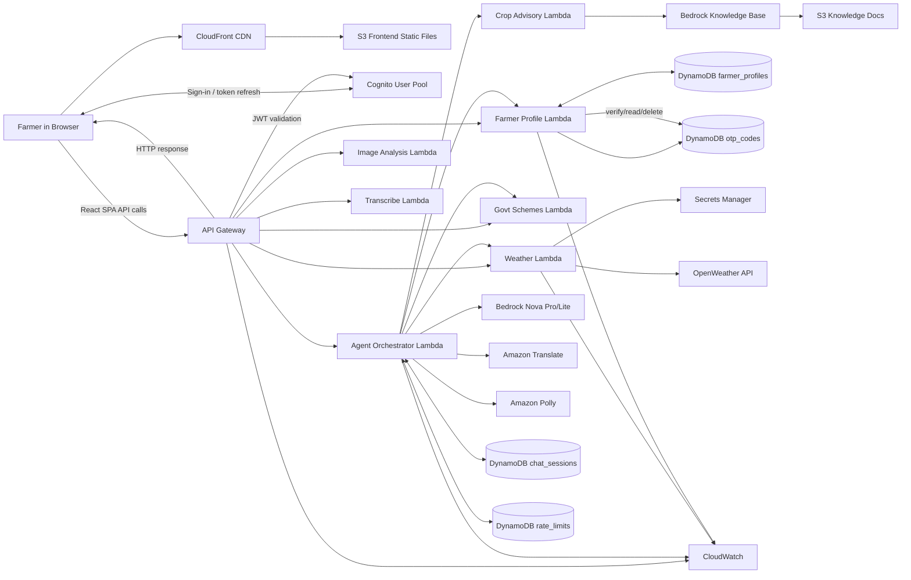

# Smart Rural AI Advisor - Complete End-to-End Architecture Flow

## Overview
This document explains the complete request-to-response flow from when a farmer opens the application to when they receive their answer, covering all components, services, and decision points.

---

## Table of Contents
0. [Left-to-Right Architecture (Quick View)](#0-left-to-right-architecture-quick-view)
1. [Initial Application Load](#1-initial-application-load)
2. [User Authentication](#2-user-authentication)
3. [Chat Request Flow](#3-chat-request-flow)
4. [Model Selection Strategy](#4-model-selection-strategy)
5. [Tool Execution Flow](#5-tool-execution-flow)
6. [Response Generation & Delivery](#6-response-generation--delivery)
7. [Special Paths](#7-special-paths)

---

## 0. Left-to-Right Architecture (Quick View)



**Direction rule**: Diagram must be read left → right, starting from Farmer/browser. No primary flow should start from bottom.

---

## 1. Initial Application Load

### Step 1.1: DNS Resolution & CDN
```
Farmer's Browser
  ↓ (HTTPS request)
DNS resolves domain → CloudFront Distribution
  ↓
CloudFront Edge Location (nearest to user)
  ↓ (cache miss on first load)
Origin: S3 Frontend Bucket (ap-south-1)
```

**Components**:
- **CloudFront**: Global CDN with edge locations across India
- **S3 Frontend Bucket**: `smart-rural-ai-frontend-{account-id}`
  - Contains: `index.html`, React JS bundles, CSS, images
  - Configured for static website hosting

### Step 1.2: React SPA Initialization
```
Browser downloads:
  1. index.html (entry point)
  2. main.js (React application bundle)
  3. vendor.js (dependencies)
  4. styles.css
  
React App initializes:
  - Routing (React Router)
  - State management (Context/Redux)
  - API client configuration
  - Language detection (browser locale)
```

**Key Point**: S3 serves ONLY static files. All dynamic API calls go directly from browser to API Gateway.

---

## 2. User Authentication

### Step 2.1: Phone + PIN Authentication Flow
```
Browser → Cognito User Pool
  ↓
1. User enters phone number (10 digits)
2. User enters 6-digit PIN
  ↓
Cognito validates credentials
  ↓
Returns JWT tokens:
  - ID Token (user identity)
  - Access Token (API authorization)
  - Refresh Token (token renewal)
  ↓
Browser stores tokens in:
  - localStorage (persistent)
  - Memory (session)
```

### Step 2.2: OTP Verification (New Users)
```
Browser → API Gateway POST /otp/send
  ↓
API Gateway → Farmer Profile Lambda
  ↓
Profile Lambda:
  1. Generates 6-digit OTP
  2. PutItem into DynamoDB otp_codes table (PK: phone, TTL: 5 minutes)
  3. Returns masked phone number
  ↓
User enters OTP → POST /otp/verify
  ↓
Profile Lambda validates OTP:
  1. GetItem from otp_codes by phone
  2. Compare submitted OTP + TTL expiry check
  3. DeleteItem otp_codes on success/expiry (single-use)
  ↓
Creates Cognito user account
  ↓
Returns success → User can now sign in
```

**DynamoDB Tables Used**:
- `otp_codes`: {phone, otp_code, expiry_ttl, verified}
- `farmer_profiles`: {farmer_id, name, state, crops, soil_type}

---

## 3. Chat Request Flow

### Step 3.1: User Sends Message
```
Farmer types: "சென்னையில் வானிலை என்ன?" (What's the weather in Chennai?)
  ↓
Browser → API Gateway POST /chat
  Headers: {
    Authorization: "Bearer <JWT_TOKEN>",
    Content-Type: "application/json"
  }
  Body: {
    message: "சென்னையில் வானிலை என்ன?",
    session_id: "abc123",
    farmer_id: "ph_9876543210",
    language: "ta-IN"
  }
```

### Step 3.2: API Gateway Processing
```
API Gateway receives request
  ↓
1. CORS validation (Origin check)
2. Cognito Authorizer validates JWT
  ↓ (calls Cognito)
Cognito User Pool verifies token signature
  ↓
Returns: {sub: "user-id", phone_number: "+919876543210"}
  ↓
API Gateway adds context to event
  ↓
Route resolution:
  - /chat, /voice        → Agent Orchestrator Lambda
  - /profile, /otp, /pin → Farmer Profile Lambda
  - /weather             → Weather Lambda
  - /image-analyze       → Image Analysis Lambda
  - /transcribe          → Transcribe Lambda
  - /schemes             → Govt Schemes Lambda
  ↓
For chat/voice requests, invokes: Agent Orchestrator Lambda
```

### Step 3.3: Agent Orchestrator - Initial Processing
```
Agent Orchestrator Lambda starts
  ↓
1. Parse request body
2. Extract: message, session_id, farmer_id, language
3. Start timer (API Gateway timeout: 29 seconds)
  ↓
Check rate limits (DynamoDB rate_limits table)
  - 15 requests/minute
  - 120 requests/hour
  - 500 requests/day
  ↓ (if exceeded)
Return 429 Too Many Requests
  ↓ (if OK, continue)
```

### Step 3.4: Language Detection & Translation
```
Orchestrator → Amazon Translate
  ↓
1. detect_dominant_language(text)
   Returns: {language: "ta", confidence: 0.98}
  ↓
2. translate_text(text, source="ta", target="en")
   Returns: "What's the weather in Chennai?"
  ↓
Store both versions:
  - Original: "சென்னையில் வானிலை என்ன?"
  - English: "What's the weather in Chennai?"
```

### Step 3.5: Context Enrichment
```
Orchestrator → DynamoDB farmer_profiles.get_item()
  Key: {farmer_id: "ph_9876543210"}
  ↓
Returns: {
  name: "Ravi Kumar",
  state: "Tamil Nadu",
  district: "Chennai",
  crops: ["rice", "groundnut"],
  soil_type: "clay loam"
}
  ↓
Orchestrator → DynamoDB chat_sessions.query()
  Key: {session_id: "abc123"}
  Limit: 40 (last 40 messages)
  ↓
Returns conversation history for context
```

### Step 3.6: Intent Classification & Routing
```
Orchestrator analyzes query:
  "What's the weather in Chennai?"
  ↓
Detected intents: ["weather"]
  ↓
Route decision:
  - Weather query → Needs get_weather tool
  - Has location → Can proceed
  - Not a greeting → Skip greeting shortcut
```

---

## 4. Model Selection Strategy

### Nova Pro vs Nova 2 Lite Decision Tree

```
┌─────────────────────────────────────────────────────────────┐
│                    Query Analysis                            │
└─────────────────────────────────────────────────────────────┘
                           ↓
        ┌──────────────────┴──────────────────┐
        │                                     │
    Is Greeting?                        Is Feature Page?
    (hi, hello, thanks)                 (crop-recommend-*, 
        │                                soil-analysis-*)
        │ YES                                 │ YES
        ↓                                     ↓
  ┌─────────────────┐                  ┌──────────────────┐
  │ SKIP BEDROCK    │                  │ Nova Pro         │
  │ Return template │                  │ (single call)    │
  │ greeting        │                  │ skip guardrail   │
  └─────────────────┘                  └──────────────────┘
        │ NO
        ↓
  ┌─────────────────────────────────────────────────────────┐
  │              Standard Chat Query                         │
  └─────────────────────────────────────────────────────────┘
                           ↓
        ┌──────────────────┴──────────────────┐
        │                                     │
   Needs Tools?                         Simple Query?
   (weather, crop,                      (general info,
    pest, schemes)                       no tools needed)
        │ YES                                 │ YES
        ↓                                     ↓
  ┌──────────────────┐                 ┌──────────────────┐
  │ Nova Pro         │                 │ Nova 2 Lite      │
  │ (tool calling)   │                 │ (faster, cheaper)│
  │ Multi-turn       │                 │ No tools         │
  └──────────────────┘                 └──────────────────┘
        │
        ↓
  Tool execution fails?
  (throttle/timeout)
        │ YES
        ↓
  ┌──────────────────┐
  │ FALLBACK:        │
  │ Nova 2 Lite      │
  │ (retry with lite)│
  └──────────────────┘
```

### Model Usage Breakdown

**Nova Pro (apac.amazon.nova-pro-v1:0)** - PRIMARY MODEL
- **Use Cases**:
  1. Tool calling (weather, crop advisory, schemes, profile)
  2. Multi-turn conversations (follow-up questions)
  3. Complex reasoning (pest diagnosis, crop recommendations)
  4. Vision tasks (image analysis for crop diseases)
- **Characteristics**:
  - Higher cost per token
  - Better reasoning capabilities
  - Supports tool use (function calling)
  - Longer context window

**Nova 2 Lite (global.amazon.nova-2-lite-v1:0)** - SECONDARY MODEL
- **Use Cases**:
  1. **Translation tasks** (line 1120): Hybrid localization to 13 Indian languages
  2. **Simple queries** (line 1154): General farming info without tool needs
  3. **Bidirectional fallback** (lines 782-783): When Pro throttles/times out
- **Characteristics**:
  - Lower cost per token (3-5x cheaper)
  - Faster response time
  - Good for simple text generation
  - Used for non-tool-calling tasks

**Code References**:
```python
# Translation (always uses Lite)
response = bedrock_rt.converse(
    modelId=FOUNDATION_MODEL_LITE,  # Line 1120
    messages=[{"role": "user", "content": [{"text": localize_prompt}]}],
    inferenceConfig={"temperature": 0.2},
)

# Fallback mapping (bidirectional)
MODEL_FALLBACK = {
    FOUNDATION_MODEL: FOUNDATION_MODEL_LITE,      # Pro → Lite
    FOUNDATION_MODEL_LITE: FOUNDATION_MODEL,      # Lite → Pro
}
```

---

## 5. Tool Execution Flow

### Step 5.1: Bedrock Converse - First Turn (Tool Decision)
```
Orchestrator → Bedrock Nova Pro
  Request: {
    modelId: "apac.amazon.nova-pro-v1:0",
    messages: [
      {role: "user", content: [{text: "What's the weather in Chennai?"}]}
    ],
    system: [{text: "You are Smart Rural AI Advisor..."}],
    toolConfig: {
      tools: [
        {name: "get_weather", description: "...", inputSchema: {...}},
        {name: "get_crop_advisory", ...},
        {name: "search_schemes", ...},
        {name: "get_farmer_profile", ...}
      ]
    },
    inferenceConfig: {temperature: 0.7},
    guardrailConfig: {
      guardrailIdentifier: "...",
      guardrailVersion: "..."
    }
  }
  ↓
Bedrock analyzes query and decides:
  "User wants weather for Chennai"
  ↓
Returns: {
  stopReason: "tool_use",
  output: {
    message: {
      role: "assistant",
      content: [{
        toolUse: {
          toolUseId: "tool_abc123",
          name: "get_weather",
          input: {location: "Chennai"}
        }
      }]
    }
  }
}
```

### Step 5.2: Tool Lambda Invocation (Synchronous)
```
Orchestrator extracts tool request:
  tool_name: "get_weather"
  tool_input: {location: "Chennai"}
  ↓
Maps to Lambda: LAMBDA_WEATHER (env variable)
  ↓
Orchestrator → lambda_client.invoke()
  FunctionName: "smart-rural-ai-weather"
  InvocationType: "RequestResponse"  ← SYNCHRONOUS (waits)
  Payload: {
    pathParameters: {location: "Chennai"}
  }
  Timeout: 25 seconds (TOOL_EXECUTION_TIMEOUT_SEC)
  ↓
Weather Lambda starts
```

### Step 5.3: Weather Lambda Processing
```
Weather Lambda receives event
  ↓
1. Validate location input (security)
2. Clean location name (remove "District", "Taluk", etc.)
  ↓
Weather Lambda → Secrets Manager
  get_secret_value(SecretId: "openweather-api-key")
  ↓
Returns: {SecretString: "abc123xyz..."}
  ↓
Weather Lambda → OpenWeather API (external HTTPS)
  GET https://api.openweathermap.org/data/2.5/weather
  Params: {
    q: "Chennai,IN",
    appid: "abc123xyz",
    units: "metric"
  }
  ↓
OpenWeather returns: {
  main: {temp: 32, humidity: 70},
  weather: [{description: "clear sky"}],
  wind: {speed: 3.5}
}
  ↓
Weather Lambda formats response:
  {
    location: "Chennai",
    current: {
      temp_celsius: 32,
      humidity: 70,
      description: "clear sky",
      wind_speed_kmh: 12.6
    },
    forecast: [...]
  }
  ↓
Weather Lambda → Orchestrator (return value)
  Returns: {
    statusCode: 200,
    body: json.dumps({...})
  }
```

### Step 5.4: Parallel Tool Execution (When Multiple Tools Needed)
```
If Bedrock requests multiple tools:
  [{name: "get_weather", ...}, {name: "get_crop_advisory", ...}]
  ↓
Orchestrator uses ThreadPoolExecutor:
  
  with ThreadPoolExecutor(max_workers=4) as executor:
      futures = []
      for tool in pending_tools:
          future = executor.submit(_execute_tool, tool.name, tool.input)
          futures.append(future)
      
      # Wait for all tools (with timeout protection)
      for future in as_completed(futures, timeout=25):
          result = future.result()
          tool_results.append(result)
  ↓
All tools execute in parallel (2-4x faster than sequential)
Thread-safe: Uses locks when ENABLE_THREAD_SAFE_TOOLS=true
```

### Step 5.5: Bedrock Converse - Second Turn (Response Generation)
```
Orchestrator → Bedrock Nova Pro (second call)
  Request: {
    messages: [
      {role: "user", content: [{text: "What's the weather in Chennai?"}]},
      {role: "assistant", content: [{toolUse: {...}}]},
      {role: "user", content: [{
        toolResult: {
          toolUseId: "tool_abc123",
          content: [{json: {
            location: "Chennai",
            current: {temp_celsius: 32, ...}
          }}]
        }
      }]}
    ]
  }
  ↓
Bedrock synthesizes response using tool data:
  "The weather in Chennai is currently 32°C with clear skies. 
   Humidity is at 70%, which is good for most crops..."
  ↓
Returns: {
  stopReason: "end_turn",
  output: {
    message: {
      role: "assistant",
      content: [{text: "The weather in Chennai is..."}]
    }
  }
}
```

---

## 6. Response Generation & Delivery

### Step 6.1: Translation to User Language
```
Orchestrator has English response:
  "The weather in Chennai is currently 32°C with clear skies..."
  ↓
User language: Tamil (ta-IN)
  ↓
Orchestrator → Amazon Translate (or Nova 2 Lite if HYBRID_LOCALIZATION_ENABLED)
  
  Option A: Amazon Translate (default)
    translate_text(
      text: "The weather in Chennai is...",
      source: "en",
      target: "ta"
    )
  
  Option B: Nova 2 Lite (hybrid mode)
    bedrock_rt.converse(
      modelId: FOUNDATION_MODEL_LITE,
      messages: [{
        role: "user",
        content: [{text: "Translate to Tamil: The weather in Chennai is..."}]
      }],
      inferenceConfig: {temperature: 0.2}
    )
  ↓
Returns: "சென்னையில் வானிலை தற்போது 32°C தெளிவான வானம்..."
```

### Step 6.2: Text-to-Speech (TTS) Generation
```
Orchestrator checks language:
  Tamil (ta-IN) → Use gTTS (Amazon Polly doesn't support Tamil)
  ↓
gTTS Library (in-process, NOT AWS service):
  from gtts import gTTS
  tts = gTTS(text="சென்னையில் வானிலை...", lang="ta")
  tts.save("/tmp/audio_abc123.mp3")
  ↓
Orchestrator → S3 Audio Bucket
  s3_client.put_object(
    Bucket: "smart-rural-ai-audio-{account-id}",
    Key: "abc123-timestamp.mp3",
    Body: audio_file,
    ContentType: "audio/mpeg"
  )
  ↓
Orchestrator → S3 generate_presigned_url()
  Returns: "https://smart-rural-ai-audio.s3.amazonaws.com/abc123.mp3?
           X-Amz-Algorithm=AWS4-HMAC-SHA256&
           X-Amz-Expires=3600&..."
  ↓
URL expires in: 1-2 hours (configurable)
```

**TTS Language Support**:
- **Amazon Polly**: Hindi (Kajal voice), English (Aditi voice)
- **gTTS Library**: Tamil, Telugu, Kannada, Malayalam, Bengali, Marathi, Gujarati, Punjabi, Odia, Assamese, Urdu

### Step 6.3: Save to DynamoDB
```
Orchestrator → DynamoDB chat_sessions.put_item() [BATCH]
  
  Batch write (2 items):
  1. User message:
     {
       session_id: "abc123",
       timestamp: 1709876543210,
       role: "user",
       message: "சென்னையில் வானிலை என்ன?",
       message_en: "What's the weather in Chennai?",
       language: "ta-IN",
       farmer_id: "ph_9876543210"
     }
  
  2. Assistant message:
     {
       session_id: "abc123",
       timestamp: 1709876548320,
       role: "assistant",
       message: "சென்னையில் வானிலை தற்போது 32°C...",
       message_en: "The weather in Chennai is currently 32°C...",
       language: "ta-IN",
       audio_url: "https://smart-rural-ai-audio.s3.amazonaws.com/...",
       tools_used: ["get_weather"],
       farmer_id: "ph_9876543210"
     }
  ↓
TTL: 30 days (auto-expire old conversations)
```

### Step 6.4: Return to API Gateway
```
Orchestrator → API Gateway (return statement)
  Returns: {
    statusCode: 200,
    headers: {
      "Content-Type": "application/json",
      "Access-Control-Allow-Origin": "https://d80ytlzsrax1n.cloudfront.net",
      "Access-Control-Allow-Headers": "Content-Type,Authorization",
      "Access-Control-Allow-Methods": "GET,POST,OPTIONS"
    },
    body: json.dumps({
      reply: "சென்னையில் வானிலை தற்போது 32°C...",
      reply_en: "The weather in Chennai is currently 32°C...",
      detected_language: "ta-IN",
      tools_used: ["get_weather"],
      sources: "WeatherFunction(OpenWeather)",
      audio_url: "https://smart-rural-ai-audio.s3.amazonaws.com/...",
      audio_key: "abc123-timestamp.mp3",
      session_id: "abc123",
      mode: "bedrock-direct",
      pipeline_mode: "direct"
    })
  }
```

### Step 6.5: Browser Receives & Renders
```
API Gateway → Browser (HTTP 200 response)
  ↓
Browser JavaScript:
  1. Parse JSON response
  2. Display Tamil text in chat bubble
  3. Fetch audio from presigned URL
  4. Auto-play audio (if enabled)
  5. Update conversation history
  6. Show "Sources: WeatherFunction(OpenWeather)" badge
  ↓
Farmer sees answer + hears audio
```

**Total Latency Breakdown**:
- DynamoDB reads: ~50ms
- Translate detect + translate: ~200ms
- Bedrock first turn (tool decision): ~1-2s
- Weather Lambda execution: ~500ms
  - Secrets Manager: ~100ms
  - OpenWeather API: ~300ms
  - Processing: ~100ms
- Bedrock second turn (response): ~1-2s
- Translate response: ~200ms
- gTTS generation: ~500ms
- S3 upload + presigned URL: ~100ms
- DynamoDB writes: ~50ms
**Total: 3-8 seconds**

---

## 7. Special Paths

### 7.1: Greeting Shortcut (Skips Bedrock)
```
User message: "Hello" or "Hi" or "Thanks"
  ↓
Orchestrator detects greeting (line 1864):
  if _is_greeting_or_chitchat(_raw_en) and not intents:
  ↓
SKIP Bedrock call entirely
  ↓
Return template greeting:
  "Hello Ravi! 👋 Welcome to Smart Rural AI Advisor.
   I can help you with:
   • Crop advice
   • Weather updates
   • Pest & disease help
   • Government schemes
   • Market prices"
  ↓
Translate → TTS → Save → Return
  ↓
Total time: ~1-2 seconds (vs 3-8 seconds for normal query)
```

**Code Reference** (line 1864-1946):
```python
if _is_greeting_or_chitchat(_raw_en) and not intents:
    logger.info(f"Greeting shortcut: '{_raw_en}' — skipping pipeline")
    result_text = _greeting_response(farmer_context)
    # ... translate, TTS, save, return
    return success_response({
        'pipeline_mode': 'greeting',
        ...
    })
```

### 7.2: Response Cache (Instant Answers)
```
User asks: "What's the weather in Chennai?"
  ↓
Orchestrator checks cache:
  cache_key = hash(query + location + crop + season)
  ↓
Cache hit? (query asked recently)
  ↓ YES
Return cached response instantly
  - No Bedrock call
  - No tool execution
  - Just translate + TTS
  ↓
Total time: ~500ms-1s (vs 3-8 seconds)
```

**Cache TTL by Category**:
- Weather: 30 minutes
- Crop advisory: 24 hours
- Schemes: 7 days
- General info: 1 hour

### 7.3: Feature Page Fast Path
```
Session ID starts with:
  - "crop-recommend-"
  - "soil-analysis-"
  - "farm-calendar-"
  - "price-advisory"
  - "pest-advisory"
  - "schemes-"
  ↓
Orchestrator detects feature page (line 2064):
  if _is_feature_page:
  ↓
Single Bedrock call (no multi-turn)
Skip Bedrock Guardrail (prompts are code-generated)
  ↓
Faster response: ~2-4 seconds
```

### 7.4: Model Fallback (Throttle/Timeout Recovery)
```
Orchestrator → Bedrock Nova Pro
  ↓
Error: ThrottlingException
  ↓
Retry 1: Wait 0.5s → Try again
  ↓
Error: ThrottlingException
  ↓
Retry 2: Wait 1.0s → Try again
  ↓
Error: ThrottlingException
  ↓
Retry 3: Wait 2.0s → Try again
  ↓
Still failing after 3 retries
  ↓
FALLBACK: Switch to Nova 2 Lite
  ↓
Orchestrator → Bedrock Nova 2 Lite
  ↓
Success! (Lite has separate throttle limits)
  ↓
Continue with response generation
```

**Bidirectional Fallback**:
- Nova Pro fails → Try Nova 2 Lite
- Nova 2 Lite fails → Try Nova Pro
- Both fail → Return error to user

**Code Reference** (lines 782-850):
```python
MODEL_FALLBACK = {
    FOUNDATION_MODEL: FOUNDATION_MODEL_LITE,      # Pro → Lite
    FOUNDATION_MODEL_LITE: FOUNDATION_MODEL,      # Lite → Pro
}

def _bedrock_converse_with_retry(bedrock_client, **kwargs):
    # Try primary model with retries
    for attempt in range(1 + MAX_RETRIES):
        try:
            return bedrock_client.converse(**kwargs)
        except ClientError as e:
            # Retry with exponential backoff
    
    # Fallback to alternate model
    fallback_model = MODEL_FALLBACK.get(primary_model)
    if fallback_model:
        return bedrock_client.converse(modelId=fallback_model, ...)
```

### 7.5: Timeout Protection (API Gateway 29s Limit)
```
API Gateway hard timeout: 29 seconds
Lambda must return before that
  ↓
Orchestrator checks remaining time before each expensive operation:
  
  remaining_ms = context.get_remaining_time_in_millis()
  if remaining_ms < 5000:  # 5 second buffer
      return _timeout_fallback_response()
  ↓
Graceful timeout message:
  "Your request is taking longer than expected. 
   Please try again with a simpler question."
  ↓
Prevents API Gateway 504 Gateway Timeout error
```

**Timeout Checks** (lines 2070, 2083):
- Before Bedrock first turn
- Before Bedrock second turn
- Before tool execution
- Before TTS generation

---

